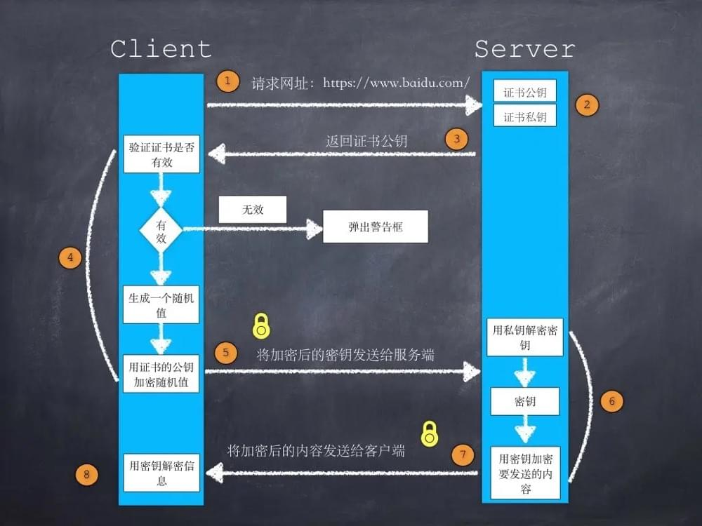
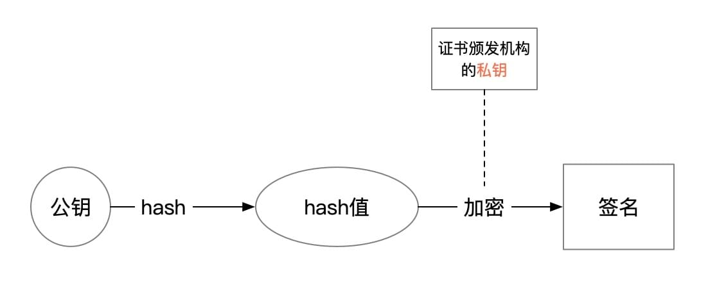
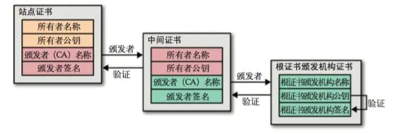

---
tags:
  - 前端基础
  - 网络
date: 2020-07-13
---

# HTTPS加密原理简介

https相关的资料已经非常多，本文尽量以最简洁的图文介绍大致原理，不涉及细节。  

*本文开始前，读者需要先了解**对称加密**、**非对称加密**、**hash算法**相关知识。*  

## HTTPS如何保证传输数据安全？
1. 服务器将**公钥**（非对称加密）发送给客户端  
2. 客户端生成随机**密钥**（对称加密），通过公钥加密后发送给服务端，这样双方都拥有了对称加密的密钥  
3. 后续传输的数据是通过密钥加密的**密文**（所以传输的数据是安全的）  

:::tip
http协议传输的数据相当于裸奔，数据从服务器到浏览器，经过的任意一个网络节点（代理、wifi、运营商等等）都可以随意篡改用户数据。  
:::

## 如何确保服务器公钥没有被篡改？
从上一节可以看到，第一步服务器下发公钥给客户端是明文的，所以确保公钥未被篡改至关重要。  

上一节第一步，服务器下发的证书中主要包含三个元素：服务器公钥、证书颁发机构信息、颁发机构签名。  

浏览器可以根据颁发机构信息找到其对应的公钥，然后三步即可验证服务器公钥是否安全：  
1. 通过颁发机构公钥解密签名，得到服务器公钥的hash值  
2. hash服务器公钥，得到其公钥的hash值  
3. 对比前两步得到的公钥hash值是否相同，如果相同则说明公钥未被篡改  

:::tip
这里我们可以总结得到：证书是否可信（或者说公钥是否安全），需要通过证书颁发者（的公钥）来验证。  
:::

## 浏览器如何确保颁发机构是否可信？
从第二节可以看到，验证服务器公钥安全性的关键在于颁发机构是否可信。  

证书颁发机构（组织）是一个树状结构，如图：  

所以说这个问题类似第二个问题，验证颁发机构是否可信（公钥是否安全），需要通过上层的颁发机构来验证。  
采用第二步的方式进行递归验证，即可确保所有证书都是安全的。  

递归的终点即根证书，如何验证根证书是否可信呢？  
答案是**浏览器内置**的，无条件信任。(浏览器还会信任操作系统的证书)  

## 如何篡改HTTPS协议传输的数据？
https经过这么严密的验证过程，还能篡改数据么？  可以的。  

从第三步可以看到，只要浏览器信任了假根证书，前面的验证步骤都不安全了。  
代理工具的根证书被信任后就可以生成假证书返回给浏览器，而不会被浏览器发现。  
所以，所有代理工具都必须用户信任其根证书，才能够查看篡改https请求的内容。  