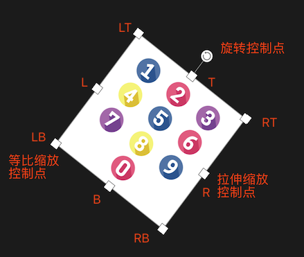
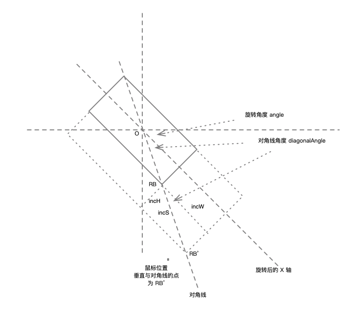
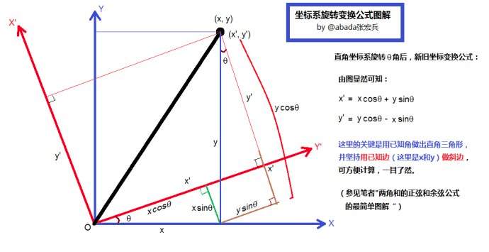

---
tags:
  - Web
date: 2022-05-02
---

# Mini Canvas Lib 核心交互实现原理

**背景**  
需要使用 Canvas 实现添加图片、文字、摄像头画面，并且支持**拖拽、缩放、旋转**等功能。  
但成熟 Canvas 库（比如 Sprite.js Fabric.js ）一般都比较庞大（300kb+），所以自己实现精简版本，减少体积。  

[DEMO](https://hughfenghen.github.io/WebAV/demo/record-avcanvas.html)  
[核心代码](https://github.com/hughfenghen/WebAV/blob/main/packages/av-canvas/src/sprites/sprite-op.ts)  

## 零
**基本功能**  
- 拖拽移动元素
- 缩放元素（变形、等比例缩放）
- 旋转元素
- 元素内容可以是：图片、文字、摄像头

画布中的元素（也可称为Sprite），每个元素的的位置信息由 IRect 描述，交互可体验[Fabric.js](http://fabricjs.com/)。  
```ts
interface IRect {
  x: number;
  y: number;
  w: number;
  h: number;
}

class Sprite {
  // 位置，尺寸数据
  rect: IRect
  // 旋转角度
  angle: number
}
```


## canvas绘制元素
因为需绘制元素（图片、文字、视频）占用的位置都可用矩形表示，所以可以：
```ts
// 将 canvas 坐标系原点移动到 rect 中心点
ctx.setTransform(1, 0, 0, 1, x + w / 2, y + h / 2)
// 这样任意 rect 的绘制参数都是一样的
ctx.drwaImage(img, -w / 2, -h / 2, w, h)
// 围绕中心点旋转
ctx.rotate(angle)
```

## 移动元素
这一步非常简单，跟拖拽dom元素一样。  
```ts
// 1. 监听mousemove事件，由鼠标位置减去初始位置，可以得到移动的坐标差值。  
// startX startY 是鼠标按下时的位置
incX = offsetX - startX
incY = offsetY - startY
// 2. 将移动距离映射为 Canvas 坐标系中的距离（因为 Canvas clientWith 跟 width 很可能不一样）。  
incX = incX / (canvas.clientWith / canvas.width) // incY 同理
// 3. 将新的坐标设置到元素的位置上。
sprite.setRect({ x: x + incX, y: y + incY })
``` 

## 翻转元素
*一般通过右键菜单来触发翻转效果，接收到事件后选择以下某个方法*  

**两个方法**  
1. 可通过 `ctx.setTransform` 实现。（**建议**，据说性能好些，不需要 ctx.save ctx.restore）  
```ts
// https://developer.mozilla.org/zh-CN/docs/Web/API/CanvasRenderingContext2D/setTransform
// 水平翻转
ctx.setTransform(-1, 0, 0, 1, 0, 0)
// 垂直翻转
ctx.setTransform(1, 0, 0, -1, 0, 0)
```
2. 可通过 ctx.scale 实现。  
```ts
// https://developer.mozilla.org/zh-CN/docs/Web/API/CanvasRenderingContext2D/scale
// 水平翻转
ctx.scale(-1, 1)
// 垂直翻转
ctx.scale(1, -1)
```

## 旋转元素
1. 获取旋转的中心点，通过 rect 计算得到。`{ x: x + w / 2, y: y + h / 2 }`  
2. 监听mousemove事件，获取鼠标坐标，由鼠标坐标得到旋转角度`angle = Math.atan2(y, x)`。  
```ts
function rotateSprite ( centerPos, onChange) {
  const onMove = ({ clientX, clientY }: MouseEvent): void => {
    // 映射为 相对中心点的坐标
    const x = clientX - centerPos.x
    const y = clientY - centerPos.y
    // 旋转控制点在正上方，相对 x 轴是 -90°， 所以需要加上 Math.PI / 2
    const angle = Math.atan2(y, x) + Math.PI / 2
    onChange(angle)
  }
  const clear = (): void => {
    window.removeEventListener('mousemove', onMove)
    window.removeEventListener('mouseup', clear)
  }
  window.addEventListener('mousemove', onMove)
  window.addEventListener('mouseup', clear)
}
```

## 缩放元素
*本身rect缩放非常简单，加上旋转后，缩放效果就复杂了很多。*  
**比如**  
1. 拖拽rect右侧的控制点，只能改变矩形的宽度，在旋转情况下，rect左侧的边是保持不动的。  
2. 拖拽 rect 右下角的控制点，同时改变宽高，但需要位置等比，rect 左上角的点保持不动。  

### 所以这个题可以抽象为
1. 给出的参数：rect（坐标、宽高）数据，旋转角度、鼠标坐标。  
2. 需要解出的答案：新的IRect（坐标、宽高）。  

### 解题步骤
以**拖拽右下角控制点**（RB）为例，因为是等比缩放，所以中心点会一直处于对角线（LT-RB）上。  
  

1. 监听 mousemove 事件，获取鼠标坐标，减去中心点坐标，得到相对于中心点的坐标。  
2. 根据坐标O、元素旋转角度、IRect，可计算出 RB 被 移动的长度。  
3. 移动长度乘以对应的三角函数，即为增加的宽、高。  
```ts
// 对角线角度（LB-RT对角线，角度是负数，需要乘以-1）
const diagonalAngle = Math.atan2(rect.h, rect.w)
// 坐标系旋转角度， lb->rt的对角线的初始角度为负数，所以需要乘以-1
const rotateAngle = diagonalAngle + angle
// startPos 及 RB 的坐标（拖拽起始位置），ClientXY 是mousemove事件中获取的坐标
const ox = clientX - startPos.x
const oy = clientY - startPos.y
// 坐标系旋转变化公式，让x轴与【对角线重合】，鼠标位置的x值即为增加的长度（RB’位于鼠标与对角线的垂直交点）
const incS = ox * Math.cos(rotateAngle) + oy * Math.sin(rotateAngle)
// 等比例缩放，增加宽高等于长度乘以对应的角度函数
// 因为等比例缩放，中心及被拖拽的点，一定在对角线上
const incW = incS * Math.cos(diagonalAngle)
const incH = incS * Math.sin(diagonalAngle)

// 新中心点坐标, 原中心坐标 (x + w / 2, y + h / 2)
const newCntX = incS / 2 * Math.cos(rotateAngle) + x + w / 2
const newCntY = incS / 2 * Math.sin(rotateAngle) + y + h / 2
// rect 新坐标
const newX = newCntX - newW / 2
const newY = newCntY - newH / 2

// 新的rect: { x: newX, y: newY, w: newW, h: newH }
```
上面代码用到了**坐标系旋转变化公式**，其推导如下图所示：
  

### 其他缩放场景注意事项
1. 左边三个点的缩放，坐标值变小（负数），也是在放大，所以计算出来值要乘以-1。  
2. 利用好坐标系旋转变化公式，拖拽某些点时，注意其角度与默认 X 轴之间的差值。  

## 判断鼠标是否点击了元素
1. 将鼠标坐标，rect xy 值转换为相对于中心点的坐标  
2. 再求出鼠标坐标旋转 rect 角度后的坐标（坐标系旋转公式）  
3. 判断鼠标点击的坐标是否超出 rect 边界  
```ts
// pos 鼠标坐标， rect center 中心点
// 鼠标点击坐标映射成 canvas坐标, 然后转换为以中点为原点的坐标
const cvsOX = pos.x / ratio.w - center.x
const cvsOY = pos.y / ratio.h - center.y

// 如果有旋转，映射成相对原点，旋转前的坐标
let mx = cvsOX
let my = cvsOY

let { x, y, w, h } = rect
// 映射成中心点坐标
x = x - center.x
y = y - center.y
// 坐标系旋转变化公式 
mx = cvsOX * Math.cos(angle) + cvsOY * Math.sin(angle)
my = cvsOY * Math.cos(angle) - cvsOX * Math.sin(angle)

if (mx < x || mx > x + w || my < y || my > y + h) return false

return true
```