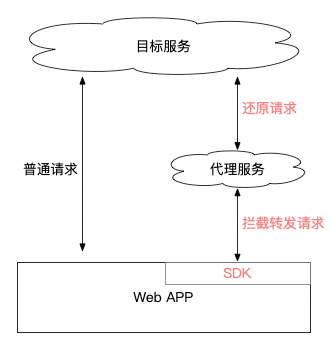
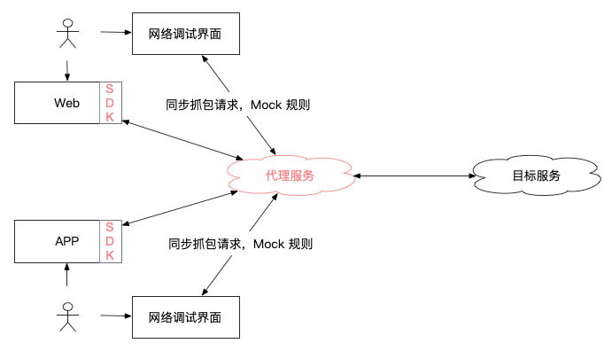
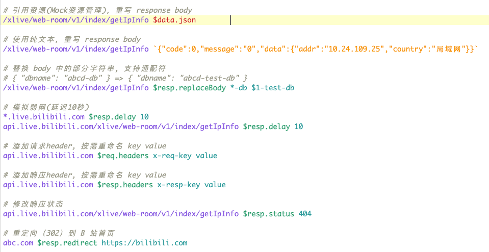

---
tags:
  - Web
  - 工具
date: 2024-04-08
---

# 自集成式 HTTP 代理方案

## 前言

大部分程序员，想必都有会一个常用的抓包代理工具；  
但在座的各位，可曾见过这样一款**集成在 Web 应用中**的代理工具？

<video src="./show-demo.mp4" controls style="width:100%;"></video>

它是明显区别于传统代理工具的，有以下特性：

- **零安装，零配置**，Web 点击即用、APP 扫码即用；_（不是开盖即食，而是直接喂到嘴里_
- 分享 URL 链接（或二维码），即可**远程调试 HTTP**，协助他人或调试移动设备
- 用户可**远程相互共享代理配置**，无需手动导入导出

以一个场景举例

1. 你是一个前端开发，当后端接口还没准备好（或有 Bug 时），产品或设计师想体验效果
2. 传统办法，你配好接口 Mock，让产品使用你的设备体验
3. 当前方案，你配好接口 Mock，发一个 URL 链接给产品即可远程体验

它的原理是将代理服务与应用（Web 网页或 APP）集成，从而大幅降低用户（研测产运）的使用成本。
  
_应用集成代理服务对应的 SDK，自动转发请求到代理服务_

**传统代理工具的主要成本**

- 下载安装代理程序，甚至收费
- 配置系统代理（移动端更烦）、https 证书
- 同事之间共享代理规则（手动导入导出文件）

这些成本带来各种烦恼，也将非技术岗位拒之门外。  
_场景：中午去吃饭的时候，手机突然断网；\*\*！原来是刚刚网络调试，配置了系统代理！_

笔者尝试过多款代理工具，始终有不满意的地方，多年前在自己的开源项目 [Erra][1] 中探索新的代理方案，仍然不满意，遂放弃。  
现将 Erra 的代理服务与工作中的应用集成，借鉴 [whistle][2] 的规则，再重新实现 UI 交互，终觉尚可。

该方案改进了工作中**高频对特定应用**（公司产品的域名、APP） 进行网络调试的体验和效率；  
该方案是一个增强型功能，与通用代理工具（Charles、Fiddler 等没有任何冲突，不会影响习惯使用通用代理工具的同学。

接下来介绍该方案的技术实现思路。

## 方案原理概览

**总结分为四个部分**

1. 与应用集成，将请求转发到代理服务，由代理服务转发请求到目标服务
2. 代理服务提供网络调试界面（UI），允许用户查看网络请求、配置 Mock 规则
3. 代理服务记录请求，并同步到 UI 界面
4. 代理服务在转发请求前、收到响应后，按 Mock 规则篡改请求内容

## 应用集成

与应用集成是当前方案区别与代理工具的根本所在，也是能实现零安装、零配置便捷性的原因。

集成是**将代理服务对应的 SDK 注入到业务系统**（网页或 APP）中，SDK 会拦截并转发请求到代理服务。

集成 SDK 的方式介绍以下两种，更多拦截注入技巧请阅读 [Web 终极拦截技巧（全是骚操作）][3]。

### 网关自动注入 SDK

1. 配置 DNS 使 `ff-*` （混合泛解析）指向代理服务，代理转发 html 请求时自动注入 SDK
   - 注入脚本示例 `resp.body.replace('<head>', '<head>')`
2. 假设目标域名为 `live.bilibili.com`，使用 `ff-live.bilibili.com` 访问代理服务即可自动注入

该方式无需业务项目对接，**适合多个域名（系统）需要接入**的场景。

### 手动注入 SDK

手动往前端项目的 HTML 中写入 ``，或打包构建时自动注入。

若**接入项目较少，或没有 DNS 配置权限**，则可采用该方式接入。

### 启动拦截转发

向页面注入 SDK（`ff-sdk.js`）后， 根据 URL Query 参数决定是否开启拦截转发请求。  
若 URL 参数包含 `ff-proxy-id` 即启动拦截转发，参数值是随机生成 id，用于隔离不同用户数据。  
_用户数据指**抓包记录、Mock 规则**_。

拦截转发的实现原理是重写 `fetch, xhr, WebSocket` 等对象，将请求转到代理服务，如何转发请看下文**请求变换协议**；  
另外还需要重写 `open, a, iframe` 的目标链接，确保页面跳转（或嵌入）场景也能继续保持 URL 前缀（`ff-`）和 Query 参数(`ff-proxy-id`) 的状态。

重写系统 API 以实现拦截的详情请阅读 [Web 终极拦截技巧（全是骚操作）][3]。

### 移动端 APP 支持

1. 向网络库注册一个拦截器
2. 扫描特制的二维码后，拦截器开始转发请求
3. 扫码后 APP 还需要修改 WebView 容器的 URL，添加前缀（`ff-`）和 Query 参数
   - 前缀和参数的内容在二维码中获取

## HTTP 请求变换协议

SDK 拦截 HTTP 请求转到代理服务，然后还原再转到目标服务，其关键在于**变换与还原请求的协议**。

原始请求，直接指向目标服务 （_以 curl 风格描述请求_）

`curl -v https://api.live.bilibili.com/test`

URL 添加前缀 `ff-` 请求会转到代理服务，因为代理服务注册了 **DNS 混合泛解析规则`ff-*`**；  
再添加 HTTP Header `x-ff-proxy-id` 用于隔离不同用户的数据。

`curl -v 'http://ff-api.live.bilibili.com/test' -H 'x-ff-proxy-id: xxx'`

代理服务**移除 URL 中的前缀与 Header，即还原成原始请求**，再发送给目标服务；  
同时，根据 `x-ff-proxy-id` 将该请求同步给对应 UI 界面。

## 代理服务与 UI 交互

代理服务作为远程中心节点，跟客户端使（UI）用 WebSocket 保持通信，代理服务会按照 `ff-proxy-id` 只同步当前用户的数据。

通过 URL `ff-proxy.bilibili.com/ui/<ff-proxy-id>` 即可访问 UI 界面。

### 抓包

代理服务每次代理请求都会根据 `ff-proxy-id` 的值，将请求内容 copy 一份发送给客户端，这就实现了远程调试。  
所以该方案实现远程调试是非常自然的，传统代理工具相对麻烦是因为它工作在用户的设备上，远程调试必须通过手动设置系统代理来实现连接。

比如，手机上访问接口  
`curl -v 'http://ff-api.live.bilibili.com/test' -H 'x-ff-proxy-id: xxx'`

任何用户在任何设备上打开了 `ff-proxy.bilibili.com/ui/xxx` 页面， 即可远程看到请求的详细内容。

### Mock 规则

代理服务还能接受客户端提交的 Mock 规则，在**转发请求前、收到响应后**，按规则篡改请求内容。

支持对 HTTP 请求内容的基本修改（添加、删除、替换），即可满足绝大部分 Mock 诉求；  
HTTP 请求内容指

- **Request**: URL、Header、Body,
- **Response**: StatusCode、Header、Body

规则借鉴了 [whistle][2] 并做了大量简化，同时也提供 UI 配置以降低使用门槛。

**规则解析**

1. 定义规则语法
2. 使用 [peggy][4] 按语法将字符串解析为 AST（抽象语法树）
3. 将 AST 转换为 js 函数实现
4. 函数会检测代理的请求是否命中规则，命中后按规则描述篡权请求内容

规则相对简单，使用语法解析是为了保持扩展性，字符串处理多写几个条件判断也能实现。

**规则存储**

规则存储在浏览器的 indexeddb 中，每次连接时将规则同步到代理服务进行解析；  
所以，代理服务是一个干净的、只维持临时状态的服务，非常方便部署与扩展。

## 相对传统方案的缺点

方案的优点写在了文章开头，这里有必要总结一下缺点，感兴趣的同学自行斟酌。

- 需要部署、维护代理服务
  - 该方案将以系统维护者的一次性部署成本，交换用户安装、配置软件的成本
- 有一定侵入性
  - 该方案不是一个透明的中间节点，会修改业务系统的行为（SDK 拦截转发）
  - PS：DNS 集成方式，可让业务系统无感自动接入，最小化影响
- 不具备通用性
  - 该方案无法调试系统网络请求，无法调试未接入的业务系统、APP

## 总结

该方案的原理是将代理服务与应用集成，从而改进了工作中高频对特定应用进行网络调试的体验和效率。

所以，实施的前提是：一定的团队规模让（效率体验改进）**收益大于付出**（代理系统部署维护成本）。

## 附录

- [Erra][1]: Node.js 实现的代理工具，已废弃
- [whistle][2]: 基于 Node 实现的跨平台抓包调试工具
- [Web 终极拦截技巧（全是骚操作）][3]
- [peggy][4]: Parser generator for JavaScript

[1]: https://github.com/hughfenghen/erra
[2]: https://github.com/avwo/whistle
[3]: https://hughfenghen.github.io/posts/2023/12/23/web-spy/
[4]: https://github.com/peggyjs/peggy
