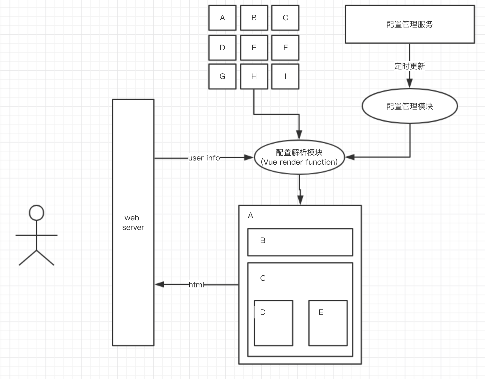
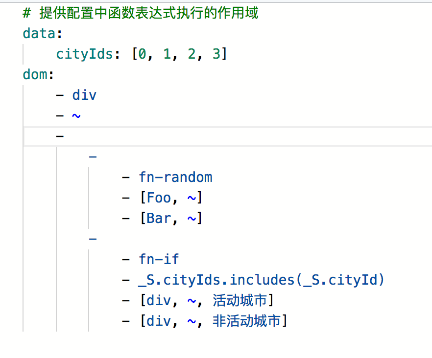

# 前端模块化设计

***本方案是一个预研项目的产出，只做出了DEMO，后因非技术原因，方案没有落地实践。***  

## 背景
某些页面展示逻辑复杂，比如点评APP首页，用户看到的页面结构是动态的，与所选城市、地理位置、APP版本相关。  
即使web端发版迅速，没有Native类似的兼容问题，如果所有逻辑代码维护成本也会越来越大。  

## 目标
- 设计一套方案，使web页面支持根据配置动态化，配置变化无需发布版本。  
- 支持根据用户属性（如城市）或随机，动态展示或隐藏某些模块。  

## 定位
**一个基于Vue生态、轻量、配置简单但灵活受限的页面动态模块化库。**  

## 工作原理图
   

## 页面配置管理
1. 需要一个服务来管理动态配置。  
1. 每个页面对应一个配置，最好开放一个接口聚合所有配置。  
1. 应用启动时获取配置，定时更新配置。（原理图是针对服务端渲染项目，SPA应用获取配置的过程可能会降低页面性能，如果性能敏感需要考虑其他优化途径。如service-worker、preload）  

## 模块打包、注册
1. 使用webpack提供的import函数将所有模块打包成异步的独立bundle。  
1. 所有异步模块引用都传递给**配置解析器**（是一个Vue render function组件），根据页面配置，实际使用的模块被解析时将被异步获取。[vue异步组件文档](https://cn.vuejs.org/v2/guide/components-dynamic-async.html#%E5%BC%82%E6%AD%A5%E7%BB%84%E4%BB%B6)  

```js
const ASYNC_COMPS = {
  Star: () => import('./star.vue'),
  Foo: () => import('./Foo.vue'),
};

const Page = Vue.extend({
  // 其他逻辑...

  components: {
  	...ASYNC_COMPS
  }
})
```

## 配置解析生成页面
*采用yaml配置，会被转化成json*  
  

1. 每个页面配置至少包含`data`、`dom`两个属性。  
  - dom：页面模块结构的组织关系（树形结构），`[tag, attrs, children]`或`[fn-*,  ...args]`的递归形式。  
  - tag 首字母大写表示业务模块组件，小写表示原生的html标签。  
  - fn-* 表示自定义函数，将在配置解析阶段由自定义解析器解析。（更像Lisp中的函数）  
    - 自定义函数的返回值必须为`[tag, attrs, children]`或`[fn-*,  ...args]`形式。  
  - data：自定义配置信息，作为`dom`自定义函数执行的作用域。  

1. 根据用户访问的路由获取对应的页面配置，配置解析模块将配置解析成Vue需要的VNodes。解析过程：  
  1. 解析`dom`中的自定义函数，返回完全的`[tag, attrs, children]`递归形式。  
    - 自定义函数中的表达式（如exp = `_S.cityIds.includes(_S.cityId)`）可使用JS`new Function('_S', ${exp})(scope)`包装执行。  
    - scope(即_S) = userInfo(访问用户的信息) + cfg.data(前文配置中的`data`属性)。  
  1. 自定义`Vue render函数`，将解析后的`dom`（递归传递给`Vue createElement`函数）转化成VNode。  
1. 当`Vue render函数`渲染异步组件时，将自动获取，已在`components`中注册但未在render中渲染的异步组件不会被获取。  

```js
const ASYNC_COMPS = {
  Star: () => import('./star.vue'),
  Foo: () => import('./Foo.vue'),
};

const cfg = {
  '/page1': {
    data: {/* ... */},
    dom: [/* ... */],
  },
}

function parseCfg(dom, h) {
  // 递归将dom转换成VNode
}

const Page = Vue.extend({
  // 其他逻辑...
  render(h) {
    return paseCfg(cfg.dom, h)
  },
  components: {
  	...ASYNC_COMPS
  }
})
```

至此，已经可以将模块通过配置进行动态组合生成页面了。  

## 获取模块依赖的数据
通常业务模块都需要接口数据。同构项目，一般在组件的`asyncData`函数中获取数据。  
采用模块化方案后，各模块（组件）都通过配置进行动态组合，其`asyncData`可以交给顶层的`Page`组件来执行。  
1. 执行`Page.asyncData`时解析配置中的`dom`得到所有依赖的异步组件的工厂函数（`()=> import(/* xxx component */)`）。  
1. 执行所有工厂函数得到Vue component。  
1. 执行所有Vue component的`asyncData`函数。  

```js
//同构框架会执行页面组件的Page.asyncData
Page.asyncData = function({ store, route }) {
  let cfg = store.state.modularization.PAGES_CFG[routePath];

  if (!cfg || !cfg.dom) {
    return Promise.resolve();
  }

  // 解析自定义函数后，可以得到所有依赖的异步组件
  cfg.dom = parseFn(
    cfg,
    // 执行自定义函数的作用域 除了配置的cfg.data 还包括rootState
    // rootState中包含一些基础信息，如何用户所选城市，用户信息等
    Object.assign({}, store.state.rootState, cfg.data)
  );

  return Promise.all(
    pickCustomCompTags(cfg.dom).map(tag => {
      const c = ASYNC_COMPS[tag];
      if (!c) return Promise.resolve();

      return c().then(comp => {
        if (typeof comp.default.asyncData === 'function') {
          return comp.default.asyncData({ store, route });
        }
        return Promise.resolve();
      });
    })
  );
};
```

## 异步组件构建优化
由于所有异步模块（Vue组件）将单独获取，可能产生较多的请求，对前端性能有一定影响。  
可以配合service worker与缓存 + http2能最大限度降低影响。  

[demo代码下载](https://github.com/hughfenghen/hughfenghen.github.io/blob/blog/docs/fe/modularization/modularization.zip)
