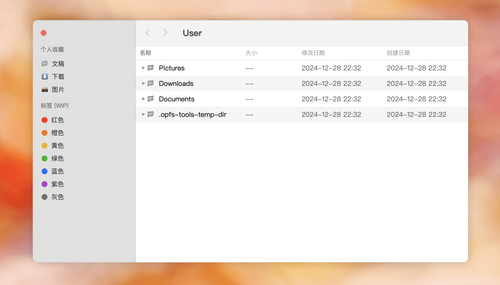

---
tags:
  - Web
  - OPFS
  - AI
date: 2025-01-07
---

# 使用 AI + OPFS 在浏览器中实现 MacOS Finder（文件管理器）

_没忍住又搞了一个 OPFS 项目，我太喜欢（Web 太需要）这个文件 IO 能力了，对 OPFS “寄予厚望”！_

项目链接：<https://github.com/hughfenghen/opfs-finder>  
立即体验：<https://hughfenghen.github.io/opfs-finder>

## 简介

该项目基于 opfs-tools 实现，可作为复杂 Web 应用的文件管理器，或在浏览器中模拟操作系统；  
项目 95% 的代码使用 AI 实现，并提供了关键 Prompts 文档，方便 AI 辅助编程初学者参考；  
可将项目剩余的 TODO List 当做练习题，鼓励使用 AI 来实现。

## 项目总结

- [OPFS][4] 是浏览器中的文件系统 API，高性能且无需用户授权
- [opfs-tools][2] 是基于 OPFS 的开源项目，提供非常便捷、操作文件的 API
- [opfs-finder][5] 模仿 Finder App，在浏览器中运行
- 本项目的动机
  - 为了展现 OPFS 的能力，加速该技术的普及
  - 为了完善 opfs-tools 的 API
  - 为了学习、应用 AI 技术，辅助实现常见、无聊的功能，[Prompts 文档](./prompts.md)
- 鼓励感兴趣的同学使用 AI 实现 TODO List 并发起 PR
- 该项目的用途
  - 成为未来复杂 Web 应用的文件管理器
  - 在浏览器中模拟操作系统（如：文档编辑器，图片查看器，纯 Web 的本地视频播放器）

## 作者碎碎念

我在开发 [WebAV][1] 项目（用于在浏览器中处理音视频）时，处理较大的音视频文件必须依赖文件系统，不能像常规的 Web App 把数据全部加载到内存中；  
为了配合 WebAV 处理音视频，封装且顺便开源了 [opfs-tools][2] 项目，用于方便文件操作。

[OPFS][4] 相当于浏览器给每个网站开辟了一个私有的存储空间，Web 开发者借助这个 API 在私有空间中创建、读写文件，不需要用户授权且性能更好；  
目前在各个浏览器中已得到较好的兼容性支持，详情可阅读[Web 文件系统（OPFS 及工具）介绍][3]。

我非常高兴 Web 能开放出非常接近操作系统的文件 API，预测 OPFS API 在未来会有很大的应用潜力；  
打算实现一个能展现 OPFS 能力的“产品”来加速该技术的普及，同时借该项目来完善 opfs-tools 的 API。

偶然想到可以模仿每天使用的 Finder（MacOS 系统文件管理）APP，这样即使没有视觉设计师也能实现不错的视觉效果；  
未来 Web 系统的 App 越来越复杂，越加深度依赖文件系统（OPFS），说不定该项目能成为第三方网站的文件管理器；  
或实现打开/预览文本、音视频文件等功能，在浏览器中模拟真实的操作系统；  
至于目前有什么用？谁知道、谁能想到你会在一个网页中放一些什么奇怪的文件呢[doge]？（该项目中的文件是由浏览器管理，用户文件系统中找不到，也不会上传）

最开始对于是否开启本项目还是有点犹豫的，因为本项目主要工作是去实现“比较无聊”的页面交互逻辑；  
想着逐渐火热的 AI 辅助编程，正好需要试试它成色几何，结果是相当地惊艳，**本项目 95% 的代码由 AI 实现**；  
于是把项目启动阶段的重要提示语都放到了 [Prompts 文档](./prompts.md)，可作为 AI 辅助编程初学者参考；  
对本项目或者 AI 辅助编程感兴趣的同学，可将 TODO List 作为练习题，鼓励使用 AI 来实现功能，测试功能后发起 PR。

## 附录

- [opfs-finder][5] 使用 AI + OPFS 在浏览器中实现 MacOS Finder
- [WebAV][1] 在浏览器中创建/编辑音视频文件
- [opfs-tools][2] 便捷、高性能的 API 操作 OPFS 文件
- [Web 文件系统（OPFS 及工具）介绍][3]
- [OPFS(Origin private file system)][4] MDN 文档

[1]: https://github.com/WebAV-Tech/WebAV
[2]: https://github.com/hughfenghen/opfs-tools
[3]: https://hughfenghen.github.io/posts/2024/03/14/web-storage-and-opfs/
[4]: https://developer.mozilla.org/zh-CN/docs/Web/API/File_System_API/Origin_private_file_system
[5]: https://github.com/hughfenghen/opfs-finder
