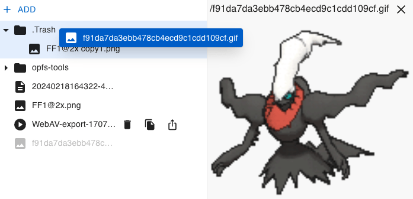

---
tags:
  - Web
date: 2024-03-06
---

# opfs-tools 项目介绍

文件系统是许多领域程序的基石，所有通用编程语言都会内置完备的文件系统 API。

Web 很长一段时间没有提供完善的访问文件系统的规范，使得需要高频读写文件、大文件处理软件在 Web 端都会受到一些限制，比如音视频剪辑、游戏、数据库等等。

之前在浏览器中实现[视频裁剪][5]、[截帧][4]等相关功能时，发现**缺少基本的操作文件的 API**，比如读写、移动、复制文件。  

而 [OPFS][1] 已经发布很久了（Chrome 86），它提供了访问文件系统的低级 API，且在 Worker 中访问才能发挥最佳性能，日常使用起来很是麻烦，于是就有了**基于 OPFS 封装简单易用 API** 的想法。  

以下两个项目就是笔者近期的成果

- [opfs-tools][2]：在浏览器中运行的简单、高性能、完备的文件系统 API
- [opfs-tools-explorer][3]：管理 Web 站点的 OPFS 文件，类似操作系统的 Explorer、Finder

点击体验 [opfs-tools-explorer demo][7]

后续会再写一篇文章详细介绍 Web 中与文件相关的 API 和 opfs-tools 实现原理。

如果读者也有在浏览器中访问文件系统的诉求，**欢迎 Star 和贡献**，还可**订阅**（导航栏）当前博客以接收更新。

## 附录

- [OPFS][1]
- [opfs-tools][2]
- [opfs-tools-explorer][3]
- [浏览器中进行快速、精确视频截帧][4]
- [在浏览器中录制视频，支持截取片段][5]
- [OPFS via sqlite3_vfs][6]

[1]: https://developer.mozilla.org/en-US/docs/Web/API/File_System_API/Origin_private_file_system
[2]: https://github.com/hughfenghen/opfs-tools
[3]: https://github.com/hughfenghen/opfs-tools-explorer
[4]: https://hughfenghen.github.io/WebAV/demo/1_4-mp4-previewer
[5]: https://github.com/hughfenghen/bloom-shadow
[6]: https://sqlite.org/wasm/doc/trunk/persistence.md#vfs-opfs
[7]: https://hughfenghen.github.io/opfs-tools-explorer/