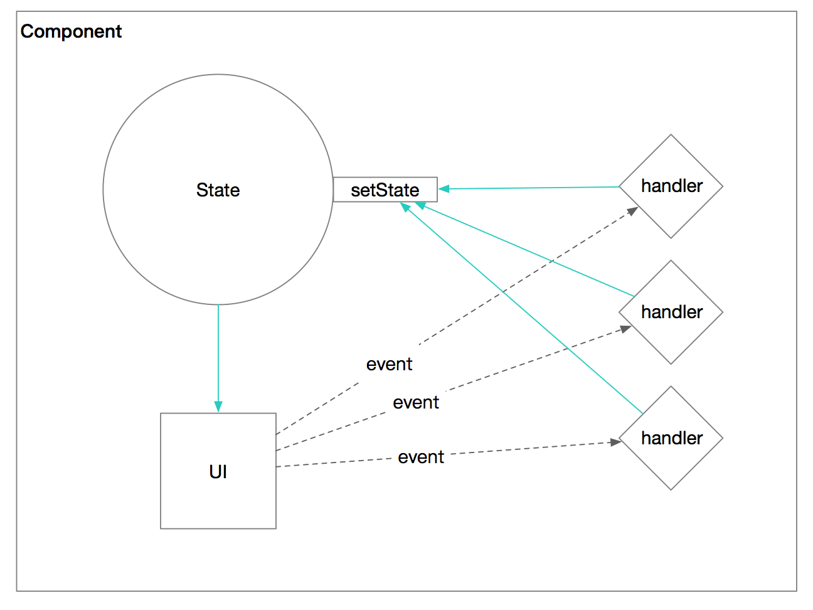
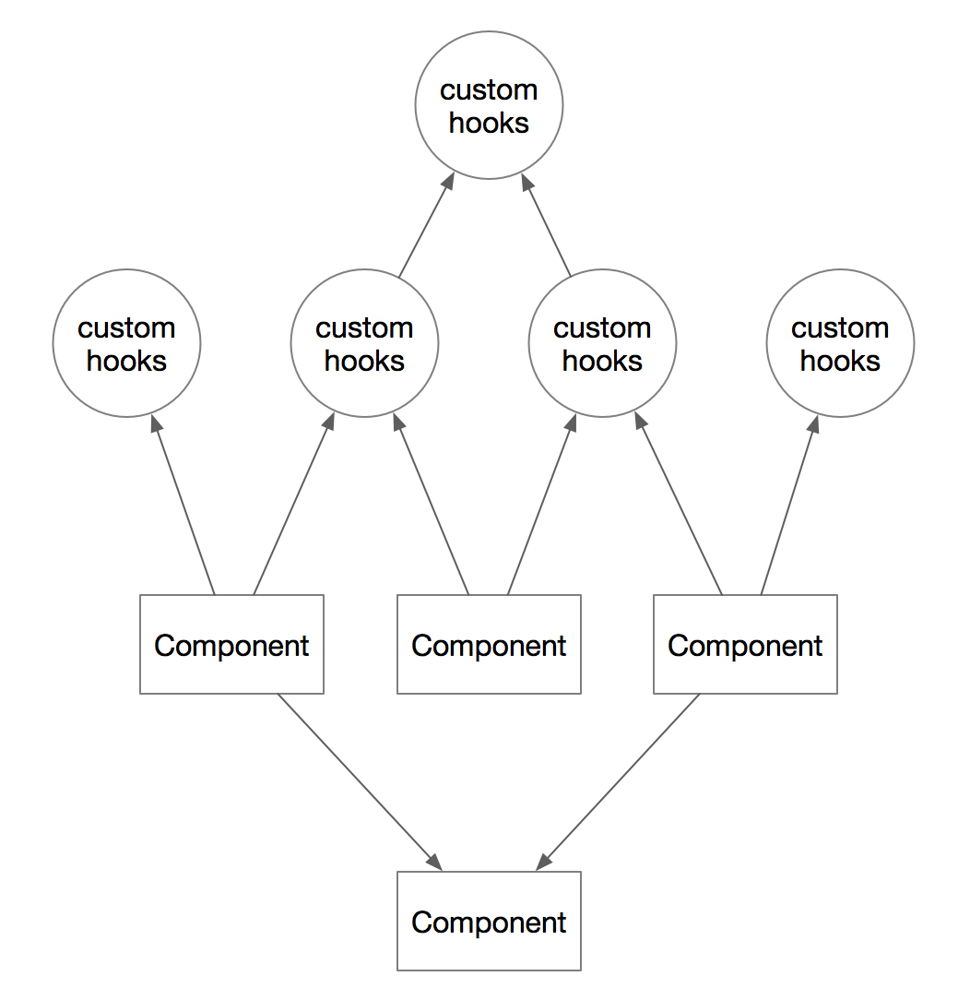

---
tags:
  - Web
  - think
  - Clojure
date: 2020-10-07
---

# React Hooks 的思考

## 前言
听说 Hooks 有一段时间了，一直没去看文档。最近终于想起这事儿，浏览一遍文档后，立即燃起了一种“兴奋感”。  
这种“兴奋感”犹如当初看见“箭头函数”、“async/await”一样。  
所以，即使在有很多分析文章的情况下，仍想再写一些个人的思考和感受。  
[react hooks官方文档](https://reactjs.org/docs/hooks-intro.html)


## 解决什么问题
[别人总结的](https://medium.com/@max80713/%E6%96%B0%E4%B8%80%E4%BB%A3-react-api-react-hooks-78c76a378f7b)
> 使用 React 开发遇到的三大问题：复用逻辑、巨型组件、混乱的 Class

上面总结得很到位，相信对每个有一定 React 开发经验的人来说都深有感触。  

对我而言，当初学习 React 时，让我产生第一丝反感的代码是：`onChange={this.handler.bind(this)}`。  
而hooks让我眼前一亮的代码，正好完美地解决上面的问题。  
```js
import { useState } from 'react';

function Example() {
  const [count, setCount] = useState(0);

  return (
    <div>
      <p>You clicked {count} times</p>
      <button onClick={() => setCount(count + 1)}>Click me</button>
    </div>
  );
}
```

## 会产生什么影响
结论：**将对React项目的代码组织结构产生巨大影响**  

我相信 React 是推荐写函数组件的（`UI = f(Props)`），实际上业务项目中绝大部分代码都处于 Class 组件内，维护一个庞大的 `this.state`（`UI = render(State^n)`）。像这样：  
  
不知道算不算违背了初衷。  

**React Hooks的目标是打碎这个庞大的 `this.state`**，通过 Hooks API（惊艳），将组件状态用函数体内的变量来维护。  
以后的代码结构（依赖关系）可能是这样：  
  
相信以后大家会更喜欢写函数组件了。  

这次“组织结构”调整将提升代码可维护性，更容易复用逻辑与 UI。  

## 会带来什么问题
1. 一定程度上导致代码碎片化
  Hooks 的特性会让开发者，打碎集中式的 state，编写小型的函数组件。  
  而复杂的需要维护的业务状态并不会减少，代码量也不会少。这将导致开发者拆分出大量的函数组件和自定义 hooks。  
2. 复杂度增加，初学者理解起来更加困难
  Hooks 维持状态的机制（闭包），加上 React 自动渲染（之前是 class render 方法，现在是函数体）， 
3. 还可能在代码调式方面造成困难 https://zhuanlan.zhihu.com/p/48264713  

## 番外篇
阅读文档，第一眼看到篇首的代码时，立即联想到[Reagent Form-2 component](https://purelyfunctional.tv/guide/reagent/#form-2)  
```clojure
(defn counting-button [txt]
  (let [state (reagent/atom 0)] ;; state is accessible in the render function
    (fn [txt]
      [:button.green
        {:on-click #(swap! state inc)}
        (str txt " " @state)])))
```

希望 React Hooks 能大幅降低 `Form-3 component` 出现的几率。  
