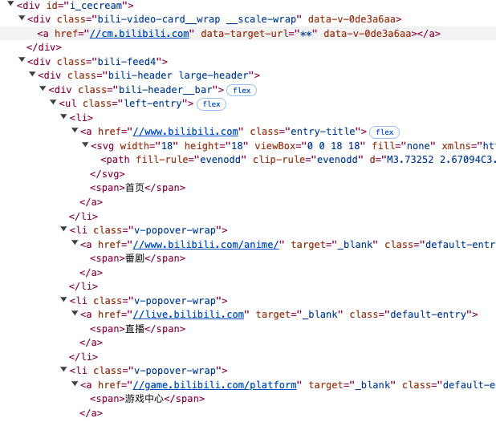
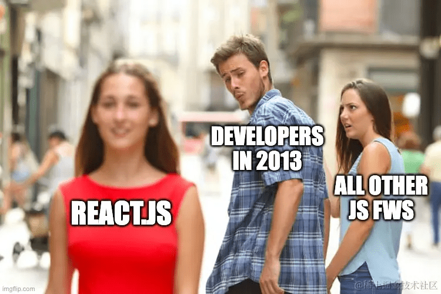
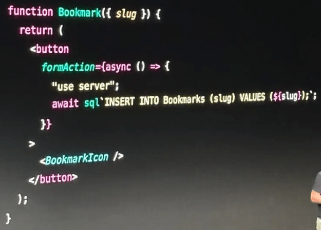
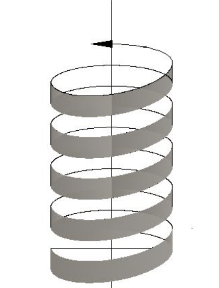

---
tags:
  - 前端基础
  - Web
  - think
date: 2025-02-09
---

# 从 React 看前端 UI 代码范式革命

## 前言

> 范式是一种公认的模型或模式。

_本来打算写的主题是“我为什么讨厌 React Hooks API“，再展开聊聊“小甜甜”是如何变成“牛夫人”的，没想到越写越严肃：）_

React 是两次前端范式革命的引领者，至今仍有繁荣的社区和旺盛的创造力；  
React 多次天才又激进的创新，一些想法被借鉴改良、一些引发广泛质疑，大部分是被认同和接受的；  
可以说 React 以一个框架之力，推动了前端领域的发展。

本文从 React 出发聊点前端历史，只讨论 Web UI 的最**基础表现形式**，不涉及框架的用法、特性介绍或对比。  
_所以本文内容没有门槛、没有干货，有点虚；放心食用，不长脑子。_

## 往事

2013 年 React 发布时，大部分团队都还没有形成前后端独立分工，前端页面代码是分别写在 html、js、css 三个不同文件中的；  
那时很多开发者看 React 的 jsx 语法（混合 html/js）多少有点**大逆不道**，因为它违反了[**关注点分离**][1]的设计思想。

关注点分离思想指导前端代码开发很多年，再由社区的 jQuery 加以巩固；  
根源在于浏览器使用三个不同类型的代码来描述 UI 的结构（html）、交互（js）、样式（css）。

随着前端页面越来越复杂，关注点分离思想逐渐成为实际工作生产的阻碍。

DOM 是一棵大而复杂的树形结构对象，jQuery 提供了非常便捷的方法，可以随意操作这棵树上的父子、兄弟节点，但难以追溯的 DOM 变更行为；  
你可以想象一下，事件回调、ajax 异步回调、定时器不停地异步操作 DOM 树，代码散落在几千行的 js 文件中，对维护者来说就是噩梦。
几个回合下来，很难直观理解这棵树的结构了；  
几十个回合下来，很难解释为什么某元素会在这里，或者某元素为什么不见了。

彼时，维护一个最简单的导航列表，面对的是这样的数据结构：  


js 代码可以在任何地方随意操作 DOM 上的任意节点，旧范式没有任何限制，就**相当于鼓励随意操作 DOM 的行为**。  
_无限自由，就是鼓励混乱。_

避免被杠，先说明一下  
良好的编码规范、贯彻执行的 CodeReview，即使旧范式也能控制混乱的增长速度；  
但这在多成员、快速迭代的项目中几乎是无法实现的，所以需要新范式、新思想。

_当时的“复杂”是相对更古早的静态页面，相对现在复杂程度只能算是小儿科了。_

## 第一次组件化革命

- **背景：** 前端页面越来越复杂，现有代码结构、范式阻碍了生产力发展
- **思想：** 组件化、数据驱动
- **武器：** jsx 语法
- **影响**
  - 前端项目进入编译时代
  - 组件化思想彻底普及
  - 数据驱动替代了 DOM 操作

_初遇 React_  


React 将页面拆分成组件，有效隔离了各个模块间的复杂度；  
将结构（html）与交互（js）代码融合在一起，由数据驱动视图；  
开发者的工作不再是命令式地虚空操作 DOM 树，而是维护组件中的状态值；  
由状态驱动的 DOM 结构就在旁边的 `render` 函数中，而不是另一个 html 文件中。

React 只是稍微扩展了一下 js 语法（jsx 两句话概括：js 中允许写标签，标签中花括号内是 js 表达式）。  
用最简单的设计、极低的用户学习成本，就实现**组件化 + 数据驱动视图**，将 html 融入 js 之中，如此自然、优雅。

```jsx
<ul>
  {list.map((it) => (
    <li>{it}</li>
  ))}
</ul>
```

## 2013 ～ 2019

React 创造了一个繁荣的社区，涌现无数基于 React 的 UI 组件库、可复用场景的页面级组件、基于组件的低代码系统……

而新的问题与混乱逐渐累积、显现。  
类组件代码快速膨胀，一个状态值离需要渲染它的节点、变更它方法往往相隔几十行甚至上百行代码，形成新的关注点分离模式。

1. `this.state`：巨大的组件状态对象
2. `this.render`：巨大的组件 DOM 结构
3. `其他类方法`：响应用户交互，变更状态

<details>
<summary><span style="color: #1989fa; cursor: pointer;">示例代码</span></summary>

```jsx
class Component {
  constructor() {
    this.state = {
      // 其他状态...
      count: 0,
      // 其他状态...
    };
  }

  // 其他方法 ...

  handleClick = (evt) => {
    this.setState({
      count: this.state.count + 1,
    });
  };

  // 其他方法 ...

  render() {
    return (
      <div>
        {/* 其他节点 */}
        <button onClick={this.handleClick}>
          Clicked {this.state.count} times
        </button>
        {/* 其他节点 */}
      </div>
    );
  }
}
```

</details>

虽说良好的编码规范、贯彻执行的 CodeReview，即使旧范式也能控制混乱的增长速度；  
但创建类组件的成本（模板代码较多），且类（class）本身有鼓励副作用方法（method）的特性；  
所以说**类组件范式，鼓励巨型组件**，它鼓励开发者将新增代码加入已有组件使之巨型化，而不是拆分组件。

## 第二次函数组件革命

- **背景：** 前端项目复杂度进一步增加，类组件代码快速膨胀
- **思想：** 函数式组件 `UI = f(state)`
- **武器：** Hooks API
- **影响：** Hooks 维持状态的函数式组件成为 UI 代码新范式

函数式组件在类组件时代就被大家熟知，但因无法维持内部状态，应用场景非常有限。  
相信大家都见过 `UI = f(state)` 这个理想化的公式，但类组件时代的实际情况是 `UI = class{ LargeState, render, ...methods }`。

React 的工程师们，天才般地发明（或引入）了**外观**清新脱俗、秀色可餐、别具一格又如此优雅自然的 Hooks API（刘亦菲.jpg）；  
且 Hooks API 完全符合 js 语法，仅凭一系列创新 API 加上魔法般的运行机制，就让函数组件拥有了维持状态的能力。

```jsx
function Counter() {
  const [count, setCount] = useState(0);
  function handleClick() {
    setCount(count + 1);
  }
  return <button onClick={handleClick}>Clicked {count} times</button>;
}
```

**简单即美**

Hooks API 之所以优美，是因为它**在 js 语法限制下**，发现了维持状态的**最简化描述形式**；  
Hooks API 维护的状态是函数内、细粒度、局部状态，与类组件的巨型状态截然相反；  
因为函数本身鼓励拆分、局部对象的特性，所以函数组件能与 Hooks API 如此自然地融合，两个字：般配！

React 的领导者地位，加上其他 UI 框架纷纷效仿，Hooks API 及其衍生（signal、composition API）形式迅速流行扩散至每一个角落，函数式组件终于成为新范式。

## 2019 ～ 至今

初见 Hooks API 时，你倾心于她的形式之美；  
如果你略懂闭包，立即会被她巧妙如魔法的实现再次折服；  
待时日渐长，你会发现她的内在 —— 简直是魔鬼！

声明：本人前文对 Hooks API 的所有赞美，仅限于她的外表。  
_但...男人...你懂的，只要对上了 👀，管她是鬼是蛇_

Hooks API **万恶之源**在于她超级简单的运行机制 —— 任何状态变更就**重复运行组件函数**，再使用虚拟 DOM diff 算法计算需要出更新的 DOM。  
_前面说简单即美，为什么“简单的运行机制”却不美了？_  
_这是一个哲学问题，有机会再聊[doge]_

该运行机制带来的缺点总结：

1. 开发者必须手动精确管理 useEffect 的依赖（漏写一个依赖，就启动找茬游戏）
2. 经常需要使用 useMemo 或 useCallback 优化性能（此类补丁 API 是重复运行机制的代价）
3. 闭包引用的状态可能过期（闭包引发的矛盾，可能需要买一个包包才能消解）
4. setState 不是同步的（对新手增加一点理解成本吧）

<details>
<summary><span style="color: #1989fa; cursor: pointer;">AI 生成的 Hooks API 缺点示例代码</span></summary>

```jsx
import React, { useState, useEffect, useCallback } from 'react';

function ExampleComponent({ fetchData }) {
  const [data, setData] = useState(null);
  const [count, setCount] = useState(0);

  // 必须手动精确管理 useEffect 的依赖
  useEffect(() => {
    // 如果 fetchData 函数未被 useCallback 包裹，可能导致不必要的重复执行
    fetchData().then((response) => setData(response));
  }, [a, b, c, d, ...]);

  const handleAlertClick = () => {
    // setTimeout 做示例看起来有点傻，实际情况中 async/await 很常见的
    setTimeout(() => {
      // 由于闭包的存在，这里引用的 count 可能不是最新的值
      alert(`Count: ${count}`);
    }, 3000);
  };

  const increment = useCallback(() => {
    setCount((prevCount) => prevCount + 1);
  }, []); // 如果不使用 useCallback，可能导致子组件不必要的重新渲染

  // setState 不是同步的
  const handleMultipleIncrements = () => {
    setCount(count + 1);
    setCount(count + 1);
    // 预期 count 增加 2，但实际上只增加了 1，因为 setState 是异步的
  };

  return (
    <div>
      <p>Data: {data}</p>
      <p>Count: {count}</p>
      <button onClick={increment}>Increment</button>
      <button onClick={handleAlertClick}>Show Alert in 3 Seconds</button>
      <button onClick={handleMultipleIncrements}>Increment Twice</button>
    </div>
  );
}
```

</details>

_另外，到最新的 React@19 版本，已经内置了 19 个 `useXXX` API（190 斤的刘亦菲.jpg）。_

## 它山之石，改良 Hooks API

React Hooks API 出现时，她的上述缺点就已经存在了，现在要解决的不是累积的矛盾，而是开发者累积的不满(￣ヘ￣)。

看看其他框架是如何改良 Hooks API 的。

**Solid.js**

`createSignal` 对比 `useState` 将数据值换成**获取数据值的函数**，实现了状态依赖的自动收集；  
一个小小的改动，就消除了组件函数重复运行、手动管理 `effect` 依赖、讨厌的过期闭包，`useMemo, useCallback` 此类补丁 API 当然没有存在的价值了。

```jsx
function Counter() {
  const [count, setCount] = createSignal(0);
  createEffect(() => {
    console.log('The count is now', count());
  });

  return <button onClick={() => setCount(count() + 1)}>Click Me</button>;
}
```

那代价是什么呢？  
状态值变成了函数，所有使用它的地方都要要加一个括号 `count()`，确实没有 Hooks API 直接使用变量那么美。

**Vue.js**

Vue 一开始选择的方向跟 React 就有明显差异，但仍然参考 Hooks API 设计了组合式 API，可以证明 Hooks API 的形式美无可辩驳。

Vue.js 使用 Proxy 来实现依赖收集、状态变更监测。  
`count.value` 的访问形式略显丑陋，采用 Proxy 来监测变更则非常方便（`obj.count ++`）；  
Vue 消除了状态变更函数 `setCount`。

```js
const count = ref(1);
const obj = reactive({ count });

// 会更新 `obj.count`
count.value++;
console.log(count.value); // 2
console.log(obj.count); // 2

// 也会更新 `count` ref
obj.count++;
console.log(obj.count); // 3
console.log(count.value); // 3
```

## 当前理想化的 UI 范式

我不知道 React 的工程师们在设计 Hooks API 时，是否有考虑过 `createSignal` 返回函数而不是值的设计方案。

也许他们觉得在一个状态后面加上括号 `count()` 来获取它的值比较丑陋；  
也许他们觉得自动依赖收集、局部 DOM 更新繁琐而不够优雅。

能肯定的是，他们低估了重复运行组件函数对开发者带来的伤害；  
如果在 2019 年首次发布 Hooks API 时，付出两个括号的代价 `count()`，前端开发者的生活将会更美好。

**那 Solid.js 就是完美的状态最简表现形式吗？**

来看一段 Svelte 代码。  
Svelte 使用 `$state` 符文（runes）将一个 js 变量标记为状态，状态变更就是变量赋值 `count += 1`。

不需要解构元组，`const [] = createSignal()`；  
不需要变更函数，`setCount(n)`；  
不需要多余的括号，状态就是 js 普通数据变量（`count`），而不是函数（`count()`）或代理对象（`count.value`）。

```svelte
<script>
	let count = $state(0);

	function handleClick() {
		count += 1;
	}
</script>

<button onclick={handleClick}> Clicked {count} times </button>
```

Svelte 如何能检测到原始值的变更 `count += 1`？  
这是 Svelte 的魔法，在编译期分析状态依赖，插入变更标记，然后在运行时按需更新 DOM。  
_值得一提的是，它还打破了 React 植入的 `虚拟DOM = 高性能` 的思想钢印_

**如果参考 svelte 再次扩展一点点 jsx 语法，函数组件是否有更简洁优美的表达形式？**

```jsx
// 假想，不可运行的代码
function Component() {
  let count = $state(0);
  function handleClick() {
    count += 1;
  }
  return <button onClick={handleClick}>Clicked {count} times</button>;
}
```

_这里不讨论实现难度或可能引入的问题，只想展现出理想状态下最简化的函数组件范式。_

讲了这么久总结一下，我只想要两个东西：

1. 将变量标记为组件状态，类似 `$state` 符文
2. 避免重复运行组件函数体，类似 Svelte 基于编译器或 Solid.js Signal 的响应式系统

## 下一次（进行中？）革命

2023 年的这张图片把很多人都震惊了，甚至火出了前端圈，让一些人回忆起被 PHP、JSP、ASP 支配的恐惧。  
_这不是开历史倒车行为，又违反了关注点分离思想么？_



React 在 10 年前（2013）使用 jsx 语法融合 UI 的结构（html）和交互（js），现在开始融合为 UI 提供数据的表层服务端。  
如果前端 UI 与后端的表层服务是同一个团队维护，在客户端中直接调用服务端函数确实是非常方便的。

比如 Next.js 项目在浏览器中调用 `getData()` ，会被自动转换成 http 请求，最终执行服务端对应的函数，相当于内置了 RPC 能力；  
消除了传统 Restful 接口的模板代码（客户端的 fetch、服务端的 router），简化了客户端/服务端交互。

```js
// src/action.server.js
export async function getData(id) {
  return db.query(id);
}
```

```js
// src/ui.client.jsx
'use client';
import { getData } from './action.server';

function UIComponent() {
  const [data, setData] = useState('');
  useEffect(() => {
    (async () => {
      setData(await getData(42));
    })();
  }, []);
  return <span>{data}</span>;
}
```

客户端/服务端泾渭分明的界限不再那么明显，同一个功能模块分别在浏览器与服务器中运行的代码文件，将被放在同一个项目中、同一个目录下，且可以相互 import，如同魔法一般。

为 UI 提供数据的表层后端接口**通常跟特定业务强相关**，无法（无需）被复用，把相关代码放在同一个目录下，相对前后端分离代码管理模式是有明显简化的；  
且能让功能模块的 UI 和数据接口保持更亲密的关系，开发者会更容易理解与维护。

未来是否会被大量开发者接受，拭目以待吧。  
_实际取决于前后端岗位的合作与博弈_

## 思考总结

我反对以“开历史倒车“的观点，来形容尝试融合前后端代码的创新行为。

> 恩格斯在《自然辩证法》中说：“由矛盾引起的发展或否定的否定——发展的螺旋形式。”  
> [螺旋形上升][3] 是对否定的否定规律所揭示的事物发展形式的一种形象比喻。

如果俯视螺旋，它是一个圆形，新的事物似乎回到历史上的某个点；  
但千万不要忽视新事物在垂直方向上的上升（进步）。



关注点分离的思想并没有错，否则 Vue 也不会发展出如此繁荣的生态；  
Vue 在单文件组件中融合了 html/js/css，同时又保持了关注点分离；  
相比 React（jsx）融合 html/js 而丢掉 css，然后用各种 css in js 方案来找补，从这个维度来看是略逊于 Vue 的。

我总结三次**范式革命背后的驱动力是[亲密性原则][2]**，规模（复杂性）的增长让代码逐渐违反了亲密性原则。

为实现共同目标的代码应该放在一起，规模较大的模块需要拆分成更细粒度；  
关系亲密、相互合作的代码就应该让它们的物理距离（代码位置）更接近，遵循亲密性原则；  
如果不同职责的代码天赋属性（如 html/js, 前/后端）有区别，那就用新技术去融合或拉近它们距离，而不是用来分割它们理由。

_有机会再聊亲密性原则与程序设计、工程化。_

## 附录

- [关注点分离][1]
- [亲密性原则][2]
- [螺旋形上升][3]

[1]: https://www.cnblogs.com/wenhongyu/p/7992028.html
[2]: https://www.cnblogs.com/asandstar/p/17072422.html#_label0_0
[3]: https://baike.baidu.com/item/螺旋形上升/22412481
