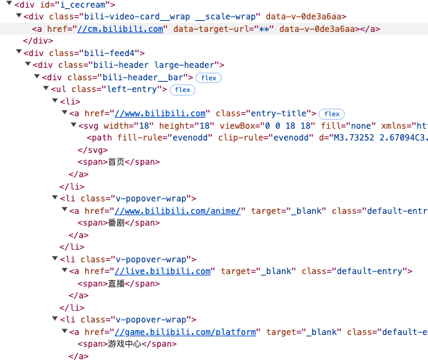
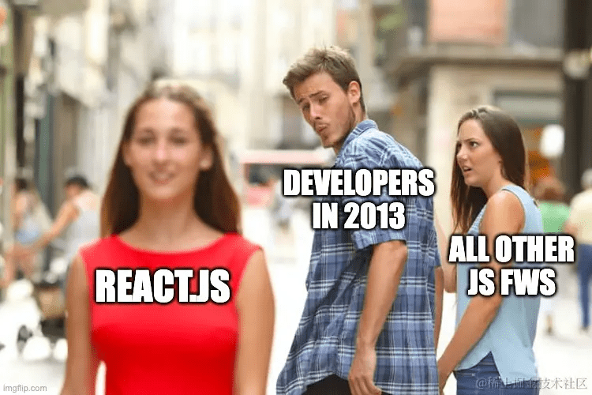
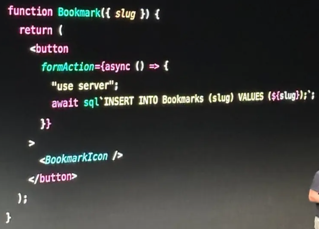
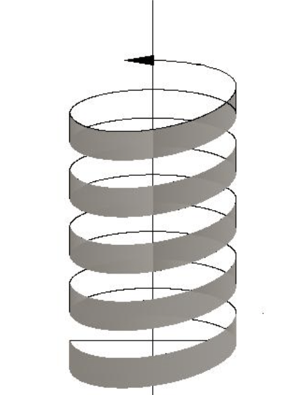

<div class="title">
  <div>
    <h1>从 React 看前端 UI 代码范式革命</h1>
    <div class="name txt-center">风痕</div>
  </div>
</div>

---


<!-- 自我介绍，右下角二维码 -->

## 前言 / 动机

- React 引领两次前端范式革命
- React 多次天才又激进的创新，被广泛认同和接受
- React 以一个框架之力，推动了整个前端领域的发展

**小甜甜 -> 牛夫人**（当初惊艳 -> 我再也不用 React 了）

<!-- 态度转变，聊点历史 -->

## 前言 / 动机

> **范式是一种公认的模型或模式**

只讨论 Web UI 代码基础范式的演进（**最基础表现形式**）

~~不同框架的用法、特性介绍或对比~~

<!-- 内容没有门槛有点虚，不用当心看完之后到脑袋发痒 -->

## 往事

- **UI = HTML（结构） + JS（交互） + CSS（样式）**
- 前后端尚未形成分工
  - HTML = （JSP / PHP / ASP）+ 数据
  - JS 响应用户交互
  - CSS 页面样式
- UI 代码指导思想 —— 关注点分离
  - JSX（HTML/JS） 大逆不道

---

HTML ｜ JS 相互隔离，可以随意操作 DOM 树
_无限自由，就是鼓励混乱_



---

- 前端页面复杂度增加，关注点分离思想开始阻碍生产
- 需要**新范式**

<!-- 简单页面：内容展示、表单提交；复杂页面：规模大，动态数据 -->

## 第一次组件化革命

- **背景：** 前端页面越来越复杂，现有代码结构、范式阻碍了生产力发展
- **思想：** 组件化、数据驱动
- **武器：** JSX 语法
- **影响**
  - 前端项目进入编译时代
  - 组件化思想彻底普及
  - 数据驱动替代了 DOM 操作

---



## 第一次组件化革命

- 将页面拆分成组件，隔离模块间的复杂度
- 融合结构（html）与交互（js）代码
- 关联数据状态与 DOM
  - 关注状态，而不是虚空操作 DOM
- 实现了组件化 + 数据驱动视图

## 第一次组件化革命

**JSX 语法**

- JS 中允许写类似 HTML 的标签
- 标签中花括号内是 JS 表达式

```jsx
<ul>
  {list.map((it) => (
    <li>{it}</li>
  ))}
</ul>
```

_JSX 的**代价**是引入了编译阶段，增加了前端**工程复杂度**_

## 2013 ～ 2019

- React 创造了繁荣的社区
- 新问题与混乱逐渐累积、显现
  - `this.state`：巨大的组件状态对象
  - `this.render`：巨大的组件 DOM 结构
  - `其他类方法`：响应用户交互，变更状态

---

```jsx
class Component {
  constructor() {
    this.state = {
      // 其他状态...
      count: 0,
      // 其他状态...
    };
  }

  // 生命周期钩子...
  componentDidMount() {}
  componentWillUnmount() {}

  // 其他方法 ...

  handleClick = (evt) => {
    this.setState({
      count: this.state.count + 1,
    });
  };

  // 其他方法 ...

  render() {
    return (
      <div>
        {/* 其他节点 */}
        <button onClick={this.handleClick}>
          Clicked {this.state.count} times
        </button>
        {/* 其他节点 */}
      </div>
    );
  }
}
```

## 2013 ～ 2019

矛盾底层原因

- 创建类组件的成本较高（模式化代码较多）
- 类（class）本身就有鼓励副作用方法（method）的特性
- **类组件范式，鼓励巨型组件**，而不是拆分组件

总结

- 理想：`UI = f(state)`
- 实际：`UI = class { LargeState, render, ...methods }`

## 第二次函数组件革命

- **背景：** 前端项目复杂度进一步增加，类组件代码快速膨胀
- **思想：** 函数式组件 `UI = f(state)`
- **武器：** Hooks API
- **影响：** Hooks 维持状态的函数式组件成为 UI 代码新范式

<!-- 终于实现理想 -->

## Hooks API

纯 API 创新 + 魔法运行机制，实现在函数内部维持状态
_（jsx 是语法创新，需要引入编译器）_

```jsx
function Counter() {
  const [count, setCount] = useState(0);
  function handleClick() {
    setCount(count + 1);
  }
  return <button onClick={handleClick}>Clicked {count} times</button>;
}
```

_(刘亦菲.jpg)_

## Hooks API

**简单即美**

- Hooks API **在 js 语法限制下**，发现了维持状态的**最简化描述形式**
- Hooks API 细粒度状态与类组件的巨型状态截然相反
- 函数本身鼓励拆分，与 Hooks API 非常匹配

React 的领导者地位，其他 UI 框架跟进  
Hooks API 促成函数式组件成为新范式

## 2019 ～ 至今

初见 Hooks API 时，你倾心于她的形式之美；  
如果你略懂闭包，立即会被她巧妙如魔法的实现再次折服；  
待时日渐长，你会发现她的内在 —— 简直是魔鬼！

声明：本人前文对 Hooks API 的所有赞美，仅限于她的外表。

**万恶之源** —— 任何状态变更就**重复运行组件函数**

## Hooks API 缺陷

1. 开发者必须手动精确管理 useEffect 的依赖
2. 需要使用 useMemo 或 useCallback 优化性能
3. 闭包引用的状态可能过期
4. setState 不是同步的

_API 膨胀，React@19 版本，已经内置了 19 个 `useXXX` API_
_（190 斤的刘亦菲.jpg）_

---

_AI 生成的展示 Hooks API 缺点示例代码_

```jsx
import React, { useState, useEffect, useCallback } from 'react';

function ExampleComponent({ fetchData }) {
  const [data, setData] = useState(null);
  const [count, setCount] = useState(0);

  // 必须手动精确管理 useEffect 的依赖
  useEffect(() => {
    // 如果 fetchData 函数未被 useCallback 包裹，可能导致不必要的重复执行
    fetchData().then((response) => setData(response));
  }, [a, b, c, d, ...]);

  const handleAlertClick = () => {
    // setTimeout 做示例看起来有点傻，实际情况中 async/await 很常见的
    setTimeout(() => {
      // 由于闭包的存在，这里引用的 count 可能不是最新的值
      alert(`Count: ${count}`);
    }, 3000);
  };

  const increment = useCallback(() => {
    setCount((prevCount) => prevCount + 1);
  }, []); // 如果不使用 useCallback，可能导致子组件不必要的重新渲染

  // setState 不是同步的
  const handleMultipleIncrements = () => {
    setCount(count + 1);
    setCount(count + 1);
    // 预期 count 增加 2，但实际上只增加了 1，因为 setState 是异步的
  };

  return (
    <div>
      <p>Data: {data}</p>
      <p>Count: {count}</p>
      <button onClick={increment}>Increment</button>
      <button onClick={handleAlertClick}>Show Alert in 3 Seconds</button>
      <button onClick={handleMultipleIncrements}>Increment Twice</button>
    </div>
  );
}
```

## 它山之石，改良 Hooks API

如何解决开发者累积的不满(￣ヘ￣)

## Solid.js

两个括号的代价（`count` -> `count()`） 避免函数组件重复运行

```jsx
function Counter() {
  const [count, setCount] = createSignal(0);

  return <button onClick={() => setCount(count() + 1)}>Click Me</button>;
}
```

## Vue.js

拥抱 Proxy

```js
const count = ref(1);
const obj = reactive({ count });

// 会更新 `obj.count`
count.value++;
console.log(count.value); // 2
console.log(obj.count); // 2

// 也会更新 `count` ref
obj.count++;
console.log(obj.count); // 3
console.log(count.value); // 3
```

---

如果首次发布 Hooks API 时，付出两个括号的代价 `count()`

前端开发者的生活将会更美好

那 Solid.js 就是状态**最简表现形式**吗？

## Svelte.js

`$state` 符文标记变量为状态，赋值语句即状态变更

```html
<script>
  let count = $state(0);

  function handleClick() {
    count += 1;
  }
</script>

<button onclick="{handleClick}">Clicked {count} times</button>
```

## Svelte.js

- 不需要解构元组，`const [] = createSignal()`；
- 不需要变更函数，`setCount(n)`；
- 不需要多余的括号，状态就是 js 普通数值变量
  - 而不是函数 `count()` 或代理对象 `count.value`。

_值得一提的是，Svelte 还打破了 React 植入的 `虚拟DOM = 高性能` 的思想钢印_

## 理想化的 UI 范式

**再扩展一次 jsx 语法，是否有更简洁优美的表达形式？**

```jsx
// 假想，不可运行的代码
function Component() {
  let count = $state(0);

  function handleClick() {
    count += 1;
  }

  return <button onClick={handleClick}>Clicked {count} times</button>;
}
```

## 理想化的 UI 范式

1. 将变量标记为组件状态，类似 `$state` 符文
2. 避免重复运行组件函数体的响应式系统

## 下一次（进行中？）革命

震惊



## 下一次（进行中？）革命

**积极的一面**：前后端无缝交互

---

Next.js 示例

```js
// src/action.server.js
export async function getData(id) {
  return db.query(id);
}

// src/ui.client.jsx
import { getData } from './action.server';
function UIComponent() {
  const [data, setData] = useState('');
  useEffect(() => {
    (async () => {
      setData(await getData(42));
    })();
  }, []);
  return <span>{data}</span>;
}
```

## 新魔法

- 客户端/服务端的界限不再那么明显
- 前端直接 import 后端模块
- 按功能模块组织代码，而不是按运行环境组织代码

_未来是否会被大量开发者接受，拭目以待_

---

<div class="title">
  <h1>思考总结</h1>
</div>

## 螺旋形上升

我反对以“开历史倒车“来形容尝试融合前后端代码的创新行为

> 由矛盾引起的发展 —— 发展的螺旋形式

俯视螺旋(圆形)，新的事物似乎回到历史上的某个点
**千万不要忽视垂直方向上的上升（进步）**



## 关注点分离

关注点分离的思想并没有错，否则 Vue 也不会发展出如此繁荣的生态

Vue 继承了 html/js/css 的模式，保持关注点分离又跟上了时代的步伐

## 亲密性原则

范式革命背后的驱动力是**亲密性原则**

- 为实现共同目标的代码应该放在一起
- 相互合作的代码就应该让它们的物理距离（代码位置）更接近
- 融合亲密代码，而不是按属性拆分

---

<div class="title">
  <div>
    <h1 class="txt-center">Thanks ~</h1>
    <p></p>
    <p class="txt-center">订阅</p>
  </div>
</div>
