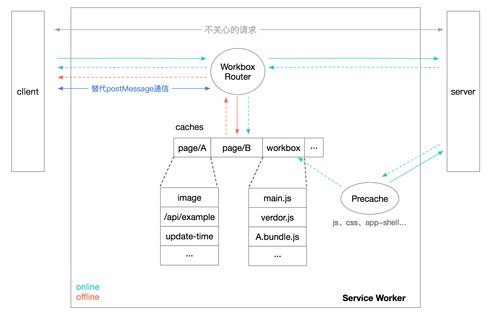

# 同构项目 Service Worker 离线化实践

> *阅读本文需要相关知识储备*：  [Service Worker 生命周期](https://developers.google.com/web/fundamentals/primers/service-workers/lifecycle?hl=zh-cn)、[Workbox](https://github.com/GoogleChrome/workbox)、前端同构渲染  

## 背景

团队计划在产品中尝试离线化某些功能，在这之前项目已经简单引入了[workbox](https://github.com/GoogleChrome/workbox)来管理静态资源。因为没有缓存动态接口数据，所有页面并不支持离线访问。    
目标：使高流量页面支持离线访问，让用户意识到网页（非APP）也能在无网络场景下使用。  

## 方案

### 调研

在对SW工作原理有初步了解之后，分析总结我们面临的主要问题分两类。  
* 如何管理缓存资源（静态资源、接口数据）  
  - 如何缓存静态资源（js, css...）  
  - 如何缓存后台接口数据  
  - 如何缓存动态获取的资源（如从接口获取的页面头图）  
  - 如何清除失效缓存  
* 如何解决同构项目特有问题（问题较复杂，后文详细描述）  

用一张图来描述大致的方案  


### 缓存管理
针对缓存管理的问题，决定以workbox为基础来实现。  
使用的workbox提供的 [workbox-webpack-plugin](https://developers.google.com/web/tools/workbox/guides/generate-service-worker/webpack)、[Precache Files](https://developers.google.com/web/tools/workbox/guides/precache-files/)、[Route Requests](https://developers.google.com/web/tools/workbox/guides/route-requests) 功能，然后再在其上编写动态资源、缓存清除逻辑，缓存关的问题基本上都解决了。  
大致步骤如下：   
1. 集成workbox-webpack-plugin插件到构建流程，`workboxPlugin.GenerateSW`生成precache-manifest文件(包含所有静态资源的路径)  
1. 避免占用太多空间、节省流量等原因，只预缓存项目公共资源 `workbox.precaching.precacheAndRoute(self.__precacheManifest.filter(/* 自定义规则 */))`，SW每次install会增量获取有更新的资源  
1. `workbox.routing.registerRoute`拦截并缓存需离线访问页面的动态请求  
    * 如何缓存通过接口获取的头图url？`registerRoute`注册一个特殊路由，获取到头图url之后发送给SW，SW发起图片请求缓存Response。  
      ```js
      // service worker js
      workbox.routing.registerRoute(/sw-api\/cache-static-res/, () => {
        const url = await event.request.json();
        await fetch(url).then(resp => cache.put(url, resp))));
        return new Response('success', {
          status: 200,
          statusText: 'ok',
        })
      }, 'POST')
      // page js
      fetch('/sw-api/cache-static-res', {
        body: 'http://xxxxxxxx.png',
        method: 'POST',
      })
      ```
1. 非公共资源，按页面缓存到Cache Storage对应的key（根据页面生成）下，当页面达到一定数量则清除最老的页面缓存  
    * 如何获取到最旧的页面缓存？可以在每个页面对应的key下创建一个时间戳缓存项，页面每次访问时都更新时间戳 `cache.put('update-timestamp', new Response(Date.now())`  

### 同构项目特有问题  

**背景：不同渲染模式的差异**  
* 纯Server端渲染，每访问一个页面，Server请求**页面初始化接口(init request)**，渲染完成后直接返回一个完整的已初始化的html文档。  
* Client端渲染，当访问一个页面时，通常是由静态资源服务器（如Nginx、Apache）或CDN返回一个非常简单的**骨架html**文档，然后加载页面的依赖的“**\*.bundle.js**”文件，由js请求**页面初始化接口(init request)**再生成dom挂载到html中的一个空节点上。  
* 同构渲染则结合两者的优点，用户在浏览器中第一次打开页面，由Server渲染（更快地展现第一屏、有利于SEO），之后的用户在站内跳转则使用客户端渲染（节省流量、减少服务端压力）。  

假设用户先打开 页面A，再跳转到 页面B（A -> B）。  
从背景描述我们可以知道对于A（html）、B（B.bundle.js + init request）两个页面，SW能截获到的内容是不一样的。    
如果在离线场景下，用户是打开 页面B，再跳转 页面A。如何生成页面B的html，获取页面A的init request呢？  
同构项目的特殊问题即：**在离线场景下，如何保证任意页面能够以任意路径访问。**  

离线场景不能访问网络，所以必须完全启用Client渲染。（也可以在用户访问页面时，额外发送一个请求，然后缓存由Server返回的html，但这种方式比较浪费资源）  
**为了使页面在不能访问网络的情况下正确渲染，需要解决两个问题：**  
1. 构建骨架html，其中引入必要的js、css。离线打开页面时返回骨架html，作为入口启动Client渲染。  
1. Server端渲染请求的init request想办法传递到Client，由SW缓存起来。  

#### 构建骨架html
1. 创建一个shell.html，留下两个标记用来注入页面依赖的js、css url  
    ```html
    <html>
      <header>
        <!-- inject main-css -->
      </header>
      <body>
        <div id="app"></div>
        <!-- inject scripts -->
      </body>
    </html>
    ```  
1. 在SW `install` 事件中请求shell.html，注入页面依赖的js、css，然后缓存到caches中  
    ```js
    self.addEventListener('install', installHandler);

    function installHandler(event) {
      // 使用webpack打包，页面依赖的三个公共js
      const regx = /(?:runtime~main|main|vendors~main)(?:\.\w+)?\.js/;

      // __precacheManifest是workbox生成的SW全局变量
      const startJS = self.__precacheManifest
        .map(({ url }) => url)
        .filter(url => regx.test(url))
        .map(url => `<script src="${url}"></script>`)
        .join(' ');

      const mainCSSUrl = self.__precacheManifest
        .find(({ url }) => /main\.\w+\.css$/.test(url));
      const mainCSS = `<link rel="stylesheet" type="text/css" href="${ mainCSSUrl ? mainCSSUrl.url : '' }">`;

      event.waitUntil(
        (async () => {
          await caches.delete(`pre-cache-tpl`);
          const cache = await caches.open(`pre-cache-tpl`);

          const resp = await fetch('/app-shell.html');
          const txt = await resp.text();
          await cache.put(
            '/app-shell.html',
            new Response(
              txt
                .replace('<!-- inject scripts -->', startJS)
                .replace('<!-- inject main-css -->', mainCSS),
              {
                headers: { 'Content-Type': 'text/html;charset=UTF-8' },
              }
            )
          );
        })()
      );
    }
    ```  
1. 当一个导航请求失败时，从caches中读取shell.html返回，页面渲染完成后将dom挂载到`<div id="app"></div>`节点上。  
    ```js
    if (/* request error && */ req.mode === 'navigate') {
      return caches.match('/app-shell.html');
    }
    ```

#### 缓存init request
1. 拦截所有Server发送的页面必要的请求。（主流的api库都提供interceptor功能）  
    ```js
    const INIT_REQUESTS = []
    // data是接口返回的数据
    INIT_REQUESTS.push({
      path,
      resp: { status, statusText, data, headers }
    })
    ```
1. 将请求结果序列化后放到返回的主文档中。  
    ```html
    <script>
    window.INIT_REQUESTS = JSON.stringify(INIT_REQUESTS)
    </script>
    ```
1. Client反序列化后，发送给SW，SW重建Response缓存到cacehs中。  
    ```js   
    cache.put(path, new Response(JSON.stringify(data), { headers, status, statusText }));
    ```
*以上是示例代码，同构项目通常会使用状态管理工具（如Vuex）把数据从Server同步到Client，免去了手动序列化的过程，只需要在rootState中用一个key来存储接口数据*

## 意外问题

*以下记录一些大家可能会碰到的问题*  

### SW文件热更新几率性失效  
```js
// src要传全路径，传相对路径不会报错，但可能会导致热更新失效。跟webpack的缓存文件缓存有关系
workboxPlugin.InjectManifest({
  swSrc: swConfig.src,  
  swDest: 'service-worker.js',
  importWorkboxFrom: 'local',
})
```

### 不要拦截页面的所有Fetch请求
只关注需要缓存请求，避免出现意外情况。例如开发阶段用来热更新的接口（`sockjs-node/932/vpeauunq/websocket`）被拦截后，如果勾选了`Update on reload`刷新时会导致页面处于卡死状态。  


### 无网或弱网环境及时中断请求
真机环境浏览器需要尝试很长的时间才会告诉你请求失败（连上wifi并不代表wifi可用，浏览器也不知道到底能不能正常访问网络），如果你的网页支持离线访问，建议设置超时时间提前中断请求，否则用户很可能还没看到你的离线页面就退出了。  
```js
Promise.race([
  fetch(req),
  new Promise((resolve, reject) =>
    setTimeout(() => reject(`fetch ${req.url || req} timeout`), FETCH_TIMEOUT)
  ),
]);
```

### preview面板可能展示与实际不符的内容
如果你将时间戳写入caches，在devtools Cache Storge 的 preview面板将展示错误的值，程序将读取到正确的值。[bug地址](https://bugs.chromium.org/p/chromium/issues/detail?id=917826&can=1&q=hughfenghen&colspec=ID%20Pri%20M%20Stars%20ReleaseBlock%20Component%20Status%20Owner%20Summary%20OS%20Modified)  
