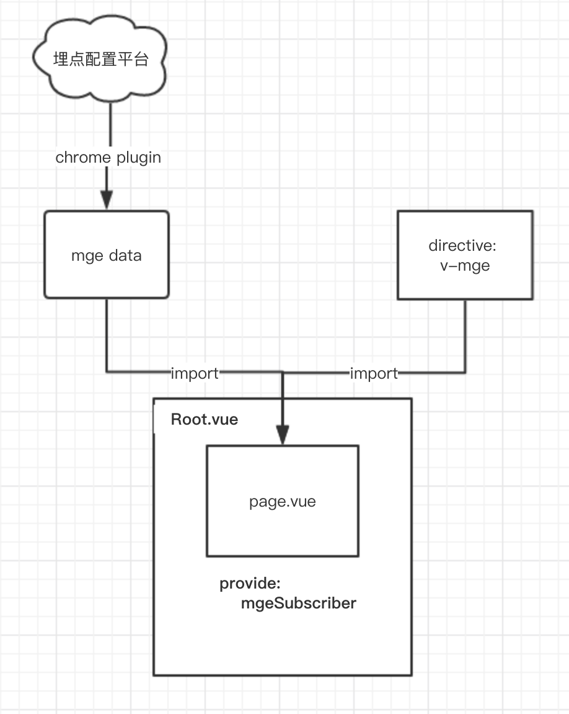
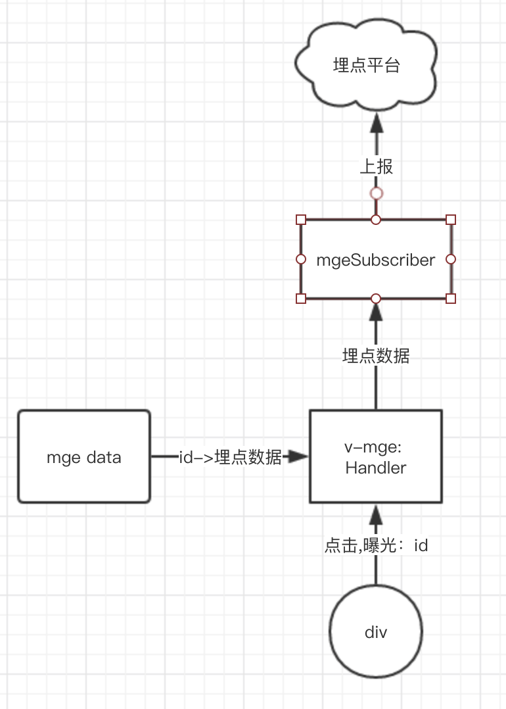

---
tags:
  - Web
date: 2018-05-01
---

# 基于vue directive实现声明式埋点方案

**注：本方案依赖[vue](https://github.com/vuejs/vue)、[lazysizes](https://github.com/aFarkas/lazysizes)(曝光事件：lazybeforeunveil)**

## 传统埋点 vs 声明式埋点

**正文开始前，对比展示一下效果，方便读者判断是否有兴趣 :）**

**传统埋点**
```vue
<template>
  <div @click="handleMoreClick(0)">More</div>
</template>

<script>
export default {
  methods: {
    handleMoreClick(type) {
      this.onAnalyticsEvent('查看更多', '签到活动card【查看更多】_click', 'b_4ezhmbjt', { type })
    },
    onAnalyticsEvent(element_id, title, bid, lab) {
      AnalyticsUtil.sendAnalyticsEvent({
        val: {
          element_id,
          title,
          bid,
          lab,
        }
      })
    },
  }
}
</script>
```

**声明式埋点**
```vue
<template>
  <div v-mge:b_4ezhmbjt="0">More</div>
</template>
<script>
/* 无需写其他代码 */
</script>
```
*神奇的`v-mge`如何实现，埋点信息如何获取？ 请看下文分解~*

## 背景

1. 前端页面埋点需求很多，基本采用传统的命令式埋点，随着项目业务需求开发持续进行，出现越来越多的冗余代码，虽做了部分公共封装，但与业务逻辑无关的埋点代码还是不可逆地累积，且分散在源码各处。
2. 埋点过程有较多重复性劳动，低效率且容易出错。  
  团队埋点流程：产品配置埋点->开发从平台逐个copy埋点信息->粘贴到源码->运行时发送埋点。

## 调研

1. 接收到优化埋点的任务时开始调研，准备了两套方案：a: 可视化无痕埋点；b: 声明式埋点。
2. 方案一最终流产。不过多介绍，原因总结如下：
    * 重新制定了埋点流程，需多方配合
    * 开发工作量大且复杂  
  *虽可提供动态埋点功能，但产品对现有埋点流程无痛感，无动力使用新方案。  
  所以，为解决自己的问题，期望别人做太大改动是不切实际的。*

3. 声明式埋点依赖`vue`框架，可以提升效率，仍需要维护埋点信息（按页面统一维护），但实现起来足够简单，且对流程无影响。

## 实现

**资源依赖如图：**  
1. 通过Chrome插件（推荐chrome插件，可快速写写浏览器[tampermonkey](https://chrome.google.com/webstore/detail/tampermonkey/dhdgffkkebhmkfjojejmpbldmpobfkfo)）生成mge data（这部分是团队定制的，不作介绍）。  
```js
// 生成的数据样例
export default {
  b_4ezhmbjt: type => ({
    elementName: '查看更多',
    eventName: '签到活动card【查看更多】_click',
    eventType: 'click',
    custom: { type },
  }),
  // ...
}
```
2. 在页面（page.vue）导入埋点数据、注册指令。  
3. 在根节点订阅（mgeSubscriber）指令发布的消息，所有埋点事件触发后都将埋点数据传递给该订阅者。  


**数据流向：**
1. 指令（v-mge）初始化时给dom节点绑定事件。
2. 事件触发时根据埋点id获取对应的埋点信息，加上业务参数合成完整的埋点数据。
3. 完整的埋点数据传递给Vue实例根节点提供（Provide）的`mgeSubscriber`。
4. `mgeSubscriber`接收到数据后上报到埋点服务器。


## 收益
* 一个埋点大约能节约1~2分钟
* 一个埋点大约5行代码，精简到可以忽略
* 埋点数据从业务代码中剥离出来（单独文件管理，import到页面）
* 覆盖90%以上的场景（UI组件内事件需要在handler中上报，不能通过指令埋点）

## 详细API
```vue
<template lang="html">
  <!-- 携带一个业务字段事件 -->
  <div v-dr-mge:b_5ix7ve3c="title">
    {{ a }}
    <!-- 携带多个业务字段 -->
    <div v-dr-mge:b_7sslet2v="[title, shopId]">
      {{ b }}
    </div>
    <!-- 不携带业务参数事件 -->
    <div v-dr-mge:b_vyc33sw0></div>
    <div v-for="(v, index) in arr">
      <!-- 曝光+click事件 -->
      <p v-dr-mge:b_1rlrj8dr|b_6zn0e86f="[v, index]">{{v}}</p>
    </div>
  </div>
</template>
```

## 可参考的指令源码
```js
import 'lazysizes';

// 每个埋点传递进来的值，经过MGE_DATA转换后的结果，当事件触发时将结果发送给provide
const CACHE_DATA = {};

function handleMge(el, bidKey, e) {
  // click使用el，曝光使用e.target
  const uniqBid = (el || e.target).dataset[bidKey];
  const mgeInfo = CACHE_DATA[uniqBid];
  if (!mgeInfo) return;

  const { data, subscriber } = mgeInfo;
  data.bid = uniqBid.replace(/-\d+$/, '');
  subscriber(data);
}

// 绑定lazysizes提供的lazybeforeunveil事件
document.addEventListener('lazybeforeunveil', handleMge.bind(null, null, 'viewMgeBid'));

// 判断传递给指令的新值、旧值是否相等
function directiveValueEquals(v1, v2) {
  if (v1 === v2) return true;
  if (typeof v1 !== typeof v2) return false;
  return v1.toString() === v2.toString();
}

// 生成唯一值，解决一个bid被注册多次的场景。如在v-for生成的元素上使用dr-mge
const uniq = (() => {
  let id = 0;
  return bid => {
    id += 1;
    return `${bid}-${id}`;
  };
})();

/**
 * 创建mge指令
 * @param  {object} mgeData 从ocean获取的埋点数据
 * @return {object}         vue 指令
 */
export default function createMgeDirective(mgeData) {
  if (mgeData == null || typeof mgeData !== 'object') return;
  // eslint-disable-next-line
  return {
    inserted(el, binding, vnode) {
      const { arg, value } = binding;
      const { $mgeSubscriber } = vnode.context.$root._provided;
      // 如果根节点未提供处理mge事件的handle，则忽略该指令
      if (!$mgeSubscriber) {
        console.error('root节点provide没有$mgeSubscriber');
        return;
      }

      arg.split('|').forEach(bid => {
        const mgeInfo = mgeData[bid];
        if (!mgeInfo) {
          console.error('未注册埋点信息的bid：', bid);
          return;
        }

        const uniqBid = uniq(bid);
        const eventData = typeof mgeInfo === 'function' ? mgeInfo(...[].concat(value)) : mgeInfo;

        el.setAttribute(`data-${eventData.eventType}-mge-bid`, uniqBid);
        CACHE_DATA[uniqBid] = {
          data: eventData,
          subscriber: $mgeSubscriber, // 当mge事件触发时将data传递给handle
        };

        if (eventData.eventType === 'click') {
          el.addEventListener('click', handleMge.bind(null, el, 'clickMgeBid'));
        } else if (
          eventData.eventType === 'view'
          && !el.classList.contains('lazyload')
        ) {
          el.classList.add('lazyload');
        }
      });
    },
    componentUpdated(el, binding) {
      const { arg, value, oldValue } = binding;

      arg.split('|').forEach(bid => {
        // 从dataset中查找 uniqBid
        const uniqBid = Object.keys(el.dataset)
          .map(key => el.dataset[key])
          .find(v => new RegExp(`${bid}-\\d+$`).test(v));
        if (!uniqBid) return;

        const mgeInfo = mgeData[bid];
        const cacheData = CACHE_DATA[uniqBid];

        if (mgeInfo && cacheData) {
          // 更新缓存值
          cacheData.data = typeof mgeInfo === 'function' ? mgeInfo(...[].concat(value)) : mgeInfo;

          // 曝光事件，当传递的参数改变时需要重新曝光，重置class
          if (cacheData.data.eventType === 'view' && !directiveValueEquals(value, oldValue)) {
            el.classList.remove('lazyloaded');
            el.classList.add('lazyload');
          }
        } else {
          console.error('指令更新异常，未找到该埋点信息或缓存数据', bid);
        }
      });
    },
    unbind(el, binding) {
      binding.arg.split('|').forEach(bid => {
        delete CACHE_DATA[bid];
      });
    },
  };
}
```
