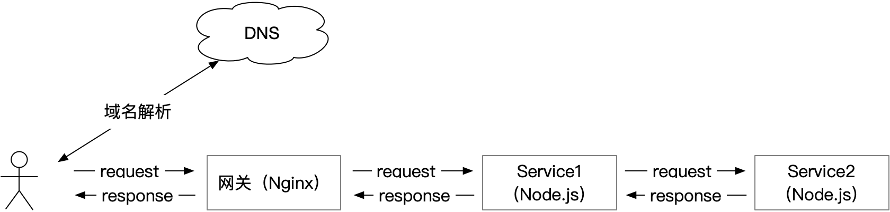
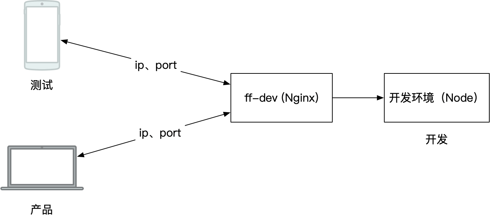

---
tags:
  - Web
date: 2023-12-23
---

# Web 终极拦截技巧（全是骚操作）

## 拦截的价值

> 计算机科学领域的任何问题都可以通过增加一个中间层来解决。 —— Butler Lampson

如果系统的控制权、代码完全被掌控，很容易添加中间层；  
现实情况我们往往无法控制系统的所有细节，所以需要使用一些 **“非常规”（拦截）** 手段来**增加中间层**。

## 拦截的方法

### 拦截/覆写浏览器 API

最常见的场景有通过拦截 `console` 实现错误上报。

```js
const _error = console.error;
console.error = (...args) => {
  _error.apply(console, args);

  console.info('在此处上报错误信息...');
};

// 其它代码打印错误
console.error('error message');
```

项目中通常会基于 axios 此类的网络库，做一些统一处理逻辑  
但在某些场景，我们无法修改项目代码，就能通过拦截 `fetch, xhr` 来达到目的。

```js
// 接口性能监控，打开 https://example.com/， 在控制台执行以下代码
const _fetch = window.fetch;
window.fetch = (...args) => {
  const startTime = performance.now();
  return _fetch(...args).finally(() => {
    console.info('接口耗时：', Math.round(performance.now() - startTime), 'ms');
  });
};

await fetch('//example.com');
```

你可以选择第三方库（比如 [xhook](https://github.com/jpillora/xhook/)）来快速实现 `fetch, xhr` 拦截功能。

浏览器中大多数 API 都是可以覆写的，**打开脑洞**，可以实现非常多的神奇功能：

- 网络 API （`xhr, fetch, WebSocket`）
  - 性能监控、统一错误码处理
  - 添加额外 HTTP 参数（`header, query`）实现接口染色功能
  - 修改 `Host` 将接口自动转向代理服务，实现远程调试接口、Mock 数据
- 修改原型 （`Array.prototype.at = ...`）
  - polyfill 库的必备手段
- 页面跳转 API （`window.open`, `history.go back pushState`）
  - 修改跳转的目的页面
  - 自动添加页面跳转埋点
- 删除特定 API 禁用浏览器功能
  - 禁止 js 访问摄像头 `navigator.mediaDevices.getDisplayMedia = null`
  - 禁止 p2p 连接 `window.RTCPeerConnection = null`

### 事件、DOM 元素

浏览器也会提供一些具备拦截性质的 API，允许开发者实现特定功能。

一个 DOM 元素经常会绑定许多事件，如果你想让特定的事件回调函数先执行，以便添加一些前置逻辑或取消后续事件的执行；  
可以了解 [addEventListener#usecapture][1] 的用法。

```js
// 禁止响应页面的所有点击事件（危险⚠️），第三个参数（usecapture）设为 true
document.body.addEventListener(
  'click',
  (evt) => {
    evt.preventDefault();
    evt.stopPropagation();
  },
  true
);
```

许多 DOM 元素都是在运行时动态创建的，如果需要修改动态创建的 DOM 元素可使用 [MutationObserver][2]  
比如，拦截所有超链接（`a` 标签），给目标链接添加 `_source` 参数

```js
const observer = new MutationObserver((mutationsList) => {
  for (const mutation of mutationsList) {
    if (mutation.type !== 'childList' || !mutation.addedNodes) return;
    mutation.addedNodes.forEach((item) => {
      if (!item.nodeName === 'A') return;
      const targetUrl = new URL(item.href, location.href);
      targetUrl.searchParams.append('_source', 'any string');
      item.href = targetUrl.href;
    });
  }
});
observer.observe(document.body, {
  attributes: true,
  childList: true,
  subtree: true,
});
```

::: tip
`MutationObserver` 同样适应于修改 `iframe, img` 的链接，或其它任意 DOM 元素的属性
:::

### 调试小技巧

如果你的页面因未知代码陷入了快速刷新的死循环，可在项目中添加以下以下代码；  
页面刷新前会进入 debug 状态，在 devtools 中查看调用堆栈（call stack）即可了解刷新的原因

```js
window.addEventListener('beforeunload', () => {
  debugger;
});
```

::: tip
http 302 属于非代码导致页面跳转，上述代码无法拦截
:::

当调试第三方代码时，需要监听某个不符合期望的对象属性值

```js
// debug 状态下任意可访问对象
const obj = { prop: 1 };

// 在 devtools -> console 中执行以下代码
_obj_prop = obj.prop;
Object.defineProperty(obj, 'prop', {
  set: (v) => {
    _obj_prop = v;
    // 每次赋值都会进入 debug 状态
    debugger;
  },
  get: () => _obj_prop,
});
// 试试执行 obj.prop = 2
// 后续可在 console 中随时访问 _obj_prop 的当前值
```

如果需要监听某个对象所有属性值被读写的消息，可以使用 `Proxy`

```js
const obj = { prop: 1 };

const obj2 = new Proxy(obj, {
  get(target, key, receiver) {
    return Reflect.get(target, key, receiver);
  },
  set(target, key, value, receiver) {
    debugger;
    return Reflect.set(target, key, value, receiver);
  },
});

// 试试执行 obj2.abc = 2
```

::: tip 注意差异

- `Object.defineProperty` 没有改变 `obj` 的引用，`Proxy` 生成了新对象 `obj2`
- 使用 `Proxy` 可以监听对象（`obj2`）所有属性的读写，而 `Object.defineProperty` 一次只能监听一个属性（`prop`）

:::

### ServiceWorker 拦截

前端开发者可能会使用 ServiceWorker 来实现离线可用、缓存资源、加速页面访问等功能。

```js
// 安装时缓存资源
self.addEventListener('install', (event) => {
  event.waitUntil(
    caches
      .open('v1')
      .then((cache) => cache.addAll(['/index.html', '/style.css', '/app.js']))
  );
});
// 拦截页面资源请求，使用缓存响应（也可使用自定义内容响应请求）
self.addEventListener('fetch', (event) => {
  event.respondWith(
    caches.match(event.request).then((response) => {
      return response;
    })
  );
});
```

ServiceWorker 不仅是一个具备拦截性质的 API，它还是独立 js 运行环境，是前端页面到服务器之间的中间层，**它能拦截同域名下的所有请求**，缓存或篡改请求结果，能实现的功能远不止离线或加速访问这么简单。  
后文会从 WebContainer 原理分析 ServiceWorker 的高端玩法。

### 服务器拦截

前面介绍的技巧都局限在客户端（浏览器）中，如果你掌握了真正的服务控制权，即配置服务器和内网 DNS 域名等权限（一般由公司内的工程效率团队或运维负责），再配合前面介绍的浏览器拦截技巧，可玩性将大大增加。

一个 HTTP 请求往往会经过多个服务器节点，**每个节点就是一个中间层**。



1. DNS 决定 HTTP 请求由哪个网关（Nginx）处理
   1. 如果你能控制 DNS 服务，则**可以在网关之前再加一个中间层**
2. 服务器节点（网关、Service）节点能获取、篡改 HTTP 请求中的所有信息：`Header、Cookie、Body`
   1. 根据 HTTP 信息，可将请求转发到本地目录（静态资源），或转发到其他远程服务
   2. 添加 Cookie 追踪用户，实现灰度、AB 实验分流等功能
   3. 实现业务层无感知注入代码
   4. 动态篡改数据，实现 Mock 功能

#### 拦截篡改 HTTP Response

Nginx 修改 html Response body，注入一个脚本 `ff-sdk.js`

```shell
sub_filter <head> "<head><script src='/ff-sdk.js'></script>";
```

::: tip

- 注入到 head 标签后，确保脚本优先执行
- 可通过脚本实现任意功能
  :::

## 如何注入代码

前文介绍的客户端拦截技巧都需要**向浏览器中注入代码**，原理是修改 html 或 js 资源的内容。

有以下方式让注入代码中浏览器环境中运行

- 向 html 中添加一个 script 标签，src 指向特定的 js 地址（前文的 `/ff-sdk.js`）
  - 简单易维护，**优先使用该方法**
- 向 html 注入一个完整的 script 标签
  - `sub_filter <head> "<head><script>alert('注入成功')</script>"`
- 修改 js 资源内容，在开始位置插入代码
  - `';(function(){ alert('注入成功') })();' + <js file body>`
  - 注入代码包裹在自执行函数中，注意前后加上*分号*

以下列举注入代码的时机，根据目的和能获取的权限决定中哪个阶段注入

1. 源码注入
   - 如果你有源码控制权，那你可以对项目做任何事情，确保拦截代码优先执行即可
   - 优点：灵活可控；缺点：通用性不好，侵入业务
2. 构建、推送服务注入
   - 工程团队提供构建、推送服务，可编写脚本在构建产物中注入代码（比如 html 中添加 script 标签）
   - 优点：业务无感知，通用性好；缺点：不一定有权限
3. 网关注入
   - Nginx 向 html 中注入 script 也很简单（参考前文 _拦截篡改 HTTP Response_）
   - 优点同上，一般限于在开发、测试环境，不会上生产环境
4. 浏览器插件、devtools 注入
   - 如果你啥权限都没有（普通用户），又想干一些“坏事”，则可选择使用插件注入代码，或临时在 devtools 的 console 面板直接写代码
   - 优点：万能注入、无法阻挡；缺点：只能影响当前浏览器，难以跨浏览器、设备、用户
   - 常用的脚本管理插件：[篡改猴][5]，也可考虑自己写浏览插件

尽量让被注入的代码**早于业务代码执行**，比如实现拦截并上报错误信息，如果被注入的代码执行时机较晚，则会丢失执行前的错误信息。

## 案例分析

### WebContainer 原理

[WebContainer][6] 是一种基于浏览器的运行时，可完全在浏览器标签页内执行 Node.js 应用程序和操作系统命令。

惊艳的地方有两点：

1. 能在浏览器中运行 Node 服务，居然还能启动 DevServer “监听端口”
2. 离线后 IDE 开发中的页面也能正常开发

以 <https://stackblitz.com/edit/nextjs-9hpfxj?file=package.json> 为例  


核心部分是将 Node 编译成 WASM，然后 Mock 文件系统、底层网络模块 使其能在浏览器中运行。

然后使用 Node 启动 devServer 服务，监听端口。

- dev 页面发起的请求被 ServerWorker 拦截映射成本地 Mock 的文件
- 本地 Mock 的文件由 IDE 源码使用 Node 编译而成
- 源码的依赖包被映射成 http 请求从远端获取

比如安装依赖 react-dom 对应的网络请求是：  
<https://t.staticblitz.com/w/v13/h/e/react-dom@18.2.0>

在浏览器中运行 DevServer 时，当然无法监听 TCP 端口。  
巧妙的地方是将端口映射成唯一的域名，通过 ServiceWorker 拦截域名下的所有请求，关联到 Mock 的文件系统。

详情请看 [WebContainer 原理分析][3]

### 沙盒

> 沙盒（sandbox，又译为沙箱）是一种安全机制，为执行中的程序提供隔离环境。通常是作为一些来源不可信、具破坏力或无法判定程序意图的程序提供实验之用。

假设你需要执行一段第三方代码，安全要求禁止访问 `document`，以及 window 下的 `open、location`。

_尝试复制以下代码在 console 中执行_

```js
function safeExec(code) {
  const proxyWindow = new Proxy(window, {
    get(target, key, receiver) {
      if (['open', 'location', 'document'].includes(key))
        throw new Error(`禁止访问 key: ${key}`);
      if (key === 'window') return proxyWindow;

      return Reflect.get(target, key, receiver);
    },
    // set() {}
  });
  new Function('window', `with(window) { ${code} }`)(proxyWindow, null);
}
// Error 禁止访问 key: open
safeExec(`window.open('//danger.com')`);
```

沙盒也是前端微应用的核心技术，通过 Proxy 监听 window 的读写记录，可以隔离多个微应用的运行环境，卸载某个微应用后也能将环境（window 对象）重置回该应用加载前的状态。

### 通用域名服务

一般 Web 开发者使用会使用 `localhost:8080、192.168.0.1:8080` 这个访问开发环境；  
如果使用真实域名来转发请求到开发环境（`https://ff-dev.bilibili.com?_ip_=192.168.0.1&_port_=8080`），能解决一些常见的问题：

- 轻易实现共享域名（`bilibili.com`）的登录态 cookie
- 无需配置 Web 服务的 https 证书
  - 在手机上使用 https 协议访问开发服务，避免 http 协议导致许多 Web API 不可用
    - [仅限于安全上下文的特性][9]
- 该服务是一个天然的中间层，可无感注入代码实现效率工具，比如：
  - 远程网络抓包、Mock
  - 移动端控制台（eruda）
  - 远程代码调试（chii）
  - 切换后端接口环境、接口染色
  - 

真实域名转发请求，能解决部分场景的问题，也会带来一些新问题需要解决：

- 静态资源（`/index.js`）不带参数，无法转发到目的地，无法初始化页面
- 页面跳转后，域名或参数（`_ip_, _port_`）会丢失
- HMR 的 WebSocket（`192.168.0.1:4000/socket.io`） 连接失败，无法自动热更新

解决这问题确实有一些难度，好在前文已经介绍了对应的拦截技巧；  
一旦解决问题部署通用域名服务后，就能给许多人提供便捷服务。

**实现原理**



1. 加载 HTML
   - 部署一个 Nginx 服务，并为其注册域名（`ff-dev.bilibili.com`）
   - 在 Nginx 中读取 http 请求的 query 参数（`_ip_, _port_`），将请求转发到对应目标
     - 目标响应后，将参数也写入到 Response 的 cookie 中
     - 如果是 html 请求，则在 body 中注入 js
       - `<body>...</body>` 替换为 `<body><script src="ff-dev-sdk.js"/>...</body>`
2. 加载静态资源  
   静态资源（`/index.js`）不带参数，Nginx 改成从 cookie 中读取参数，然后将请求转发到目的地
3. 解决页面跳转参数丢失
   - `ff-dev-sdk.js` 拦截所有 a 标签、重写 open 方法，在页面跳转的 url 添加参数（`_ip_, _port_`）；
   - 页面跳转后，新页面也能转发到正确的目的地
4. 解决 HMR 无法热更新  
   `ff-dev-sdk.js` 覆写 `WebSocket` 的实现，将链接 `192.168.0.1:4000/socket.io` 替换为 `ff-dev.bilibili.com/socket.io?_ip_=192.168.0.1&_port_=4000` 继续由 Nginx 转发

以上步骤使用的技巧在前文都有介绍

- 注入 js 代码到 html 中，写入参数（`_ip_, _port_`）到 cookie 中
- 拦截 a 标签
- 覆写 API：open，WebSocket

## 总结

### 应用**中间层**思路的经验

- “**添加一个中间层**”是一种有效且通用的解决问题的思路
- 根据需要解决的问题，思考中间层的位置、以及一个能**注入代码时机**，并让代码尽早执行
  - 源码注入脚本
  - 构建、推送服务注入
  - 网关注入
  - 浏览器插件、devtools 注入
- Web 技术栈拥有非常大的可操作空间
  - 利用 js 的动态特性，覆写系统 API 实现拦截
  - 灵活使用具有拦截性质的 API
  - ServiceWorker
  - 了解 HTTP 请求的构成（Header、Cookie、Body），以及它流转的节点
- 多种拦截技巧灵活搭配，释放更强大的力量
- 能力越强（拦截范围越大）、责任越大，**注意安全**

### 安全边界

从前文看由于 js 灵活特性，甚至看起来有点不安全（覆写系统 API），但恰恰相反，Web 平台常与“安全”一起出现。  
js 的动态灵活是运行在 Web 安全边界（[同源策略][7]、[内容安全策略][8]）构建的“大沙盒”内的。

新手开发者常碰到的跨域问题，就是因为碰到了安全边界，安全边界是 Web 平台能力受限（相对 Native）的重要原因之一。

Web 平台中的所有技巧策略都必须符合安全规则；  
所以，建议大家在学习拦截技巧的同时，了解同源策略、内容安全策略(CSP) 等安全知识。

### 太骚了，接受不了？

从《通用域名服务》章节的原理来看，似乎有点过于“骚操作”了；  
从效率角度出发，不要在乎骚不骚、脏不脏，有价值就干。

解决清真与效率的冲突：隔离脏代码，不拉低系统整体代码质量。

## 附录

- [addEventListener#usecapture][1]
- [MutationObserver][2]
- [ServiceWorker][4]
- [WebContainers][6]
- [WebContainer 原理分析][3]
- [浏览器的同源策略][7]
- [内容安全策略（CSP）][8]
- [仅限于安全上下文的特性][9]

[1]: https://developer.mozilla.org/en-US/docs/Web/API/EventTarget/addEventListener#usecapture
[2]: https://developer.mozilla.org/en-US/docs/Web/API/MutationObserver
[3]: https://hughfenghen.github.io/posts/2023/03/29/webcontainer/
[4]: https://developer.mozilla.org/zh-CN/docs/Web/API/ServiceWorker
[5]: https://chrome.google.com/webstore/detail/dhdgffkkebhmkfjojejmpbldmpobfkfo
[6]: https://webcontainers.io/
[7]: https://developer.mozilla.org/zh-CN/docs/Web/Security/Same-origin_policy
[8]: https://developer.mozilla.org/zh-CN/docs/Web/HTTP/CSP
[9]: https://developer.mozilla.org/zh-CN/docs/Web/Security/Secure_Contexts/features_restricted_to_secure_contexts
