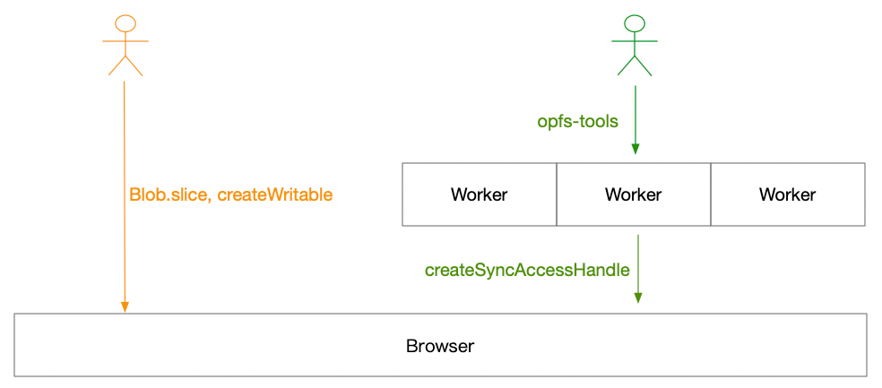

---
tags:
  - Web
date: 2024-03-14
---

# Web 文件系统（OPFS 及工具）介绍

文件系统是往往是构建大型软件的基石之一，很长一段时间 Web 平台因缺失成熟的文件系统成为构建大型软件的阻碍，如今 [OPFS][1] 可弥补这一缺憾。

本文介绍 OPFS 背景和基本使用方法、使用过程中的注意事项，及如何配合笔者开源的 [opfs-tools][5]、[opfs-tools-explorer][6] 两个项目，充分发挥 OPFS 的性能与开发效率。

## Web 存储 API

Web 提供了多种 API 用于解决**特定场景**下的存储诉求

| API            | 场景                                                             |
| :------------- | :--------------------------------------------------------------- |
| localStorage   | **键/值对字符串**存储，可用空间小                                |
| sessionStorage | 同上，区别在于会话结束时会被清除                                 |
| indexeddb      | 用于在客户端存储大量的**结构化**数据                             |
| Caches         | 一般用于在 ServiceWorker 中网络缓存资源（Request/Response 对象） |

_~~上古时期，开发者会用 Cookie 存储少量数据，当前不建议在客户端操作 Cookie~~_

### 文件困境

其他通用编程语言都会内置完备的文件系统 API，通过文件能解决大部分存储诉求。

Web 开发者最早接触文件应该都是从 `<input type="file">` 开始的，但是从 `input` 中拿到的居然是一个**只读**的文件（[File][3]）对象；所以最开始 Web 只拥有一个“半成品”文件，基本只用来获取文件上传到服务器。

后来 **indexedDB** 可存储较大的数据量，一些需要读写文件的场景，开发者会将数据存储到 indexedDB，即使**读写很麻烦，性能也很差**

Web 很长一段时间没有提供完善的访问文件系统的规范，使得需要**高频读写文件、大文件处理**的软件在 Web 端都会受到读写性能限制，比如音视频剪辑、游戏、数据库等等。

## OPFS（骑士）

而 [OPFS][1](Origin Private File System) 是 Web 提供的**通用存储能力**，具有以下特征

- 它是一个文件系统，提供了底层的文件操作 API，**不限于特定的存储场景**
- 它可对 Web 同源的文件自由进行读写操作，**无需用户手动授权**
- 它对文件的访问是经过**高度性能优化**的

_OPFS 在 Chrome 86 后可用，主流浏览器均已支持_

下面介绍基本的 API 的使用，详情请阅读 [Web.dev OPFS][2]

### 基础读写文件

```js
const opfsRoot = await navigator.storage.getDirectory();
// 创建目录
const dirHandle = await opfsRoot.getDirectoryHandle('dir', {
  create: true,
});
// 创建文件
const fileHandle = await dirHandle.getFileHandle('my first file', {
  create: true,
});
// 写入文件
const writable = await saveHandle.createWritable();
await writable.write('测试数据');
await writable.close();
// 读取文件
const file = await fileHandle.getFile();
await file.slice(0, file.size);
```

### Worker 同步读写

同步读写性能更好，`fileHandle.createSyncAccessHandle` API 须在 WebWorker 中才能运行

```js {4}
const fileHandle = await opfsRoot.getFileHandle('my highspeed file.txt', {
  create: true,
});
const accessHandle = await fileHandle.createSyncAccessHandle();
const content = textEncoder.encode('Some text');
// 同步写入
accessHandle.write(content, { at: accessHandle.getSize() });
accessHandle.flush();

const buf = new ArrayBuffer(10);
// 期望读取 10 个字节数据到 buf 对象中， read 返回实际读取字节数
accessHandle.read(buf);
```

## opfs-tools（白衣骑士）

OPFS 定位是文件系统底层 API，它只提供获取文件/文件夹句柄，对文件进行二进制读写操作的 API，但缺少常见的文件操作 API，比如文本读写、移动、复制、删除文件。

**直接使用 OPFS API 比较麻烦**，在实际应用中需要更高层次的封装，以简化代码、提高效率。

[opfs-tools][5] 基于 OPFS 封装提供简洁的 API，让你能**优雅高效**地操作文件，总结有以下特性

- opfs-tools 允许直接读写常见数据类型（文本、二进制、流），无需转换成二进制
- opfs-tools 能直接处理字符串 path，无需循环获取深层级的目录或文件
- opfs-tools 提供便捷的 API 操作 file/dir，如复制、移动、删除
- opfs-tools 自动将读写请求代理到 WebWorker，性能更好

以下代码介绍了其主要 API，_读者可与前文原生 API 读写文件进行对比_。

```js
import { file, dir, write } from 'opfs-tools';

// --------- Create / Write ---------
await dir('/test-dir').create(); // create a directory

await write('/dir/file.txt', ''); // empty file
await write('/dir/fetch-file', (await fetch('//example.com')).body);
// inputFile from the input element picked by the user
await write('/dir/input-file', inputFile.stream());

// --------- Read ---------
await file('/dir/file.txt').text();
await file('/dir/input-file').arrayBuffer();
await file('/dir/input-file').stream();

await dir('/test-dir').children();

// --------- Remove ---------
await dir('/test-dir').remove();

await file('/dir/file.txt').remove();

// --------- copyTo / moveTo ---------
await file('/dir/file').copyTo(file('/dir/file copy1'));
await dir('/dir').moveTo(dir('/.Trash'));
```

:::tip
opfs-tools 借鉴 Unix，使用 `/` 符号分隔目录，单个字符 `/` 表示**当前源的根目录**
:::

### 性能

前文提到 OPFS 必须在 WebWorker 中同步读写，才能发挥最佳性能。

经测试，在主线程通过 WebWorker 代理读写操作，即便多一层中转仍比在主线程中直接读写更快；  
**高频读写场景能提升 3 ～ 6 倍的性能**，_[跑一下性能对比测试][4]试试_。



所以，opfs-tools 会**自动启动 WebWorker**，将读写操作代理到 Worker **以提升性能**，这对使用者来说是无感的。

这里需要提一下 [Transferable object][9]，`ArrayBuffer` 实现了 `Transferable` 接口，因此在主线程、Worker 线程间转移的成本非常小；  
这就是 opfs-tools 比主线程读写性能更优的**原理：`ArrayBuffer` 在线程间低成本转移，然后在 Worker 中同步读写**；

因转移以后的对象在原线程中就不可用了，所以使用 **opfs-tools 写入**数据有一个**注意事项**。

```js
const ab = new Uint8Array([1, 1, 1, 1, 1]);
console.log(ab.byteLength); // => 5
await write('/test', ab);
console.log(ab.byteLength); // => 0, ab 被转移到 Worker 线程，数据被清除

// 如果原线程后续仍需要访问 ab 对象，可写入 clone 对象
await write('/test', ab.slice(0));
```

## opfs-tools-explorer（白衣骑士的剑）

如果你的 Web 应用需要进行文件操作，开发测试阶段最好能直观地看见文件内容。

[opfs-tools-explorer][6] 是基于 opfs-tools 项目开发的可视化工具，类似于操作系统的**文件管理器程序**，用于开发调试或管理 OPFS 文件资源，立即[体验在线 DEMO][7]。


在开发、测试阶段（或通过 URL 参数控制），将以下代码注入到项目的 html 中，即可管理操作当前 Web 站点的文件资源。

```html
<script src="https://cdn.jsdelivr.net/npm/opfs-tools-explorer"></script>
<script>
  OTExplorer.init();
</script>
```

## 注意事项

- OPFS 的文件对用户是不可见的，你不能在操作系统中找到对应 OPFS 文件
- OPFS 读写文件不需要用户授权，临时使用很方便，但文件**可能被浏览器自动清除**
  - 需要[永久性存储][8]，请阅读文章，总结：
    - 可以调用 `navigator.storage.persist()` 申请权限
    - 但 Chrome 及大部分浏览器会自动判断是否授权，Firefox 会弹窗让用户决策
- OPFS 受同源策略限制
  - 源包括 **协议://域名:端口**，三个组成部分必须完全一致才算同源，**无法跨源访问存储数据**
  - opfs-tools 的根目录 `/` 是按源隔离的，更不是系统根目录

## 附录

- [opfs-tools][5] 简洁高效的文件系统 API
- [opfs-tools-explorer][6] 可视化管理 OPFS 资源，提升开发调试效率
- [OPFS Benchmark][4]
- [MDN OPFS][1](Origin Private File System)，私有源文件系统
- [Web.dev OPFS][2]
- [Web 永久存储权限][8]
- [Transferable object][9]

[1]: https://developer.mozilla.org/zh-CN/docs/Web/API/File_System_API/Origin_private_file_system
[2]: https://web.dev/articles/origin-private-file-system
[3]: https://developer.mozilla.org/zh-CN/docs/Web/API/File
[4]: https://hughfenghen.github.io/opfs-tools/demo/benchmark.html
[5]: https://github.com/hughfenghen/opfs-tools
[6]: https://github.com/hughfenghen/opfs-tools-explorer
[7]: https://hughfenghen.github.io/opfs-tools-explorer/
[8]: https://web.dev/articles/persistent-storage?hl=zh-cn#request_persistent_storage
[9]: https://developer.mozilla.org/zh-CN/docs/Web/API/Web_Workers_API/Transferable_objects
