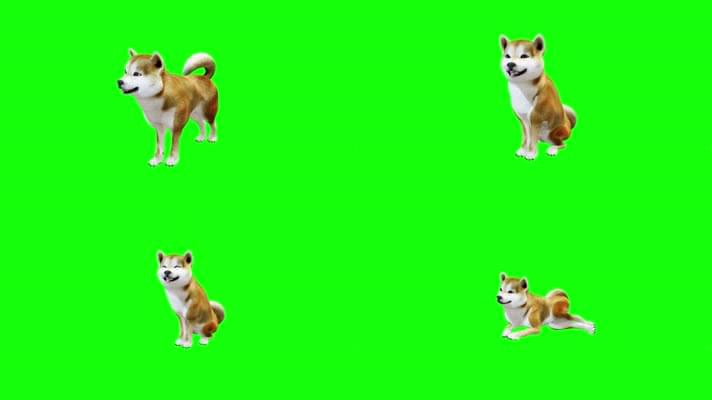

---
tags:
  - Web
date: 2023-07-07
---

# WebGL Chromakey 实时绿幕抠图

**20行核心（shader）代码实现实时绿幕抠图**  

## 背景
因为视频相关标准及浏览器的实现问题，很难在主流浏览器中顺利播放背景透明的视频。  

有两种方法可以为最通用的视频格式（MP4,H264）移除背景，实现透明效果：
1. 原视频配上绿幕，使用本文介绍方法移除背景绿幕
   - 优点：制作使用简单
   - 缺点：抠图可能不完美，导致偏色  
  

2. 将视频中的alpha通道与画面并排放置，在客户端混合
   - 优点：精确还原
   - 缺点：分辨率增加，视频变大；可能适应场景小，原视频制作需要精确的alpha通道  


## 效果演示
静态图片抠图 **[DEMO](https://hughfenghen.github.io/WebAV/demo/chromakey.html)**  
配合 [@webav/av-cliper](https://github.com/hughfenghen/WebAV/blob/main/packages/av-cliper) 进行视频抠图 **[DEMO](https://hughfenghen.github.io/WebAV/demo/concat-media.html)**  

*方法二参考：<https://juejin.cn/post/6885673542642302984>*  

## 绿幕抠图原理
1. 定义一个范围（range），和一个目标颜色值
2. 使用 WebGL（[片元着色器](https://developer.mozilla.org/zh-CN/docs/Web/API/WebGLShader)） 逐个比对原像素与目标颜色的距离
3. 根据颜色距离判断
   - 超过range上限（颜色差距很大）则保留原像素  
   - 低于range下限（颜色很相似）则移除像素  
   - 处于range之中，原像素 - 目标像素 * 相似度系数

## 实现
*需要先了解一下 [YUV](https://baike.baidu.com/item/YCrCb/10874556) 颜色编码*

**Shader代码**
```glsl
precision mediump float;
uniform sampler2D u_texture;
uniform vec4 keyRGBA;    // key color as rgba
uniform vec2 range;      // the smoothstep range

varying vec2 v_texCoord;

vec2 RGBToCC(vec4 rgba) {
  float Y = 0.299 * rgba.r + 0.587 * rgba.g + 0.114 * rgba.b;
  return vec2((rgba.b - Y) * 0.565, (rgba.r - Y) * 0.713);
}

void main() {
  // 从贴图获取源像素
  vec4 srcColor = texture2D(u_texture, v_texCoord);
  // 源像素 RGB 转换为 YUV
  vec2 srcCC = RGBToCC(srcColor);
  // 目标颜色转换为 YUV
  vec2 keyCC = RGBToCC(keyRGBA);

  // 计算距离
  float mask = sqrt(pow(keyCC.x - srcCC.x, 2.0) + pow(keyCC.y - srcCC.y, 2.0));
  // 对距离值在range中进行平滑映射取值
  mask = smoothstep(range.x, range.y, mask);

  // 低于range下限
  if (mask == 0.0) { discard; }
  // 超过range上限
  else if (mask == 1.0) { gl_FragColor = srcColor; }
  // 处于range之中
  else {
    // 某些源像素（如头发边缘）混合了绿幕颜色，需要减去绿幕颜色，否则边缘会有绿斑
    gl_FragColor = max(srcColor - (1.0 - mask) * keyRGBA, 0.0);
  }
}
```

*上面算法使用 CPU（纯js代码）也能实现，但性能会差很多*  

除了上面分析的核心代码之外还有一些为了让Shader运行起来的辅助代码，属于 WebGL 的基础知识，查看[完整代码](https://github.com/hughfenghen/WebAV/blob/main/packages/av-cliper/src/chromakey.ts)  

## 如何使用
1. `import { createChromakey } from '@webav/av-cliper'` 或复制完整代码到项目中
2. 参考以下示例
```ts
import { createChromakey } from '../src/chromakey'

const cvs = document.querySelector('#canvas') as HTMLCanvasElement
const ctx = cvs.getContext('2d', {
  alpha: true
})!

;(async () => {
  const img = new Image()
  img.src = './public/img/green-dog.jpeg'
  await new Promise(resolve => {
    img.onload = resolve
  })
  const chromakey = createChromakey({
    // 不传默认取第一个像素值
    keyColor: [65, 249, 0]
  })
  ctx.drawImage(await chromakey(img), 0, 0, cvs.width, cvs.height)
})()
```

传入一张 720P 的图片给 `chromakey` 首次执行（包括初始化）大概耗时 20ms，后续每次执行基本在 1ms 之内；  
所以性能方面实现视频实时抠图没有压力，将 Video 标签传给 chromakey 快速刷新即可  
```js
async function render() {
  ctx.drawImage(await chromakey(videoElement), 0, 0, cvs.width, cvs.height)
  requestAnimationFrame(render) // 注意：后台页面 requestAnimationFrame 停止执行
}

render()
```
