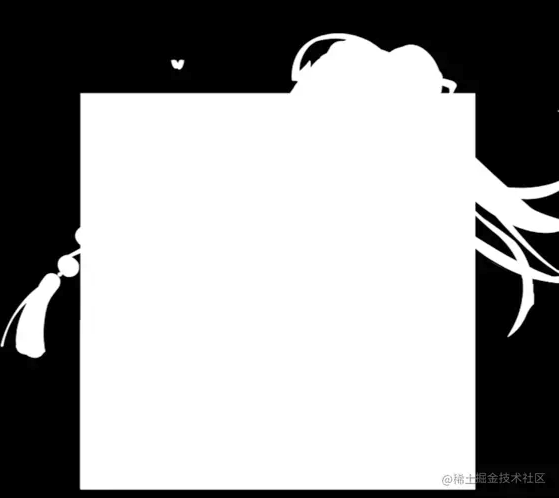

---
tags:
  - Web
date: 2023-07-07
---

# WebGL Chromakey 实时绿幕抠图

**20行核心（shader）代码实现实时绿幕抠图**  

## 背景
因为视频相关标准及浏览器的实现问题，很难在主流浏览器中顺利播放背景透明的视频。  

有两种方法可以为最通用的视频格式（MP4,H264）移除背景，实现透明效果：
1. 原视频配上绿幕，使用本文介绍方法移除背景绿幕
   - 优点：制作使用简单
   - 缺点：抠图可能不完美，导致偏色  
  

2. 将视频中的alpha通道与画面并排放置，在客户端混合
   - 优点：精确还原
   - 缺点：分辨率增加，视频变大；可能适应场景小，原视频制作需要精确的alpha通道  



## 效果演示
静态图片抠图 **[DEMO](https://hughfenghen.github.io/WebAV/demo/chromakey.html)**  
配合 [@webav/av-cliper](https://github.com/hughfenghen/WebAV/blob/main/packages/av-cliper) 进行视频抠图 **[DEMO][1]**  

*方法二参考：<https://juejin.cn/post/6885673542642302984>*  

## 绿幕抠图原理
1. 传入四个参数
   1. 目标颜色，*期望抠除背景色，可以不是绿色*
   2. 相似度阈值
   3. 平滑度敏感系数
   4. 颜色饱和度敏感系数
2. 使用 WebGL（[片元着色器](https://developer.mozilla.org/zh-CN/docs/Web/API/WebGLShader)） 逐个比对原像素与目标颜色
3. 计算过程
   1. 将颜色转换到 UV 空间，计算出当前像素的与目标颜色的距离
   2. 将`距离 - 相似度阈值`，小于 0 则判定为绿幕，将像素点设置为全透明（alpha=0）
   3. 与平滑度参数计算，将相似度转换成 alpha 通道值，越大越不透明
   4. 计算出愿像素点的灰度值
   5. 将相似度与饱和度参数计算，然后与原像素点的灰度值混合，越大越靠近原像素点，越小越就接近灰度  
    （后两步为了移除前景边缘与绿幕反光，导致的前景像素点混合了绿幕背景颜色）

## 实现
参考：[Production-ready green screen in the browser][2]

*需要先了解一下 [YUV][3] 颜色编码*

**Shader代码**
```glsl
#version 300 es
precision mediump float;
out vec4 FragColor;
in vec2 v_texCoord;

uniform sampler2D frameTexture;
uniform vec3 keyColor;

// 色度的相似度阈值
uniform float similarity;
// 透明度的平滑度计算
uniform float smoothness;
// 降低绿幕饱和度，提高抠图准确度
uniform float spill;

vec2 RGBtoUV(vec3 rgb) {
  return vec2(
    rgb.r * -0.169 + rgb.g * -0.331 + rgb.b *  0.5    + 0.5,
    rgb.r *  0.5   + rgb.g * -0.419 + rgb.b * -0.081  + 0.5
  );
}

void main() {
  // 获取当前像素的rgba值
  vec4 rgba = texture(frameTexture, v_texCoord);
  // 计算当前像素与绿幕像素的色度差值
  vec2 chromaVec = RGBtoUV(rgba.rgb) - RGBtoUV(keyColor);
  // 计算当前像素与绿幕像素的色度距离（向量长度）, 越相似则色度距离越小
  float chromaDist = sqrt(dot(chromaVec, chromaVec));
  // 设置了一个相似度阈值，baseMask < 0，则像素是绿幕，> 0 则像素点可能属于前景（比如人物）
  float baseMask = chromaDist - similarity;
  // 与平滑度参数计算，将 baseMask 转换成 alpha 通道值，越大越不透明
  float fullMask = pow(clamp(baseMask / smoothness, 0., 1.), 1.5);
  rgba.a = fullMask;
  // 如果 baseMask < 0，spillVal 等于 0；baseMask 越小，像素点饱和度越低
  float spillVal = pow(clamp(baseMask / spill, 0., 1.), 1.5);
  // 计算当前像素的灰度值
  float desat = clamp(rgba.r * 0.2126 + rgba.g * 0.7152 + rgba.b * 0.0722, 0., 1.); 
  rgba.rgb = mix(vec3(desat, desat, desat), rgba.rgb, spillVal);
  FragColor = rgba;
}
```

*上面算法使用 CPU（纯js代码）也能实现，但性能会差很多*  

除了上面分析的核心代码之外还有一些为了让Shader运行起来的辅助代码，属于 WebGL 的基础知识，查看[完整代码](https://github.com/hughfenghen/WebAV/blob/main/packages/av-cliper/src/chromakey.ts)  

## 如何使用
1. 静态图片抠图示例
```ts {16}
import { createChromakey } from '@webav/av-cliper'

const cvs = document.querySelector('#canvas') as HTMLCanvasElement
const ctx = cvs.getContext('2d', { alpha: true })!

;(async () => {
  const img = new Image()
  img.src = './public/img/green-dog.jpeg'
  await new Promise(resolve => { img.onload = resolve })
  const chromakey = createChromakey({
    // 目标颜色不传，则取第一个像素点当做背景色
    similarity: 0.35,
    smoothness: 0.05,
    spill: 0.05,
   })
  ctx.drawImage(await chromakey(img), 0, 0, cvs.width, cvs.height)
})()
```
2. 使用 `@webav/av-cliper` 对 mp4 视频进行逐帧抠图，[体验 DEMO：mp4(chromakey)][1] 合成视频的效果
```ts {8}
import { createChromakey, MP4Clip } from '@webav/av-cliper'
const chromakey = createChromakey({
  similarity: 0.4,
  smoothness: 0.1,
  spill: 0.1,
})
const clip = new MP4Clip((await fetch('<mp4 url>')).body!)
clip.tickInterceptor = async (_, tickRet) => {
  if (tickRet.video == null) return tickRet
  return { ...tickRet, video: await chromakey(tickRet.video) }
}
```

传入一张 720P 的图片给 `chromakey` 首次执行（包括初始化）大概耗时 20ms，后续每次执行基本在 1ms 之内；  
所以性能方面实现视频实时抠图没有压力，将 Video 标签传给 chromakey 即可  
```js
async function render() {
  ctx.drawImage(await chromakey(videoElement), 0, 0, cvs.width, cvs.height)
  requestAnimationFrame(render) // 注意：后台页面 requestAnimationFrame 停止执行
}

render()
```

## 其它实现

以下是另一个实现抠图的 shader 的代码实现、使用相对简单；  
但相对上面的实现，边缘可能会存在黑边。  


```glsl
precision mediump float;
uniform sampler2D u_texture;
uniform vec4 keyRGBA;    // key color as rgba
uniform vec2 range;      // the smoothstep range

varying vec2 v_texCoord;

vec2 RGBToCC(vec4 rgba) {
  float Y = 0.299 * rgba.r + 0.587 * rgba.g + 0.114 * rgba.b;
  return vec2((rgba.b - Y) * 0.565, (rgba.r - Y) * 0.713);
}

void main() {
  // 从贴图获取源像素
  vec4 srcColor = texture2D(u_texture, v_texCoord);
  // 源像素 RGB 转换为 YUV
  vec2 srcCC = RGBToCC(srcColor);
  // 目标颜色转换为 YUV
  vec2 keyCC = RGBToCC(keyRGBA);

  // 计算距离
  float mask = sqrt(pow(keyCC.x - srcCC.x, 2.0) + pow(keyCC.y - srcCC.y, 2.0));
  // 对距离值在range中进行平滑映射取值
  mask = smoothstep(range.x, range.y, mask);

  // 低于range下限
  if (mask == 0.0) { discard; }
  // 超过range上限
  else if (mask == 1.0) { gl_FragColor = srcColor; }
  // 处于range之中
  else {
    // 某些源像素（如头发边缘）混合了绿幕颜色，需要减去绿幕颜色，否则边缘会有绿斑
    gl_FragColor = max(srcColor - (1.0 - mask) * keyRGBA, 0.0);
  }
}
```

## 附录
- [WebAV](https://github.com/hughfenghen/WebAV) 基于 WebCodecs 构建的音视频处理 SDK
- [Production-ready green screen in the browser][2]
- [YUV][3] 颜色编码
- [体验视频抠图再合成 DEMO][1]


[1]: https://hughfenghen.github.io/WebAV/demo/concat-media.html
[2]: https://jameshfisher.com/2020/08/11/production-ready-green-screen-in-the-browser/
[3]: https://baike.baidu.com/item/YUV/3430784