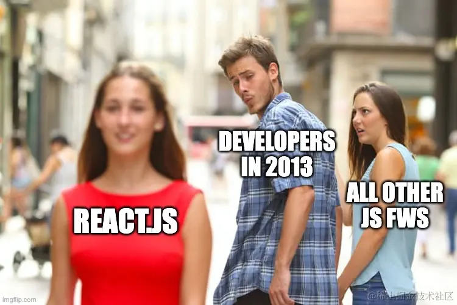
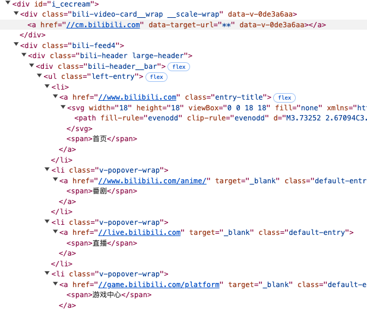

# 从 React 看前端代码范式革命

前言
本来打算写的主题是“我为什么讨厌 React“，再展开聊聊“小甜甜”是如何变成“牛夫人”的。  
没想到越写越严肃。。。

**什么是范式？**

本文从 React 视角出发聊点前端历史，只讨论 Web UI 代码的最**基础表现形式**，不涉及框架的用法、特性介绍或对比。  
_所以本文内容没有门槛、没有干货，有点虚；放心食用，不费脑。_

最开始并不是这样的，遥想十年前第一次见面时：  


两次前端革命的引领者 —— React，为何现在成了被革命的对象？

<!-- 时代变了 -->

1. 历史背景
2. 第一次革命、第二次革命
   1. 第一次，优点：jsx
   2. 第二次，优点：函数式组件、API 设计
   3. 2.5 次，svelte runnes 符文
3. 现存的问题（我不喜欢的点）
   1. 优雅背后的万恶之源：反直觉、难以预测运行机制
      1. 禁止条件分支中的 useState
      2. 一个个丑陋的补丁： useMemo useCallback
   2. 越来越多的内置 hooks
4. 出路在哪里
   1. react 遗留的问题，被抛弃的 css
      1. 关注点分离思想的继承者 —— vue
   2. 前后端统一组件，react、vue
      1. 但不是 use server
   3. svelte
   4. 理想化的范式应该什么样子？
5. 私货
   1. 关注点分离 错了吗？
      1. 没错，物极必反，复杂度增加后就不适应了
      2. 违反了亲密性原则（高内聚、低耦合）
      3. 有机会聊聊基本的、通用的、普世原则之一 —— 亲密性原则
         1. 就像隐藏在自然规则之下原始神格，是 React 两次革命背后的推手

<!--
## 前端代码范式演进

**html**

**jsx: 类组件**

**jsx: 函数组件**

**未来期望** -->

## 往事云烟

2013 年 React 发布时，复杂前端页面代码是分别写在 html+js+css 三个不同文件中的。  
那时很多开发者看 React 多少有点**大逆不道**，因为它违反了“关注点分离”的设计思想。

“关注点分离”思想统治前端开发很多年，根源在于浏览器使用三个不同类型的标签来描述 UI 的结构（div）、交互（script）、样式（style），再由 jQuery 加以巩固。

<!-- （狭义的前端开发从 2009 年开始产生，Nodejs 诞生 -->

随着前端页面越来越复杂，“关注点分离”思想逐渐成为实际工作生产的阻碍。  
DOM 是一棵大而复杂的树形结构对象，jQuery 提供了非常便捷的方法，可以随意操作这棵树上的父子、兄弟节点。  
几个回合下来，很难直观理解这棵树的结构了；  
几十个回合下来，很难解释为什么某元素会在这里，或者某元素为什么不见了。

“关注点分离” + jQuery 时期，你维护一个最简单的导航列表，面对的是这样的数据结构：


jQuery 操作 DOM 确实便捷，但难以追溯的 DOM 变更行为；  
你可以想象一下，事件回调、ajax 异步回调、定时器不停地异步操作 DOM 树，代码散落在几千行的 js 文件中，对维护者来说就是噩梦。

本质原因是，js 代码可以在任何地方随意操作 DOM 上的任意节点，旧范式没有任何限制，就**相当于鼓励随意操作 DOM 的行为**。  
就像无限自由，就是鼓励混乱。

避免被杠，先说明一下  
良好的编码规范、贯彻执行的 CodeReview，即使旧范式也能控制混乱的增长速度；  
但这在多成员、快速迭代的项目中几乎是无法实现的，所以需要新范式、新思想。

_当时的“复杂”是相对更古早的静态页面，相对现在复杂程度只能算是小儿科了。_

## 第一次组件化革命

背景：前端页面越来越复杂，现有代码结构、范式阻碍了生产力发展
思想：组件化、数据驱动
武器：jsx
影响：

1. 前端项目进入编译时代
2. 组件化思想彻底普及
3. 数据驱动替代了 DOM 操作

它将页面拆分成组件，有效隔离了各个模块间的复杂度；  
将结构（div）与交互（js）代码融合在一起，由数据驱动视图；  
开发者的工作不再是命令式地虚空操作 DOM 树，而是维护组件中的状态，由状态生成的 DOM 结构在旁边的 `render` 函数中就能看到。

<!-- 彼时 React 高举“组件化”思想大旗，开启一场轰轰烈烈的革命。   -->

React 只是稍微扩展了一下 js 语法（jsx 两句话概括：js 中允许写标签，标签中花括号内是 js 表达式）。  
用最简单的设计、极低的用户学习成本，就实现**组件化 + 数据驱动视图**，将 html 融入 js 之中，如此自然、优雅。

```jsx
<ul>
  {list.map((it) => (
    <li>{it}</li>
  ))}
</ul>
```

## 2013 ～ 2019

React 创造了一个繁荣的社区，涌现无数基于 React 的 UI 组件库、可复用场景的页面级组件、基于组件的低代码系统……

新的问题与混乱逐渐累积、显现。

类组件代码快速膨胀，一个状态值离需要渲染它的节点、变更它方法往往相隔几十行甚至上百行代码，形成新的“关注点分离”模式

1. `this.state`：巨大的组件状态对象
2. `this.render`：巨大的组件 DOM 结构
3. `其他类方法`：响应用户交互，变更状态，刷新 DOM

```jsx
class Component {
  constructor() {
    this.state = {
      // 其他状态...
      count: 0,
      // 其他状态...
    };
  }

  // 其他方法 ...

  handleClick = (evt) => {
    this.setState({
      count: this.state.count + 1,
    });
  };

  // 其他方法 ...

  render() {
    return (
      <div>
        {/* 其他节点 */}
        <button onClick={this.handleClick}>
          Clicked {this.state.count} times
        </button>
        {/* 其他节点 */}
      </div>
    );
  }
}
```

虽说良好的编码规范、贯彻执行的 CodeReview，即使旧范式也能控制混乱的增长速度；  
但创建类组件的成本（模板代码较多），且类（class）本身有鼓励副作用方法（method）的特性；  
所以说**类组件范式，鼓励巨型组件**，即将新增代码加入已有组件使之巨型化，而不是拆分组件。

## 第二次函数组件革命

**背景：** 前端项目复杂度进一步增加，类组件代码快速膨胀
思想：函数式组件 `UI = f(state)`
武器：Hooks API
影响：Hooks 维持状态的函数式组件成为 UI 代码新范式

函数式组件在类组件时代就被大家熟知，但因无法维持内部状态，应用场景非常有限。  
相信大家都见过 `UI = f(state)` 这个理想化的公式，但类组件时代的实际情况是 `UI = class(LargeState, render, ...methods)`。

React 的工程师们，天才般地发明（或引入）了**外观**清新脱俗、秀色可餐、别具一格又如此优雅自然的 Hooks API（刘亦菲.jpg），让函数组件拥有了维持状态的能力。

```jsx
function Component() {
  const [count, setCount] = useState(0);
  function handleClick() {
    setCount(count + 1);
  }
  return <button onClick={handleClick}>Clicked {count} times</button>;
}
```

React 的领导者地位，加上其他 UI 框架纷纷效仿，Hooks API 及其衍生（signal、composition API）形式迅速流行扩散至每一个角落，函数式组件终于成为新范式。

Hooks API 之所以优美，是因为它**在 js 语法限制下**，发现了维持状态的**最简化描述形式**，它将状态由 js 对象切割成最基础的原始值；  
Hooks API 维护的状态是函数内、细粒度、局部状态，与类组件的巨型状态截然相反；  
因为函数本身鼓励拆分、局部对象的特性，所以能与 Hooks API 如此自然地融合，两个字：般配！

**简单即美**

## 2019 ～ 至今

初见 Hooks API 时，你倾心于她的形式之美；  
如果你略懂闭包，立即会被她的巧妙实现再次折服；  
待时日渐长，你会发现她的内在 —— 简直是魔鬼！

声明：本人前文对 Hooks API 的所有赞美，仅限于她的外表。  
_但...男人...你懂的，只要对上了 👀，管她是鬼是蛇_

Hooks API **万恶之源**在于她超级简单的运行机制 —— 任何状态变更即**重复运行组件函数**，再使用虚拟 DOM diff 算法计算需要出更新的 DOM。  
_前面说简单即美，为什么“简单的运行机制”却不美了？_  
_这是一个哲学问题，有机会再聊[doge]_

该运行机制带来的缺点总结：

1. 必须手动精确管理 useEffect 的依赖（漏写一个依赖，就启动找茬游戏）
2. 必须使用 useMemo 或 useCallback 优化性能（补丁 API，重复运行的代价）
3. 闭包引用的状态可能过期（闭包引发的矛盾，可能需要买一个包包才能消解）
4. setState 不是同步的（对新手增加一点理解成本吧）

_这是 AI 生成的 hooks 缺点的示例代码_

代码警告 - 展开

```jsx
import React, { useState, useEffect, useCallback } from 'react';

function ExampleComponent({ fetchData }) {
  const [data, setData] = useState(null);
  const [count, setCount] = useState(0);

  // 必须手动精确管理 useEffect 的依赖
  useEffect(() => {
    // 如果 fetchData 函数未被 useCallback 包裹，可能导致不必要的重复执行
    fetchData().then((response) => setData(response));
  }, [a, b, c, d, ...]);

  const handleAlertClick = () => {
    // setTimeout 做示例看起来有点傻，实际情况中 async/await 很常见的
    setTimeout(() => {
      // 由于闭包的存在，这里引用的 count 可能不是最新的值
      alert(`Count: ${count}`);
    }, 3000);
  };

  const increment = useCallback(() => {
    setCount((prevCount) => prevCount + 1);
  }, []); // 如果不使用 useCallback，可能导致子组件不必要的重新渲染

  // setState 不是同步的
  const handleMultipleIncrements = () => {
    setCount(count + 1);
    setCount(count + 1);
    // 预期 count 增加 2，但实际上只增加了 1，因为 setState 是异步的
  };

  return (
    <div>
      <p>Data: {data}</p>
      <p>Count: {count}</p>
      <button onClick={increment}>Increment</button>
      <button onClick={handleAlertClick}>Show Alert in 3 Seconds</button>
      <button onClick={handleMultipleIncrements}>Increment Twice</button>
    </div>
  );
}
```

_另外，到最新的 React@19 版本，已经内置了 19 个 useXXX（190 斤的刘亦菲.jpg）。_

## 它山之石，进行中的改良

React Hooks API 出现时，她的上述缺点就已经存在了，现在要解决的不是累积的矛盾，而是是开发者累积的不满(￣ヘ￣)。

看看其他框架，是如何改良 Hooks API 的。

**Solid.js**

`createSignal` 对比 `useState` 将数据值换成**获取数据值的函数**，实现了状态依赖的自动收集；  
一个 API 上的小改动，就消除了组件函数重复运行，手动管理 `effect` 依赖，讨厌的过期闭包，`useMemo, useCallback` 此类补丁 API 当然没有存在的价值了。

Singal API 逐渐被开发者熟知，甚至衍生出一个 [tc39 提案](https://github.com/tc39/proposal-signals) （_本人并不看好该提案，后面说_）。

```jsx
function Counter() {
  const [count, setCount] = createSignal(0);
  createEffect(() => {
    console.log('The count is now', count());
  });

  return <button onClick={() => setCount(count() + 1)}>Click Me</button>;
}
```

那代价是什么呢？  
状态值变成了函数，所有使用它的地方都要要加一个括号 `count()`，这点确实 Hooks API 直接使用原始值那么美。

**Vue.js**

Vue 一开始选择的方向跟 React 就有明显差异，但仍然参考 Hooks API 设计了组合式 API，可以证明 Hooks API 的形式美无可辩驳；  
即使 React 如日中天，Vue 也发展出庞大用户群体，所以的他设计肯定值得学习。

Vue.js 使用 Proxy 来实现依赖收集、状态变更更新监测。

`count.value` 的访问形式略显丑陋，采用 Proxy 来监测变更非常方便（`obj.count ++`）；
Vue 消除了状态变更函数 `setCount`。

```js
const count = ref(1);
const obj = reactive({ count });

// 会更新 `obj.count`
count.value++;
console.log(count.value); // 2
console.log(obj.count); // 2

// 也会更新 `count` ref
obj.count++;
console.log(obj.count); // 3
console.log(count.value); // 3
```

## 当前理想化的 UI 范式

我不知道 React 的工程师们在设计 Hooks API 时，是否有考虑过 `createSignal` 返回函数而不是值的设计方案。

也许他们觉得在一个状态后面加上括号 `count()` 来获取它的值比较丑陋；  
也许他们觉得自动依赖收集、局部 DOM 更新繁琐而不够优雅。

能肯定的是，他们低估了重复运行组件函数对开发者带来的伤害；  
如果在 2019 年首次发布 Hooks API 时，付出两个括号的代价 `count()`，采用 Solid.js 返回函数而不是值的设计，前端开发的生活将会更美好。

**那 Solid.js 就是完美的状态最简表现形式吗？**

来看一段 Svelte 代码。  
Svelte 扩展 `$state` 符文（runes）将一个 js 变量标记为状态，状态变更就是变量赋值 `count += 1`。

不需要解构元组，`const [] = createSignal()`；  
不需要变更函数，`setCount(n)`；  
不需要多余的括号，状态就是变量（`count`），不是函数（`count()`）。

```svelte
<script>
	let count = $state(0);

	function handleClick() {
		count += 1;
	}
</script>

<button onclick={handleClick}> Clicked {count} times </button>
```

**如果参考 svelte 再次扩展一点点 jsx 语法，函数组件是否有更简洁优美的表达形式？**

```jsx
// 假想，不可运行的代码
function Component() {
  let count = $state(0);
  function handleClick() {
    count += 1;
  }
  return <button onClick={handleClick}>Clicked {count} times</button>;
}
```

如何能检测到原始值的变更 `count += 1`？  
这是 Svelte 的魔法，在编译期分析状态依赖，插入变更标记，然后在运行时按需更新 DOM。  
_值得一提的是，它还打破了 React 植入的 `虚拟DOM = 高性能` 的思想钢印_

讲了这么久总结一下，我只想要两个东西：

1. 将变量标记为组件状态，类似 `$state` 符文
2. 避免重复运行组件函数体，类型 Svelte 基于编译器的响应式系统

## 未来的革命

react sql 讲起

消除 BS 状态同步代码
remix 是一个探索者

未来是否会发生，取决于需求有多强

关注点分离没有错，vue、svelte
被 React（jsx） 丢掉的 css

挖坑：亲密性原则

## 附录

<!-- ----------------------- -->

<!-- 它的缺陷可以从 React 早期的广告标签中反向体现出来 -->

初见 React 非常惊艳（如上图），  
React 带来了组件化思想

数据驱动视图、虚拟 DOM

我是在 2015 年开始接触 React，

最基本的思想都不是原创，React 的牛逼之处在于，一点点小发明 让他们迅速普及
组件化、数据驱动视图
函数组件、函数中管理状态

1. 复杂度只会增长，不会降低
2. 工具只能采用更优的方法管理复杂度
