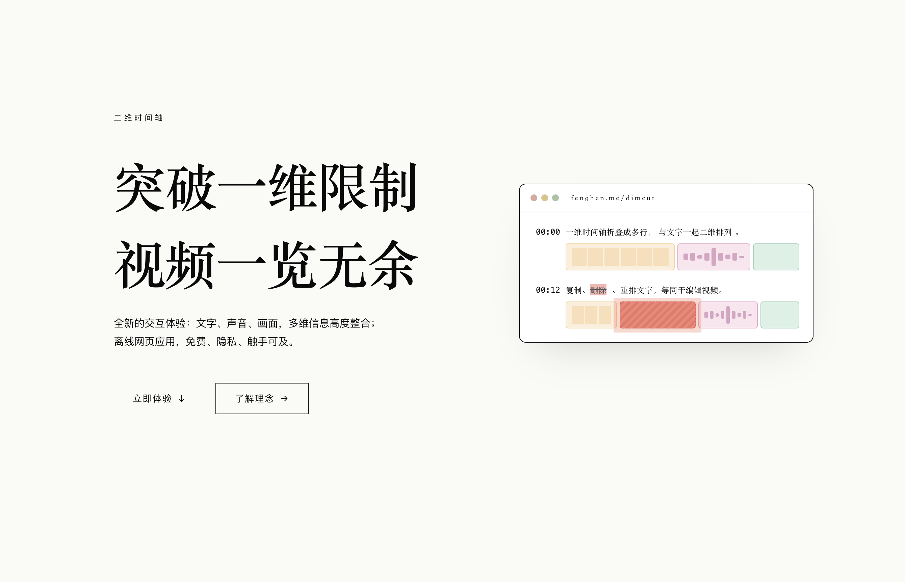
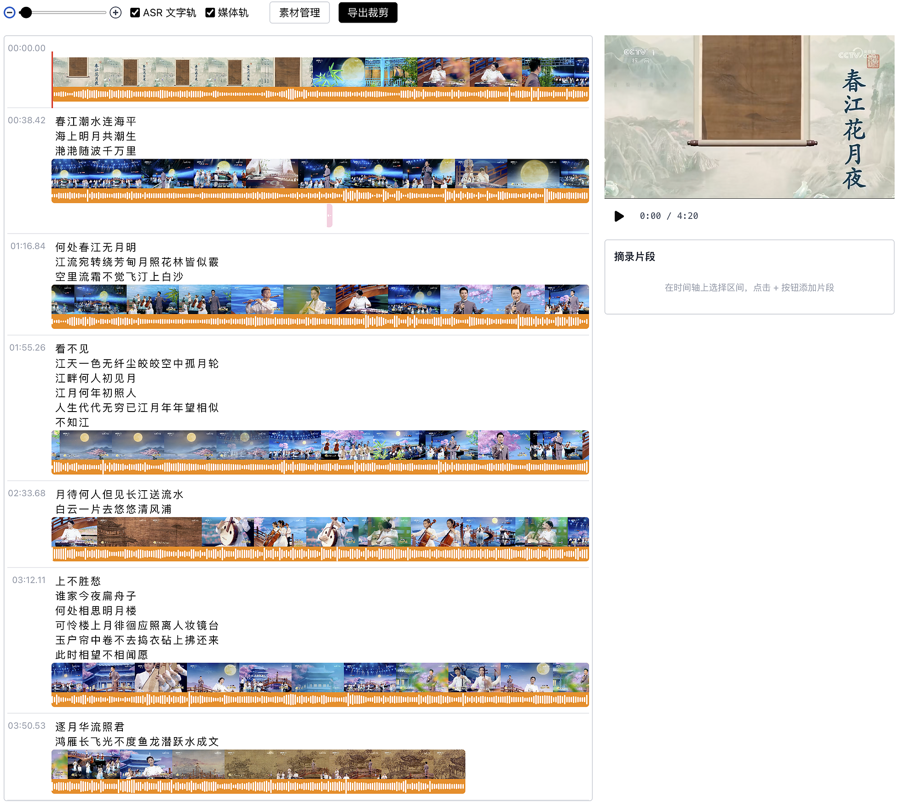

---
tags:
  - 音视频
  - WebCodecs
  - Audio & Video
date: 2026-05-24
---

# 创新视频剪辑交互：二维时间轴 + 文字轨

_**以下是视频文字稿**，观看视频请移步 [B 站](https://www.bilibili.com/video/BV1W8Le6yEyz/)_

[立即体验 Dimcut](https://fenghen.me/dimcut)

## 传统剪辑的痛点

今天分享一款视频剪辑工具——**DimCut**。

日常剪辑中，录制完成后需要反复回看视频，依据画面和声音逐段删除废片、添加素材、对齐时间戳。在剪映等工具中，这一过程对应的是频繁拖拽横向滚动条定位片段、反复点击暂停按钮确认时间点，操作效率较低。

## 两个核心创新

DimCut 通过两项交互设计来解决上述问题。

### 二维时间轴

将传统的一维时间轴折叠为二维布局。一行对应一个时间段，所有内容一目了然，无需横向滚动，改用垂直滚动浏览——体验接近阅读长文。

### 文字轨

将 ASR 识别出的文字直接整合进时间轨道。用户通过阅读文字即可快速定位时间点、选中片段，无需反复播放视频确认内容。

## 功能演示

### 删除片段

轨道中同时展示音频波形图和视频画面帧。若开头有前奏需要去除，选中该区域后点击删除，导出时自动从有效内容起始。  
对于单句内容（如"海上明月共潮生"），可通过文字直接选中该片段并删除，导出结果自动跳过。

### 提取有效片段

当视频大部分内容不需要，只希望保留若干片段时，可使用「提取」模式：

1. 选中目标片段
2. 点击加号添加到提取列表
3. 继续选择更多片段
4. 导出时仅包含选中的片段

适合从长视频中摘录有价值的内容，或提取片段后做二次编辑。

### 调整片段顺序

多个片段选中后，支持拖拽调整顺序，导出的视频按调整后的排列生成。

### 添加音效素材

素材管理中支持额外的音效轨道，可将音效拖拽到指定位置（如为视频开头添加提示音），增强表现力。

## 素材与 ASR 配置

素材管理提供两类配置：

- **主轨素材**：视频或音频文件，可随时替换；播客场景直接使用音频
- **ASR 语音识别**：调用第三方服务（如 Whisper）从音频中提取文字

DimCut 的核心优势在于以文字驱动视频剪辑，区别于传统工具依赖画面和声音的定位方式。阅读文字的效率远高于反复回放视频——点击文字即可跳转到对应时间点和片段。

文字轨和媒体轨均可独立隐藏：不需要文字时可隐藏文字轨保持简洁；以文字为主的播客场景可隐藏媒体轨，纯文字操作。时间轴支持从全局概览到帧级别（一行约一秒）的自由缩放。

## 总结

DimCut 的三大特征：

- **二维时间轴**：一眼看到更多信息，避免横向滚动
- **文字整合进时间轨道**：更快地定位时间点、选中片段，进行剪辑操作
- **极简 UI 设计**：直接在网页中剪辑视频

如有建议或反馈，欢迎在 GitHub 上交流。

## 相关链接

- [Dimcut 产品体验](https://fenghen.me/dimcut)
- [GitHub](https://github.com/hughfenghen/dimcut)
- [B 站视频](https://www.bilibili.com/video/BV1W8Le6yEyz/)
