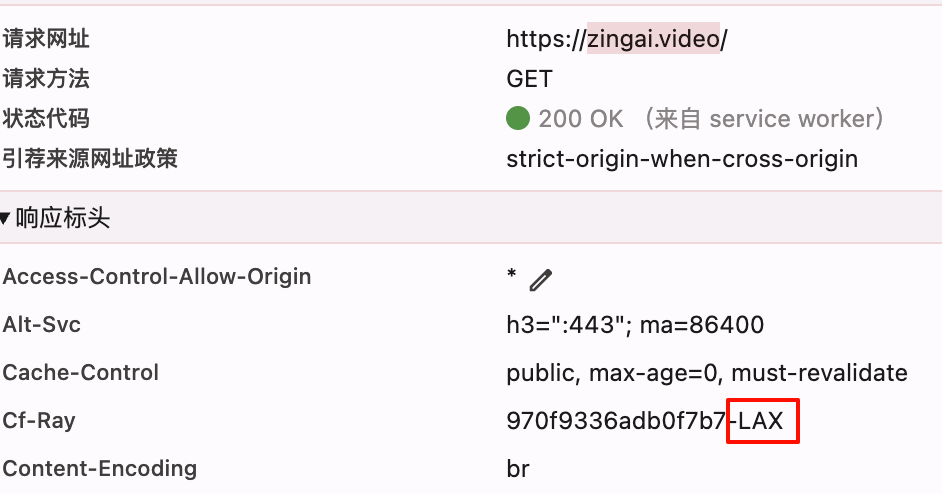

---
tags:
  - 网络
date: 2025-08-20
---

# 互联网“骨干协议” —— BGP 协议

## 背景

最近将站点部署在 Cloudflare Pages 上，访问速度不稳定，有时非常慢；  
分析原因，发现有绕远路的现象；

_不翻墙，请求由**洛杉矶**的机房处理；翻墙后，请求由**新加坡**的机房处理；_ 实测翻墙后速度有很大提升。

按理说上海的请求应该都由新加坡（或香港）的机房处理，因为物理距离相比洛杉矶近很多；  
**为什么会有绕远路的现象？**

_ping 域名观察 ip 地址_

_IPv4 的归属地是“泛播”，IPv6 则指向美国_

于是跟 AI 学习了一点关于网络知识，同时理解了以前工作中碰到的一些“神奇”现象（后文介绍）。

### 前序基础知识

计算机网络模型、TCP/IP 协议、CDN、DNS  
_对这些知识有个大概印象就好，若不了解，后续再补充学习也行_

---

_后面是跟 AI （ChatGPT5） 的对话记录_

## 介绍 Cloudflare ip 泛播的工作原理，如何让不同地区服务器共享同一个 ip，ipv6 可以泛播吗？

### 1. 什么是 IP 泛播（Anycast）

- **单播（Unicast）**：一个 IP 地址对应唯一的服务器/节点，客户端请求必须路由到这个唯一的节点。
- **广播（Broadcast）**：一个 IP 地址对应一整个网络段，数据包会发给网络段里的所有节点（通常只在局域网中使用）。
- **泛播（Anycast）**：多个地理位置不同的节点（数据中心/服务器）共享同一个 IP 地址，BGP 协议会把客户端流量路由到“网络拓扑上最接近”的那个节点。

Cloudflare 就是通过 **BGP + Anycast** 来实现的：

- Cloudflare 在全球每个数据中心的边界路由器上，都对外 **通告相同的 IP 前缀**（比如 104.16.0.0/12）。
- 全球 ISP 的路由器接收到这些 BGP 通告后，会选择一条最优路径（最短 AS path、最低成本等）来决定访问该 IP 的流量应该送往哪一个 Cloudflare 数据中心。
- 最终效果就是：**用户访问 Cloudflare 的同一个 IP，会自动路由到离自己最近的 Cloudflare 节点**。

### 2. 为什么能做到“不同地区服务器对应一个 IP”

- 本质是 **BGP 路由选择**：同一个 IP 前缀被全球多地的 Cloudflare 节点宣告，但 ISP 只会选择一条“最优路径”。
- 所以即便 IP 相同，来自美国的请求可能会落到 Cloudflare 洛杉矶节点，中国大陆可能走到香港节点，欧洲可能走到法兰克福节点。
- 这样就达到了“同一个 IP，根据用户地理/网络位置，进入不同的服务器”的效果。

换句话说：

> **不是服务器自己判断用户来源，而是网络路由在传输层就已经把请求送到了就近节点。**

### 3. IPv6 能不能泛播？

答案是：**可以，Cloudflare 已经在使用 IPv6 Anycast**。

- IPv6 同样依赖 BGP 进行路由，和 IPv4 原理完全一致。
- Cloudflare 的 IPv6 地址段（比如 `2606:4700::/32`）同样在全球所有数据中心通过 BGP 泛播出去。
- 用户访问 Cloudflare 提供的 IPv6 地址时，也会自动路由到最近的数据中心。

### 4. 总结

- **工作原理**：Cloudflare 在全球所有边缘节点使用 **BGP Anycast** 宣告相同的 IP 段，用户的 ISP 会选择到最近的节点转发请求。
- **为什么能做到“同一个 IP 不同地区落到不同服务器”**：这是因为路由协议的“最优路径选择”，而不是靠应用层判断。
- **IPv6 是否支持泛播**：完全支持，Cloudflare 的 IPv6 服务就是依赖 IPv6 Anycast 部署的。

---

## 介绍 BGP 协议

### 1. BGP 是什么

- **全称**：Border Gateway Protocol，边界网关协议。
- **作用**：互联网的“骨干协议”，用于在不同自治系统（AS，Autonomous System）之间交换路由信息。
- **地位**：没有 BGP，就没有今天的互联网。因为全球互联网是由成千上万的 AS（ISP、运营商、IDC、大型企业网络等）互联组成的，而 BGP 是它们之间的“导航系统”。

### 2. 自治系统（AS）

在理解 BGP 前，先要理解 **AS**：

- AS（Autonomous System）：一个由统一管理的网络系统，通常由一个运营商、公司或组织控制。
- 每个 AS 有唯一的 **AS 编号（ASN）**，由国际机构（IANA / RIR）分配。
- 举例：

  - 中国电信 AS4134
  - Cloudflare AS13335
  - Google AS15169

BGP 就是不同 AS 之间的路由协议，所以被称为 **外部网关协议（EGP）**。

### 3. BGP 的核心原理

BGP 的基本工作流程：

1. **建立会话**：两个 AS 之间的边界路由器建立 TCP 连接（端口 179）。
2. **交换路由信息**：边界路由器会发布自己能到达的网络前缀（IP 段）。

   - 例如：Cloudflare 的路由器对外宣告 `104.16.0.0/12`，表示“我可以处理发往这些 IP 的流量”。

3. **路由选择**：其他 AS 收到这些前缀后，会根据 **BGP 路由选择规则**，决定把数据包往哪条路径送。
4. **持续更新**：一旦路由有变化（链路中断、新路径出现），BGP 会更新路由表，确保网络连通。

### 4. BGP 路由选择原则

BGP 不像 OSPF、IS-IS 那样追求“最短路径”，它的路由选择考虑很多因素：

1. **最短 AS Path**（AS 路径最短的优先）
2. **Local Preference**（本地偏好值，运营商可以手工配置）
3. **Origin Type**（路由的来源方式）
4. **MED（多出口判别）**（跨运营商时使用的权重参数）
5. **eBGP 优先于 iBGP**（外部路径优先）
6. **更低的路由 ID / 优先级**

最终决定哪条路由被采用。

---

### 5. BGP 的两种类型

- **eBGP（External BGP）**：不同 AS 之间的 BGP，会经过公网。
- **iBGP（Internal BGP）**：同一个 AS 内部不同路由器之间的 BGP，用于保持一致的路由信息。

---

### 6. BGP 的应用场景

1. **互联网骨干**：全球互联网依靠 BGP 互联。
2. **CDN/Anycast**：Cloudflare、Google、Akamai 等通过 BGP Anycast，把同一个 IP 在全球宣告。
3. **多线接入/智能路由**：一个企业接入多家运营商（如电信/联通/移动），通过 BGP 做智能选路。
4. **防御 DDoS**：通过 BGP 黑洞路由（BGP Blackhole），快速把攻击流量丢弃。
5. **流量工程**：运营商可以用 BGP 属性（Local Pref、AS Path prepend 等）调整流量走向。

### 7. BGP 的特点

- **基于 TCP 179 端口**（保证可靠传输）。
- **只传递可达性信息**（我能到达哪些网段），不传输具体的拓扑。
- **收敛速度较慢**（相比 OSPF），但稳定性更好。
- **高度可控**（通过策略路由，可以精细化调整流量）。

✅ 总结：
BGP 是互联网的“导航协议”，通过 AS 之间的路由信息交换，让全球无数网络拼接成一个“全球互联网”。Cloudflare、Google、Facebook、ISP 等大厂都通过 BGP 来实现 **IP 泛播、流量调度、跨网互联**。

---

## 既然有了 BGP 实现的泛播，为什么网络社区还需要做 Cloudflare 优选 IP？

确实，**Cloudflare 已经用 BGP Anycast 做了全球泛播**，理论上用户访问同一个 IP，都会走到「最近、最优」的 Cloudflare 节点。那为什么还会出现「Cloudflare 优选 IP」这种需求呢？

我给你从 **BGP 路由机制的限制** 和 **实际网络环境的复杂性** 两方面来解释。

### 1. 理论：BGP Anycast = 最近节点？

BGP 的路由选择**不是“地理最近”**，而是根据一套策略：

- **AS Path**（自治系统路径长短）
- **Local Pref**（运营商的本地偏好设置）
- **路由策略**（运营商可能有商业合作，比如强制优先走某条链路）
- **网络成本**（ISP 间的结算关系，可能绕远路但便宜）

👉 所以，虽然 Cloudflare 在全球宣告相同 IP 段，但并不保证你在中国一定走香港节点，也可能被运营商绕去美国、日本，延迟和丢包率都更高。

### 2. 现实：为什么要“优选 IP”

在真实网络环境中，有几个典型问题：

1. **运营商策略问题**

   - 比如中国移动的国际出口，常常绕路，用户去香港的 Cloudflare 节点，结果被 BGP 路由到美国西海岸，延迟直接 200ms+。
   - 这不是 Cloudflare 的问题，而是运营商的 **BGP 策略 + 结算关系** 导致的。

2. **网络拥塞**

   - 即使理论上路由到了“近点”，但链路本身可能拥塞、丢包高。
   - Cloudflare 没办法控制每一家 ISP 的链路质量。

3. **Cloudflare 的 Anycast 粒度较粗**

   - Cloudflare 的 IP 段很大（比如 `104.16.0.0/12`），一个段里可能包含很多节点。
   - 但用户可能需要“更细粒度”的选择，找出其中 **对自己网络环境延迟最低的 IP**。

### 3. 什么是“优选 IP”

所谓 **Cloudflare 优选 IP**，其实就是：

- 网络社区里的人测试 Cloudflare 所有可用的 Anycast IP（IPv4/IPv6），
- 对比在不同地区/不同运营商下的 **延迟、丢包率、带宽**，
- 最终挑选出“对自己网络环境最优”的 IP 来使用。

例如：

- 某个中国移动用户，优选测试后发现 `104.19.192.12` 比默认的 `104.16.0.0/12` 其他 IP 更快，于是就固定用这个 IP。
- 本质上就是 **人工补充了 BGP 没法保证的“真实网络质量”信息**。

### 4. IPv6 的情况

IPv6 也有 Anycast，**同样存在这个问题**：

- BGP 仍然是运营商策略主导，IPv6 甚至在国内的优化更差。
- 所以 IPv6 也会出现“访问 Cloudflare 走远路”的情况，依然需要“优选 IP”。

### 5. 总结

- **BGP Anycast** 只能保证“拓扑意义上的最近路径”，但不能保证“实际网络质量最好”。
- **运营商路由策略、国际出口瓶颈、链路拥塞**，都会导致用户访问 Cloudflare 的延迟和体验不稳定。
- **优选 IP** 就是用户自己在 Cloudflare 提供的 IP 段里挑选“在自己运营商网络下延迟最低、质量最优”的那个 IP 来用。

👉 换句话说：

- **Cloudflare Anycast 是全球层面的优化**。
- **优选 IP 是用户侧的本地优化**。

---

## 前面提到绕远路可能是运营商的策略，那采用社区的优选 IP 是否会被惩罚或封禁？

问题涉及 **Cloudflare、运营商、用户三方的关系**。
我们分情况来分析：

### 1. Cloudflare 的角度

- **Cloudflare 官方不会惩罚使用“优选 IP”**。

  - 因为你本质上还是在访问 Cloudflare 的 Anycast 节点。
  - 优选 IP 只是你在 Cloudflare 公布的 **合法 IP 段** 里，挑选出最适合你网络的一个。
  - Cloudflare 的 IP 段是对外公开宣告的，所有人都可以直接访问。

- **只要不滥用**（比如恶意 DDoS、爬虫、攻击），Cloudflare 不会因为你用了“优选 IP”而封禁。
- 有些服务（比如 CDN 域名）可能依赖 **Host Header / TLS SNI**，即便你直连优选 IP，也还是通过 Cloudflare 的边缘节点进入，Cloudflare 仍然能做流量管理。

### 2. 运营商的角度

- 运营商不会因为你使用“优选 IP”而“惩罚你”，因为对他们来说，你就是访问了一个 Cloudflare 的 IP，没什么特别。
- 但运营商 **可能会随时调整 BGP 策略**，你今天的“优选 IP”走香港，明天可能又绕去美国。
- 这就是为什么社区优选 IP 工具通常要 **定期测试、自动切换**，因为运营商的路由策略是不稳定的。

### 3. 潜在风险

虽然不会“惩罚”，但有几点需要注意：

1. **IP 可用性波动**

   - Cloudflare 的大段 IP 可能分配给不同的服务（网站/CDN/API/Workers…），某些 IP 在特定地区可能被屏蔽或限速。
   - 选中的优选 IP 可能一段时间好用，过一段时间就不行了。

2. **部分业务可能不兼容**

   - 如果某个服务要求 **CNAME / 域名解析绑定**，直连优选 IP 可能绕过 Cloudflare 的一些安全功能（例如 WAF、Bot 管理）。
   - 特别是 SaaS 型客户（如 Shopify、Notion），可能不允许直连 IP，而必须用域名。

3. **法律/合规风险**

   - 在某些地区（例如中国大陆），Cloudflare 节点的可用性受政策影响，如果你绕过官方解析结果，可能访问效果不稳定，甚至被阻断。

### 4. 总结

- ✅ **不会被 Cloudflare 惩罚**，因为你访问的还是 Cloudflare Anycast 公布的合法 IP。
- ✅ **不会被运营商封禁**，因为运营商看不出你是不是“优选 IP”，只会按 BGP 策略路由。
- ⚠️ **最大风险是可用性**：优选 IP 可能随时间变化，需要定期维护。
- ⚠️ **部分场景不适用**：某些服务要求强制走域名，直连 IP 可能绕过安全功能或导致不可用。

换句话说：

> **社区优选 IP 是一种用户侧的“临时网络优化手段”，风险主要在稳定性，而不是封禁或惩罚。**

---

## CDN 也会路由用户请求到最近的节点处理，它的实现原理（动态/智能 DNS）跟 BGP 协议有什么关系和区别？

你已经注意到 **CDN 调度** 和 **BGP Anycast** 的相似点：两者都能让用户请求落到“最近/最优”的节点。但它们的实现原理其实完全不同，我给你系统对比一下：

### 1. **CDN 的调度方式**

主流 CDN（阿里云、腾讯云、Akamai 等）大多数采用 **DNS 解析调度**：

1. 用户访问 `example.com`。
2. 浏览器向 **本地 DNS 服务器**（LDNS）发起域名解析请求。
3. 解析请求最终到达 CDN 的 **权威 DNS**（通常是智能调度系统）。
4. CDN 根据多个维度（用户的 IP、LDNS 的 IP、网络拓扑、节点负载、带宽成本…）返回一个 **离用户最优的节点 IP**。
5. 用户再用这个 IP 去访问 CDN 节点。

👉 这种方式叫做 **智能 DNS / 动态 DNS 调度**。

- 优点：粒度更细，可以根据用户来源灵活选择节点。
- 缺点：DNS 只能做到“粗略定位”，因为权威 DNS 看到的是 **LDNS 的 IP**，而不一定是用户的真实 IP（比如公司内网、公共 DNS）。

### 2. **Cloudflare 的 Anycast 调度方式**

Cloudflare 与传统 CDN 最大的不同：

- 它不是依赖 **DNS 返回不同的 IP**，而是给所有用户返回 **相同的 Anycast IP**。
- 之后交给 **BGP 路由协议**来选择最近的 Cloudflare 数据中心。

👉 本质是 **网络层调度（BGP）**，而不是 **应用层调度（DNS）**。

- 优点：快速、简洁，用户只需解析一次 IP，路由天然送去最近节点。
- 缺点：路由选择由运营商决定，Cloudflare **无法完全掌控**（会出现“绕路”问题，需要优选 IP）。

### 3. **二者关系与区别**

| 维度          | BGP Anycast（Cloudflare）     | 智能 DNS（大多数 CDN）           |
| ------------- | ----------------------------- | -------------------------------- |
| 调度层级      | 网络层（路由层）              | 应用层（DNS 解析）               |
| 调度手段      | BGP 路由最优路径              | 根据用户 IP/LDNS IP 返回不同 IP  |
| 用户看到的 IP | 全球相同（Anycast IP）        | 不同地区返回不同 IP              |
| 调度精细度    | 粗（依赖运营商路由策略）      | 细（可基于用户、网络、负载调整） |
| 稳定性        | 简单高效，但可能绕路          | 灵活可控，但依赖 DNS 准确性      |
| 延迟影响      | 无 DNS 多级跳转开销           | 受限于 DNS 缓存与 LDNS 位置      |
| 典型代表      | Cloudflare、Google DNS、Quad9 | Akamai、阿里云 CDN、腾讯云 CDN   |

### 4. **CDN 为什么不都用 Anycast？**

- Anycast 要求在全球都有自建节点，并且在所有 ISP 建立 BGP 对等关系 → 成本极高，只有 Cloudflare、Google、Meta 这样的大厂能玩。
- DNS 调度更灵活，可以按需控制：比如某个节点过载，直接不返回它的 IP；但 Anycast 流量过来后，除非内部再转发，否则节点自己必须处理。
- DNS 调度能区分业务：同一个域名下，可以按地区返回不同的 CNAME/IP，适合多租户、多业务的复杂场景。

### 5. **总结**

- **BGP Anycast**：让“网络本身”决定用户走到哪个节点，速度快、实现简洁，但受限于运营商策略，不可控。
- **智能 DNS 调度**：由“CDN 平台”决定用户走到哪个节点，调度灵活、可控，但受限于 DNS 层的局限（缓存、LDNS 偏差）。
- **Cloudflare 之所以特别**：它用 BGP Anycast 做第一层“最近节点路由”，再结合 **内部负载均衡**（Argo Smart Routing 等）做第二层调度。
