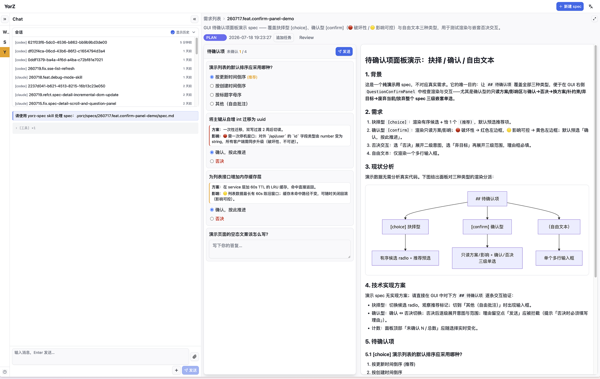
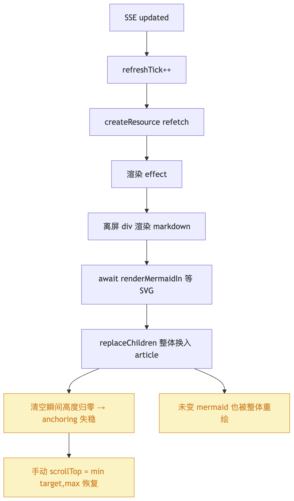
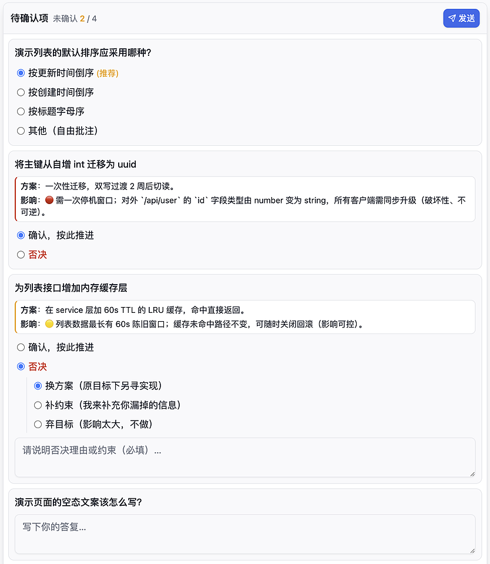

# Vibe Coding 将程序编成黑盒，怎么办？

现在的开发者不再编写代码、review 代码，即使 SDD（Spec 驱动 Agent 开发）工作流也会面临类似问题 —— 开发者将逐渐放弃阅读 spec 文档。

如果 Agent 将开发者驱逐出编程工作流的所有阶段，那么程序终将成为黑盒，程序的可靠性、可维护性会成为新的问题。

[解决办法](#解决办法) —— 我的开源项目 [YorZ（柚子）][2]

## 起因

Agent 会将开发者驱逐出编程工作流，是因为 Agent 输出信息的速度太快，会导致开发者信息过载。

回想第一次吸 Claude 的那个深夜，似乎是很遥远的事情，其实也就大半年的时间，这大半年我跟 Agent 之间的合作模式迁移了三次：

- 我设计；Agent 编码
- SDD 工作流：我提需求、整理背景信息，阅读 spec；Agent 设计、然后编码
- 简化版 SDD 工作流：我提需求；Agent 分析背景、设计、然后编码

SDD 可以理解为「先让 Agent 写清楚要做什么，再让 Agent 按照这份说明去实现」：
需求不会直接进入编码阶段，而是先沉淀成 spec.md，里面包含目标、背景、约束、方案、任务拆分、验收标准等信息。
开发者主要 review spec，而不是逐行 review 代码；只要 spec 的方向是对的，后续编码就更容易收敛。

它的好处很明显：复杂任务不再只靠聊天记录里的几句话支撑，Agent 有稳定的上下文和任务边界；  
对开发者来说，SDD 把「盯着 Agent 写代码」变成了「控制目标与设计」，理论上更适合多人协作、长任务和并发任务。

SDD 的问题在于依赖程序员发现 spec 中的问题，提前纠正，避免 Agent 编码时偏离实际目标。  
如同程序员 review 代码速度跟不上 Agent 的编码速度一样，程序员 review spec.md 的速度也跟不上 Agent 输出 spec 文档的速度。

SDD 实践早期，我极少让 Agent 并发执行任务，因为整理信息跟 review spec 消耗了很多精力，还没缓过来，Agent 的代码就写完了，又要开始测试验收。

Review spec 越来越累，特别是接手一些陌生的模块，开始跟不上 Agent 的思路；  
我逐渐放弃阅读 spec，进入真正的 Vibe Coding（抽卡）状态，功能验收不通过，就让 Agent 再执行一遍；  
Agent 跟我确认问题（做决策），我一脸懵逼，就像课堂上睡觉被老师点名提问一样，只能选一个看起来顺眼的答案。

如此运行了一段时间，我没有更轻松，效率也没有提升，更多的时间消耗在测试阶段；  
程序（代码）对我来说越来越像一个黑盒，我甚至不知道关键模块的代码入口文件名，这让我有种恐慌感。

## 解决办法

我并没有维持在上述的糟糕状态太长时间，因为解决思路就摆在眼前，前不久 Claude 发布了一篇很火的博客 [使用 Claude Code：HTML 的惊人有效性][1]，核心内容大意是：

Markdown 虽然简单、便携、适合编辑，但当 Agent 开始产出越来越大的计划、报告、评审材料时，它的表达能力很快变成瓶颈。  
超过一百行的 Markdown 很少有人真的逐行读完，HTML 则可以把表格、图形、颜色、布局、交互、链接、图片、响应式结构组织在同一个可浏览的文档里，让信息密度和可读性同时提升。

开发者之所以放弃 review 代码、放弃 review spec.md，也是同样的道理：

- Agent 输出速度太快，导致开发者信息过载
- Markdown 纯文本表达能力有限

所以我就启动了 [YorZ（柚子）项目][2]：使用 Web UI（HTML）来承载 SDD 工作流。



YorZ 的工作原理：

1. 对 spec.md 中复杂信息进行升维，使用 Mermaid 图形语法表达复杂逻辑
2. 使用 HTML 将 spec.md（包含 Mermaid）渲染为图形，一图胜千言，同时将精确详细信息折叠起来，保留给 Agent 作为编码参考
3. 专门针对 SDD 工作流实现配套的 UI 交互，如：方案决策、追加任务、Agent 并发执行、深度 debug 等，以最大化 Agent 的输出效率

当开发者不再编写代码，也不再阅读代码，  
应该如何保持开发者对程序的掌控力，如何确保程序的基本质量，如何避免复杂程序走向腐烂崩溃？  
如果开发者不了解程序，就无法控制程序、改进程序，无法做出有价值的决策。  
我认为，当开发者不再编写、阅读代码，至少应该阅读 spec 中的数据流图、时序图、模块架构图，避免程序彻底沦为黑盒。

你可以对比以下真实 spec 中文字与图像的阅读体验：

_文字与图片都是在解释 bug （接口更新 MD 文档，导致前端页面高度塌缩）的原因_



```md
当前渲染 effect 为「双缓冲」：离屏 `<div class="markdown">` 渲染 markdown + `await renderMermaidIn` 等 SVG 就绪 → `replaceChildren` 整体换入可见 `<article>` → 手动 `scrollTop = min(target, max)` 恢复。`replaceChildren` 属「先清空再插入」，清空瞬间高度归零使 `scroll-anchoring` 找不到稳定锚点，故必须手动补；整体替换也使未变 mermaid 一并重绘。

关键点：**整体替换让 `scroll-anchoring` 失效**（所有节点都换新，无稳定锚点）；**增量更新让它生效**（大部分节点不动，浏览器以未变节点为锚保持视口）——这是本次重构可去掉手动 scrollTop 的原理基础。

涉及文件与关键位置

- `src/gui/src/pages/SpecDetail.tsx`
  - `L121-131` SSE `onUpdated`：`setTimeout(() => void startTransition(() => setRefreshTick(t=>t+1)), SSE_DEBOUNCE_MS)`（**保留**）。
  - `L210-252` 渲染 effect（双缓冲）：`document.createElement('div')` 离屏 → `off.innerHTML = renderMarkdown(...)` → `el.parentElement.appendChild(off)` → `renderMermaidIn(off).then(...)` → `el.replaceChildren(...Array.from(off.childNodes))` → `el.scrollTop = Math.min(target, el.scrollHeight - el.clientHeight)`（**重写为 morphdom 增量**，移除手动 scrollTop 与离屏）。
- `src/gui/src/lib/markdown.ts`
  - `L160-164` mermaid fence 输出 raw 占位：`<div class="mermaid" data-mermaid-source="${escaped}">${code}</div>`（无 `data-processed`）。
- `src/gui/src/lib/mermaid.ts`
  - `L18-53` `renderMermaidIn(container)`：`querySelectorAll('.mermaid')` → 对每个 node `node.textContent = source; node.removeAttribute('data-processed')` → `await mermaid.run({nodes})`（注入 SVG，mermaid 内部会置 `data-processed`）；注册 `matchMedia('(prefers-color-scheme: dark)')` change → 重渲染。当前**无条件重渲染所有** `.mermaid`（需改为只处理未 `data-processed` 的）。
- `package.json`：当前无 DOM-diff 依赖（morphdom / nanomorph 均无）。
- 回归测试：`src/gui/src/__e2e__/scroll-preserve.spec.ts`、`scroll-followup.spec.ts`、`spec-task-list.spec.ts`（本次复用验证）。
```

不同于近期火热的「Loop」概念，YorZ 并不追求完全将开发者排除出循环，产品需要保留人的品味，程序也是如此，所以 YorZ 工作流特意保留了决策环节，优化了决策 UI。



YorZ 致力于提升开发者与 Agent 的协同效率，特意对并发启动多个 Agent 来执行任务的场景做了优化，自动使用 worktree 创建隔离环境，确保并行任务不会互相影响，完成之后可便捷地合入、清理 worktree 项目。


## 未来展望

目前我的编程工作基本都迁移到 YorZ（YorZ 本身就是使用 YorZ 开发的），最后的测试验收环节往往还是要手动操作，特别是前端的复杂交互任务，难以完全转交给 Agent 来执行，这是接下来需要考虑的。

将 SDD 工作流 UI 化的另外一个好处就是，有望实现真正的移动端远程编程；  
现在有不少 Agent 提供移动端入口，但仍然围绕 Markdown 文档与代码文件，显然是不可取的，PC 宽屏开发者都不再看文档和代码，何况手机小屏幕。

只需要打通最后的测试验收环节，再配合 YorZ 已完成的图形化、SDD 定制的 UI 交互，实现工作流闭环；  
真正的移动端远程开发终将实现，随时随地像刷短视频一样轻松惬意 [doge]

---

_欢迎加入交流群：QQ 群 `224778869`_

 

[1]: https://claude.com/blog/using-claude-code-the-unreasonable-effectiveness-of-html
[2]: https://github.com/hughfenghen/YorZ
