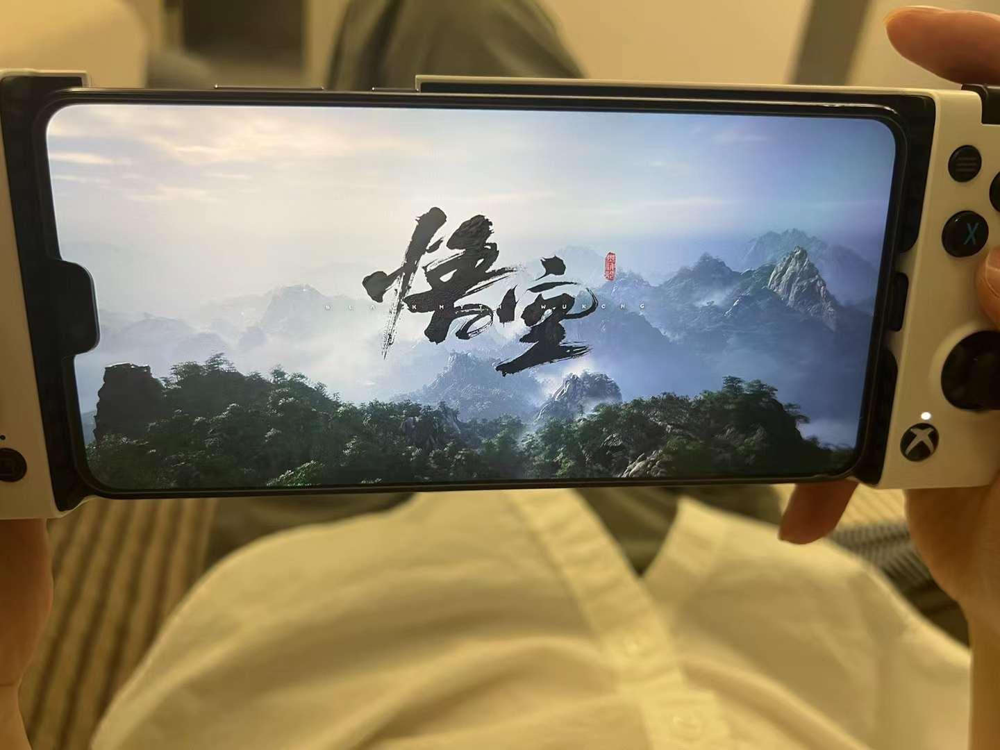

---
tags:
  - 游戏
date: 2024-08-24
---

# 手残党的【黑神话·悟空】笔记

## 背景

[黑神话·悟空](https://www.gamesci.com.cn/)是 2024 年发行的现象级单机游戏。

笔者小时候看电视剧、动画片时就曾”梦”幻西游，四年前看了首支实机演示就很期待；  
所以即便是典型的手残玩家、3D 眩晕症患者也不愿错过。

本文从一个手残玩家视角，记录一些游玩心得，随缘更新。

## 设备

笔者平常一般是玩解谜类型游戏且喜欢躺着玩，所以整了一台 3050Ti 显卡的迷你主机，然后使用 sunshine + moonlight 串流到手机，如文首的照片。

串流会略微增加延迟，偶尔卡顿，设备性能还带得动，搜教程开启 DLSS 后效果会更好一些。

分辨率 1560x720，60FPS，网络延迟 10ms，小屏幕掌机；有人说这是侮辱这款游戏的行为[doge]  
手残、低配、3D 眩晕，叠满 debuff，直面天命！

_掌机模式似乎有一个好处，3D 眩晕没那么严重了 ；）_

## 通关感受

我之前从没玩过类魂游戏，总的来说战斗体验还是挺好的，特别是被虐个把小时后，我与 Boss 双双残血，最能体会到那种紧张刺激的感觉。

游戏难度并不算高，主题是战斗，也需要稍微动点脑子；  
每个 Boss 的都有其特征，不断尝试总结，搭配不同的法术、法宝、技能、药品，基本不会卡太久；  
即使我是个手残党玩家，第一章（大头、白衣秀士、黑熊）之后也顺畅多了。

游戏最大的成就是其艺术性，提升战斗技艺找寅虎老师，风景摄影可以去黑风山、紫云山，了解剧情、故事、众生相可以细读影神图。  
换几种体验方式，更能体现票价的性价比：）

不好的点，就是特别容易迷路，特别是盘丝洞、花果山；  
本来洞穴中就特别容易晕 3D，加上玩玩绕绕差点吐出来，卡了几个小时，不得不看别人的视频跑地图；  
而花果山，创作团队似乎已经放弃引导玩家了，跟着别人的视频飞一不小心都能飞错路。

## Boss 攻略经验

被虐不要慌，Boss 可以猖狂无数次，而天命人只需要赢一次。

本来想记录所有 Boss 的攻略技巧，但工作量太大了，网上的教程资料都非常多；  
且很多 Boss 都比较简单，所以只记录一些让我印象深刻（虐我好惨）的 Boss。

### 幽魂/金池长老

这两个小 Boss 非常像（或者说是同一个角色），第一个幽魂打了好久是没想到的。。。

1. 因为不知道**定身**可以多次使用。。。发现能 CD 再次使用就好打多了。
2. 他的攻击节奏不是特别紧凑，有时会看着你散步，此时**立棍**打他硬直接着揍就行。

### 白衣秀士

打了很久，运气过的。。。

他喜欢远距离冲刺攻击，**立棍**可以躲伤害。

打完白衣秀士，水潭左侧藏着**金池长老**一定要打，拿到**避火罩**后面打黑熊轻松点。

### 黑熊

人形态运气过的，山顶熊形态打了**很很很**久，经验：

1. 熊熊皮实得很，**劈棍**技能点到那个**按比例扣血**的，效果很好
2. 按比例扣血需要打完一整套再接重击，所以必须配合**定身**才能打出来
3. 熊熊太皮实了，法力值很可能不够用，尽量靠闪避躲伤害，只用**定身**配合打伤害
4. 刀狼变身早期就用起来，这样可以撑到后面 CD 完成二次使用
5. 伏虎丸（加攻击）、避凶药（加防御）、清凉散（避火）能加 buff
   1. 建议早期不要用药，先打几次练手，快要能打赢了才吃药
   2. 因为足够手残就会发现，土地庙售卖药品数量是有限的，没药只能硬上了

### 鼠鼠父子

鼠鼠父子情深，但。。。都傻傻的，他们的攻击会误伤对方。

1. 引导鼠儿子（傻二郎）敲碎石柱，不然鼠父（傻爸爸）上去后就打不到了
2. 走位，攻击时让傻二郎站在天命人跟傻爸爸中间
   1. 否则攻击会被傻爸爸的石头远程打断
   2. 处于中间的傻二郎还会被傻爸爸的石头命中
3. 击败傻二郎，这关就过了
   1. 攻击傻爸爸，特别击杀傻爸爸后，傻二郎会进入暴走状态，不太好打

理论上来说，可以

1. 把傻爸爸打成重伤（留一点血）
2. 把傻二郎打成重伤
3. 击杀傻爸爸，再击杀傻二郎（傻二郎满血就击杀傻爸爸，暴走后着实难打）

但这样会不会错过傻大郎？（我是击杀傻二郎直接过关了）

### 虎先锋

虎先锋果然如传闻那般 —— 难搞。

虎先锋攻击节奏快，还经常被打出连招，很容易一套带走，且血条还比较厚。  
特别是**闪身攻击**，伤害高，还会丢失目标，其他攻击相对容易躲避。

1. 积攒**两格棍势**，再配合定身打出百分比伤害；定身时间如果不够，轻棍不要打完就提前重击，再接重击
2. 躲避虎先锋的跳跃攻击到砸到地面有延迟，所以闪避时需要稍微延迟；
   1. 手残党需要练习这个技巧，如果慌起来胡乱闪避，大概率仍然会被击中
3. 起手刀狼变身，让技能尽快 CD
4. **闪身攻击**加丢失目标很容易被一套带走，但虎先锋最多使用两三次的样子
   1. 考虑使用**化气**躲避
   2. 二次刀狼变身，可以考虑留在闪身攻击时释放
5. 利用血池凸出部分遮挡视线，拖时间等技能 CD
   1. 血池凸出部分在高台方向，凸出部分两侧可以遮挡视线
   2. 当虎先锋看不见天命人的时候，攻击节奏大幅放慢
6. 积攒棍势，不要恋战
   1. 没有定身控制的情况下，轻棍打两三下就该闪避躲攻击了
   2. 闪避躲攻击可以加棍势，手残党看情况练习，闪避失败被击中扣血就得不偿失了

**总结**

1. 三个定身（每次两格棍势）打出百分比伤害
2. 每次刀狼变身努力磨掉 20% 血量
3. 化气、二次刀狼变身躲掉闪身攻击

再加一点**运气**，大概能带走虎先锋

### 小骊龙

前期小骊龙一般 30s 送走天命人，因为这个莽夫大概掉血 30% 的时候就一定会释放全屏范围的雷波攻击。  
这是手残党最怕的，必须连续快节奏操作才能躲过去的伤害，刀狼变身、化气都没用。

所以，通过小骊龙最核心的是**躲避雷波攻击**

1. **跳跃 + 闪避交替**躲伤害会轻松很多，连续跳、或者闪避，似乎有点后摇，容易被击中
2. 采取**左右横跳（闪避）**的策略成功率更高，面向 Boos 正前方跳容易被下一波攻击命中
3. 跳到石头上也能躲避掉，但不用刻意找石头，大部分石头都会被小骊龙击碎

雷波攻击之外，他就是个莽夫，即使没有定身也能在他技能后摇也能打出一小套技能

吐槽：这个关卡把游戏缺点（无处不在的空气墙）暴露出来了，看着空间很很大，实际四周的空气墙导致空间比视觉上小很多，有些石头你以为能跳上去躲避攻击，最后。。。

提示：回头想想，这一关可以先拿到石头人变身后再来，应该会简单很多，因为石头人不怕雷击。

### 黄风大王

太逆天了，技能超远，伤害又高，动不动就放连招，还有大风遮蔽形迹，很难打到。

被虐了一个小时，只能先去刷图  
原来那只醉酒猪的任务奖励居然是**定风珠**，还扯出一段往事，仇敌竟是故人。。。

拿到定风珠，后面就好打多了。

1. 炼丹的老鼠那里搞点仙丹，加血量、防御、攻击、棍势的药要都整上
2. 老套路，刀狼线上，等 CD
3. 适当时机放出定风珠
4. 三个定身 + 两个化气 + 两次刀狼，运气不太差（别被连上）就能过了

### 亢金龙

名为龙，实则“泥鳅”，比较滑，不容易打到。

所以，重点是

1. 怎么把伤害打到他身上去
2. 怎么躲避他的攻击

**技巧**

1. 观察他的行动，闪避躲伤害；没办法，只能躲，好在也不难躲
2. 喝棍势药，戳棍捅下来；四段棍势 + 翻滚 可以瞬间出戳棍，但不要离太远
3. 定风珠能把他打下来
4. 他落地时轻棍三下 + 定身，争取多打几棍子
5. 化气躲避攻击时，下一次攻击能把他打下来

### 魔将·妙音

打别的 Boss 是被虐，打魔将是要累死天命人。

魔将的特征是，攻击他的腿几乎不掉血，只有攻击他的头才管用，且他的技能大多是范围伤害。

我最后仍然没有找到他的弱点，怎么快速把他打跪下来，只能跟他慢慢耗。

所以逃命的技巧

1. 连招前摇、放大招的时候，刀狼变身或化气技能躲避
2. 嗑药（神宵散）加雷电抗性

然后，趁他跪下赶紧输出吧。

### 亢金星君

（第一个女神 Boss，有点不忍下手。。。

她的特征是喜欢远程攻击。

所以，还是躲伤害，同时靠近她，落地时尽快输出，打出硬直；  
没有棍势打硬直，就不要贪棍，她起手攻击就要闪避了。

场地比较大，可以拉开距离，在下坡边缘可以用石头遮挡视线，拖延时间等技能 CD，远距离她的技能也更容易躲。

### 不白

这家伙老是格挡，定身都不管用。  
格挡三次后一定会攻击，但手残党**识破很难打出来**，不然应该会很好打。

1. **定身换安身**，圈内回血加棍势慢慢消耗
2. **切换到戳棍**，保持远距离一定时间，他肯定会突进攻击，戳棍很有效
3. **变身刀狼换石精**，能打出更多伤害
4. **化气换铜头铁臂**，格挡之后、突进攻击即使手残党使用硬化还是很好躲的

### 黄眉

黄眉最大的弱点是为了蛊惑天命人，屁话超级多，每次释放完技能都要嘴遁一通。  
厉害的地方就是控制技能很多。

1. **定身换安身**，被圈禁后伤害只能硬抗，安身圈内加防御加血可以少掉很多血
2. 黄眉技能后摇阶段（嘴遁时）、或圈禁快消失时，蓄力棍势，靠近重击
   1. 若他释放非指向性技能，可以边跑边蓄力
3. 重击之后马上拉开距离，在他附近很容易被范围攻击命中
4. 三段棍势的重击能打破金身，若他自己消除金身会有半屏范围攻击，伤害很高躲远点
5. 打掉四分之一血量后，必然会释放大招，似乎是全屏范围，我还不知道怎么躲避，只能硬扛
   1. 大招之后再使用刀狼变身，否则变身会被他大招破掉

提示：被圈禁后，棍花应该可以挡掉雷电攻击

### 寅虎

太强了，根本打不过。。。

被追着打、各种连招、还都是霸体状态都打不动，搭配快慢刀，根本闪不过，手残党被虐哭了。

这要是守关 Boss 的话，估计就玩不下去了。

---

终于打过这该死的老虎了。。。

1. 技能：广谋、化气、分身、石头人，化气、分身技能点多加一些
2. 开场趁老虎摸刀的时候，放广谋的 🐍、分身、蓄力一击
3. 然后立刻化气躲开继续蓄力三段，破影一击
4. 再立刻变身石头人，站着挨打积满怒气，RT+X 释放技能（以上大概能消耗掉寅虎 50%～ 70% 的血量）
5. 接下来就开始逃窜，等化气技能 CD，再次蓄力 2 ～ 3 段，破影一击
6. 大概第三次化气后就能打败老虎了

**注意**

1. 开局前 参势丸、伏虎丸、避火罩，能增加胜利的几率
2. 注意寅虎的技能，化气后的破影一击，千万不要打空，否则难度会大大增加

### 青背龙

其实青背龙的招式很少，相对来说也比较容易躲，但我花的时间却比黄眉还多。

因为，受到雷蜇伤害后，下个技能没躲掉一下就能打掉七八成的血量，很容易被瞬杀了。

1. 受到雷蜇伤害后，拉开距离尽快回血，慌了就化气逃开
2. 定身配合棍花、避火罩增加棍势
3. 他释放大招时，保持距离，立刻换戳棍蓄力，等他冲过时很容易打中
   1. 一定要蓄满三段棍势，来不及的话及时放弃
4. 嗑药（神宵散）能增加容错性

### 小黄龙

听说小黄龙挺难搞的，但，对不起，我用了轮椅打法。。。

金身套装、隼居士、定身，配合棍花，基本上循环刷新隼居士的技能。

隼居士的风可以冰冻或者定身，然后上去一段棍花积累棍势，打出重棍。  
再循环上述动作。

### 晦月魔君

上述的轮椅打法，只对晦月魔君一阶段有用，第二阶段我还是被虐了。。。

只能老老实实摸索它的技能招式，让后硬上了。

伤害最高的是鸡叫之后的飞剑攻击，但好在都比较容易躲避。

Boss 比较大只，备好葫芦回血效果好的酒、泡酒物，只能贴身硬打了。

安身法也能回血，不要点最后一个技能点，不然太耗蓝了，来不及躲避还得靠化气。

### 避水金睛兽

火焰山的 Boss 也太简单了，一个下午打完了火焰山。  
就最后一个避水金睛兽，卡了一会儿。

主要是满屏的火光，导致画面在视觉上非常不清晰，比如**安身法**基本不能用，也完全打不出识破。  
而且，它移动非常迅速，轮椅打法也不不适用，最后变成拼血量。

**技巧**

1. 湘妃葫芦、清凉散、避火罩，对抗火焚伤害
2. 不要正面 A 它，尽量闪到屁股后面，可以躲避大部分攻击
3. 化气后的蓄力攻击，可以改成立棍，否则很容易打空
4. 变身石头人，站在火焰上很快就能积累怒气，能锤它两次
5. Boss 韧性不高，配合大头可以打出很多伤害

PS：据说融化冰之后，有第二个场景，Boss 还会切换形态，我直接第一个场景打死了。

### 二郎神

不愧是最强 Boss。

主要特征

1. 技能多、格挡条也很长，直接攻击打不出伤害
2. 会读指令，简单蓄力棍基本打不中
3. 可以破掉很多变身技

所以

1. 变身技换石头人，二郎神不会攻击石头，可用来躲避一些高伤害技能
2. 使用大头、芭蕉扇，可以打破格挡，能打出很多伤害
3. 使用安身法，贴身硬刚，圈内加防御加血量，硬刚不会输
4. 由于会读指令，所以不出妄想蓄力棍，棍势应该在 Boss 技能间隙用来配合识破
5. 多备些药增加胜率
