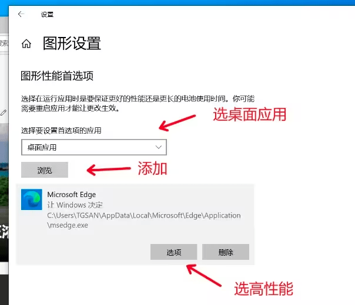

---
tags:
  - Bugfix
date: 2023-09-19
---

# 解决 Edge 117 浏览器视频变色

*仔细观察颜色，“变色”其实是“**反色**”效果*

**Bug 触发条件**：Win10 系统 + Edge 117 浏览器 + AMD 集成显卡 + HEVC 视频流  

Edge 117 如果使用 AMD 集成显卡，观看视频时可能出现视频反色现象，在 bilibili（哔哩哔哩） 直播中发现。  

通过以下设置，**配置 Edge 使用英伟达独立显卡**，可解决反色问题。  

如果没有独立显卡，请尝试**升级显卡驱动**程序。

## 步骤
1. 打开 **设置**  
2. 单击 **系统**  
3. 单击 **显示**  
4. 单击 **图形设置**  
5. 选择 **桌面应用**，浏览添加 **Edge** 浏览器  
6. 单击 **选项**，选择**高性能**  
7. 确定，退出设置  
8. **重启 Edge** 浏览器  

