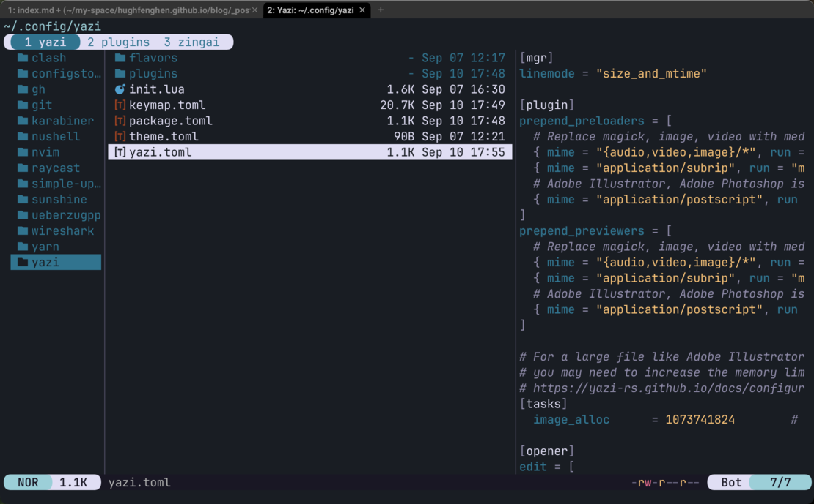
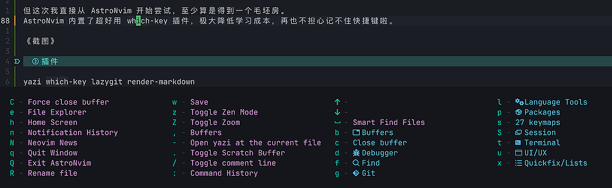
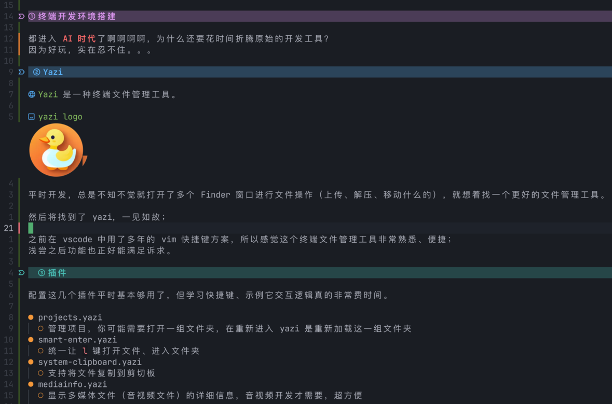

---
tags:
  - 工具
date: 2025-09-09
---

# 终端开发环境搭建

都进入 **AI 时代**了啊啊啊啊，为什么还要花时间折腾上古时代的开发工具？  
因为太好玩，实在忍不住。。。

## Yazi

[Yazi](https://yazi-rs.github.io/) 是一个终端文件管理工具，这是它的 logo。


平时总是不知不觉就打开了多个 Finder 窗口进行文件操作，就想着找一个更好的文件管理工具。  

然后就找到了 yazi，一见如故；



之前在 vscode 中用了多年的 vim 快捷键方案，所以感觉这个终端文件管理工具非常熟悉、便捷；  
浅尝之后功能也正好能满足诉求。  

### 插件

配置这几个插件平时基本够用了，学习快捷键、适应它的交互逻辑还是挺非常费时间。

- **projects**  
  - 管理项目，你可能需要打开一组文件夹，在重新进入 yazi 时重新加载这一组文件夹 
- **smart-enter**
  - 统一让 `l` 键打开文件、进入文件夹
- **system-clipboard**
  - 支持将文件复制到剪切板
- **mediainfo**
  - 显示多媒体文件（音视频文件）的详细信息，音视频开发才需要，超方便

插件地址安装方法在 [yazi resource](https://yazi-rs.github.io/docs/resources) 中，我还特意为 Yazi 写了一个[图片压缩](https://github.com/hughfenghen/image-minify.yazi)插件 :P

### 额外配置

- 显示更新时间、文件大小
  - line mode (快捷键 m) 可以切换显示不同的信息，但我希望同时显示时间、大小
  - 在 `init.lua` 扩展一种行模式，在 `yazi.toml` 中配置
  ```lua
  -- init.lua
  function Linemode:size_and_mtime()
	  local time = math.floor(self._file.cha.mtime or 0)
	  if time == 0 then
		  time = ""
	  elseif os.date("%Y", time) == os.date("%Y") then
		  time = os.date("%b %d %H:%M", time)
	  else
		  time = os.date("%b %d  %Y", time)
	  end

	  local size = self._file:size()
	  return string.format("%s %s", size and ya.readable_size(size) or "-", time)
  end
  -- yazi.toml
  [mgr]
  linemode = "size_and_mtime"

  -- 文本编辑使用 nvim 打开
  [opener]
  edit = [
	  { run = 'nvim "$@"', block = true, for = "unix" },
  ]
  ```

## NeoVim

[NeoVim](https://neovim.io/) 是一个现代化的 Vim 编辑器，保留了 Vim 的模态编辑交互，持续引入新特性。


`yazi` 的纯键盘文件管理太过丝滑流畅了，查看文档时不小心看到 `yazi.nvim` 插件；  
想到在 VSCode 中从编码切换到文件管理，总是去操作侧边栏；  
顿悟：应该可以把编码跟文件管理的交互统一起来！

之前尝试过几次 NeoVim，每次启动只有一个空荡荡的启动页，没有文件树、没有搜索替换这些基础 UI，毛坯房都算不上，顶多算个房子框架；  
所以每次浅尝就放弃了，实在懒得去折腾。

但这次我直接从 AstroNvim 开始尝试，至少算是得到一个毛坯房。  
AstroNvim 内置了超好用 which-key 插件，极大降低学习成本，再也不担心记不住快捷键啦。



### 插件

yazi which-key lazygit render-markdown

- **AstroNvim**
  - 初始插件集合
- **auto-session**
  - 启动 nvim 时自动恢复关闭时的标签/buffer
- **flash**
  - 快速移动光标，类似 easy-motion
- **formatter**
  - 格式化
- **grug-far**
  - 全局搜索替换
- **heirline**
  - 标签栏控制，我用来隐藏标签栏
- **im-select**
  - 【必备】自动切换中英文输入法
- **markdown**
  - 快捷操作 Markdown
- **multicursor**
  - 多光标批量编辑操作
- **render-markdown**
  - 在编辑器中渲染 Markdown，超级漂亮
  - 建议给插件额外配置加粗、斜体高亮
  ```lua
    return {
    "MeanderingProgrammer/render-markdown.nvim",
    dependencies = { "nvim-treesitter/nvim-treesitter", "nvim-mini/mini.icons" },
    ft = { "markdown" },
    config = function()
      ------------ markdown style ------------
      -- 红色加粗 bold = true,
      vim.api.nvim_set_hl(0, "@markup.strong", { fg = "#ff6b6b", bold = true })
      -- 青色斜体
      vim.api.nvim_set_hl(0, "@markup.italic", { fg = "#4ecdc4", italic = true })
      -- 灰色删除线
      vim.api.nvim_set_hl(0, "@markup.strikethrough", { fg = "#95a5a6", strikethrough = true })
      ------------ markdown style ------------

      -- 初始化插件，使用最基本的配置
      require("render-markdown").setup {}
    end,
  }
  ```
- **search-replace**
  - 单文件搜索替换
- **yazi**
  - 文件管理，建议禁用内置的 `neo-tree` 插件 
- **lazygit**
  - Git 操作，插件已经内置需要独立安装 `lazygit` 命令行

### 额外配置

```lua
-- 自动保存
vim.o.autowriteall = true

-- 自定义快捷键
vim.api.nvim_set_keymap("n", "<S-Tab>", ":bprev<CR>", { noremap = true })
vim.api.nvim_set_keymap("n", "<Tab>", ":bnext<CR>", { noremap = true })
vim.keymap.set("n", "<Enter>", "o<Esc>", { noremap = true, silent = true, desc = "插入新行" })
vim.keymap.set("n", "<S-Enter>", "i<Enter><Esc>", { noremap = true, silent = true, desc = "从当前光标断行" })
vim.keymap.set("t", "<Esc>", [[<C-\><C-n>]])
```

## WezTerm

本来打算继续在 Warp 中运行这一套终端环境，但 Warp 显然不只想做一个终端工具，近期更新集成了大量的 AI 和编辑器功能，导致界面非常冗余，某些元素还无法隐藏；  
最终选择了界面简洁、清爽的 [WezTerm](https://wezterm.org/index.html)。


### 配置

WezTerm 的配置文件路径 `~/.wezterm.lua`

```lua
local wezterm = require("wezterm")

local config = {}
config.term = "wezterm"

-- 一定要先安装 JetBrainsMono Nerd Font 字体
-- 配置 fallback "PingFang SC" 也是必要的，否则默认字体无法显示中文斜体、加粗、删除样式
config.font = wezterm.font_with_fallback({
	"JetBrainsMono Nerd Font",
	"PingFang SC",
})

config.font_size = 16.0 -- 默认字号为 12.0 :contentReference[oaicite:0]{index=0}

-- 隐藏顶部的 title bar 让界面更加简洁
config.window_decorations = "RESIZE"

-- 背景设置，让窗口不那么“黑”，看起来有点“高级灰”的效果
config.colors = { background = "#191D23" }

-- 重新设置边距，默认的太宽了
config.window_padding = {
	left = 10,
	right = 2,
	top = 0,
	bottom = 0, -- 目前没办法彻底移除底边距，只能忍
}

-- 让 option + left/right 可以跳跃单词
config.keys = {
	{ key = "LeftArrow", mods = "OPT", action = wezterm.action({ SendString = "\x1bb" }) },
	{ key = "RightArrow", mods = "OPT", action = wezterm.action({ SendString = "\x1bf" }) },
}

return config
```

### 问题

- 不显示斜体、加粗、删除样式
  - 安装并配置字体，字体规格要包含有粗体、斜体
    - 推荐访问 [download nerdfonts](https://www.nerdfonts.com/font-downloads) 然后搜索 `JetBrainsMono Nerd Font`
  - 使用 `font_with_fallback` 配置回退字体，回退字体选择一个包含中文粗体、斜体的字体，否则中文样式显示不全
- option + 方向键无法跳跃词汇
  ```base
  infocmp -1x tmux-256color > tmux-256color.info
  echo "        smxx=\E[9m," >> tmux-256color.info
  echo "        rmxx=\E[29m," >> tmux-256color.info
  tic -x tmux-256color.info
  infocmp -1x tmux-256color | grep -E 'infocmp|smxx|rmxx'
  rm tmux-256color.info
  ```
- 无法移除底部边距，暂无法解决
  - [关注 issue](https://github.com/wezterm/wezterm/issues/7113)

## 最后

虽然 VSCode + Vim 方案键盘能完成大部分编辑操作，但基于 GUI 的交互设计总是不可避免地要使用鼠标；  
全键盘完成所有操作（编码、git、文件管理）是真的丝滑，目前只剩下 Web 开发的 chrome 调试环节不得不使用鼠标，就真的没办法了。  

另外，没想到在终端绑定（CMD Option）快捷键这么麻烦，
最终选择先放弃原有的快捷键习惯，将空格作为 `<leader>` 然后在配合字符键也挺不错，键盘方案终于也跨平台了 :P

这套方案实在没什么吹的，特别是 AI 时代手动编写代码占比只会越来越少，配置终端环境很可能算是"**没苦硬吃**"。。。  
对我来说，花时间折腾这些工具，解决碰到各种问题、探索各种可能性，有点上头像玩游戏一样解压。
可能是最近开发压力太大了。 🐶

既然都切换到终端开发环境了，是不是该试试在 Android 手机中写代码，这样外出异地就不用带电脑了？  
还是先消停下，后面有空再折腾吧，这次“浪费”的时间太多了。 🐶

*PS：NeoVim render-markdown 插件渲染效果真漂亮*




