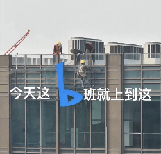
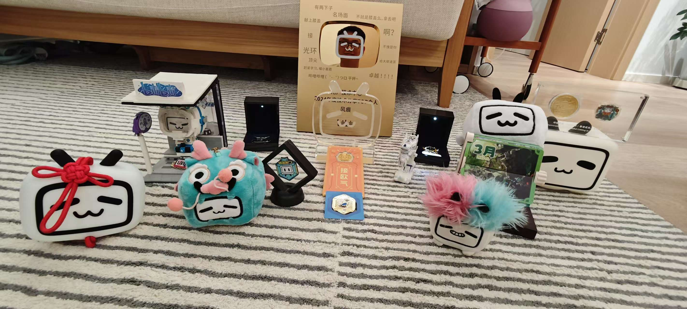

# 2025 裸辞计划

_大家好，我是风痕，在我的[博客首页](https://fenghen.me)可以看到我的一些个人信息。_

去年初发了一篇文章[2024，做个“前端网红”吧][3]，回顾 2024 我的博客、公众号、开源项目热度有一点提升，但显然还不够“红”，可能大概也许是被这个 “B 班”给耽误了吧 [doge]。

不得不说阿 B 的文化生活还是非常丰富的，我几乎不主动参加活动也能被动收到这么多纪念品。

鉴于去年 2024 的文章中的照骗引流效果不错，所以我特意用 AI 将照片中人脸朝向修正了再放到这里，不得不说 AI 对自然语言理解能力还是很强的：)

当然，最终图片效果还得看 OpenAI，非常自然，虽然跟本人不太像。

## 接下来

可能是自我上学前班以来最漫长的“假期”，具体多久看天意，因为我并不打算在假期完全躺平放空，而是尝试一些想做的事情，同时看看 AI 方向的机会。

如果你有匹配的工作岗位，也欢迎推荐给我，我的意向是  
地点：远程/上海；方向：AI + Web 音视频/工程效率

联系方式：邮箱 `hughfenghen@gmail.com` 微信号 `liujun_fenghen`。

[_商务合作(帅气博主在线接单)_](https://fenghen.me/posts/2025/04/11/business-cooperation/)

## 输出形式

前不久在我的博客更新了一篇文章 [AI 媒介将如何重塑人类社会（风痕、Claude 访谈记录）][4]。

我深信 AI 将像互联网一样深度改造各个行业，作为社会个体只能积极拥抱 AI，但同时也应提前思考个人该如何回应 AI。

以前我对外的主要输出方式是在博客发布文章，但免费开放的个人博客可能在 AI 时代存在危险，因为 AI 会截胡用户，文章会失去读者，特别是技术知识型文章。

未来 AI 会协助人们快速解决问题，而人们不会关心 AI 的知识来自哪里，技术博客将成为 AI 进步的养料，文章-读者将被 AI 隔离开。

也许未来技术知识博主，会像现在的开源项目对抗云厂商一样，去对抗大模型公司。

就我个人来说，准备会尝试直播、视频这种直接面向观众的形式；说实话我自己也没什么信心，但欲成网红，总得试试。  
视频内容会先发布到我的 [哔哩哔哩账号][5]。

万万没有想到，从不看直播的我在五年前进了直播团队，却在离职之后才准备开直播；  
从不剪视频的我在视频公司中开源了一个视频剪辑项目，却在离职后准备投稿视频了；  
生活真是幽默，如果我尝试视频失败了，那只能说 —— 活该。

## 输出内容

### WebAV-Pro

首先我会尝试 [WebAV-Pro][2] 项目，这是基于 WebAV 的商业版 SDK，如果你对 Web 平台视频处理有好的想法建议、合作诉求，欢迎联系我。

当然，我会继续维护开源且免费的、提供基础能力的 [WebAV][1] 项目。

在找到合适的岗位或创业项目之前，我希望该项目能带来一些收益，补贴家用。

### Web 先进工艺及应用

近些年 Web 发展很快，而且倾向于开放偏底层的能力，如 WASM、WebGPU、WebCodecs、OPFS 等等；  
单看某个 API 可能会觉得它们在各自领域有些作用，但相对 Native 方案又总差点意思，且在上层应用方面推广得比较慢，让人不仅担心它们的应用潜力。

诚然，我们应该认识到 Web 技术的弱点，也应该看到 Web 平台优势（低成本、便捷性）。

我认为目前的 Web 技术已经拥有构建更复杂产品和工具的能力，绝不只是表单提交与信息呈现这样的简单交互。  
所以我打算介绍一些实用的底层 API，和一些案例的实现原理，让它们被更多的前端开发者了解到。

可能涉及的内容如下，如果你也感兴趣可以通过[这些途径][6]关注我。

- 基础 API：WebGPU、WASM、OPFS、WebCodecs、Workerlet、WebNN、ServiceWorker、WebTransport、跨页面通信
- 案例：WebContainer、WebAV、性能压力检测、后台保活、“量子纠缠“、网页 PPT、多人协同富文本编辑、机器学习

### 独立游戏

一个独立游戏，或一本书，或是游戏 + 书，大概是关于《平面国》跟二向箔的故事。

没有 AI 的时候都不敢想，因为跟我的专业跨度实在太大了。

这部分工作很可能不会在 2025 启动，就当是个人自我实现，先写在这里立个 flag 吧，等解决温饱问题再说。

## 离职原因

对当前工作稍感倦怠，有太多想法想去尝试，也不想错过已来的 AI 时代。

虽然对当前工作岗位比较满意，但实在难以抑制躁动不安的内心，何不逐风而行呢。

好风凭借力，送我上青云～

## 附录

- [2024，做个“前端网红”吧][3]
- [AI 媒介将如何重塑人类社会（风痕、Claude 访谈记录）][4]
- [WebAV][1]， [WebAV-Pro][2]
- [关注我的途径][6]

[1]: https://github.com/WebAV-Tech/WebAV
[2]: https://github.com/WebAV-Tech/WebAV-Pro
[3]: https://fenghen.me/posts/2024/01/01/wechat-subscribe/
[4]: https://fenghen.me/posts/2025/03/12/how-ai-media-will-reshaping-human-society/
[5]: https://space.bilibili.com/386916237
[6]: https://fenghen.me/subscribe.html
