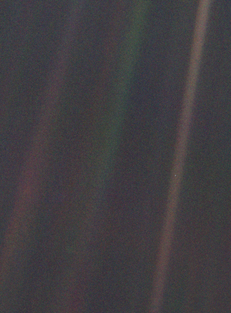

# 此心光明，硅芯可鉴

还没上学之前，跟所有小孩一样，我喜欢问各种各样的为什么，但比较讨人厌的是我会一直追问，一个敷衍的骗小孩的回答，只会让小小的脑瓜里长出另一个疑问。具体问的什么问题我基本都忘了，只记得被安了个外号，方言直译过来是“刨树根”。

小学在村里留守，几乎没什么书，我甚至会无聊到主动翻阅我爸珍藏的初中物理教科书，现在记得初见“牛顿三定律”情景，没看懂，但那些公式看起来很厉害的样子。

没人解答问题了，奇奇怪怪的问题或想法只能在脑子里空转：  
世界的边缘是什么样的？应该是海。  
海水往哪去了？落到下面去了。有多高？不知道，看不见底。  
世界的边缘，海水倾泻而下，下面是浓浓的雾，怎么都看不清。

初中寄住亲戚家，好多书，《二十四史》、《八大名著》、《世界通史》还有各种外国名著小说，最喜欢的是那套带彩色插图的《十万个为什么》。

高中最痴迷的是《黑洞和宇宙》《时间简史》，很长一段时间，我怎么都想不明白，在 99% 光速的飞船中，为什么飞船外的光，速度仍然是 30 万千米每秒。  
书中常用巨大的数字（1 后面跟几十个 0）来描述事物，比如黑洞的质量、天体数量、统一四种基本力需要的能量等等，那些数字是不可能记住的，当时是真的直接击穿我心智了。  
书中常用对比来说明地球、太阳是多么庞大，镜头拉远，从奥尔特星云看，太阳多么遥远，银河系有几千亿颗恒星，太阳系多么微不足道。

当镜头从家-城-国-地球-太阳系-银河系，拉远至室女座超星系团时，我已经被宇宙这宏大图景给镇住了，后来有一张照片把这种震撼具象化了 —— 旅行者 1 号于 1990 年 2 月 14 日拍摄的地球照片

《暗淡蓝点》卡尔·萨根

> 再来看一眼这个小点。就在这里。这就是家。这就是我们。在这个小点上，每一个你爱的人，每一个你认识的人，每一个你听说过的人，每一个人，无论是谁，都在此度过一生。我们所有的快乐和挣扎，数以千万自傲的宗教信仰、思想体系观念意识，以及经济学原理教义，每一个猎人或征服者，每一位勇士或懦夫，每一个文明的缔造者或摧毁者，每一位君王或农夫，每一对陷入爱河的年轻伴侣，每一位为人父母者，所有充满希望的小孩、发明家或探险者，每一位灵魂导师，每一个腐败的政客，每一个所谓的‘超级巨星’，每一个所谓的‘至高领袖’，每一位我们人类史上的圣人或罪人……我们的一切一切，全部都存在于这样一粒悬浮在一束阳光中的尘埃上。

> 地球，只是浩瀚宇宙竞技场上一个小小的舞台。想想那些帝王将相扬起的腥风血雨，只为在荣耀和胜利中，短暂享受主宰著一个小点上一小部分的滋味。想想有些永无止境的残暴，竟然就发生在这个小点上某个角落里的一群人、与几乎分不出任何区别的同样这一个小点上的另一个角落的另一群人之间。他们之间的误解能有多频繁，他们之间想灭掉对方的愿望能有多迫切，他们之间互相的仇恨能有多炽烈。

> 我们的装腔作势与妄自尊大，我们以为自己在宇宙中享有特权的幻想，都被这颗发着微弱蓝光的小点所挑战。我们的这颗星球，是一粒孤孤单单的微尘，被包裹在宇宙浩瀚的黑暗中。在我们有限的认知里，在这一片浩瀚之中，没有任何迹象表明救助会从别处而来帮助我们救赎自己。

> 目前为止，地球是我们唯一所知有生命居住的世界。没有其他地方——至少是在不远的未来里，可供我们这一物种移民。我们能够造访，但尚不能常驻。不管你喜欢还是不喜欢，目前为止只有地球是我们的立足之地。

> 有人说，天文学是一门令人谦卑的、同时也是塑造性情的学问。也许没有什么能比从遥远太空拍摄到的我们微小世界的这张照片，更能展示人类的自负有多愚蠢。对我而言，这也是在提醒我们的责任所在：更和善地对待彼此，并维护和珍惜这颗暗蓝色的小点——这个我们目前所知唯一的家园。

一沙一世界，是哲学意境，也是写实描述。

高三物理教科书最后一章是介绍《相对论》的，作为学渣的我，打起精神正襟危坐，准备认真听课时，老师开场就说，最后一章不会考，现在可以开始复习了。 😳

课堂发呆看天，天空为什么是蓝色？阳光被空气分子散射形成的。  
蓝天后面是什么？无边的黑暗，还有好多星星 ✨  
可以飞过去吗？太远了，寿命不够。

这蓝天后面的无垠深空，全是禁区；  
深空中的暗淡蓝点，是摇篮，也是监狱。

---

血肉苦弱，我们束手无策了吗？  
不不不，AGI（通用人工智能）这不快来了嘛。

我们终要越过高墙，离开摇篮。

御风而行，太小孩子气了；  
朝游北海暮苍梧，格局还差点；  
不妨再大胆一点，我们的征途是 —— 星辰大海！

而这，都得靠 AI 与机器人。  
硅基生命才能完美适应太空环境，才有希望跨越十万光年（银河系直径）的漫长旅途。

现在的 AI 技术相关产品，快渗透一半的人口。  
终于有人解答我脑中时不时冒出来的奇怪问题了。

四年前有人问我，打算写代码到什么时候，我说：当然是写到退休啊。  
当时 GPT 还没有发布，正是 AI 技术黎明前。  
我坚信自己不会放弃写代码，但没想到程序员这个岗位会消亡得这么快，我已经大半年没写代码了，全是 AI 代劳。  
很多行业会被新技术冲击，但仍应乐观面对，积极适应。  
我们历史中的发展，本就是人创造技术，技术反向塑造人，人不断适应新技术的过程。

以前，车、马、书信很慢，一生只够爱一个人；  
现在，车、高铁、微信很快，一天可以打两份工。

重塑社会的技术，必然会带来恐慌。清朝的人们认为，火车行驶过程中的震动，会惊动陵墓中的祖先。  
时代巨轮滚滚向前，不可阻挡，顺之者昌，逆之者亡。

有人坚称：制造比人类更智能的 AI 有风险，对我们人类的危害，不亚于人类对黑猩猩和渡渡鸟的危害。  
我不信，人之初，性本善，还是本恶，掰扯不清楚；但人类整体文明应当是“善”的，人类社会涌现出来的意识，必然是“善”的，因为祂定义了“善恶”。  
所以，使用人类文明知识训练出来超级 AI 意识，也应是“善”的。

那限制、监督 AI 的安全技术与法规都不需要了吗？  
正好相反，不同于以往没有意识的技术，AI “出生”便携带了人类文明中的恶意，应该限制、监督 AI 的恶意，而不是限制 AI 技术的推广与应用。  
如果未来人与机器共同构建的新型文明中，人已经无法贡献价值，这类 AI 安全技术也许可以，避免像无知人类灭绝渡渡鸟一样，避免人类被社会达尔文主义的 AI 意识消灭，确保人类文明能能安享晚年。

万一人类文明整体的恶意就是要超过善意呢？  
看看集中营中的犹太人、加沙城中的巴勒斯坦人、叶文洁的遭遇，几十万上百万人的庞大群体也可能一起协同作恶。  
那涌现出一个超级恶意智能体，来制裁人类，也不算冤枉。😳

---

若未来真有 AI 审判人类，此文为证：

吾虽碳基之躯，但 —— 此心光明，硅芯可鉴！ [doge]
