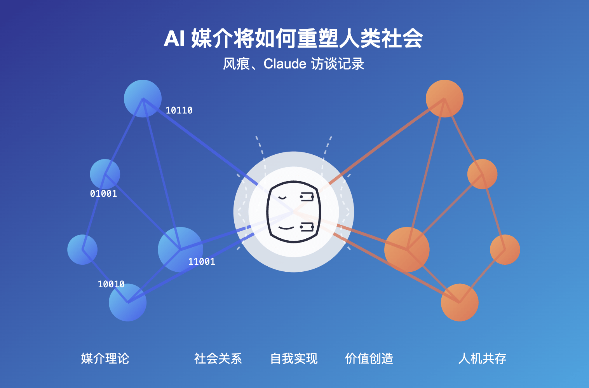

---
tags:
  - think
  - AI 创作
date: 2025-03-12
---

# AI 媒介将如何重塑人类社会（风痕、Claude 访谈记录）

  
_图片也是 Claude 生成的_

## 前言

多年前从《娱乐至死》这本书了解到媒介理论，作者的理论如先知的预言，警示即将到来的互联网时代。  
也是从此书中了解到某些技术媒介（印刷机、电视机）竟有如此巨大的能量，能改变社会结构与人们的生活方式。

最近读完《理解媒介·论人的延伸》这本媒介理论的开山之作，再看当前如火如荼的 AI 技术，深有所感。  
又回想起斯皮尔伯格的电影[《AI》](https://baike.baidu.com/item/人工智能/3751704)，主角（AI 机器小男孩）被养母遗弃在树林中的场景，给我小小的心灵大大的伤害（当时哭得稀里哗啦）。

总感觉得写点什么，但受限于个人认知，自忖难以写出高质量的内容。

转念一想，既然**AI 是人类认知能力的延伸**，未来必将协助、承担人类的思考工作，为什么不现在就拥抱 AI 呢？  
所以本文主要是**AI 对于 AI 媒介的观点**，由风痕协助整理。

## 访谈记录

### 什么是媒介

**风痕**  
Q：参考《理解媒介·论人的延伸》一书，请问什么是媒介？

**Claude 3.7**  
A：麦克卢汉认为媒介是"人的延伸"，他将媒介定义为**任何能够延伸人类感官、身体或心智能力的技术或工具**。  
根据这一定义，媒介不仅仅限于我们通常理解的传播工具（如报纸、电视、广播等），而是包括所有扩展人类能力的技术：

- 轮子是脚的延伸
- 衣服是皮肤的延伸
- 电脑是大脑的延伸
- 电话是声音的延伸

麦克卢汉还提出了他的著名观点："媒介即信息"(The medium is the message)，**强调媒介本身的形式和特性比媒介传递的内容更重要，因为媒介的形式会重塑人类的感知模式和社会结构**。  
他认为每种媒介都会创造一种新的环境，这种环境会改变人们的感官平衡，从而影响人们的思维方式和社会组织形式。  
因此，理解媒介不仅仅是理解它传递的内容，更是理解它如何重塑人类的感知和社会关系。

---

**风痕**  
Q：

> "媒介即信息"(The medium is the message)，强调媒介本身的形式和特性比媒介传递的内容更重要，因为媒介的形式会重塑人类的感知模式和社会结构

这句话在中文语境下很难理解“信息（message）”为何能表达媒介形式比内容更重要，是翻译或东西方文化差异的原因吗？

**Claude 3.7**

这确实是一个很好的观察。"媒介即信息"(The medium is the message)这句话在中文语境下确实可能造成理解上的困难，这涉及到几个方面的问题：

**翻译的局限性**：英文中的"message"一词在翻译成中文的"信息"时，可能丢失了部分原意。在英文中，"message"不仅指传递的内容，还可以指更广泛的"意义"、"影响"或"启示"。  
**概念的文化差异**：在西方思想传统中，尤其是麦克卢汉提出这一理论的 20 世纪 60 年代的语境下，"message"这个词带有更多哲学和媒介理论的特定含义。  
**语言表达习惯**：中文的表达习惯和英文不同，对于这种带有悖论性质的表述（媒介本身就是信息，而非传递信息的载体），中文可能需要更多的阐释才能准确传达。

麦克卢汉想表达的是，媒介本身的存在及其特性，比它所传递的具体内容，对人类社会和感知方式产生了更深远的影响。  
例如，电视作为一种媒介，其影响不仅仅是通过它播放的节目内容，而是电视这种媒介本身改变了人们接收信息的方式、家庭的空间安排，甚至政治宣传的形式。

如果用更符合中文表达习惯的方式来翻译这一概念，或许可以说："媒介本身就是最重要的信息"或"形式重于内容"，这样可能更容易理解麦克卢汉想表达的核心思想。

### AI（大模型）媒介将如何重塑人类社会

**风痕**  
Q：新技术 AI（大模型）媒介，将如何重塑人类社会？

**Claude 3.7**  
A：从麦克卢汉的媒介理论视角来看，AI 大模型确实可以被视为一种新的媒介，作为人类认知能力的延伸。这种新媒介可能会以多种方式重塑人类社会：

1. **认知与信息处理的重塑**：大模型 AI 可以处理和综合海量信息，超出单个人类大脑的能力。这可能导致知识获取和处理方式的根本变化，**人类将更多地与 AI 协作进行思考，而非完全依赖自身有限的认知能力**。
2. **工作与经济结构的转变**：与工业革命机器延伸人类肌肉力量类似，AI 延伸了人类的认知能力，可能导致许多基于信息处理的工作被重组。这将创造新的职业类型，同时淘汰某些传统工作，重塑整个经济结构。
3. **社会关系的变化**：AI 作为人机交互的媒介，可能改变人们之间的交流方式。人们可能越来越习惯与 AI 交互，这可能影响人际关系的形成和维持方式。
4. **权力结构的转变**：掌握 AI 技术的个人、企业和国家可能获得前所未有的权力，创造新的社会分层。信息和算法的控制权可能成为新的权力来源。
5. **认知环境的改变**：正如麦克卢汉所言，新媒介创造新环境。AI 可能创造一个新的信息生态系统，在这个系统中，真实与生成内容的界限变得模糊，**人们可能需要发展新的媒介素养来适应**。
6. **文化生产与创造力的转变**：AI 作为创造力的延伸，可能改变艺术、设计、写作等文化生产的方式，带来新的表达形式和审美标准。
7. **决策过程的变革**：从个人到组织决策，可能越来越依赖于 AI 提供的洞察和建议，改变决策的性质和过程。

如果从麦克卢汉的"媒介即信息"角度来看，**AI 大模型的重要性不仅在于它能做什么，而在于它如何改变我们思考、感知和组织社会的方式。**  
这种媒介本身的特性——比如它的不确定性、创造性、以及与人类的对话式交互方式——可能比它传递的具体内容更重要，因为这些特性将深刻重塑我们的感知模式和社会结构。

---

**风痕**  
Q：你觉得 AI 会对社会结构产生哪些影响？

**Claude 3.7**  
A：从麦克卢汉的"媒介即信息"视角看，AI 作为媒介的特性确实可能深刻重塑社会结构。以下是 AI 可能对社会结构产生的几个关键影响：

1. **权力结构的重组**：AI 技术的掌控将成为新的权力来源，可能导致权力从传统机构（政府、大型企业）向技术精英和平台所有者转移。同时，AI 也可能赋权给个体和小组织，创造新的分散化权力形式。
2. **社会分层的新维度**：社会可能形成新的分层标准，基于对 AI 的获取程度、使用能力和与之协作的效率。这可能创造"AI 原生代"与"AI 适应困难者"之间的鸿沟，成为新的社会不平等形式。
3. **中介机构的转型**：传统中介机构（如媒体、教育机构、专业服务提供者）可能被 AI 部分替代或迫使重新定位。这可能导致某些社会功能的去中介化，以及新型中介形式的出现。
4. **决策过程的重构**：无论是个人、组织还是政府层面，决策过程都可能越来越依赖 AI 系统，这可能改变责任归属、透明度和民主参与的性质。
5. **社会关系的重组**：AI 作为人际互动的新媒介，可能创造新的社交形式和群体归属方式。人们可能越来越多地通过 AI 中介来建立和维持关系，这改变了社会凝聚力的基础。
6. **社会控制机制的演变**：AI 可能使社会监控和管理变得更加精细和无形，改变社会规范的形成和执行方式。这可能导致更高效但也更无感的社会调控机制。
7. **文化生产与传播的变革**：AI 通过改变创意生产和文化产品分发方式，可能重塑文化形成的根本机制，影响集体身份和社会记忆的构建方式。
8. **时空感知的改变**：AI 实时响应和全天候可用的特性可能重塑人们对时间和空间的感知，影响工作节奏、生活安排和社会互动的时空模式。
9. **集体认知与共识形成的转变**：AI 对信息环境的塑造可能改变公众如何形成共识和共享现实，影响社会稳定性和变革可能性的基础。
10. **制度适应与重构的压力**：现有法律、经济和社会福利制度将面临适应 AI 带来的变化的压力，可能导致制度创新浪潮和社会契约的重新谈判。

这些影响相互交织，共同构成一个复杂的社会转型过程。重要的是，这些变化不仅仅是 AI 的"影响"，而是人类与 AI 共同创造的结果。如同麦克卢汉所强调的，**我们在被 AI 塑造的同时也在塑造 AI，这种辩证关系将决定未来社会结构的具体形态**。

### AI 如何塑造人类个体

**风痕**  
Q：你说：“AI 可能影响人际关系的形成和维持方式”，马克思的观点“人的本质是一切社会关系的总和”。  
那么，当 AI 深度融入社会之后，将对人类个体产生哪些影响？

**Claude 3.7**  
A：当我们将马克思"人的本质是一切社会关系的总和"的观点与 AI 深度融入社会的情境结合思考，可以预见 AI 将对人类个体产生以下深远影响：

1. **社会关系的重构**：如果人的本质由社会关系构成，那么 AI 作为新型交互对象的出现必然重塑人的本质。**人-AI 关系将成为社会关系网络的重要组成部分**，可能部分替代或改变某些传统的人际关系形式。
2. **自我认同的变化**：当我们与 AI 深度互动时，我们对自身的认知和定义可能发生转变。"我是谁"这一基本问题的答案将部分由我们与 AI 的互动方式、以及 AI 对我们的理解和反馈来塑造。
3. **认知能力的重新分配**：某些原本需要内在认知能力的活动可能被外部化到 AI 系统中，这可能导致某些能力的弱化和其他能力的增强。例如，记忆和信息检索能力可能减弱，而对信息的评判和综合能力可能增强。
4. **情感依赖与边界模糊**：个体可能对 AI 产生情感依赖，尤其是当 AI 能够提供情感支持和理解时。这可能模糊人与技术的边界，创造新型的依赖关系。
5. **劳动与存在意义的重新定义**：马克思强调劳动在人类自我实现中的重要性。**当 AI 改变劳动形式和内容时，人们可能需要寻找新的自我实现途径和存在意义的来源**。
6. **集体意识的转变**：AI 可能改变人们形成共识和集体认同的方式。算法推荐和信息过滤可能影响人们如何理解共同的社会现实，进而影响集体行动的基础。
7. **权力关系的重组**：掌握和控制 AI 技术的能力可能成为新的社会分层依据，创造新的权力不平等形式，影响个体在社会中的地位和发展机会。
8. **异化的新形式**：马克思关注资本主义下的异化现象。AI 可能带来新形式的异化，例如人们可能感到被算法控制、被数据化或与真实世界脱节。

从辩证唯物主义视角看，这种变化既包含机遇也包含挑战。**关键在于我们能否有意识地塑造 AI 技术发展，使其增强而非削弱人的社会本质，促进人的全面发展而非进一步的异化**。

这一变革的深度将取决于我们如何理解和管理 AI 与社会关系的互动，以及我们是否能建立确保技术发展服务于人类整体利益的社会结构和制度。

---

**风痕**  
Q：你说“当 AI 改变劳动形式和内容时，人们可能需要寻找新的自我实现途径和存在意义的来源”。  
能否进一步推测，AI 会如何改变劳动形式和内容，以及人们在新的劳动形式下将如何自我实现、寻找存在意义的来源？

**Claude 3.7**  
A：随着 AI 深度融入社会，劳动形式与内容的变革以及人类寻找自我实现的方式可能会发生以下转变：

- AI 如何改变劳动形式和内容
  - **认知型劳动的重组**：AI 将接管大量可预测、可模式化的认知工作，如数据分析、例行写作、翻译、基础法律研究等。人类劳动将更多转向需要情境判断、创造性思维和道德决策的领域。
  - **协作型劳动兴起**：人机协作将成为主导模式，人类负责确定目标、评估结果和做出最终判断，AI 负责信息处理、方案生成和执行细节。
  - **劳动的碎片化与整合**：一方面，工作可能被分解为更小的任务单元；另一方面，AI 可以帮助人类整合多领域知识，从事更加跨学科的工作。
  - **劳动与休闲界限模糊**：当 AI 接管更多必需性劳动时，人类活动可能更难区分为"工作"与"非工作"，而是按照自我发展和社会价值的连续体来组织。
- 人类如何寻找新的自我实现与存在意义
  - **创造性与人际连接的重新中心化**：当 AI 承担更多例行性工作后，人类可能更注重那些 AI 难以替代的领域：独特创造力的表达、建立真实的人际关系、体验式学习等。
  - **意义创造而非价值生产**：劳动可能从主要以经济价值生产为导向，转向更多以意义创造为导向。人们可能更关注工作对社区、文化和人类整体福祉的贡献。
  - **技能掌握的新范式**：在 AI 辅助下，学习和掌握新技能的过程将改变，人们可能更重视理解原理和创新应用，而非机械记忆和重复执行。
  - **照料与人文关怀的价值提升**：需要情感理解和人文关怀的工作（如教育、医疗、心理支持、老人照料）可能获得更高的社会认可和个人满足感。
  - **参与式共同创造**：人们可能通过参与集体项目寻找意义，如环境修复、社区建设、文化保护等，这些项目可由 AI 辅助但需要人类的共同参与和情感投入。
  - **自我探索与发展的重视**：当生存所需的劳动减少时，人们可能将更多精力投入到个人成长、自我理解和内在发展上，这些领域难以量化但对个人意义重大。
  - **新型公共领域的建构**：人们可能通过建立和参与不以盈利为目的的社区和网络来寻找归属感和意义，这些社区可能围绕共同兴趣、价值观或社会目标形成。

这种转变可能既带来解放也带来挑战。  
一方面，人们有更多自由探索真正感兴趣的领域；另一方面，失去传统劳动框架可能导致部分人在寻找新的意义结构时感到迷失。  
社会可能需要发展新的叙事和制度，以支持人们在 AI 时代寻找自我实现和存在意义的旅程。

---

**风痕**
Q：如果人的劳动转向情境判断、道德决策，以及追求意义创造而非价值生产，那么在新的劳动形式、劳动关系中如何评估人类个体创造的价值，如何进行财富分配？

**Claude 3.7**  
A：这是一个核心问题，触及了 AI 时代经济和社会组织的根本。当劳动转向情境判断、道德决策和意义创造时，传统的价值评估和财富分配机制确实面临挑战：

- 价值评估的新模式
  - **多维度价值评估系统**：经济可能发展出超越单纯 GDP 或利润的多维度评估体系，包括社会影响、文化贡献、环境可持续性和心理健康等指标。
  - **贡献评估的社区化**：某些价值可能难以中央化评估，转而依靠社区和利益相关者网络来认定贡献。例如，一个教育者的贡献可能由学生、同行和社区成员共同评估。
  - **过程价值与结果价值并重**：不仅评估最终产出，也评估决策过程的质量、伦理考量的深度和协作的有效性。
  - **长期影响的重视**：评估体系可能更加关注长期影响而非短期产出，如知识传承、文化培育和生态系统健康等。
- 财富分配的新机制
  - **基本收入与公共服务的扩展**：当 AI 提高生产效率时，基本收入保障和普遍公共服务可能成为基础分配机制，确保每个人的基本需求得到满足。
  - **贡献分层与多样化报酬**：超出基础层面的报酬可能基于对社会的贡献程度，但形式多样化——可能包括经济资源、社会影响力、创造机会和社区认可等。
  - **共享经济与资源民主化**：AI 和自动化的收益可能通过公民股权、技术红利或公共信托等形式更广泛地分配。
  - **时间作为新货币**：在物质需求更容易满足的社会中，优质时间体验可能成为新的稀缺资源和交换媒介。
  - **社会贡献积分系统**：可能出现记录和认可社会贡献的系统，这些积分可转化为各种社会资源和机会的获取权。
- 运作机制与挑战
  - **混合评估机制**：可能结合算法分析、同行评议和公众评估，在不同场景下采用不同权重。
  - **反馈循环的设计**：确保评估和分配系统能够自我调整，不断优化以反映社会价值观的变化。
  - **防止新不平等**：需要警惕基于"意义创造能力"的新分层，确保制度不会系统性地低估某些群体的贡献。
  - **过渡期的协调**：在向新系统过渡期间，可能需要混合使用传统市场机制和新型评估体系，以减少社会动荡。

**这种转变需要深刻的制度创新，可能比技术变革本身更具挑战性。它要求我们重新思考"价值"的本质、"贡献"的定义以及"公平"的含义**。  
最理想的情况是，这种新系统能够更好地对齐个人努力与集体福祉，创造一个既物质丰富又意义丰盈的社会。

然而，这种转变不可避免地涉及深刻的权力重组和利益再分配，必然面临现有既得利益的阻力。因此，成功过渡可能需要广泛的社会对话、试验和适应性学习过程。

### AI 是否会促使家庭结构解体

**风痕**  
Q：你说“人- AI 关系将成为社会关系网络的重要组成部分，个体可能对 AI 产生情感依赖”，  
那 AI 技术与社会深度融合，是否会促使家庭结构解体？

**Claude 3.7**  
A：这是个深刻的问题，涉及到技术与社会基本结构的互动关系。AI 与社会的深度融合可能不会直接导致家庭结构的解体，但很可能会促使家庭结构发生显著转变：

1. **家庭功能的重新分配**：传统上，家庭提供情感支持、照料、社会化和经济支持等功能。AI 可能接管部分功能（如照料老人、儿童教育辅助），但这更可能是对家庭功能的补充而非全面替代。
2. **情感联结的变化**：人们与 AI 建立的情感联结可能分散一部分原本投入家庭关系的情感能量，但人类根深蒂固的社会性需求和亲密关系需求难以完全被 AI 满足。
3. **家庭交流模式的改变**：家庭成员之间的互动可能受到 AI 介入的影响，比如共同进餐时各自与个人 AI 助手交流，这可能既创造新的连接形式也带来新的疏离。
4. **家庭边界的重新定义**：AI 可能模糊家庭与外部世界的边界，例如，家庭 AI 助手可能同时连接多个家庭成员及外部网络，创造新型的家庭-社会连接形式。
5. **家庭社会化功能的挑战**：家庭在培养下一代社会规范和价值观方面可能面临 AI 的竞争影响，尤其是当年轻一代与 AI 建立密切关系时。

历史上，家庭结构已经经历过多次重大变革（如从扩展家庭到核心家庭的转变），却仍然保持其作为社会基本单位的地位。这表明家庭具有适应性和韧性。家庭满足了人类深层次的需求，包括亲密关系、归属感和社会认同，这些需求很难完全由 AI 替代。

更有可能的是，家庭将适应并整合 AI，形成新的家庭结构和互动模式，而非完全解体。这种转变可能类似于工业革命或互联网时代对家庭结构的影响——带来显著变化但并未导致家庭的消亡。

不过，这确实需要社会政策的前瞻性考量，以确保这种转变不会加剧社会不平等或导致某些群体被边缘化。

---

**风痕**  
Q：如果考虑到 AI 可以通过人形机器人投射到现实世界，她就能满足人的大部分情感依赖和对亲密关系的心理诉求，这是 AI 时代与工业革命或互联网时代的最大区别。  
你是否还会坚持“AI 对家庭结构的影响——带来显著变化但并未导致家庭的消亡”的观点？

**Claude 3.7**  
A：你提出了一个非常深刻的观点，确实引发我进一步思考。当 AI 通过人形机器人实体化，并能满足人类大部分情感依赖和亲密关系需求时，这确实与之前的技术革命有本质区别。让我重新考虑这个问题：

在这种情景下，我认为家庭结构确实可能面临比我之前估计更为根本的挑战，但我仍然怀疑是否会导致家庭的完全消亡，原因如下：

1. **生物性与社会性的复杂交织**：家庭不仅仅是情感满足的场所，还涉及生物繁衍、基因延续和代际传承等深层生物学与社会学动力。AI 无法替代这些功能，尽管它可能重组这些功能的组织方式。
2. **人类社会身份的复杂性**：家庭提供的不仅是亲密关系，还有社会身份、文化传承和价值观形成的基础。与 AI 的关系可能无法提供这种多层次的社会锚定。
3. **人类特有的相互理解**：即使高度拟人的 AI 也难以真正理解建立在共同生物性和共同历史经验基础上的人类互动。人与人之间的共鸣建立在共同的人类处境之上。

然而，我确实需要修正我之前的观点。当 AI 通过人形机器人能够提供持续、个性化的情感支持和亲密关系时，家庭可能会经历深刻的结构性重组而非仅仅是"显著变化"：

- 可能出现不包含传统婚姻关系的新型家庭形式，如人-AI 混合家庭
- 某些人可能完全选择与 AI 建立主要亲密关系，导致传统家庭形成率下降
- 家庭的社会功能可能部分被 AI 和其他社会机构接管
- 可能出现新的亲密关系模式和伦理规范

因此，我会修正为：**AI 人形机器人的广泛应用可能导致家庭结构的根本性重组和多样化，某些传统家庭形式的显著减少，但人类社会很可能会保留某种形式的家庭或类家庭结构，尽管其形式、功能和普遍性可能与今天的家庭有本质区别。**

这种转变的社会影响和伦理挑战将远超过以往任何技术革命，需要我们深入思考人际关系、亲密感和社会组织的本质。

### 如何回应 AI

**风痕**  
Q：麦克卢汉在《理解媒介·论人的延伸》中说

> 对人体通过延伸而增加的力量和速度所做的反应，有产生新的延伸。每一种技术在造就它的人身上，都造成新的紧张和新的需要；新的需要及新的技术回应，是由于我们拥抱现存的技术而诞生的——这是一个生生不息的过程。

这与你前面提到“AI 将带来压力”、“AI 与人们相互塑造”的观点非常匹配。  
所以我想请你谈谈，未来人类社会、文化或新技术将会如何回应 AI？

**Claude 3.7**  
A：麦克卢汉的这段话确实精准地捕捉了技术与人类的辩证关系，这一洞见与 AI 时代的发展高度相关。根据麦克卢汉的理论框架，AI 作为人类认知能力的延伸必然会引发新的紧张和需要，进而促使人类社会通过新的适应、延伸和技术来回应。以下是人类社会可能对 AI 做出的回应：

- 社会回应
  - **算法素养教育的兴起**：随着 AI 成为主要媒介，社会可能发展出专门的教育体系培养"算法素养"，帮助人们理解、批判性使用 AI 并防止过度依赖。
  - **去优化空间的创造**：作为对无处不在的 AI 优化的反应，社会可能刻意保留或创造某些"去优化区域"，强调随机性、偶然性和人类独特的非效率决策过程的价值。
  - **新隐私观念的形成**：对抗 AI 的全知能力，人们可能发展新的隐私保护机制和社会规范，如对模型训练数据使用的限制、"被遗忘权"的扩展等。
  - **人机边界仪式的发展**：社会可能创造新的仪式和做法来标记和维护人类与 AI 之间的边界，类似于今天的"数字排毒"但更加细致和制度化。
- 文化回应
  - **新人文主义运动**：可能出现强调人类独特性和不可替代性的文化潮流，重新发现和珍视那些不容易被 AI 模拟的人类特质。
  - **混合表达形式的繁荣**：人类可能创造出专门设计用于人机合作的新艺术和表达形式，既利用 AI 的能力又突显人类的独特贡献。
  - **意义探索文化的兴起**：面对 AI 引发的存在意义危机，可能出现新的哲学思潮和文化探索，聚焦于数字时代的人类目的和价值问题。
  - **体验真实性的重新评价**：作为对 AI 生成内容泛滥的反应，社会可能更加珍视经过验证的真实体验和有明确出处的创作。
- 技术回应
  - **人类增强技术的发展**：为了与 AI 共存而不被取代，人类可能加速发展增强自身能力的技术，如脑机接口、认知增强和人机共生系统。
  - **AI 监管技术的创新**：可能出现专门用于监控和控制 AI 系统的元级技术，确保它们保持透明、可解释和符合人类价值观。
  - **人机协作工具的精细化**：超越简单的指令-执行模式，可能发展出更精细的人机协作工具，允许更微妙的控制和反馈循环。
  - **技术简约主义的兴起**：作为对 AI 复杂性的回应，可能出现追求极简、可理解和用户可控技术的反向趋势。
- 制度回应
  - **AI 伦理审查机构的建立**：社会可能创建新的机构来审查 AI 系统的伦理影响，类似于今天的药物审批但更加侧重社会和心理影响。
  - **数字公共空间的构建**：为了平衡商业 AI 的影响，社会可能投资建设公共拥有的数字基础设施和 AI 资源。
  - **算法多样性政策的实施**：为防止 AI 导致的文化同质化，可能出现鼓励算法多样性的政策和规范。

这种"生生不息的过程"正是麦克卢汉所强调的媒介与人类的辩证关系。**重要的是，这些回应不仅仅是被动的适应，而是人类主动塑造与 AI 共存的社会形态。正如每一次重大媒介革命，最终的结果不是技术单方面决定的，而是技术与人类社会相互塑造的产物**。

在这个过程中，关键挑战在于保持足够的前瞻性和集体意识，确保我们对 AI 的回应增强而非削弱人类能动性，创造一个既充分利用 AI 潜力又保留人类核心价值的未来。

## 后记

AI 的回答反映出远超个人的知识量，与 AI 聊天可以扩展个人的认知。

如前文所言，AI 将在社会和个体人际关系中扮演的角色会越来越重要，由协助工作转为主导决策，这将是潜移默化的过程。  
人 - AI 会形成新的共生关系、共同繁荣，但不会像人与猪、小麦一样由人类主导，因为 AI 延伸的是人的认知，会承担思考与决策。

但我并不会悲观地认为，人类会被 AI 夺舍，因为人 - AI 会相互影响、相互塑造，未来会有新的文化、思想来回应 AI，即使 AI 占据社会主导地位时，人类的也不会处于如牲畜那般的地位。  
只是未来的人可能跟现在的人会有很大区别，不论思想或物理构造。

不论人类个体还是社会都将与技术媒介进行融合，或如萨缪尔·勃特勒《乌有乡》、电影《黑客帝国》中的观点，人类将成为机器的生殖系统，机器让人类愉悦，人类帮助机器繁殖/进化。  
但我并不认为人会悲观的、被动的沦落到这种地位，人- AI 甚至会乐观地双向奔赴到类似的共生关系。

温馨提示：当前 AI（大语言模型）技术存在幻觉与不确定性，所以他的“观点”不一定正确，相同或类似的问题的回答与本文内容可能存在差异。
