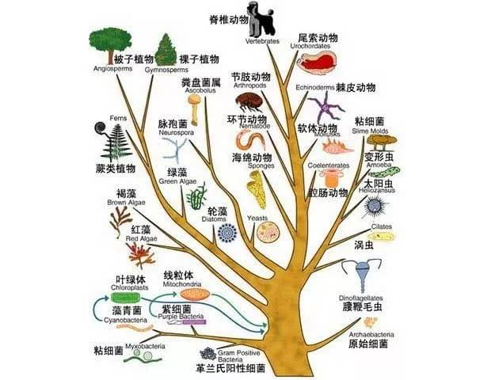

---
tags:
  - think
date: 2020-10-07
---

# 生存空间

> 存在即合理。 —— 黑格尔

## 一  
我很久前曾多次纳闷：苍蝇，存在的意义是什么？  
不像蚊子，咬人痛痒，它飞来飞去让人厌烦，飞得还快打不着，打着了又让人恶心。  
总之，它不那么坏，整天飞来飞去惹人厌烦外，不能理解其存在的意义。  

现在看来，当时的思考内容略显幼稚。  
但人总是受限于自己的主观经验，难以理解很多事物存在的“理”。  

## 二
然，大道至简。  
足够“简单”才容易传播、容易被理解，如前文引用的名言。  

此处点题：借用“生存空间”来广泛理解事物之所以存在的“理”。  

生存空间包含两个主体：空间，和生存于其内的个体。  
空间：经常延伸为资源、环境，也可能是抽象概念，不一定客观存在；空间本身可扩张、收缩。  
个体：能适应环境、改变环境、改变自身；个体能组合为复杂体或聚合为族群。  

## 三
物种的演化只需要两个基本因素：复制、变异。  

提到“进化”，直接让人联想到的是进化树，暗含了物种演化过程是有方向（低级->高级、简单->复杂）的。  
❌❌  
早在严复做《天演论》的时候，就反对将evolution译为“进化”。  

实际上，演化是没有方向的，各物种都随机朝各方向拓展边界。哪里有生存空间，便会有物种挤占进去。  
充满空间后便是彼此竞争。然后此消彼长，周而复始，最终在某个阶段达到平衡。  

看起来的方向，只是物种不断拓展“边界”过程中留下的痕迹。  
值得一提的是，物种并没有拓展边界的动机，拓展只是适应环境的一种行为表现，是基因的复制本能导致的。  

细菌病毒之所以存在（而且如此长久地存在），无非是因为有足够丰富的生存空间。   

每一次“破圈”（单细胞->多细胞、海洋->陆地->天空），可以看做生物演化过程中的一次跃进，新物种的适应能力拓展了生存空间的边界。  

其他灵长目无法演化出与人类媲美的智力，可以解释为顶层生存空间被智人挤满。  

## 四
而人类历史，可解释为人类族群对于生存空间竞争过程的记录。  

推动历史的力量是 人类生存空间（可简化为容纳个体数量）与人类繁殖本能，两个因素之间的矛盾。  
人类生存空间的变化原因有：气候、人类社会生产力。    

工业革命之前，生存空间的大小主要受气候影响。  
生物繁殖本能使得人类数量总是逼近生存空间的极限，当生存空间缩小的时候（气候变冷），就会爆发大规模战争，降低人口数量，直至平衡。  

战争是族群间竞争的表现，是人类与生存空间平衡的工具。  

工业革命之后，生产力急剧提升，使生存空间也迅速扩张。  
人类社会部分区域甚至出现了人口下滑，所以第三次世界大战会不会发生还不好说 -_-```。

此处，将“繁殖是人类的本能”改为“享乐是人类的本能”。  
繁殖是享乐行为，人口数量增长是享乐的结果。  
去屎人类享乐的动力来源于基因的复制本能。  

## 五

苍蝇存在的“理”是什么？所处的环境有足够的能量，它够快的飞行速度。  
坏人存在的“理”是什么？他行的恶能让他生存下去。  
谣言存在的“理”是什么？因为“愚者”够多。  
......  

AI会毁灭人类么？  
我猜不会，两者的生存空间交集有限，没这个必要。  
