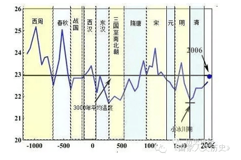
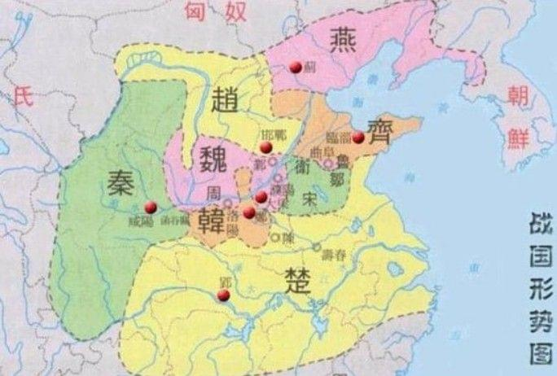

---
tags:
  - think
date: 2020-10-07
---

# 为何是秦灭六国，统一天下

*刚刚与网友谈到这个话题。  
史书总是把王朝兴衰全归因于“人”，我更愿意相信其主因是“天”。  
所以，我更“青睐”把王朝更替与气候变化关联起来的相关学说。*

**以下为爱好者臆测“为何是秦灭六国，一统天下”的原因（由于是爱好者，并不打算详细论证^_^）**

### 天
春秋战国时期大降温（看图）。  
    
[来源链接](http://www.360doc.com/content/15/0616/06/17132703_478419907.shtml)  
估计北方的诸侯收成都不好吧，没有找到战国时期天灾的相关资料。[期待这本书验证](https://baike.baidu.com/item/%E4%B8%89%E5%8D%83%E5%B9%B4%E5%A4%A9%E7%81%BE/12292062?fr=aladdin)  

### 地
公元前316年秦灭巴蜀，得成都平原。  
约公元前256开建都江堰，使成都平原得"天府之国"美称，成为秦国粮仓。纬度偏南，地理优势。
    
那为啥不是楚灭六国呢？  
猜测原因是：文明主要在北方形成（黄河流域），当时南方绝大部分是蛮荒之地，开发不够。  
后面两千年，每次大降温（游牧民族必然兴起），导致经济都往南迁移，直到宋朝，南方经济才超过北方，明朝才能成为首个逆袭北方统一中国的王朝。    

### 人
商鞅变法（公元前475～公元前221年），史料很多不多说了。  

***公元前221年，秦灭六国***
