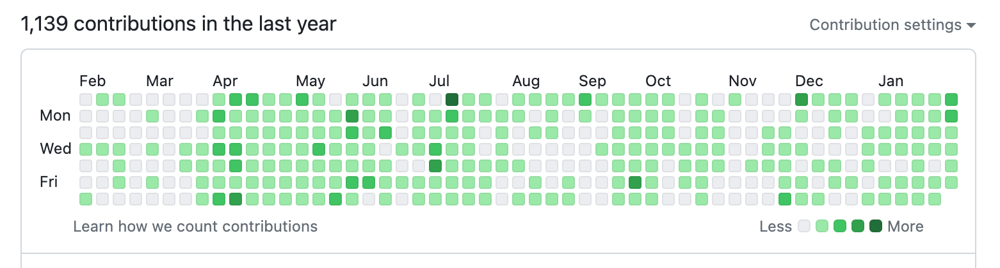

# 2024，做个“前端网红”吧

​ 写博客好多年了，以前是随缘更新，无所谓有没有人看。

23 年有些意外、有些机缘，写了不少代码和文章。

收到了一些正向反馈，github 新增 500+ star，博客站点日 PV 300 左右。

所以想博客也许可以作为一个业余项目，正经运营起来。

作为 Web 开发者，自然不喜欢微信的半封闭生态，对于是否开通微信公众号犹豫了一段时间。

但“**数据渴望流动，信息渴望传播**”，而公众号是一个不可否认的重要途径。

---

本公众号将主要发表 Web 技术文章，分两种类型

- 原创文章；Web 工程效率、音视频方向，或一些经验沉淀
- 技术资讯；倾向于关注 Web 基础、前沿的进展与应用

短期先同步博客中的热门文章，之后尽量做到两星期更新一次。  
先试运营一段时间，能走多远就随缘了。

先定个 24 年小目标 —— 做个“前端网红”吧。

点个关注（或订阅），助力好友完成*一个小目标*，祝大家龙年好运。

---

- 个人博客：<https://fenghen.me/>
- RSS 订阅：<https://fenghen.me/rss.xml>
- Github：<https://github.com/hughfenghen>
- 微信公众号：风痕 Web 栈
  - 
