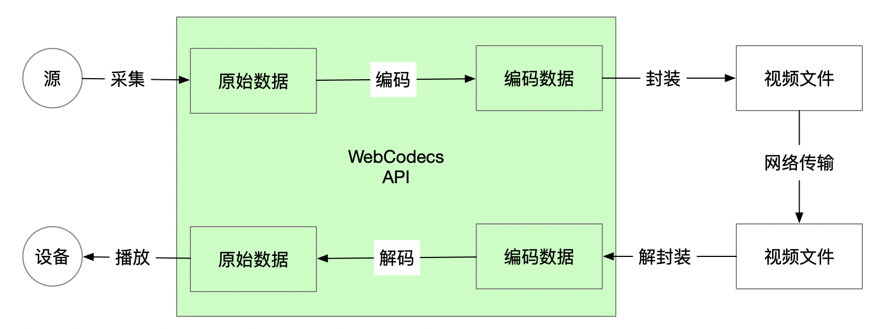

---
tags:
  - WebAV
  - 音视频
  - WebCodecs
date: 2023-07-16
---

# Web 音视频（零）概览

> [**Web 音视频目录**](/tag/WebAV)

WebCodecs API 已经发布一段时间（chrome 94），在浏览器中处理音视频文件或实时视频流已经可行。  
计划开一个系列介绍 Web 音视频基础知识，及如何在浏览器中处理视频文件（或视频流）。  

*作者也是音视频领域的新手，本系列文章也算是个人的学习总结，若发现错误内容可在评论区留言*  
*本系列适合有一定经验的前端开发者入门音视频领域，不会深入介绍音视频相关知识，会尽量提供链接引用*  

## Web 音视频历史阶段
0. 荒芜 时代  
   Web 不支持流媒体，PC 硬件标配光驱，软件标配本地播放器  
   用户：下载电影然后离线观看  
1. Flash 时代  
   Flash 插件是浏览器的标配，可以播放 FLV 视频，以及 RTMP 推流，Flash 死了，这两个协议现在还活着，可谓影响深远  
   用户：在线观看视频逐渐流行  
2. HTML5 时代  
   Video 标签可直接播放 MP4 视频，对与大量已存在的 FLV 视频文件，可在浏览器使用 JS 转封装为 fMP4，使用 MSE API 播放；FLV.js 成为明星项目  
   用户：在线观看视频是首选方式，本地播放器被冷落  
3. WebCodecs 时代  
   补全 Web 缺失的音视频**生产、编辑**能力，能力已具备，生态还未成熟  
   用户：预计在线剪辑、配合AI生成视频，视频会议、直播推流等工具将逐渐网页化  

## Web 音视频现状
**音视频工作流程**  
  

编解码是整个链路中最消耗计算资源的，在 WebCodecs 之前 Web 技术栈缺失可控编解码的能力。  

其中解封装、解码、播放能力被统一封装进了 HTMLMediaElement、MSE 等 API 中，所以在网页中播放音视频基本没问题；  
但因为没有开放底层数据控制或操作能力，像视频帧处理、播放缓冲区控制等功能是难以或无法实现。  

而编码能力的缺失，导致 Web 端少有视频生产工具；现有的在线剪辑工具都强依赖服务端能力支持。  

原生编解码能力缺失，于是大家寻求各种编解码器的 WASM 版或 ffmpeg.js 来满足最基本的诉求；  
但仍然受到性能和功能性的制约，极大地限制了应用场景。  

<strong>
WebCodecs 就是来改变这个现状的；   
WebCodecs 是 Web 平台音视频处理的基础；     
WebCodecs 将会像 HTML5 一样，促进音视频在 Web 平台的应用和发展。     
</strong>

*这就是本系列文章的写作动机。*  

如果之前没接触过 WebCodecs，建议先阅读[【译】WebCodecs 说明][1]，能快速了解 WebCodecs API 的动机与目标

## 本系列内容预告
- 系列概览
- [Web 音视频基础知识](/posts/2023/07/19/webav-1-basic/)
  - WebCodecs 常用 API 介绍
  - 音视频编码、封装，及常见格式
- [在浏览器中解析视频](/posts/2023/07/23/webav-2-parse-video/)
  - 解析视频、视频逐帧处理...
  - WebCodecs 解码相关 API 应用
- [在浏览器中创建视频](/posts/2023/07/31/webav-3-create-video/)
  - 从 Canvas、摄像头、麦克风等采集数据创建并导出视频文件
  - WebCodecs 编码相关 API 应用
- [在浏览器中处理音频](/posts/2023/08/05/webav-4-process-audio/)
  - 在浏览器中**采集、处理、编码、封装**音频数据全流程介绍
  - 音频数据基本处理：音量调节、混流、淡入淡出、重采样
- [在浏览器中合成视频](/posts/2023/08/12/webav-5-combine/)
  - 在视频上添加素材（视频、音频、图片、文字）
  - 合成、拼接多个视频
- [图像素材处理](/posts/2023/08/19/webav-6-process-image/)
  - 图像处理
  - 控制素材层级、给素材添加动画，导出视频
  - 素材动画：位移、旋转、不透明度...
- [中期回顾](/posts/2023/08/19/webav-7-mid-review/)
  - 个人回顾
  - WebCodecs 的价值、应用场景、案例分析

点击 [WebAV 标签](/tag/WebAV/) 可以查看本系列目录  

本系列的素材、案例来源于 [WebAV 项目](https://github.com/hughfenghen/WebAV)；  
WebAV 尝试提供简单易用的 API 在浏览器中处理音视频数据。  

你可以扫码打赏，给作者提供更新动力（压力 ：）  

  

Star 或 Watch [WebAV 项目](https://github.com/hughfenghen/WebAV)来跟进项目进展、体验DEMO、查阅示例代码；  
Star 或 Watch [本博客站点](https://github.com/hughfenghen/hughfenghen.github.io) 以接收本系列文章更新。  

## Web 音视频相关 API
- [WebCodecs API](https://developer.mozilla.org/zh-CN/docs/Web/API/WebCodecs_API)
  - VideoEncoder、VideoDecoder
  - AudioEncoder、AudioDecoder
  - ImageDecoder
  - MediaStreamTrackProcessor
- [Web Audio](https://developer.mozilla.org/zh-CN/docs/Web/API/Web_Audio_API)
  - AudioContext、OfflineAudioContext
  - AudioWorkletNode
- [MSE API](https://developer.mozilla.org/zh-CN/docs/Web/API/Media_Source_Extensions_API)
  - MediaSource、SourceBuffer
- [HTMLMediaElement](https://developer.mozilla.org/zh-CN/docs/Web/API/HTMLMediaElement)
  - HTMLVideoElement、HTMLAudioElement
- 其它
  - [MediaRecorder](https://developer.mozilla.org/zh-CN/docs/Web/API/MediaRecorder)
  - [WebRTC API](https://developer.mozilla.org/zh-CN/docs/Web/API/WebRTC_API)
  - [MediaStream](https://developer.mozilla.org/zh-CN/docs/Web/API/MediaStream)

## 附录
- [WebAV](https://github.com/hughfenghen/WebAV) 基于 WebCodecs 构建的音视频处理 SDK
- [WebCodecs Explainer](https://github.com/w3c/webcodecs/blob/main/explainer.md)
- [Video processing with WebCodecs](https://developer.chrome.com/articles/webcodecs/)
- [【译】WebCodecs 说明][1]

[1]: /posts/2023/10/02/webcodecs-explainer/