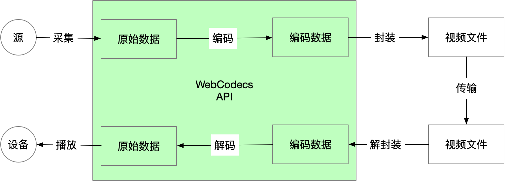
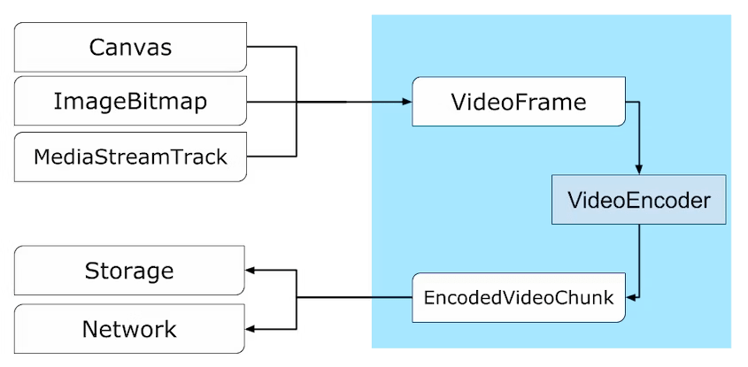

---
tags:
  - WebAV
  - 音视频
  - WebCodecs
date: 2023-07-19
---

# Web 音视频（一）基础知识

> [**Web 音视频目录**](/tag/WebAV)

阅读后续文章或开始使用 WebAV 处理音视频数据之前，需要一点点背景知识。  

本篇主要简单介绍音视频最基础的知识，以及 WebCodecs 的核心 API。  

## 视频结构
视频文件可以理解为容器包含了元数据和编码数据（压缩的音频或视频）；  
不同的容器格式有各种区别，比如用不同方式组织管理元数据和编码数据。  
  

### 编码格式
**编码**的**目的**是为了**压缩**，各种编码格式就是不同的压缩算法；  
因为采样获取的原始数据（图像、音频）过于庞大，不压缩几乎无法存储、传输；  

不同的编码格式有不同的**压缩率、兼容性、复杂度**；  
一般来说越新的格式压缩率越高、兼容性越差、复杂度越高；  
不同的业务场景（点播、直播、视频会议）的诉求会在这三个因素之间做权衡选择。  

**常见视频编码格式**
- H264 (AVC), 2003
- H265 (HEVC), 2013
- AV1, 2015

**常见音频编码格式**
- MP3, 1991
- AAC, 2000
- Opus, 2012

### 封装（容器）格式
编码数据是压缩后的原始数据，需要元数据来描述才能被正确解析播放；  
常见的元数据包括：时间信息，编码格式，分辨率，码率，语言等等。  

最常见的是 MP4，且 MSE 只支持 [fMP4](https://github.com/CharonChui/AndroidNote/blob/master/VideoDevelopment/%E8%A7%86%E9%A2%91%E5%B0%81%E8%A3%85%E6%A0%BC%E5%BC%8F/fMP4%E6%A0%BC%E5%BC%8F%E8%AF%A6%E8%A7%A3.md)，所以后续示例都是处理 MP4 文件。  

**其他常见格式**
- FLV，flv.js 主要是将 FLV 转封装成 fMP4，使得浏览器能播放 FLV 格式的视频  
- WebM，免费， [MediaRecorder][9] 输出的就是 WebM 格式  

## WebCodecs 核心 API

  
由上图可知，WebCodecs 工作在编解码阶段，不涉及封装、解封装  

上图节点与 API 的对应关系  
**视频**
- 原始图像数据： [VideoFrame][1]
- 图像编码器： [VideoEncoder][3]
- 压缩图像数据： [EncodedVideoChunk][5]
- 图像解码器： [VideoDecoder][4]

数据转换关系：  
`VideoFrame -> VideoEncoder => EncodedVideoChunk ->  VideoDecoder => VideoFrame`

**音频**
- 原始音频数据： [AudioData][2]
- 音频编码器： [AudioEncoder][6]
- 压图音频数据： [EncodedAudioChunk][7]
- 音频解码器： [AudioDecoder][8]

*音频数据转换跟视频对称*  

编解码、音视频这种对称易于理解掌握，这也是 WebCodecs 目标之一。  
> Symmetry: have similar patterns for encoding and decoding

### WebCodecs API 注意事项
记录新手容易碰到的陷阱

- VideoFrame 可能占用大量显存，及时 close 避免影响性能  
- VideoDecoder 维护了队列，其输出（output）的 VideoFrame 需要及时 close 否则它将暂停输出 VideoFrame
- 要及时检查 [encodeQueueSize](https://developer.mozilla.org/en-US/docs/Web/API/VideoEncoder/encodeQueueSize) ， 编码器若来不及处理则需要暂停生产新的 VideoFrame  
- 编解码器使用完后需要主动 close，比如 [VideoEncoder.close](https://developer.mozilla.org/en-US/docs/Web/API/VideoEncoder/close)，否则可能阻塞其他编解码器正常工作  

## 附录
- [WebAV](https://github.com/hughfenghen/WebAV) 基于 WebCodecs 构建的音视频处理 SDK
- [VideoFrame][1] 、 [AudioData][2]
- [VideoEncoder][3] 、 [VideoDecoder][4]
- [AudioEncoder][6] 、 [AudioDecoder][8]
- [EncodedVideoChunk][5] 、 [EncodedAudioChunk][7]

[1]: https://developer.mozilla.org/en-US/docs/Web/API/VideoFrame
[2]: https://developer.mozilla.org/en-US/docs/Web/API/AudioData
[3]: https://developer.mozilla.org/en-US/docs/Web/API/VideoEncoder
[4]: https://developer.mozilla.org/en-US/docs/Web/API/VideoDecoder
[5]: https://developer.mozilla.org/en-US/docs/Web/API/EncodedVideoChunk
[6]: https://developer.mozilla.org/en-US/docs/Web/API/AudioEncoder
[7]: https://developer.mozilla.org/en-US/docs/Web/API/EncodedAudioChunk
[8]: https://developer.mozilla.org/en-US/docs/Web/API/AudioDecoder
[9]: https://developer.mozilla.org/zh-CN/docs/Web/API/MediaRecorder