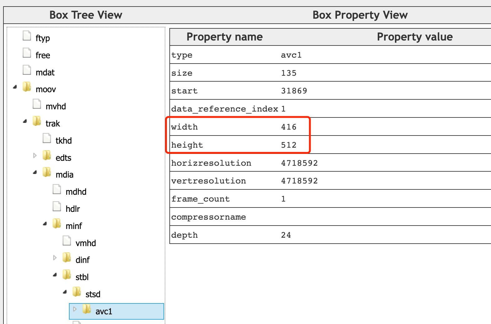

---
tags:
  - WebAV
  - 音视频
  - WebCodecs
date: 2023-07-23
---

# Web 音视频（二）在浏览器中解析视频
浏览器中已经能直播播放视频，为什么需要手动解析？  
某些场景需要对视频进行更细致的处理，比如截取关键帧、提取视频中的文字、人物打码、极低延时播放视频等等。  
总之，除了最单纯的视频播放外，对视频数据的一切处理都需要从解析开始。  

## MP4 简单介绍
MP4 是最流行兼容性最好的视频封装格式之一，在浏览器中也得到了良好支持；  
本系列后续都以 MP4 视频作为示例，所以先简单介绍 MP4 的基本概念。  
*其它格式的视频文件需使用对应的解封装 SDK*  

MP4 可以分为普通 MP4 和 [Fragment MP4](https://www.zhihu.com/question/314809922/answer/618733209)；  
普通 MP4 的元数据可在音视频数据前面（利于网络播放），也可在后面；  
Fragment MP4把音视频数据切成一个个小片段管理，非常方便直播场景，也是 MSE 唯一支持的格式。  
  

MP4 使用 Box 的抽象概念来描述管理数据，不同的数据抽象成不同的 Box，允许多层嵌套 Box；  
下图是一个普通 MP4 文件的可视化，该文件视频分辨率存储在 `moov box -> trak box -> ... -> avc1 box` 中，已编码（压缩）的音视频数据则存储在 `mdata box` 中  


*你可以访问 [mp4box.js filereader][2] 来可视化 MP4 文件*  

## 解封装
我们使用 [mp4box.js][1] 在浏览器中解封装（demux）MP4文件；  
解封装（demux）可以理解为提取 MP4 文件的元数据，以及将音视频数据解析成一个个包（Sample）方便处理。  
Sample 可转换为 `EncodedVideoChunk` 或 `EncodedAudioChunk`。  


WebAV 项目中的 [SampleTransform][4] 可将 MP4 文件流转换成 Sample 流(ReadableStream)  
`mp4FileStream.pipeThrough(new SampleTransform())`即可得到 Sample 流。  

**解封装核心伪代码**
```ts
const file = mp4box.createFile()
file.onReady = info => {
  file.setExtractionOptions(info.videoTracks[0]?.id, 'video')
  file.setExtractionOptions(info.audioTracks[0]?.id, 'audio')

  file.start()
}

function sample2ChunkOpts (s) {
  return {
    type: (s.is_sync ? 'key' : 'delta') 
    timestamp: (1e6 * s.cts) / s.timescale,
    duration: (1e6 * s.duration) / s.timescale,
    data: s.data
  }
}

file.onSamples = (id, type, samples) => {
  // `EncodedVideoChunk` 或 `EncodedAudioChunk`
  const chunks = samples.map(s => new EncodedVideoChunk(sample2ChunkOpts(s)))
}

const mp4stream = await fetch('<mp4 url>').body
let inputBufOffset = 0
while (read ui8ArrBuf for mp4stream) {
  const inputBuf = ui8ArrBuf.buffer
  inputBuf.fileStart = inputBufOffset
  inputBufOffset += inputBuf.byteLength
  file.appendBuffer(inputBuf)
}
```

*解封装过程不会消耗过多的计算资源，一般使用 js 处理也不会有性能问题，该过程不在 WebCodecs 的覆盖范围内。*

## 解码
更新中...

## 视频帧处理
更新中...

## 附录
- [mp4box.js][1] 能在浏览器中运行的 MP4 封装、解封装工具
- [mp4box.js filereader][2] MP4 文件可视化工具，基于 mp4box.js 构建
- [WebAV][3] 基于 WebCodecs、mp4box.js 构建的音视频处理 SDK


[1]: https://github.com/gpac/mp4box.js
[2]: https://gpac.github.io/mp4box.js/test/filereader.html
[3]: https://github.com/hughfenghen/WebAV
[4]: https://github.com/hughfenghen/WebAV/blob/main/packages/av-cliper/src/mp4-utils.ts#L380

