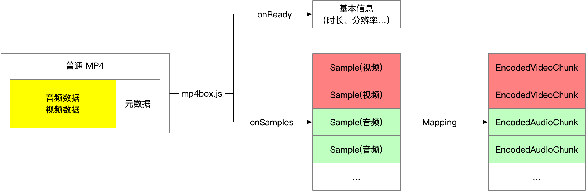

---
tags:
  - WebAV
  - 音视频
  - WebCodecs
date: 2023-07-23
---

# Web 音视频（二）在浏览器中解析视频

> [**Web 音视频目录**](/tag/WebAV)

浏览器中已经能直播播放视频，为什么需要手动解析？  
某些场景需要对视频进行更细致的处理，比如截取关键帧、提取视频中的文字、人物打码、极低延时播放视频等等。

总之，除了最单纯的视频播放外，对视频数据的一切处理都需要从解析开始。

_你可以跳过原理介绍，直接查看 [WebAV 解析 MP4 示例](#webav-视频解析示例)_

## MP4 简单介绍

MP4 是最流行兼容性最好的视频封装格式之一，在各种浏览器中也得到了良好支持；  
本系列后续都以 MP4 视频作为示例，所以先简单介绍 MP4 的基本概念。  
_其它格式的视频文件需使用对应的解封装 SDK_

MP4 可以分为普通 MP4 和 [Fragment MP4](https://www.zhihu.com/question/314809922/answer/618733209)；  
普通 MP4 的元数据可在音视频数据前面（利于网络播放），也可在后面；  
Fragment MP4 把音视频数据切成一个个小片段管理，非常方便直播场景，也是 MSE 唯一支持的格式。  


MP4 使用 Box 的抽象概念来描述管理数据，不同的数据抽象成不同的 Box，允许多层嵌套 Box；  
下图是一个普通 MP4 文件的可视化，该文件视频分辨率存储在 `moov box -> trak box -> ... -> avc1 box` 中，已编码（压缩）的音视频数据则存储在 `mdata box` 中

<div style="width: 500px;"></div>

_你可以访问 [mp4box.js filereader][2] 来可视化 MP4 文件_

## MP4 解封装

我们使用 [mp4box.js][1] 在浏览器中解封装（demux）MP4 文件；  
解封装（demux）可以理解为提取 MP4 文件的元数据，以及将音视频数据解析成一个个包（Sample）方便处理。  
而 MP4 Sample 可转换为 `EncodedVideoChunk` 或 `EncodedAudioChunk`。



WebAV 项目中的 [SampleTransform][4] 可将 MP4 文件流转换成 Sample 流(ReadableStream)  
`mp4FileStream.pipeThrough(new SampleTransform())`即可得到 Sample 流。

**解封装伪代码**

[_mp4box.js API 文档_][1]

```ts
const file = mp4box.createFile()
file.onReady = info => {
  file.setExtractionOptions(info.videoTracks[0]?.id, 'video')
  file.setExtractionOptions(info.audioTracks[0]?.id, 'audio')

  file.start()
}

file.onSamples = (id, type, samples) => {
  // `EncodedVideoChunk` 或 `EncodedAudioChunk`
  const chunks = samples.map(s => new EncodedVideoChunk({
    type: (s.is_sync ? 'key' : 'delta')
    timestamp: (1e6 * s.cts) / s.timescale,
    duration: (1e6 * s.duration) / s.timescale,
    data: s.data
  }))
}

const mp4stream = await fetch('<mp4 url>').body
let inputBufOffset = 0
while (read ui8ArrBuf for mp4stream) {
  const inputBuf = ui8ArrBuf.buffer
  inputBuf.fileStart = inputBufOffset
  inputBufOffset += inputBuf.byteLength
  file.appendBuffer(inputBuf)
}
```

_解封装过程不会消耗过多的计算资源，一般使用 js 处理也不会碰到性能瓶颈，该过程不在 WebCodecs 的覆盖范围内。_

## 视频解码

不同的视频需要对应的解封装程序，解封装得到的数据（如 MP4 Sample）可转换为 WebCodecs 中提供的 `EncodedVideoChunk` 或 `EncodedAudioChunk`，然后分别由 `VideoDecoder` 或 `AudioDecoder` 进行解码（解压）。  
使用解码器之前需要初始化配置（`decoder.configure`），必填参数 `codec` 可以在解封装时拿到（onReady）。


```js
const videoDecoder = new VideoDecoder({
  output: (videoFrame) => {
    // videoFrame 可绘制到 Canvas 进行额外处理
  },
  error: console.error,
});
videoDecoder.configure({ codec: '<视频数据对应的编码格式>' });
```

解码视频数据得到多个 `VideoFrame, AudioData` 对象，这两个对象包含了对应帧视频、音频的原始数据，可通过其实例的 `copyTo` 方法将原始数据 copy 到 ArrayBuffer 中。

::: tip

- `VideoFrame` 可能占用大量显存，及时 `close` 避免影响性能
- `VideoFrame.copyTo` 会将帧的原始数据从显存复制到内存，像素处理请优先使用 WebGL
- `VideoDecoder` 输出（output）的 `VideoFrame` 需要及时 `close` 否则它将暂停解码
  :::

## 视频帧处理

在浏览器中一般配合使用 `Canvas` 对 `VideoFrame` 进行处理，如：

- 降低视频分辨率
  1. 绘制 `VideoFrame` 到 `Canvas`， `ctx.draw(videoFrame, 0, 0)`
  2. 创建新的 `VideoFrame`， `new VideoFrame(canvas, {...})`
- 裁剪视频；使用 `ctx.draw` 后面的定位参数，绘制 `VideoFrame` 指定区域
- 叠加视频、图片、文字等；先绘制 `VideoFrame` 再绘制其他元素
- 降低帧率，平均抽取丢掉多余帧；如 60FPS -> 30FPS，大概每两帧丢掉一帧不绘制
- 滤镜、抠图、特效等复杂图形处理；使用 WebGL 或 WebGPU

常见的视频处理 [DEMO][6]

对视频进行逐帧处理后，**如何重新编码封装成文件**，请阅读下一章。

_音频处理后续会专门写一篇文章_

## WebAV 视频解析示例

mp4box.js 解封装配合 WebCodecs 解码原理上很简单，但需要阅读大量文档、API 以及编写很多细节逻辑，汇总起来就相对繁琐了。  
`@webav/av-cliper` 提供了 `MP4Clip` 可以将视频流转换成视频帧（`VideoFrame`） 屏蔽许多繁琐过程

```js
import { MP4Clip } from '@webav/av-cliper';

// 传入一个 mp4 文件流即可初始化
const clip = new MP4Clip((await fetch('<mp4 url>')).body);
await clip.ready;

let time = 0;
// 最快速度渲染视频所有帧
while (true) {
  const { state, video: videoFrame } = await clip.tick(time);
  if (state === 'done') break;
  if (videoFrame != null && state === 'success') {
    ctx.clearRect(0, 0, cvs.width, cvs.height);
    // 绘制到 Canvas
    ctx.drawImage(
      videoFrame,
      0,
      0,
      videoFrame.codedWidth,
      videoFrame.codedHeight
    );
    // 注意，用完立即 close
    videoFrame.close();
  }
  // 时间单位是 微秒，所以差不多每秒取 30 帧，丢掉多余的帧
  time += 33000;
}
clip.destroy();
```

[体验 DEMO][5]

## 附录

- [WebAV][3] 基于 WebCodecs 构建的音视频处理 SDK
- [WebAV 视频处理 DEMO][6]
- [WebAV 解码 DEMO][5]
- [mp4box.js][1] 能在浏览器中运行的 MP4 封装、解封装工具
- [mp4box.js filereader][2] MP4 文件可视化工具，基于 mp4box.js 构建

[1]: https://gpac.github.io/mp4box.js
[2]: https://gpac.github.io/mp4box.js/test/filereader.html
[3]: https://github.com/hughfenghen/WebAV
[4]: https://github.com/hughfenghen/WebAV/blob/main/packages/av-cliper/src/mp4-utils.ts#L380
[5]: https://hughfenghen.github.io/WebAV/demo/1_1-decode-video
[6]: https://hughfenghen.github.io/WebAV/demo/2_1-concat-video
