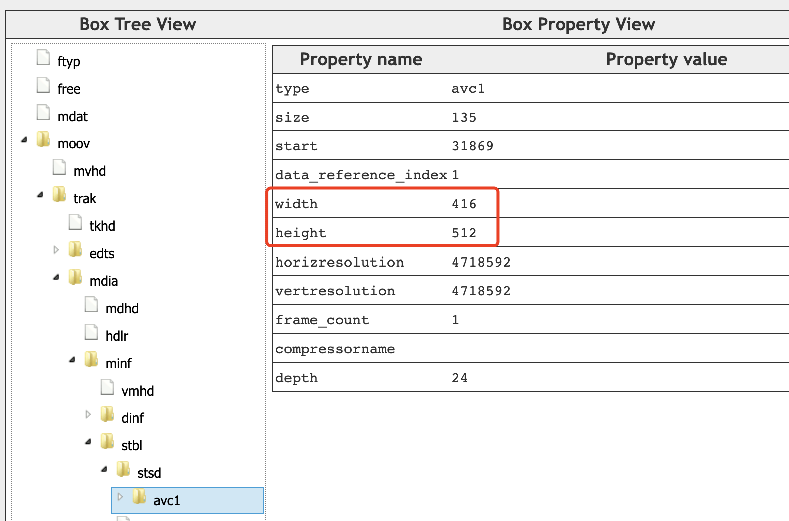
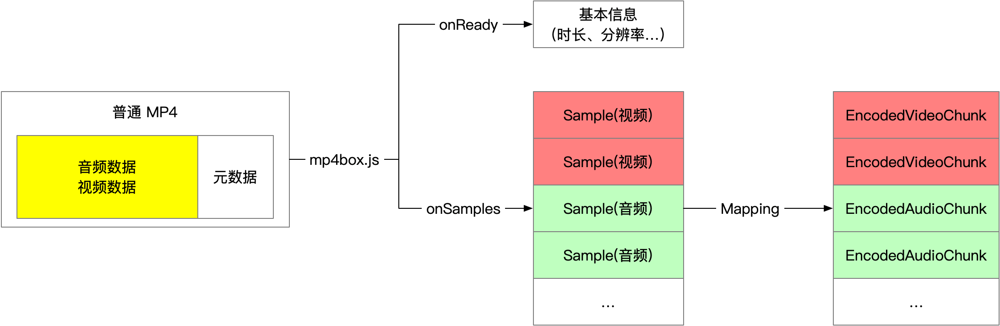

---
tags:
  - WebAV_EN
  - Audio & Video
  - WebCodecs
date: 2023-07-23
---

# Web Audio & Video (2) Parsing Video in the Browser

> [**Web Audio & Video Series Table of Contents**](/tag/WebAV_EN)

While browsers can already play videos directly, why would we need to write code to parse them manually?
The answer lies in specific scenarios that require more detailed video processing, such as extracting keyframes, detecting text in videos, applying person privacy masking, or achieving ultra-low latency video playback.

In essence, except for basic video playback, any video data processing starts with parsing.

_You can skip the technical principles and jump directly to [WebAV MP4 Parsing Example](#webav-video-parsing-example)_

## Brief Introduction to MP4

MP4 is one of the most popular and well-supported video container formats across various browsers;
This series will use MP4 videos as examples, so let's start with a brief overview of MP4 fundamentals.
_Other video formats require their corresponding demuxing SDKs_

MP4 can be categorized into regular MP4 and [Fragment MP4](https://www.zhihu.com/question/314809922/answer/618733209);
In regular MP4, metadata can be placed either before the audio/video data (beneficial for network streaming) or after it;
Fragment MP4 manages audio/video data in small segments, making it ideal for live streaming scenarios and is the only format supported by MSE.


MP4 uses the concept of Boxes to describe and manage data, with different data types abstracted into different Boxes that can be nested;
The image below visualizes a regular MP4 file, where video resolution is stored in `moov box -> trak box -> ... -> avc1 box`, while encoded (compressed) audio/video data is stored in the `mdat box`



_You can visit [mp4box.js filereader][2] to visualize MP4 files_

## MP4 Demuxing

We use [mp4box.js][1] to demux MP4 files in the browser;
Demuxing can be understood as extracting metadata from MP4 files and parsing audio/video data into individual packages (Samples) for easier processing.
These MP4 Samples can be converted to `EncodedVideoChunk` or `EncodedAudioChunk`.



The [SampleTransform][4] in the WebAV project can convert MP4 file streams into Sample streams (ReadableStream)
Use `mp4FileStream.pipeThrough(new SampleTransform())` to obtain the Sample stream.

**Demuxing Pseudo-code**

[_mp4box.js API Documentation_][1]

```ts
const file = mp4box.createFile()
file.onReady = info => {
  file.setExtractionOptions(info.videoTracks[0]?.id, 'video')
  file.setExtractionOptions(info.audioTracks[0]?.id, 'audio')

  file.start()
}

file.onSamples = (id, type, samples) => {
  // Convert to `EncodedVideoChunk` or `EncodedAudioChunk`
  const chunks = samples.map(s => new EncodedVideoChunk({
    type: (s.is_sync ? 'key' : 'delta')
    timestamp: (1e6 * s.cts) / s.timescale,
    duration: (1e6 * s.duration) / s.timescale,
    data: s.data
  }))
}

const mp4stream = await fetch('<mp4 url>').body
let inputBufOffset = 0
while (read ui8ArrBuf for mp4stream) {
  const inputBuf = ui8ArrBuf.buffer
  inputBuf.fileStart = inputBufOffset
  inputBufOffset += inputBuf.byteLength
  file.appendBuffer(inputBuf)
}
```

_Demuxing doesn't consume excessive computational resources; JavaScript processing generally won't hit performance bottlenecks. This process is outside WebCodecs' scope._

## Video Decoding

Different videos require corresponding demuxing programs. The demuxed data (like MP4 Samples) can be converted to WebCodecs' `EncodedVideoChunk` or `EncodedAudioChunk`, which are then decoded (decompressed) by `VideoDecoder` or `AudioDecoder` respectively.
Before using the decoder, initialization configuration (`decoder.configure`) is required, with the mandatory `codec` parameter available during demuxing (onReady).


```js
const videoDecoder = new VideoDecoder({
  output: (videoFrame) => {
    // videoFrame can be drawn to Canvas for additional processing
  },
  error: console.error,
});
videoDecoder.configure({ codec: '<codec format matching the video data>' });
```

:::tip
For `videoDecoder.configure` parameters, please refer to the [MDN documentation][7]
While `description` is a required parameter, documentation is limited. See the author's [avcC box content analysis][8]
:::

Decoding video data yields multiple `VideoFrame` and `AudioData` objects containing raw frame data. The raw data can be copied to an ArrayBuffer using their `copyTo` method. Important considerations during processing:

::: tip

- `VideoFrame` may consume significant GPU memory; close them promptly to maintain performance
- `VideoFrame.copyTo` copies frame data from GPU to system memory; prefer WebGL for pixel processing
- `VideoFrame` outputs from `VideoDecoder` must be closed promptly, or decoding will pause
  :::

## Video Frame Processing

In browsers, `VideoFrame` processing typically involves `canvas`, for operations such as:

- Reducing video resolution
  1. Draw `VideoFrame` to a lower resolution `canvas`, `ctx.draw(videoFrame, 0, 0)`
  2. Create new `VideoFrame`, `new VideoFrame(canvas, {...})`
- Cropping video frames; use positioning parameters with `ctx.draw` to render specific regions
- Overlaying videos, images, text; draw `VideoFrame` first, then other elements
- Reducing frame rate by selective frame dropping; e.g., 60FPS -> 30FPS by dropping every other frame
- Complex graphics processing like filters, masking, effects; use WebGL or WebGPU

See common video processing [DEMO][6]

For re-encoding and packaging processed video frames into files, see the next chapter.

_Audio processing will be covered in a dedicated article_

## Web Audio & Video Video Parsing Example

While combining mp4box.js demuxing with WebCodecs decoding is conceptually simple, it requires extensive documentation reading, API understanding, and detailed logic implementation.
`@webav/av-cliper` provides `MP4Clip` to convert video streams into video frames (`VideoFrame`), abstracting away many complex details

```js
import { MP4Clip } from '@webav/av-cliper';

// Initialize with an mp4 file stream
const clip = new MP4Clip((await fetch('<mp4 url>')).body);
await clip.ready;

let time = 0;
// Render all video frames at maximum speed
while (true) {
  const { state, video: videoFrame } = await clip.tick(time);
  if (state === 'done') break;
  if (videoFrame != null && state === 'success') {
    ctx.clearRect(0, 0, cvs.width, cvs.height);
    // Draw to Canvas
    ctx.drawImage(
      videoFrame,
      0,
      0,
      videoFrame.codedWidth,
      videoFrame.codedHeight
    );
    // Important: close immediately after use
    videoFrame.close();
  }
  // Time unit is microseconds, ~30fps, dropping excess frames
  time += 33000;
}
clip.destroy();
```

[Try the DEMO][5]

## Appendix

- [WebAV][3] Audio & video processing SDK built on WebCodecs
- [WebAV Video Processing DEMO][6]
- [WebAV Decoding DEMO][5]
- [mp4box.js][1] MP4 muxing/demuxing tool for browsers
- [mp4box.js filereader][2] MP4 file visualization tool built on mp4box.js
- [MDN VideoDecoder Documentation][7]
- [MP4 avcC box Analysis and VideoDecoder Initialization][8]

[1]: https://gpac.github.io/mp4box.js
[2]: https://gpac.github.io/mp4box.js/test/filereader.html
[3]: https://github.com/WebAV-Tech/WebAV
[4]: https://github.com/WebAV-Tech/WebAV/blob/main/packages/av-cliper/src/mp4-utils.ts#L380
[5]: https://webav-tech.github.io/WebAV/demo/1_1-decode-video
[6]: https://webav-tech.github.io/WebAV/demo/2_1-concat-video
[7]: https://developer.mozilla.org/en-US/docs/Web/API/VideoDecoder/VideoDecoder
[8]: https://github.com/hughfenghen/hughfenghen.github.io/issues/198
