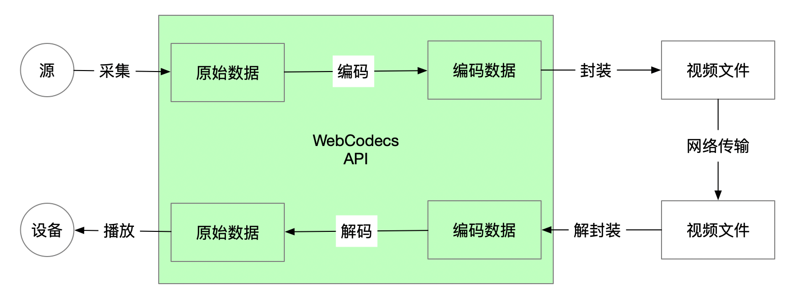

---
tags:
  - WebAV
  - 音视频
  - WebCodecs
date: 2023-07-31
---

# Web 音视频（三）在浏览器中创建视频

> [**Web 音视频目录**](/tag/WebAV)

  

在 WebCodecs 之前，由于编解码能力的缺失，几乎无法在纯浏览器中编辑、创建视频。  
WebCodecs 补齐了编解码能力，相当于在浏览器中提供了视频创作能力。  

预计 WebCodecs 将会像 HTML5 技术（Video、Audio、MSE...）一样对音视频工具的用户带来巨大改变，HTML5 作用于视频消费端，WebCodecs 作用于视频生产端。  

本章介绍如何在浏览器中创建视频，如何解析视频请阅读[上一章](../webav-2-parse-video/)  

*你可以跳过原理介绍，直接查看 [WebAV 生成 MP4 示例](#webav-生成视频示例)*  

## 采集与编码
   

前面的文章已介绍过 WebCodecs 使用 VideoFrame、AudioData 来描述音视频原始数据。  
*请参考 [WebCodecs 核心 API](/posts/2023/07/19/webav-1-basic/#webcodecs-核心-api)*

常见的音视频源有：MediaStream（摄像头、麦克风、分享屏幕）、Canvas、Video标签、文件流等...  

**第一步**，将这些源对象转换成 VideoFrame、AudioData 对象，方法有：
1. 使用 [MediaStreamTrackProcessor][1] 将 MediaStream 转换为 `ReadableStream<VideoFrame> 、 ReadableStream<AudioData>`，*MDN 有示例代码*
2. 直接将 Canvas、Video 标签传递给 VideoFrame 的构建函数 `new VideoFrame(canvas)`
3. 由解码器（VideoDecoder 、 AudioDecoder）解码本地或网络文件，得到 VideoFrame、AudioData
4. 从 [AudioContext][2] 获取音频原始数据创建 AudioData 对象，*后续【音频数据处理】文章再介绍*

**第二步**，将 VideoFrame、AudioData 传入编码器（VideoEncoder、AudioEncoder）  
```js
const encoder = new VideoEncoder({
  error: console.error,
  output: (chunk, meta) => {
    // chunk: EncodedVideoChunk 等待封装
    // meta 在下一步封装 SDK 创建轨道时需要
  }
})
encoder.configure({
  codec: 'avc1.4D0032', // H264
  width: 1280,
  height: 720
})

let timeoffset = 0
let lastTime = performance.now()
setInterval(() => {
  const duration = (performance.now() - lastTime) * 1000
  encoder.encode(
    new VideoFrame(canvas, {
      // 这一帧画面，持续 33ms，duration 单位 μs
      duration,
      timestamp: timeoffset
    })
  )
  timeoffset += duration
}, 33)
```

::: warning
当高频调用 `encoder.encode` 时应根据当前编码器的队列大小 `encoder.encodeQueueSize` 决定是否需要暂停，队列中的 VideoFrame **数量过多会爆掉显存**，导致性能极其低下
:::

## 封装
编码器（VideoEncoder、AudioEncoder）将一帧帧原始数据编码（压缩）后会输出 EncodedVideoChunk、EncodedAudioChunk 对象，然后由封装程序将他们封装（muxing）成对应格式的视频文件。  

我们继续使用 mp4box.js 来演示封装 mp4 文件。  

MP4 将一个编码后的数据包抽象为 **Sample**，与 EncodedVideoChunk、EncodedAudioChunk 对象一一对应。  
MP4 将不同类型的数据（音频、视频）分组抽象为 **Track**，分组管理不同类型的 Sample。  

::: details 代码示例
```js
const file = mp4box.createFile()
// 创建视频轨道
const videoTrackId = file.addTrack({
  timescale: 1e6,
  width: 1280,
  height: 720,
  // meta 来原于 VideoEncoder output 的参数
  avcDecoderConfigRecord: meta.decoderConfig.description
})
// 创建音频轨道
const audioTrackId = file.addTrack({
  timescale: 1e6,
  samplerate: 48000, 
  channel_count: 2, 
  type: 'mp4a' // AAC
  // meta 来原于 AudioEncoder output 的参数
  description: createESDSBox(meta.decoderConfig.description)
})

/**
 * EncodedAudioChunk | EncodedVideoChunk 转换为 MP4 addSample 需要的参数
 */
function chunk2MP4SampleOpts (
  chunk: EncodedAudioChunk | EncodedVideoChunk
): SampleOpts & {
  data: ArrayBuffer
} {
  const buf = new ArrayBuffer(chunk.byteLength)
  chunk.copyTo(buf)
  const dts = chunk.timestamp
  return {
    duration: chunk.duration ?? 0,
    dts,
    cts: dts,
    is_sync: chunk.type === 'key',
    data: buf
  }
}

// VideoEncoder output chunk
const videoSample =  chunk2MP4SampleOpts(chunk)
file.addSample(videoTrackId, videoSample.data, videoSample)

// AudioEncoder output chunk
const audioSample =  chunk2MP4SampleOpts(chunk)
file.addSample(audioTrackId, audioSample.data, audioSample)
```
:::

以上代码是为了将主要过程与 API 建立对应关系，实际上还需要比较复杂的流程控制逻辑，以及进一步了解 mp4 格式知识才能编写出完整可运行的程序。  

::: tip
- addSample 前必须保证音视频轨道（addTrack）都已经创建完成
- 创建音频轨道需要传递 `description`(esds box)，否则某些播放器将无法播放声音
:::

## 生成文件流
使用 mp4box.js 封装编码器输出的数据，我们持有的是一个 MP4File 对象（`mp4box.createFile()`），将 MP4File 对象转换成 `ReadableStream` 可以非常方便地写入本地文件、上传到服务器。  

*注意释放内存引用，避免内存泄露*

::: details 代码不算太长，全部贴出来了
```ts
export function file2stream (
  file: MP4File,
  timeSlice: number,
  onCancel?: TCleanFn
): {
  stream: ReadableStream<Uint8Array>
  stop: TCleanFn
} {
  let timerId = 0

  let sendedBoxIdx = 0
  const boxes = file.boxes
  const tracks: Array<{ track: TrakBoxParser; id: number }> = []

  const deltaBuf = (): Uint8Array | null => {
    // boxes.length >= 4 表示完成了 ftyp moov，且有了第一个 moof mdat
    // 避免moov未完成时写入文件，导致文件无法被识别
    if (boxes.length < 4 || sendedBoxIdx >= boxes.length) return null

    if (tracks.length === 0) {
      for (let i = 1; true; i += 1) {
        const track = file.getTrackById(i)
        if (track == null) break
        tracks.push({ track, id: i })
      }
    }

    const ds = new mp4box.DataStream()
    ds.endianness = mp4box.DataStream.BIG_ENDIAN

    for (let i = sendedBoxIdx; i < boxes.length; i++) {
      boxes[i].write(ds)
      delete boxes[i]
    }
    // 释放引用，避免内存泄露
    tracks.forEach(({ track, id }) => {
      file.releaseUsedSamples(id, track.samples.length)
      track.samples = []
    })
    file.mdats = []
    file.moofs = []

    sendedBoxIdx = boxes.length
    return new Uint8Array(ds.buffer)
  }

  let stoped = false
  let canceled = false
  let exit: TCleanFn | null = null
  const stream = new ReadableStream({
    start (ctrl) {
      timerId = self.setInterval(() => {
        const d = deltaBuf()
        if (d != null && !canceled) ctrl.enqueue(d)
      }, timeSlice)

      exit = () => {
        clearInterval(timerId)
        file.flush()
        const d = deltaBuf()
        if (d != null && !canceled) ctrl.enqueue(d)

        if (!canceled) ctrl.close()
      }

      // 安全起见，检测如果start触发时已经 stoped
      if (stoped) exit()
    },
    cancel () {
      canceled = true
      clearInterval(timerId)
      onCancel?.()
    }
  })

  return {
    stream,
    stop: () => {
      if (stoped) return
      stoped = true
      exit?.()
    }
  }
}
```
:::

以上步骤，就是在浏览器中创建视频文件的全过程。

在 WebCodecs 之前，前端开发者只能在及其有限的场景使用 ffmpeg.js、MediaRecorder 创建视频文件。  
现在利用 WebCodecs 则可以快速创建视频文件，并进行非常细致的帧控制，为多样的产品功能提供底层技术支持。  

## WebAV 生成视频示例

整个过程的原理不算难，文章的前两张图基本概括了，如果从零开始实现，还是有非常多的细节需要处理，以及更深入地学习一些 mp4 文件相关知识。  

你可以略过细节，使用 `@webav/av-cliper` 提供的工具函数 `recodemux 、 file2stream` 来快速创建视频文件。  

以下是从 canvas 创建视频的示例
```js
import { recodemux, file2stream } from '@webav/av-cliper'

const muxer = recodemux({
  video: {
    width: 1280,
    height: 720,
    expectFPS: 30
  },
  // 后续文章介绍如何处理音频数据
  audio: null
})

let timeoffset = 0
let lastTime = performance.now()
setInterval(() => {
  const duration = (performance.now() - lastTime) * 1000
  muxer.encodeVideo(video
    new VideoFrame(canvas, {
      // 这一帧画面，持续 33ms，duration 单位 μs
      duration,
      timestamp: timeoffset
    })
  )
  timeoffset += duration
}, 33)

const { stream } = file2stream(muxer.mp4file, 500)
// upload or write stream
```

体验使用不同素材[创建视频 DEMO][6]； 查看 [recodemux 详细用例][7]

## 附录
- [WebAV][4] 基于 WebCodecs 构建的音视频处理 SDK
- [mp4box.js][3] 能在浏览器中运行的 MP4 封装、解封装工具
- [VideoEncoder][5]
- [AudioContext][2]
- [MediaStreamTrackProcessor][1]

[1]: https://developer.mozilla.org/en-US/docs/Web/API/MediaStreamTrackProcessor
[2]: https://developer.mozilla.org/en-US/docs/Web/API/AudioContext
[3]: https://gpac.github.io/mp4box.js
[4]: https://github.com/hughfenghen/WebAV
[5]: https://developer.mozilla.org/en-US/docs/Web/API/VideoEncoder
[6]: https://hughfenghen.github.io/WebAV/demo/concat-media.html
[7]: https://github.com/hughfenghen/WebAV/blob/main/packages/av-cliper/src/combinator.ts#L118
