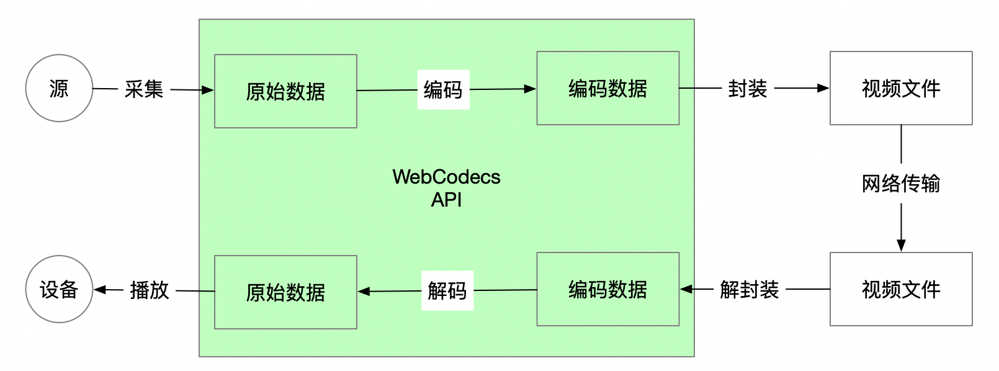

---
tags:
  - WebAV_EN
  - Audio & Video
  - WebCodecs
date: 2023-07-31
---

# Web Audio & Video (3) Creating Videos in the Browser

> [**Web Audio & Video Series Table of Contents**](/tag/WebAV_EN)



Before WebCodecs, the lack of encoding and decoding capabilities made it nearly impossible to edit or create videos purely in the browser.  
WebCodecs fills this gap by providing video creation capabilities directly in the browser.

WebCodecs is expected to revolutionize user habits much like HTML5 technologies (Video, Audio, MSE...) did. While HTML5 transformed video consumption, WebCodecs is set to transform video production.

This chapter covers video creation in the browser. For video parsing, please refer to the [previous chapter](../webav-2-parse-video/)

_You can skip the technical principles and jump directly to [WebAV MP4 Creation Example](#webav-video-creation-example)_

## Capture and Encoding


As discussed in previous articles, WebCodecs uses VideoFrame and AudioData to represent raw audio and video data.  
_Please refer to [WebCodecs Core APIs](/posts/2023/07/19/webav-1-basic/#webcodecs-core-api)_

Common audio and video sources include: MediaStream (camera, microphone, screen sharing), Canvas, Video elements, file streams, etc.

**Step One**: Convert these source objects into VideoFrame and AudioData objects using these methods:

1. Use [MediaStreamTrackProcessor][1] to convert MediaStream into `ReadableStream<VideoFrame>` and `ReadableStream<AudioData>` (_see MDN for example code_)
2. Pass Canvas or Video elements directly to the VideoFrame constructor: `new VideoFrame(canvas)`
3. Obtain VideoFrame and AudioData by decoding local or network files using VideoDecoder and AudioDecoder
4. Create AudioData objects from raw audio data obtained from [AudioContext][2] (_covered in the upcoming Audio Data Processing article_)

**Step Two**: Feed VideoFrame and AudioData into encoders (VideoEncoder, AudioEncoder)

```js
const encoder = new VideoEncoder({
  error: console.error,
  output: (chunk, meta) => {
    // chunk: EncodedVideoChunk waiting for muxing
    // meta: needed for track creation in the next muxing step
  },
});
encoder.configure({
  codec: 'avc1.4D0032', // H264
  width: 1280,
  height: 720,
});

let timeoffset = 0;
let lastTime = performance.now();
setInterval(() => {
  const duration = (performance.now() - lastTime) * 1000;
  encoder.encode(
    new VideoFrame(canvas, {
      // This frame lasts 33ms, duration in μs
      duration,
      timestamp: timeoffset,
    })
  );
  timeoffset += duration;
}, 33);
```

::: warning
When calling `encoder.encode` at high frequency, monitor `encoder.encodeQueueSize` to determine if pausing is necessary. Too many VideoFrames in the queue can **exhaust GPU memory** and severely impact performance
:::

## Muxing

Encoders (VideoEncoder, AudioEncoder) compress raw data frame by frame and output EncodedVideoChunk and EncodedAudioChunk objects, which are then muxed into video files of the desired format.

We'll continue using mp4box.js to demonstrate MP4 file muxing.

MP4 abstracts each encoded data packet as a **Sample**, corresponding one-to-one with EncodedVideoChunk and EncodedAudioChunk objects.  
Different types of data (audio, video) are grouped into **Tracks**, managing different types of Samples.

::: details Code Example

```js
const file = mp4box.createFile()
// Create video track
const videoTrackId = file.addTrack({
  timescale: 1e6,
  width: 1280,
  height: 720,
  // meta from VideoEncoder output parameters
  avcDecoderConfigRecord: meta.decoderConfig.description
})
// Create audio track
const audioTrackId = file.addTrack({
  timescale: 1e6,
  samplerate: 48000,
  channel_count: 2,
  type: 'mp4a' // AAC
  // meta from AudioEncoder output parameters
  description: createESDSBox(meta.decoderConfig.description)
})

/**
 * Convert EncodedAudioChunk | EncodedVideoChunk to MP4 addSample parameters
 */
function chunk2MP4SampleOpts (
  chunk: EncodedAudioChunk | EncodedVideoChunk
): SampleOpts & {
  data: ArrayBuffer
} {
  const buf = new ArrayBuffer(chunk.byteLength)
  chunk.copyTo(buf)
  const dts = chunk.timestamp
  return {
    duration: chunk.duration ?? 0,
    dts,
    cts: dts,
    is_sync: chunk.type === 'key',
    data: buf
  }
}

// VideoEncoder output chunk
const videoSample = chunk2MP4SampleOpts(chunk)
file.addSample(videoTrackId, videoSample.data, videoSample)

// AudioEncoder output chunk
const audioSample = chunk2MP4SampleOpts(chunk)
file.addSample(audioTrackId, audioSample.data, audioSample)
```

:::

This code demonstrates the relationship between key processes and APIs. However, implementing a complete, working program requires more complex flow control logic and deeper understanding of the MP4 format.

::: tip

- Ensure all audio and video tracks (addTrack) are created before calling addSample
- Audio track creation requires a `description` (esds box), otherwise some players won't play audio
  :::

## Generating File Streams

After muxing encoded data with mp4box.js, we have an MP4File object (`mp4box.createFile()`). Converting this MP4File object to a `ReadableStream` makes it convenient for saving locally or uploading to a server.

_Remember to release memory references to prevent memory leaks_

::: details Complete Code Example

```ts
export function file2stream(
  file: MP4File,
  timeSlice: number,
  onCancel?: TCleanFn
): {
  stream: ReadableStream<Uint8Array>;
  stop: TCleanFn;
} {
  let timerId = 0;

  let sendedBoxIdx = 0;
  const boxes = file.boxes;
  const tracks: Array<{ track: TrakBoxParser; id: number }> = [];

  const deltaBuf = (): Uint8Array | null => {
    // boxes.length >= 4 means ftyp moov and first moof mdat are complete
    // Avoid writing incomplete moov to prevent unrecognizable files
    if (boxes.length < 4 || sendedBoxIdx >= boxes.length) return null;

    if (tracks.length === 0) {
      for (let i = 1; true; i += 1) {
        const track = file.getTrackById(i);
        if (track == null) break;
        tracks.push({ track, id: i });
      }
    }

    const ds = new mp4box.DataStream();
    ds.endianness = mp4box.DataStream.BIG_ENDIAN;

    for (let i = sendedBoxIdx; i < boxes.length; i++) {
      boxes[i].write(ds);
      delete boxes[i];
    }
    // Release references to prevent memory leaks
    tracks.forEach(({ track, id }) => {
      file.releaseUsedSamples(id, track.samples.length);
      track.samples = [];
    });
    file.mdats = [];
    file.moofs = [];

    sendedBoxIdx = boxes.length;
    return new Uint8Array(ds.buffer);
  };

  let stoped = false;
  let canceled = false;
  let exit: TCleanFn | null = null;
  const stream = new ReadableStream({
    start(ctrl) {
      timerId = self.setInterval(() => {
        const d = deltaBuf();
        if (d != null && !canceled) ctrl.enqueue(d);
      }, timeSlice);

      exit = () => {
        clearInterval(timerId);
        file.flush();
        const d = deltaBuf();
        if (d != null && !canceled) ctrl.enqueue(d);

        if (!canceled) ctrl.close();
      };

      // Safety check if already stopped when start triggers
      if (stoped) exit();
    },
    cancel() {
      canceled = true;
      clearInterval(timerId);
      onCancel?.();
    },
  });

  return {
    stream,
    stop: () => {
      if (stoped) return;
      stoped = true;
      exit?.();
    },
  };
}
```

:::

These steps complete the process of creating video files in the browser.

Before WebCodecs, frontend developers could only create video files in very limited scenarios using ffmpeg.wasm or MediaRecorder.  
Now, WebCodecs enables quick video file creation with precise frame control, providing foundational technical support for diverse product features.

## Web Audio & Video Video Creation Example

While the underlying principles aren't complex (as illustrated in the first two diagrams), implementing from scratch requires handling many details and deeper knowledge of MP4 file formats.

You can skip the details and use `@webav/av-cliper`'s utility functions `recodemux` and `file2stream` to quickly create video files.

Here's an example of creating video from canvas:

```js
import { recodemux, file2stream } from '@webav/av-cliper';

const muxer = recodemux({
  video: {
    width: 1280,
    height: 720,
    expectFPS: 30,
  },
  // Audio handling covered in upcoming articles
  audio: null,
});

let timeoffset = 0;
let lastTime = performance.now();
setInterval(() => {
  const duration = (performance.now() - lastTime) * 1000;
  muxer.encodeVideo(
    new VideoFrame(canvas, {
      // This frame lasts 33ms, duration in μs
      duration,
      timestamp: timeoffset,
    })
  );
  timeoffset += duration;
}, 33);

const { stream } = file2stream(muxer.mp4file, 500);
// upload or write stream
```

Try the [video creation DEMO][6] with different materials; Check out [detailed recodemux examples][7]

## Appendix

- [WebAV][4] Audio & video processing SDK built on WebCodecs
- [mp4box.js][3] MP4 muxing/demuxing tool for browsers
- [VideoEncoder][5]
- [AudioContext][2]
- [MediaStreamTrackProcessor][1]

[1]: https://developer.mozilla.org/en-US/docs/Web/API/MediaStreamTrackProcessor
[2]: https://developer.mozilla.org/en-US/docs/Web/API/AudioContext
[3]: https://gpac.github.io/mp4box.js
[4]: https://github.com/bilibili/WebAV
[5]: https://developer.mozilla.org/en-US/docs/Web/API/VideoEncoder
[6]: https://bilibili.github.io/WebAV/demo/2_1-concat-video
[7]: https://github.com/bilibili/WebAV/blob/main/packages/av-cliper/src/combinator.ts#L118
