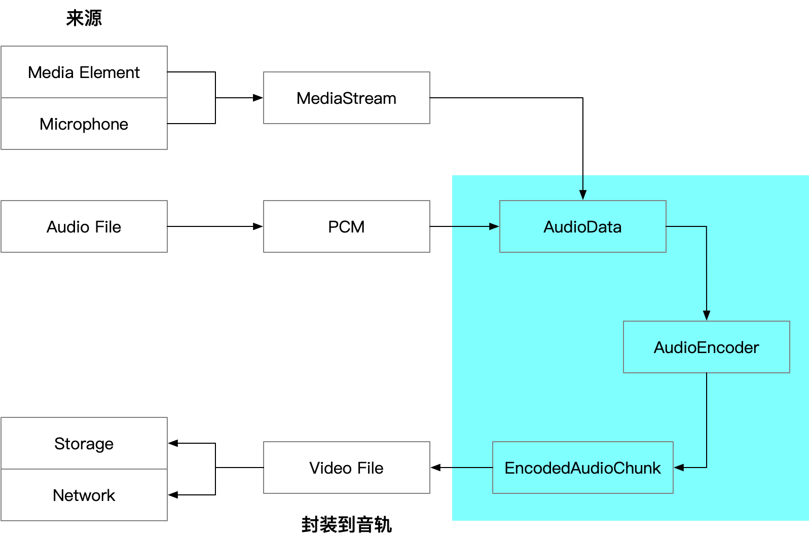

---
tags:
  - WebAV
  - 音视频
  - WebCodecs
  - Web
date: 2023-08-05
---

# Web 音视频（四）音频处理

*为什么单独介绍?*
1. 因为网络上缺乏音频处理的资料，绝大多数示例都是针对视频而略过音频，很多人在网上寻找音频处理的示例
2. 对前端开发者来说，音频处理相对视频略微复杂一些

所以，本文专门针对音频数据，汇总讲解**采集-处理-编码-封装**全过程，帮助初学者入门



## Web Audio API
> Web Audio API 提供了在 Web 上控制音频的一个非常有效通用的系统，允许开发者来自选音频源，对音频添加特效，使音频可视化，添加空间效果（如平移）等等。

开始前先提一下 [Web Audio API][1]，它包含非常多的 API 用于在 Web 中创建、处理音频；  
本文会依赖其中少量 API，但不会过多介绍，有兴趣的同学可以阅读张鑫旭的文章 [JS交互增加声音][2] 

## 采集

### 数字化声波
声音的本质是波；对一段连续声音进行采样，每一个点用一个浮点数来表示，声音就被数字化成了一个浮点数组；  
js 中通常使用 `Float32Array` 来描述。  

数字化（Pulse Code Modulation, PCM）一段声音后（`Float32Array`），还需要几个**关键属性**  
- SampleRate（采样率）：采样声波的频率，48KHz 就是每秒采样 48000 个数字
- ChannelCount（声道数）：声音来源数量，比如两个声波（双声道）采样后会得到两个 `Float32Array`，通常会将它们前后拼接成一个 `Float32Array`，前一半为左声道声波采样数据，后一半为右声道数据
- SampleSize（位深 Bit Depth）：用几个 bit 来记录某个点的值，`Float32Array` 即是每个点 32bit（4字节）浮点数

*为什么没有声音时长？*  
时长 `duration = Float32Array.length / ChannelCount / SampleRate`  
假设一段**单声道**音频数据（Float32Array）长度为 **96000**，SampleRate 为 **48KHz**  
那么它的时长为 `96000 / 1 / 48000 = 2` 秒

### 声音数据（Float32Array）来源
列举主要三个来源途径，直到`Float32Array`的转换过程  
1. 本地或网络音频文件 -> `ArrayBuffer` -> `AudioContext.decodeAudioData` -> `Float32Array`
2. `Video or Audio Element` -> `MediaElement.captureStream()` -> `MediaStream` -> `MediaStreamTrack` ->  `MediaStreamTrackProcessor` -> `AudioData` -> `Float32Array`
3. 麦克风、屏幕分享 -> `MediaStream` -> ...(如上)

转换过程不算复杂，只是需要阅读的 API 比较多；获得 `Float32Array` 后就可以进行下一步处理。  

## 处理

图像处理的计算复杂度高很多，依赖硬件加速；对前端开发者来说是绘制到 canvas，使用对应的 API 去操作，反而对音频处理更陌生。  
这里举几个常见例子，帮助大家熟悉音频处理逻辑。  

### 音量调节
中学物理学过，声波的振幅表示音量大小，乘以一个数可以改变振幅（音量）；  
所以 `Float32Array` 乘以 0~1 之间小数相当于降低音量，大于 1 相当于增大音量

```js
for (let i = 0; i < float32Arr.length; i++) float32Arr[i] *= 0.5
```

以上是原理，因为人耳对音量大小的感知是对数关系而不是线性的，实际音量调节要复杂很多，可阅读 [PCM 音量控制][3]

### 混流
因为声音的本质是波，所以多个声音混合即波的叠加，使用加法即可

`float32Arr1 + float32Arr2 => outFloat32Arr`  
```js
const len = Math.max(float32Arr1.length, float32Arr2.length)
const outFloat32Arr = new Float32Array(len)
for (let i = 0; i < len; i++) 
  outFloat32Arr[i] = (float32Arr1[i] ?? 0) + (float32Arr2[i] ?? 0)
```

### 声音淡入/淡出
最常见的场景，点击按钮暂停音乐时，声音大小是快速降低为 0，而不是瞬间消失。   
多年前很多音乐播放器是没有做声音淡出的，现在已经体验不到那种声音瞬间消失的难受感觉了。  

假设需要截断一个音频，为了前半段的音频结尾听起不那么难受，需要将结尾的 0.5s 音量降低至 0；音频采样率为 48KHz。  
```js
// 生成 1s 随机 PCM 数据
const pcmF32Arr = new Float32Array(Array(48000).fill(0).map(() => Math.random() * 2 - 1))
// 开始位置距离结尾 0.5s（采样率 / 2）
const start = pcmF32Arr.length - 1 - 48000 / 2
for (let i = 0; i < 48000 / 2; i += 1)
  pcmF32Arr[start + i] *= (1 - i / 48000 / 2)
```

### 重采样
重采的原理是对 `Float32Array` 进行抽取（降 48K -> 44.1）或插值（升 44.1K -> 48K）。  

而在 Web 中 AudioContext、OfflineAudioContext API 已经提供重采样能力

[audioResample 源码][4]
::: details
```js
/**
 * 音频 PCM 重采样
 * @param pcmData PCM
 * @param curRate 当前采样率
 * @param target { rate: 目标采样率, chanCount: 目标声道数 }
 * @returns PCM
 */
export async function audioResample (
  pcmData: Float32Array[],
  curRate: number,
  target: {
    rate: number
    chanCount: number
  }
): Promise<Float32Array[]> {
  const chanCnt = pcmData.length
  const emptyPCM = Array(target.chanCount)
    .fill(0)
    .map(() => new Float32Array(0))
  if (chanCnt === 0) return emptyPCM

  const len = Math.max(...pcmData.map(c => c.length))
  if (len === 0) return emptyPCM

  const ctx = new OfflineAudioContext(
    target.chanCount,
    (len * target.rate) / curRate,
    target.rate
  )
  const abSource = ctx.createBufferSource()
  const ab = ctx.createBuffer(chanCnt, len, curRate)
  pcmData.forEach((d, idx) => ab.copyToChannel(d, idx))

  abSource.buffer = ab
  abSource.connect(ctx.destination)
  abSource.start()

  return extractPCM4AudioBuffer(await ctx.startRendering())
}
```
:::

## 编码音频
因为 [AudioEncoder][6] 只能编码 [AudioData][5] 对象，所以需要先将 Float32Array 转换成 AudioData 对象。  
```js
new AudioData({
  // 当前音频片段的时间偏移
  timestamp: 0,
  // 双声道
  numberOfChannels: 2,
  // 帧数，就是多少个数据点，因为双声道，前一半左声道后一半右声道，所以帧数需要除以 2
  numberOfFrames: pcmF32Arr.length / 2,
  // 48KHz 采样率
  sampleRate: 48000, 
  // 通常 32位 左右声道并排的意思，更多 format 看 AudioData 文档
  format: 'f32-planar',
  data: pcmF32Arr
})
```

创建并初始化音频编码器
```js
const encoder = new AudioEncoder({
  output: (chunk) => {
    // 编码（压缩）输出的 EncodedAudioChunk
  },
  error: console.error
})

encoder.configure({
  // AAC 编码格式
  codec: 'mp4a.40.2',
  sampleRate: 48000,
  numberOfChannels: 2,
})

// 编码原始数据对应的 AudioData
encoder.encode(audioData)
```

::: tip
记得先使用 `AudioEncoder.isConfigSupported` 检测兼容性，可能不支持输出 `AAC` 编码格式
:::

## 封装
音频不能出现空隙
esds box
封装层、description 属性保持一致

## 附录
- [Web Audio API][1]
- [JS 交互增加声音][2]
- [PCM 音量控制][3]
- [audioResample 源码][4]
- [AudioData][5]
- [AudioEncoder][6]

[1]: https://developer.mozilla.org/zh-CN/docs/Web/API/Web_Audio_API
[2]: https://www.zhangxinxu.com/wordpress/2017/06/html5-web-audio-api-js-ux-voice/
[3]: https://blog.jianchihu.net/pcm-volume-control.html
[4]: https://github.com/hughfenghen/WebAV/blob/724dec000da070d0c5a0201bb409c41c3f654b92/packages/av-cliper/src/av-utils.ts#L136
[5]: https://developer.mozilla.org/en-US/docs/Web/API/AudioData
[6]: https://developer.mozilla.org/en-US/docs/Web/API/AudioEncoder