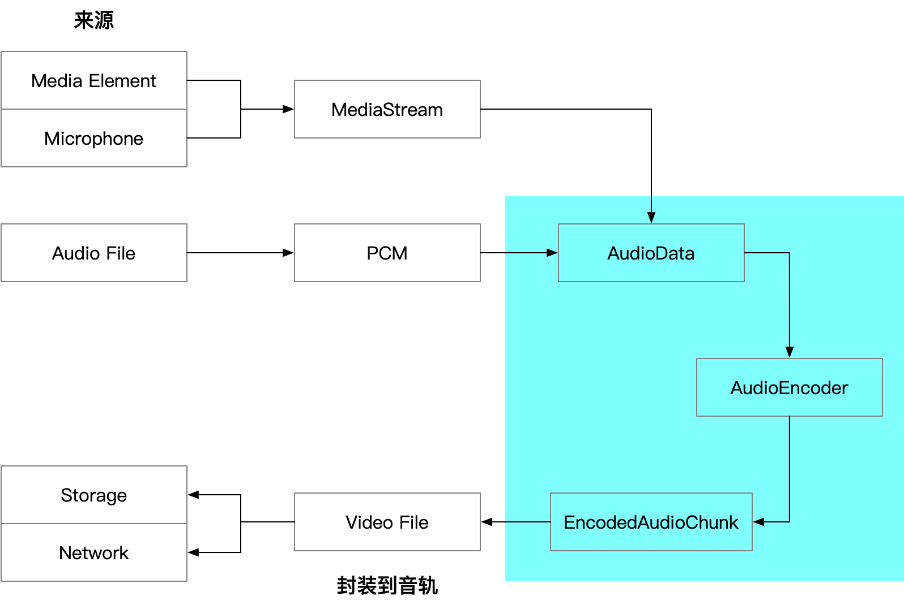

---
tags:
  - WebAV_EN
  - Audio & Video
  - WebCodecs
  - Web
date: 2023-08-05
---

# Web Audio & Video (4) Processing Audio in the Browser

> [**Web Audio & Video Series Table of Contents**](/tag/WebAV_EN)

_Why dedicate a chapter to audio processing?_

1. There's a scarcity of audio processing resources online, with most examples focusing on video while glossing over audio, leaving many searching for audio processing examples
2. For frontend developers, audio processing is slightly more complex than video processing

Therefore, this article specifically focuses on audio data, providing a comprehensive guide to the entire **capture-process-encode-mux** workflow to help beginners get started.


The above diagram shows the general workflow from audio capture to file muxing in the Web.

_You can skip the technical principles and jump directly to [WebAV Audio Encoding and Muxing Example](#webav-audio-encoding-and-muxing-example)_

## Capture

### Digitizing Sound Waves

**Sound is essentially a wave**. When sampling a continuous sound wave, each point is represented by a floating-point number, thus digitizing sound into a floating-point array. In JavaScript, **`Float32Array`** is commonly used to store these digitized floating-point arrays.
_Note: Any numeric array type can describe sound waves; we'll use `Float32Array` to represent PCM data throughout this article_

If you're unfamiliar with audio, waves, and digitization concepts, we **strongly recommend** experiencing [Waveforms][13]

After digitizing (Pulse Code Modulation, PCM) a sound segment into `Float32Array`, several **essential attributes** are needed to describe this data:

- SampleRate: The frequency at which the wave is sampled; 48KHz means 48,000 samples per second
- ChannelCount: The number of sound sources; for example, two waves (stereo) after sampling will yield two `Float32Array`s, typically concatenated into a single `Float32Array` with the left channel data in the first half and right channel data in the second half

**\*Why no duration attribute?**\*
Because duration can be calculated using `ChannelCount` and `SampleRate`:
`duration = Float32Array.length / ChannelCount / SampleRate`

For example, if a **mono** audio data (Float32Array) has a length of **96000** and a SampleRate of **48KHz**,
then the duration is: `96000 / 1 / 48000 = 2` seconds

### Sound Data (Float32Array) Sources

Here are three main audio sources and their conversion processes to `Float32Array`:

1. Local or network audio file -> `ArrayBuffer` -> `AudioContext.decodeAudioData` -> `Float32Array`
2. `Video or Audio Element` -> `MediaElement.captureStream()` -> `MediaStream` -> `MediaStreamTrack` -> `MediaStreamTrackProcessor` -> `AudioData` -> `Float32Array`
3. Microphone, screen sharing -> `MediaStream` -> ...(same as above)

The conversion process isn't complex, but it involves numerous APIs. Once you obtain the `Float32Array`, you can proceed to processing.

## Processing

Image processing has much higher computational complexity and relies on hardware acceleration. While frontend developers are familiar with drawing to canvas and using corresponding APIs, audio processing might feel less familiar.

Here are some common examples to help you understand audio processing logic. You can either write code to edit audio data or utilize existing Web Audio API features (like resampling).

### Web Audio API

> The Web Audio API provides a powerful and versatile system for controlling audio on the Web, allowing developers to choose audio sources, add effects to audio, create audio visualizations, apply spatial effects (like panning), and more.

Let's first mention the [Web Audio API][1], which includes numerous APIs for creating and processing audio in the Web.
We'll use a few of these APIs but won't cover them extensively. For those interested, check out Zhang Xinxu's article [Adding Sound to JS Interactions][2]

### Volume Control

As we learned in high school physics, wave amplitude represents volume. Multiplying by a number changes the amplitude (volume).
Therefore, multiplying a `Float32Array` by a decimal between 0 and 1 reduces volume, while multiplying by a number greater than 1 increases volume.

```js
for (let i = 0; i < float32Arr.length; i++) float32Arr[i] *= 0.5;
```

This is the basic principle, but **human perception of volume is logarithmic rather than linear**. Actual volume control is more complex; read more about [PCM Volume Control][3]

### Mixing

Since sound is essentially waves, mixing multiple sounds means adding waves together. Simple addition works:

`float32Arr1 + float32Arr2 => outFloat32Arr`

```js
const len = Math.max(float32Arr1.length, float32Arr2.length);
const outFloat32Arr = new Float32Array(len);
for (let i = 0; i < len; i++)
  outFloat32Arr[i] = (float32Arr1[i] ?? 0) + (float32Arr2[i] ?? 0);
```

### Fade In/Out

A common scenario is when clicking to pause music: the volume gradually decreases to 0 instead of abruptly stopping.  
Many years ago, music players didn't implement sound fade-out. Today, we rarely experience that jarring sensation of sound suddenly disappearing.

Let's say we need to truncate an audio file and want to make the ending of the first half less abrupt by fading out the last 0.5s. The audio sample rate is 48KHz.

```js
// Generate 1s of random PCM data
const pcmF32Arr = new Float32Array(
  Array(48000)
    .fill(0)
    .map(() => Math.random() * 2 - 1)
);
// Starting position 0.5s from the end (sampleRate / 2)
const start = pcmF32Arr.length - 1 - 48000 / 2;
for (let i = 0; i < 48000 / 2; i += 1)
  // Gradually reduce volume
  pcmF32Arr[start + i] *= 1 - i / 48000 / 2;
```

### Resampling

When input audio sample rate differs from output, or when mixing audio with different sample rates, resampling is necessary to change the audio's sample rate.

Resampling works by sampling or interpolating the `Float32Array`.  
For example, 48KHz audio has 48,000 points (numbers) per second. Reducing to 44.1KHz means removing `48000 - 44100` points per second.

In the Web, AudioContext and OfflineAudioContext APIs provide resampling capabilities, allowing us to resample audio without implementing the algorithms ourselves.

::: details Using OfflineAudioContext for Audio Resampling

```js
/**
 * Audio PCM Resampling
 * @param pcmData PCM
 * @param curRate Current sample rate
 * @param target { rate: Target sample rate, chanCount: Target channel count }
 * @returns PCM
 */
export async function audioResample (
  pcmData: Float32Array[],
  curRate: number,
  target: {
    rate: number
    chanCount: number
  }
): Promise<Float32Array[]> {
  const chanCnt = pcmData.length
  const emptyPCM = Array(target.chanCount)
    .fill(0)
    .map(() => new Float32Array(0))
  if (chanCnt === 0) return emptyPCM

  const len = Math.max(...pcmData.map(c => c.length))
  if (len === 0) return emptyPCM

  const ctx = new OfflineAudioContext(
    target.chanCount,
    (len * target.rate) / curRate,
    target.rate
  )
  const abSource = ctx.createBufferSource()
  const ab = ctx.createBuffer(chanCnt, len, curRate)
  pcmData.forEach((d, idx) => ab.copyToChannel(d, idx))

  abSource.buffer = ab
  abSource.connect(ctx.destination)
  abSource.start()

  return extractPCM4AudioBuffer(await ctx.startRendering())
}
```

:::
[WebAV audioResample function source code][4]

::: tip
In WebWorker environments where `OfflineAudioContext` isn't available, you can use JavaScript-based audio resampling libraries like [wave-resampler][14]

```js
import { resample } from 'wave-resampler';
// The Worker scope does not have access to OfflineAudioContext
if (globalThis.OfflineAudioContext == null) {
  return pcmData.map(
    (p) =>
      new Float32Array(
        resample(p, curRate, target.rate, { method: 'sinc', LPF: false })
      )
  );
}
```

:::

## Audio Encoding

Since [AudioEncoder][6] can only encode [AudioData][5] objects, we need to first convert Float32Array to AudioData.

```js
new AudioData({
  // Time offset for current audio segment
  timestamp: 0,
  // Stereo
  numberOfChannels: 2,
  // Frame count (number of data points); for stereo, divide by 2 as data is split between left and right channels
  numberOfFrames: pcmF32Arr.length / 2,
  // 48KHz sample rate
  sampleRate: 48000,
  // Usually means 32-bit interleaved channels; see AudioData docs for more formats
  format: 'f32-planar',
  data: pcmF32Arr,
});
```

Creating and initializing the audio encoder:

```js
const encoder = new AudioEncoder({
  output: (chunk) => {
    // EncodedAudioChunk output from encoding (compression)
  },
  error: console.error,
});

encoder.configure({
  // AAC encoding format
  codec: 'mp4a.40.2',
  sampleRate: 48000,
  numberOfChannels: 2,
});

// Encode the AudioData
encoder.encode(audioData);
```

::: tip
Remember to check compatibility using `AudioEncoder.isConfigSupported` before creating the encoder
:::

## Muxing

We'll continue using mp4box.js to demonstrate muxing `EncodedAudioChunk`

::: details Main Code

```js
const file = mp4box.createFile();
const audioTrackId = file.addTrack({
  timescale: 1e6,
  samplerate: 48000,
  channel_count: 2,
  hdlr: 'soun',
  // mp4a is the container format, corresponding to AAC codec
  type: 'mp4a',
  // meta from AudioEncoder output parameters
  // Without this field, Windows Media Player won't play audio
  description: createESDSBox(meta.decoderConfig.description),
});

/**
 * Convert EncodedAudioChunk | EncodedVideoChunk to MP4 addSample parameters
 */
function chunk2MP4SampleOpts(
  chunk: EncodedAudioChunk | EncodedVideoChunk
): SampleOpts & {
  data: ArrayBuffer,
} {
  const buf = new ArrayBuffer(chunk.byteLength);
  chunk.copyTo(buf);
  const dts = chunk.timestamp;
  return {
    duration: chunk.duration ?? 0,
    dts,
    cts: dts,
    is_sync: chunk.type === 'key',
    data: buf,
  };
}

// AudioEncoder output chunk
const audioSample = chunk2MP4SampleOpts(chunk);
file.addSample(audioTrackId, audioSample.data, audioSample);
```

:::
Due to length constraints, see [createESDSBox source code][7] for the above code's dependency

If you're implementing audio muxing yourself, note:

1. mp4box.js still has unfixed bugs in ESDS Box creation, [see details][8]
2. Data (addSample) can only be added after both audio and video tracks (addTrack) are created, and track creation requires meta data from encoders (VideoEncoder, AudioEncoder). See [synchronized audio/video track creation][9] code
3. Audio data timing (`Sample.cts`) apparently can't control audio offset. For silent periods, you still need to fill data, e.g., 10s of silent PCM data:  
   `new Float32Array(Array(10 * 48000).fill(0))`

## Web Audio & Video Audio Encoding and Muxing Example

Implementing audio encoding and muxing from scratch requires understanding the principles above plus extensive API reading and detail handling.

You can skip the details and use `@webav/av-cliper`'s utility functions `recodemux` and `file2stream` to quickly encode and mux audio into video files.

Here's the core code for capturing and muxing audio from a microphone:

```js
import { recodemux, file2stream } from '@webav/av-cliper';

const muxer = recodemux({
  // Video is currently required, see previous article for video frame capture
  video: {
    width: 1280,
    height: 720,
    expectFPS: 30,
  },
  audio: {
    codec: 'aac',
    sampleRate: 48000,
    channelCount: 2,
  },
});

// Write file every 500ms
// upload or write stream
const { stream, stop: stopOutput } = file2stream(muxer.mp4file, 500);

const mediaStream = await navigator.mediaDevices.getUserMedia({
  video: true,
  audio: true,
});
const audioTrack = mediaStream.getAudioTracks()[0];
const reader = new MediaStreamTrackProcessor({
  track: audioTrack,
}).readable.getReader();
async function readAudioData() {
  while (true) {
    const { value, done } = await reader.read();
    if (done) {
      stopOutput();
    }
    await muxer.encodeAudio(value);
  }
}
readAudioData.catch(console.error);
```

Here's the [complete example][11] for recording and exporting MP4 from camera and microphone. [Try the DEMO][12] now.

## Appendix

- [WebAV][10] Audio & video processing SDK built on WebCodecs
- [Camera & Microphone Recording DEMO][12]
- [Web Audio API][1]
- [Adding Sound to JS Interactions][2]
- [PCM Volume Control][3]
- [AudioData][5], [AudioEncoder][6]
- [WebAV audioResample Source Code][4]
- [WebAV createESDSBox Source Code][7]
- [wave-resampler][14] PCM audio resampler written entirely in JavaScript

[1]: https://developer.mozilla.org/zh-CN/docs/Web/API/Web_Audio_API
[2]: https://www.zhangxinxu.com/wordpress/2017/06/html5-web-audio-api-js-ux-voice/
[3]: https://blog.jianchihu.net/pcm-volume-control.html
[4]: https://github.com/bilibili/WebAV/blob/724dec000da070d0c5a0201bb409c41c3f654b92/packages/av-cliper/src/av-utils.ts#L136
[5]: https://developer.mozilla.org/en-US/docs/Web/API/AudioData
[6]: https://developer.mozilla.org/en-US/docs/Web/API/AudioEncoder
[7]: https://github.com/bilibili/WebAV/blob/bb95c96e2023fd27ef8abb45ab45aec5abff8b02/packages/av-cliper/src/mp4-utils.ts#L998
[8]: https://github.com/bilibili/WebAV/issues/10
[9]: https://github.com/bilibili/WebAV/blob/bb95c96e2023fd27ef8abb45ab45aec5abff8b02/packages/av-cliper/src/mp4-utils.ts#L171
[10]: https://github.com/bilibili/WebAV
[11]: https://github.com/bilibili/WebAV/blob/bb95c96e2023fd27ef8abb45ab45aec5abff8b02/packages/av-recorder/src/mux-mp4-worker.ts#L42
[12]: https://bilibili.github.io/WebAV/demo/4_1-recorder-usermedia
[13]: https://pudding.cool/2018/02/waveforms/
[14]: https://github.com/rochars/wave-resampler
