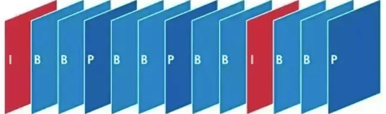
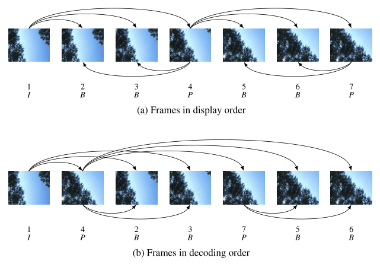

---
tags:
  - Audio & Video
  - WebCodecs
  - WebAV_EN
date: 2024-10-28
---

# Pure Web Video Editing

_[**ZingAI.video**](https://www.zingai.video) is a product that uses pure Web technology to implement editing functions. Welcome to try it._

---

## Introduction

The WebCodecs API provides audio and video codec capabilities for the Web platform, making it possible to implement efficient, professional video editing products on the Web platform (browser, Electron).

Readers can refer to the author's [introductory series][1] for more detailed information, or directly use the [WebAV][8] open-source project to **create/edit** audio and video files in the browser.

## Background & Solutions

To address the need for simple video editing in live streaming content submission scenarios, we needed to develop a lightweight video editing product.
This allows users to complete the live streaming - editing - submission workflow online.

Current video editing solutions on the Web platform include:

1. Cloud-based: Web UI for editing, with user operations synchronized to cloud for processing
2. ffmpeg.wasm: Compiling ffmpeg to WebAssembly for in-browser editing
3. WebCodecs: Using WebCodecs API for video data encoding/decoding, combined with Web APIs and third-party libraries

|               | Cloud  | ffmpeg.wasm | WebCodecs |
| ------------- | ------ | ----------- | --------- |
| Cost          | Poor   | Good        | Good      |
| Ecosystem     | Good   | Medium      | Poor      |
| Extensibility | Medium | Poor        | Good      |
| Compatibility | Good   | Good        | Poor      |
| Performance   | Medium | Poor        | Good      |

### Solution Analysis

The WebCodecs solution offers clear advantages in **cost and extensibility**, though its ecosystem maturity and compatibility are somewhat lacking.  
Cloud-based solutions are currently mainstream; with sufficient project budget, they can complement WebCodecs well.  
ffmpeg.wasm is impractical due to poor performance.

**WebCodecs Solution**

**Advantages**

- Cost: Requires minimal Web development to implement frontend editing features, reducing both development costs and technical complexity, with no server running or maintenance costs
- Extensibility: Easy integration with Canvas and WebAudio for custom functionality

**Disadvantages**

- Ecosystem Maturity: Lacks readily available transitions, filters, effects, and supports limited container formats
- Compatibility: Requires Chrome/Edge 94+ (approximately 10% of users incompatible)

Given the product positioning (lightweight editing tool) and user characteristics (streamers), these drawbacks are acceptable because:

- Ecosystem immaturity is a development cost issue rather than a capability limitation; existing features meet current product needs
- Compatibility is a temporal issue; proper prompting can guide users to upgrade their browsers

For WebCodecs performance and optimization insights, read [this article][7].

Based on the above, we chose the WebCodecs solution.

## Feature Analysis

Developing a video editing product requires three steps:

1. Implement asset management module
2. Implement canvas module
3. Implement timeline module

Each module contains numerous sub-features like asset management, thumbnails, preview playback, which can be broken down into fundamental capabilities and implemented using Web platform APIs.

Let's explore these fundamental capabilities' implementation principles, mastering which enables building complete editing functionality.

## Implementing Core Capabilities

### Asset Loading and Storage

Audio and video assets are typically large, incurring time and bandwidth costs for upload and download.

While the Web platform previously had many file read/write limitations, the OPFS API now significantly improves user experience.

OPFS (Origin Private File System) provides each website with private storage space, allowing Web developers to create, read, and write files without user authorization, offering better performance compared to user space file operations.

For details, read [Web File System (OPFS and Tools) Introduction][5]

### Asset Parsing

We know that **video consists of a series of images**

Raw audio and video data is enormous; for efficient storage and transmission, it needs to be **compressed and packaged** into common media file formats.

1. Image frames are compressed in groups (temporally adjacent images are often very similar, achieving higher compression ratios)
2. Multiple compressed frame groups plus metadata (codec, duration, subtitles, etc.) form the audio/video file

Compressed image frames are categorized into I/P/B types, with I-frames and subsequent P/B frames forming a Group of Pictures (GOP).

The first step in processing audio/video data is file parsing to obtain raw data, which follows this reverse process:

`Video File -> Demux -> Compressed Frames -> Decode -> Raw Image Frames`

- Use third-party libraries (like mp4box.js) to demux video files, obtaining compressed frames
- Use WebCodecs API to decode compressed frames into raw image frames

_EncodedVideoChunk (compressed frame) can be converted to VideoFrame (raw image frame) through VideoDecoder_

_Learn more in [Parsing Video in the Browser][3]_

### Video Frame Seeking and Traversal

Since video files are typically large, loading them entirely into memory is impractical. Instead, data is read and decoded from disk as needed.

For example, to add a watermark to video frames between 10-20s:

1. Locate frames between 10-20s in the file
2. Read and decode corresponding frames from disk to get raw images
3. Draw text on the images, then re-encode to generate new compressed frames

This shows that frame seeking and streaming traversal is the first step in audio/video processing.

As mentioned earlier, video frames are grouped with different types within groups, so seeking and decoding must follow a specific order.

Image frame sequence (display order) showing the relationship between frame types and decoding order, _note the numbers and frame types_.

Read more about [The Relationship Between I/P/B Frames, GOP, IDR, and PTS, DTS][6]

### Image Processing

With the above knowledge, we can now freely read or traverse all image frames in a video file.

Simple image processing, like drawing new content (text, images) on original images or applying basic filters, can be implemented using Canvas API.

Complex image processing, such as green screen keying, effects, custom filters, requires WebGL Shader code.

WebGL Shader code runs on the GPU, efficiently processing all pixel values in each frame concurrently.

### Spatial and Temporal Properties

**Spatial properties refer to asset coordinates, size, and rotation angle**

When exporting video, we can create animation effects by dynamically setting spatial properties of image frames based on time.

For example, for an image asset's translation animation (0s ~ 1s, x-coordinate 10 ~ 100), at 0.5s the frame coordinate would be `x = (100 - 10) * (0.5 / 1)`.

**Temporal properties refer to asset time offset and duration in the video**

These two properties describe an asset's position on the video timeline.

When assets support spatial and temporal properties, we can not only programmatically set properties for animations but also enable user control (drag, scale, rotate, etc.) through mouse operations.

## Conclusion

1. Understanding these fundamental capabilities' principles, plus some patience and time, enables implementing most video editing features
2. These capabilities extend beyond editing to client-side batch video processing, live streaming, and enhanced playback scenarios
3. Audio/video processing on the Web platform involves many details and requires numerous APIs. Continue exploring through our [article series][1] and open-source [WebAV SDK][8].

## Appendix

- [Web Audio & Video Introductory Series][1]
- [WebCodecs Performance and Optimization Insights][7]
- [WebAV][8]: SDK for creating/editing audio and video files on the Web platform
- [Parsing Video in the Browser][3]
- [High-Performance Video Frame Capture Based on WebCodecs][4]
- [Web File System (OPFS and Tools) Introduction][5]
- [Relationship Between I-frames, P-frames, B-frames, GOP, IDR, and PTS, DTS][6]

[1]: https://fenghen.me/tag/WebAV_EN/
[3]: https://fenghen.me/posts/2023/07/23/webav-2-parse-video/
[4]: https://www.bilibili.com/read/cv30358687/
[5]: https://fenghen.me/posts/2024/03/14/web-storage-and-opfs/
[6]: https://www.cnblogs.com/yongdaimi/p/10676309.html
[7]: https://fenghen.me/posts/2024/07/27/webcodecs-performance-benchmark/
[8]: https://github.com/WebAV-Tech/WebAV
