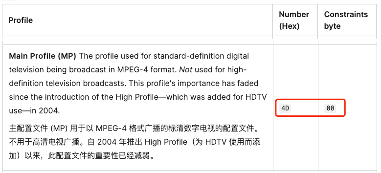

---
tags:
  - 音视频
  - WebCodecs
date: 2024-05-11
---

# WebCodecs 编码字符串（codec）介绍

> 笔者的 [**Web 音视频系列文章**](/tag/WebAV)

视频播放经常会看到这样的字符串 `video/mp4; codecs="avc1.4d002a"`，WebCodecs 编解码器初始化也需要配置 [codec 参数][1]，本文尝试简单介绍编码字符串含义。

视频编码分许多种类，每个种类还分多个版本，不同种类、版本对应的编解码算法、支持的能力（分辨率上限、色深等等）不同。

所以编码字符串（比如 `avc1.4d002a`）就是规格符号，表示该文件是采用**哪种规格生产出来的**，**如果要正确解码**该文件的数据，就**需要使用同样规则符号**去初始化一个解码器。

---

最常见的 AVC 编码字符串模式是 [`avc1[.PPCCLL]`][2]，说明及翻译如下。

> PPCCLL are six hexadecimal digits specifying the profile number (PP), constraint set flags (CC), and level (LL). See AVC profiles for the possible values of PP.
> PPCCLL 是六个十六进制数字，指定配置文件编号 ( PP )、约束集标志 ( CC ) 和级别 ( LL )。请参阅 AVC 配置文件以了解 PP 的可能值。

> The constraint set flags byte is comprised of one-bit Boolean flags, with the most significant bit being referred to as flag 0 (or constraint_set0_flag, in some resources), and each successive bit being numbered one higher. Currently, only flags 0 through 2 are used; the other five bits must be zero. The meanings of the flags vary depending on the profile being used.
> 约束集标志字节由一位布尔标志组成，最高有效位称为标志 0（或在某些资源中为 constraint_set0_flag ），并且每个连续位的编号较高。目前，仅使用标志 0 到 2；其他五位必须为零。标志的含义根据所使用的配置文件而有所不同。

> The level is a fixed-point number, so a value of 14 (decimal 20) means level 2.0 while a value of 3D (decimal 61) means level 6.1. Generally speaking, the higher the level number, the more bandwidth the stream will use and the higher the maximum video dimensions are supported.
> Level 是定点数，因此值 14 （十进制 20）表示级别 2.0，而值 3D （十进制 61）表示级别 6.1。一般来说，级别数越高，流将使用的带宽就越多，支持的最大视频尺寸就越高。

以 `avc1.4d002a` 为例

1. `avc1` 表示采用 AVC （也称 H.264）来编码（压缩）图像数据
2. `4d00` 的含义可从 [`avc1[.PPCCLL]`][2] 后面查询到
   

3. `2a` Level 值对应 `4.2`(`2a` 转 10 进制等于 42，再除以 10 等于 `4.2`)，它对视频参数的限制参考 [wiki][3]
   > As the term is used in the standard, a "level" is a specified set of constraints that indicate a degree of required decoder performance for a profile. For example, a level of support within a profile specifies the maximum picture resolution, frame rate, and bit rate that a decoder may use. A decoder that conforms to a given level must be able to decode all bitstreams encoded for that level and all lower levels.
   > 在标准中，"Level"是指一组指定的约束条件，用于指示配置文件所需的解码器性能水平。例如，在一个配置文件中，支持的级别指定了解码器可以使用的最大图像分辨率、帧率和比特率。符合特定级别的解码器必须能够解码该级别及所有较低级别编码器输出的数据。
   > 

从以上分析可以 `avc1.4d002a` 支持的最大分辨率是 `2048×1080`，如果使用此规格初始化编码器，试图编码超过最大分辨率的图像就会抛出错误；  
假设要编码生成 4k 视频，就需要选择一个合适的编码字符串去初始化编码器，比如 `avc1.640034`。

---

其他编码格式（如`av1`）虽然字符串模式不完全一致，但可用相同的方法进行分析。

## 附录

- [WebCodecs VideoEncoder.codec][1]
- [avc 编码字符串][2]
- [Advanced_Video_Coding][3]

[1]: https://developer.mozilla.org/en-US/docs/Web/API/VideoEncoder/configure#codec
[2]: https://developer.mozilla.org/en-US/docs/Web/Media/Formats/codecs_parameter#avc1.ppccll
[3]: https://en.wikipedia.org/wiki/Advanced_Video_Coding
