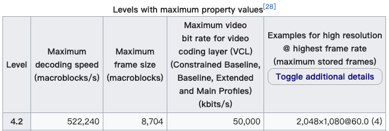

---
tags:
  - Audio & Video
  - WebCodecs
  - WebAV_EN
date: 2024-05-11
---

# Understanding WebCodecs Codec Strings

> From the author's [**Web Audio & Video Series**](/tag/WebAV_EN)

When working with video playback, you'll often encounter strings like `video/mp4; codecs="avc1.4d002a"`. WebCodecs encoders and decoders also require [codec parameters][1] during initialization. This article aims to explain these codec strings in simple terms.

Video encoding comes in many types, each with multiple versions. Different types and versions correspond to different encoding/decoding algorithms and capabilities (maximum resolution, color depth, etc.).

Therefore, a codec string (like `avc1.4d002a`) serves as a specification identifier, indicating **which standard was used to produce** the file. To **correctly decode** the file's data, you **need to use the same specification identifier** when initializing a decoder.

---

The most common AVC codec string pattern is [`avc1[.PPCCLL]`][2]. Here's the explanation:

> PPCCLL are six hexadecimal digits specifying the profile number (PP), constraint set flags (CC), and level (LL). See AVC profiles for the possible values of PP.

> The constraint set flags byte is comprised of one-bit Boolean flags, with the most significant bit being referred to as flag 0 (or constraint_set0_flag, in some resources), and each successive bit being numbered one higher. Currently, only flags 0 through 2 are used; the other five bits must be zero. The meanings of the flags vary depending on the profile being used.

> The level is a fixed-point number, so a value of 14 (decimal 20) means level 2.0 while a value of 3D (decimal 61) means level 6.1. Generally speaking, the higher the level number, the more bandwidth the stream will use and the higher the maximum video dimensions are supported.

Let's analyze `avc1.4d002a` as an example:

1. `avc1` indicates that AVC (also known as H.264) is used to encode (compress) the image data
2. The meaning of `4d00` can be found in the [`avc1[.PPCCLL]`][2] documentation
   

3. The Level value `2a` corresponds to `4.2` (`2a` in decimal is 42, divided by 10 equals `4.2`). Its constraints on video parameters are detailed in the [wiki][3]:
   > As the term is used in the standard, a "level" is a specified set of constraints that indicate a degree of required decoder performance for a profile. For example, a level of support within a profile specifies the maximum picture resolution, frame rate, and bit rate that a decoder may use. A decoder that conforms to a given level must be able to decode all bitstreams encoded for that level and all lower levels.
   > 

From this analysis, we can see that `avc1.4d002a` supports a maximum resolution of `2048×1080`. If you try to encode images exceeding this maximum resolution using an encoder initialized with this specification, it will throw an error.  
For example, if you need to encode 4K video, you'll need to choose a suitable codec string to initialize the encoder, such as `avc1.640034`.

---

While other encoding formats (like `av1`) may have slightly different string patterns, they can be analyzed using the same approach.

## Appendix

- [WebCodecs VideoEncoder.codec][1]
- [AVC Codec String][2]
- [Advanced_Video_Coding][3]

[1]: https://developer.mozilla.org/en-US/docs/Web/API/VideoEncoder/configure#codec
[2]: https://developer.mozilla.org/en-US/docs/Web/Media/Formats/codecs_parameter#avc1.ppccll
[3]: https://en.wikipedia.org/wiki/Advanced_Video_Coding
