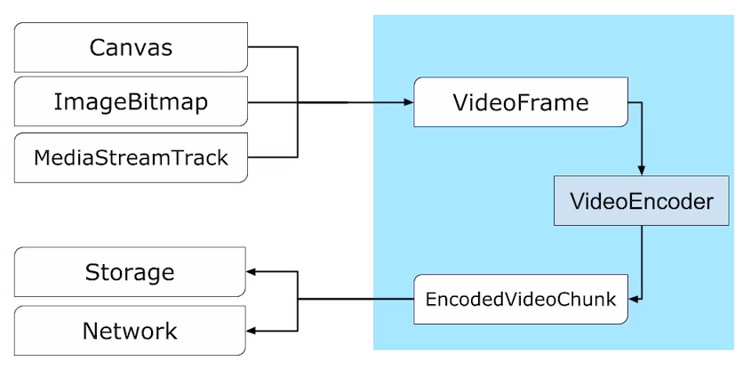
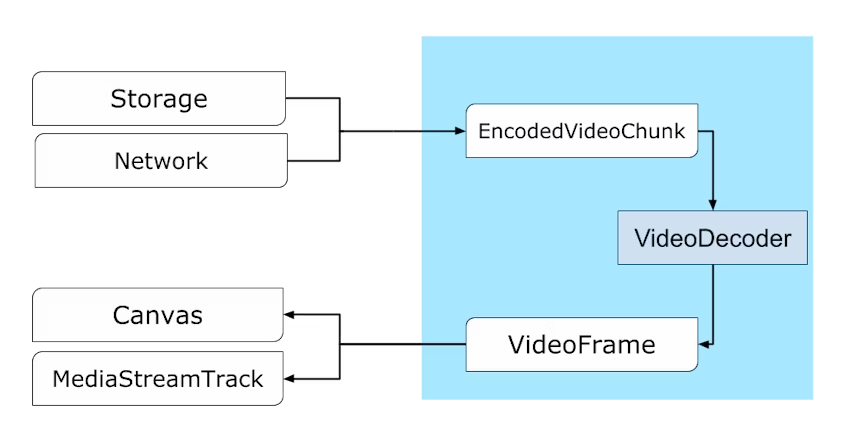
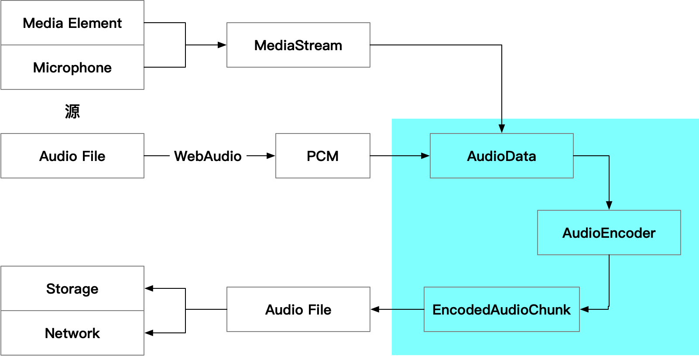

---
tags:
  - WebAV
  - 音视频
  - WebCodecs
date: 2023-10-06
---

# WebCodecs 开启 Web 音视频新篇章 

## WebCodecs 是什么

- WebCodecs 是一个 Web 规范，21 年 9 月份在 Chrome 94 中实现
- WebCodecs 提供访问编解码能力的接口，可精细控制音视频数据

### Web 音视频 API 存在什么问题
音视频技术在 Web 平台上的应用非常广泛，已有许多 Web API 间接调用了编解码器来实现特定功能：  
- 视频播放：MSE、HTMLMediaElement
- 音频解码：WebAudio
- 录制视频：MediaRecorder
- 实时流媒体：WebRTC
  
但没有方法可以灵活配置或直接访问编解码器，所以许多应用使用 JS 或 WASM （比如 ffmpeg.js）来实现编解码功能，尽管存在诸多缺陷或限制：  
- 降低了性能（WebCodecs 编码速度可达到 ffmpeg.js 的 20 倍）
- 增加功耗
- 额外网络开销下载已内置的编解码器

这么做的原因是 Web API 在特定场景都存在难以克服的障碍  
- WebAudio 只能解码完整的音频文件，但不支持数据流、不提供解码进度信息、更不支持编码
- MediaRecorder 只能录制特定格式（WebM、MP4）的视频，无法控制编码速度、输出缓冲区等
- WebRTC 与 MediaStream API 高度耦合，且不透明，仅能用于实时音视频通信
- Video 标签、MSE 最常用于视频播放，但无法控制解码速率、缓冲区长度，且只支持播放部分视频容器格式

总结：**目前 API 在特定场景做到简单、够用，但无法实现高效且精细地控制**  

### WebCodecs 设计目标

- **流式传输**：对远程、磁盘资源进行流式输入输出
- **效率**：充分利用设备硬件，在 Worker 中运行
- **组合性**：与其他 Web API(如 Streams、WebTransport 和 WebAssembly)配合良好
- **可恢复性**：在出现问题时能够恢复的能力(网络不足、资源缺乏导致的帧下降等)
- **灵活性**：能适应各种场景(硬实时、软实时、非实时)，能在此之上实现类似 MSE 或 WebRTC 的功能
- **对称性**：编码和解码具有相似的模式


### 非 WebCodecs 目标  
- 视频容器 封装/解封装 相关 API
- 在 JS 或 WASM 中实现编解码器

以上总结于 [译 WebCodecs 说明][1]，让大家快速了解 WebCodecs API 的背景和目标

<!-- PPT 配图 -->
<!-- 二维码：WebCodecs 提案 说明， 原文、译文 -->

## WebCodecs 能做什么

### WebCodecs API 介绍

先了解 WebCodecs API 在视频生产消费链路所处的位置  


由图可知 WebCodecs API **提供的能力**：  
- 控制编解码过程
- 访问编解码前后的底层数据



- `VideoFrame、EncodedVideoChunk` 对应编码前的源图像和编码后的压缩数据，两者均提供获取底层二进制数据的接口；  
- `VideoEncoder、VideoDecoder` 用于 `VideoFrame、EncodedVideoChunk` 两者的类型转换
- 这里可以看到编码、解码过程在 API 设计上的对称性
- 图像编解码习得的知识，同样可以对称迁移到音频编解码

  


音频数据转换可与 Web Audio 配合，涉及的 API 比图像数据更多一些  

以上就是 WebCodecs 提供的核心 API，新增 API 的数量非常少；  
不过，设计的音视频背景知识、与之相互配合的 Web API 需要一定时间学习  

#### 相关 Web API
音视频生产消费链路中，WebCodecs **不涉及部分**由其他 Web API 提供  
- 音视频数据的采集与渲染
  - 源：navigator.mediaDevices、Canvas、Web Audio ...
  - 输出：Canvas、Web Audio、HTMLMediaElement ...
- 封装/解封装
  - 第三方库提供，可由 JS/WASM 实现
- 传输、存储
  - fetch、WebTransport、OPFS ...

基于 Web 平台已有的能力，加上 WebCodecs 提供的编解码能力，能帮助开发者实现那些功能呢？  

### 视频生产，从零到一
由于缺失编码能力，导致 Web 端少有视频生产工具；现有的 Web 视频剪辑工具都强依赖服务端能力支持，交互体验存在优化空间；  

在 Web 页面借助 Canvas 制作动画是非常简单的，借助 WebCodecs 的编码能力，现在就能将动画快速保存为视频。  

视频裁剪、添加水印、内嵌字幕等基础视频剪辑能力，没有 WebCodecs 都是难以实现的。  

WebCodecs 将填补该领域的空白。  

### 视频消费，精细控制
借助 HTMLMediaElement、MSE，Web 平台的视频消费应用已经非常成熟；  
以上 API 虽然简单易用，但无法控制细节，常有美中不足之感

比如，缓冲延迟控制、逐帧播放、超快速播放、解码控制等

WebCodecs 将支持构建更强、体验更好的视频消费应用  

### 算力转移，成本体验双赢
目前 Web 使用的音视频服务，其处理过程都是在服务器上完成的

比如，众多在线视频处理工具提供的：压缩（降低分辨率、码率）、水印、变速、预览图 功能

处理流程：用户上传视频 -> 服务器处理 -> 用户下载视频；  
整个过程消耗了服务器的计算成本、带宽成本，用户上传下载的等待时间，且处理过程是不透明的，不能预览  

WebCodecs 能让更多的任务在本地运行，不仅降低了服务运营成本，还能提升用户体验

### DEMO 演示及实现
WebCodecs 是相对底层 API，实现产品功能需要编写大量的上层代码；  
所以这里引用作者开源的 WebAV 来演示功能实现  

[WebAV][3] 基于 WebCodecs，**尝试提供简单易用的 API 在浏览器中处理音视频数据**  

**1. 快速解码**  
以设备最快的速度解码一个 20s 的视频，并将视频帧绘制到 Canvas 上  

<video style="width: 100%;" src="./decode-video-demo.mp4" controls></video>

```js
import { MP4Clip } from '@webav/av-cliper'

// 传入一个 mp4 文件流即可初始化
const clip = new MP4Clip((await fetch('<mp4 url>')).body)
await clip.ready

let time = 0
// 最快速度渲染视频所有帧
while (true) {
  const { state, video: videoFrame } = await clip.tick(time)
  if (state === 'done') break
  if (videoFrame != null && state === 'success') {
    ctx.clearRect(0, 0, cvs.width, cvs.height)
    // 绘制到 Canvas
    ctx.drawImage(videoFrame, 0, 0, videoFrame.codedWidth, videoFrame.codedHeight)
    // 注意，用完立即 close
    videoFrame.close()
  }
  // 时间单位是 微秒，所以差不多每秒取 30 帧，丢掉多余的帧
  time += 33000
}
clip.destroy()
```

**2. 添加水印**  
给视频添加随时间移动的半透明文字水印

<video style="width: 100%;" src="./watermask-demo.mp4" controls></video>

```js
const spr1 = new OffscreenSprite(
  new MP4Clip((await fetch('<mp4 url>')).body)
)

const spr2 = new OffscreenSprite(
  new ImgClip('水印')
)
spr2.setAnimation(/* animation config */)

const com = new Combinator()

await com.add(spr1, { main: true })
await com.add(spr2, { offset: 0 })
// com.ouput() => 输出视频流 
```


**3. 绿幕抠图**  
带绿幕的数字人形象与背景图片合成视频，使用 WebGL 对每帧图像进行处理，将人物背景修改为透明效果  

<video style="width: 100%;" src="./chromakey-demo.mp4" controls></video>

```js
// 创建抠图工具函数
const chromakey = createChromakey(/* 绿幕抠图配置 */)
// 背景绿幕的测试视频
const clip = new MP4Clip((await fetch('<mp4 url>')).body)
// MP4 的每一帧 都会经过 tickInterceptor
clip.tickInterceptor = async (_, tickRet) => {
  if (tickRet.video == null) return tickRet
  return {
    ...tickRet,
    // 抠图之后再返回
    video: await chromakey(tickRet.video)
  }
}
```

**4. 花影**  
在浏览器中运行的视频录制工具，可用于视频课程制作、直播推流工作台  
视频演示视频课程制作的基本操作，包含 “**添加摄像头、分享屏幕、修改素材层级、剪切视频片段、预览导出视频**” 五个步骤  

<video style="width: 100%;" src="./Bloom-Shadow-demo.mp4" controls></video>

<!-- 二维码：WebAV、系列文章、花影项目 -->

## WebCodecs 会带来什么改变

**应用场景预测**  
- 视频生产工具
  - 视频剪辑、直播工作台，搭配多人协同、AI 能力  
- 视频消费工具
  - 播放器、视频会议、云游戏
- 算力转移
  - 视频压缩、缩略图生成、植入水印、调整速率

没有 WebCodecs 以上的工具已经存在了，为什么相信它们会应用 WebCodecs？  

首先，有了 WebCodecs 之后这些工具能做到体验更好、更便宜、迭代更快；  
再结合以往经验和 Web 平台所具备优势，相信 WebCodecs 未来会得到广泛应用  

分享两个例子

**1. 用户视频消费行为变化**  
1. 荒芜 时代  
   Web 不支持流媒体，PC 硬件标配光驱，软件标配本地播放器  
   用户行为：下载电影然后离线观看  
2. Flash 时代  
   Flash 插件是浏览器的标配，可以播放 FLV 视频
   用户行为：在线观看视频逐渐流行  
3. HTML5 时代  
   Video 标签可直接播放 MP4 视频，对与大量已存在的 FLV 视频文件转封装为 fMP4，使用 MSE API 播放；FLV.js 成为明星项目  
   用户行为：在线观看视频成为首选
4. WebCodecs 时代  
   补齐音视频编解码能力  
   用户行为：预计 WebCodecs 配合 AI 加多人协同，音视频剪辑、视频会议、直播推流等工具将逐渐 Web 化  

**2. 富文本编辑**  
Web 开放了几个核心 API，让大部分文字编辑转移到线上，产生大量优秀的知识管理应用  
借助 Web 的易访问性、搭配协同编辑，将生产沟通效率提升了一个等级　　
- contenteditable：可编辑节点
- Selection：选区
- Range：文档片段

还有大量产品案例：Notion、Figma、Web PhotoShop、VSCode、slack...

总结：**一旦 Web 平台具备某个领域的基础能力，相关产品不可避免的 Web 化**  

## WebCodecs 的优势与缺憾

### 优势
WebCodecs 的优势在于 Web 平台  
- Web 平台天然具有的优势
  - 跨平台
  - 开放、易访问性
  - 迭代效率
- Web 底层能力越来越完善，已具备构建大型、专业应用的条件
  - WASM、WebGPU、OPFS、WebTransport

### 缺憾
- 生态不成熟
  - 比如 缺少优秀的 封装/解封装 工具包，支持容器格式有限
  - 需要更多音视频、前端开发者参与共同推动
- 兼容性
  - Firefox、旧版本浏览器不支持 WebCodecs
  - to C 的产品需要做好降级
- 受限于浏览器提供的编解码器
  - 编解码的可控参数不够丰富（为了通用性不可避免的交换）
  - 暂无法自定义编解码器

## 愿景
- WebCodecs 成为 Web 平台音视频处理的基础；  
- WebCodecs 像 HTML5 一样，促进音视频在 Web 平台的应用和发展。 


## 附录
- [译 WebCodecs 说明][1]
- [Web 音视频（零）概览][2]
- [WebAV][3] 基于 WebCodecs 构建的音视频处理 SDK
- [花影][4] 在浏览器中运行的视频录制工具

[1]: /posts/2023/10/02/webcodecs-explainer/
[2]: /posts/2023/07/16/webav-0-overview/
[3]: https://github.com/hughfenghen/WebAV
[4]: https://github.com/hughfenghen/bloom-shadow
