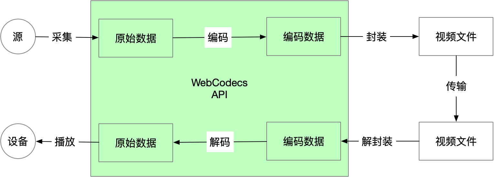
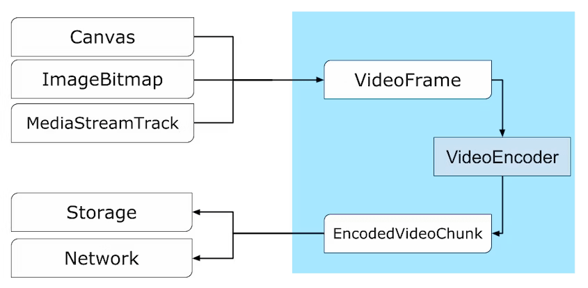

---
tags:
  - WebAV
  - 音视频
  - WebCodecs
date: 2023-10-06
---

# WebCodecs 开启 Web 音视频新篇章

_你可以先略过下面的无聊文字，体验一番 [WebCodecs 的实力][6]_

## WebCodecs 是什么

- WebCodecs 是一个 Web 规范，21 年 9 月份在 Chrome 94 中实现
- WebCodecs 提供访问编解码能力的接口，可精细控制音视频数据

### Web 音视频 API 存在什么问题

音视频技术在 Web 平台上的应用非常广泛，已有许多 Web API **间接调用了编解码**器来实现特定功能：

- 视频播放：MSE、HTMLMediaElement
- 音频解码：WebAudio
- 录制视频：MediaRecorder
- 实时流媒体：WebRTC

但没有方法可以灵活配置或直接访问编解码器，所以许多应用使用 JS 或 WASM （比如 ffmpeg.wasm）来实现编解码功能，尽管**存在诸多缺陷或限制**：

- 低性能（WebCodecs 编码速度可达到 ffmpeg.wasm 的 20 倍）
- 高功耗
- 额外网络开销（下载已内置的编解码器）

这么做的原因是以前的 Web API 在特定场景都**存在难以克服的障碍**：

- WebAudio 只能解码完整的音频文件，但不支持数据流、不提供解码进度信息、更不支持编码
- MediaRecorder 只能录制特定格式（WebM、MP4）的视频，无法控制编码速度、输出缓冲区等
- WebRTC 与 MediaStream API 高度耦合，且不透明，仅能用于实时音视频通信
- Video 标签、MSE 最常用于视频播放，但无法控制解码速率、缓冲区长度，且只支持播放部分视频容器格式

总结：**目前 API 在特定场景做到简单、够用，但无法实现高效且精细地控制**

### WebCodecs 设计目标

- **流式传输**：对远程、磁盘资源进行流式输入输出
- **效率**：充分利用设备硬件，在 Worker 中运行
- **组合性**：与其他 Web API(如 Streams、WebTransport 和 WebAssembly)配合良好
- **可恢复性**：在出现问题时能够恢复的能力(网络不足、资源缺乏导致的帧下降等)
- **灵活性**：能适应各种场景(硬实时、软实时、非实时)，能在此之上实现类似 MSE 或 WebRTC 的功能
- **对称性**：编码和解码具有相似的模式

### 非 WebCodecs 目标

- 视频容器 封装/解封装 相关 API
- 在 JS 或 WASM 中实现编解码器

以上总结于 [译 WebCodecs 说明][1]，让大家快速了解 WebCodecs API 的背景和目标

## WebCodecs 能做什么

### WebCodecs API 介绍

先了解 WebCodecs API 在视频生产消费链路所处的位置



由图可知 WebCodecs API **提供的能力**：

- 控制编解码过程
- 访问编解码前后的底层数据



- `VideoFrame、EncodedVideoChunk` 对应编码前的源图像和编码后的压缩数据，两者均提供获取底层二进制数据的接口；
- `VideoEncoder、VideoDecoder` 用于前两者的类型转换
- Web 平台所有表达图像相关的类型，都可以转换为 `VideoFrame`
- 这里可以看到编码、解码过程在 API 设计上的对称性
- 图像编解码习得的知识，同样可以对称迁移到音频编解码


以上就是 WebCodecs 提供的核心 API，新增 API 的数量非常少，主要难点在音视频相关的背景知识。

利用 `mp4box.js` 解封装 mp4 文件，得到 `EncodedVideoChunk` 后给 WebCodecs 解码，即可实现 mp4 -> 图像帧。  


#### WebCodecs 不涉及环节

音视频生产消费链路中，由其他 Web API 提供，包括：

- 音视频数据的采集与渲染
- 封装/解封装
- 传输、存储

### 相关 Web API

基于底层 API 可以构建的基础能力


- WebAudio：音频处理
- WebGPU/WebGL + OffscreenCanvas：离屏图像处理
- OPFS：本地文件读写
- WebWorker + WASM：密集型计算
- WebTransport：低延迟网络传输

_基于 Web 平台已有的能力，加上 WebCodecs 提供的编解码能力，能帮助开发者实现那些功能呢？_

### DEMO 演示及实现

WebCodecs 是相对底层 API，简单功能可能也需要写非常多的辅助代码，可以借助 WebAV 封装的工具函数来快速实现功能

**[WebAV][3] 基于 WebCodecs，提供简单易用的 API 在浏览器中处理音视频数据**

接下来演示 DEMO 效果以及基于 WebAV 的代码实现

**1. 可控解码**  
以设备最快的速度解码一个 20s 的视频，并将视频帧绘制到 Canvas 上  
可控解码的意义不只是它能实现超快速或逐帧播放视频，而在于它能快速遍历所有帧，这是视频处理的基础

<video style="width: 100%;" src="./decode-video-demo.mp4" controls></video>

首先从 WebAV 导出一个 MP4Clip 对象，它只需要一个 MP4 文件 URL 进行初始化  
然后使用 tick 方法获取到视频帧，再绘制到 canvas 上  
`while true` 表示不做任何等待，所以到底有多快取决于网络下载和设备解码的速度

```js
import { MP4Clip } from '@webav/av-cliper';

// 传入一个 mp4 文件流即可初始化
const clip = new MP4Clip((await fetch('<mp4 url>')).body);
await clip.ready;

let time = 0;
// 最快速度渲染视频所有帧
while (true) {
  const { state, video: videoFrame } = await clip.tick(time);
  if (state === 'done') break;
  if (videoFrame != null && state === 'success') {
    ctx.clearRect(0, 0, cvs.width, cvs.height);
    // 绘制到 Canvas
    ctx.drawImage(
      videoFrame,
      0,
      0,
      videoFrame.codedWidth,
      videoFrame.codedHeight
    );
    // 注意，用完立即 close
    videoFrame.close();
  }
  // 时间单位是 微秒，所以差不多每秒取 30 帧，丢掉多余的帧
  time += 33000;
}
clip.destroy();
```

**2. 添加水印**  
给视频添加随时间移动的半透明文字水印

<video style="width: 100%;" src="./watermask-demo.mp4" controls></video>

先把文字转换成图片，这样很容易借助 css 实现各种文字效果；  
然后控制图片按照一定规则移动，这里省略了动画的配置；  
动画配置方法跟 css 的动画几乎是一样的，只需提供 0%，50% 特定时机的坐标就行了，WebAV 会自动计算出中间状态的坐标值，来实现动画效果；  
最后将 MP4Clip 跟 ImgClip 合成输出一个新的视频流

```js
const spr1 = new OffscreenSprite(new MP4Clip((await fetch('<mp4 url>')).body));

const spr2 = new OffscreenSprite(new ImgClip('水印'));
spr2.setAnimation(/* animation config */);

const com = new Combinator();

await com.add(spr1, { main: true });
await com.add(spr2, { offset: 0 });
// com.ouput() => 输出视频流
```

**3. 绿幕抠图**  
带绿幕的数字人形象与背景图片合成视频，使用 WebGL 对每帧图像进行处理，将人物背景修改为透明效果  
_抠图实现参考文章：[WebGL Chromakey 实时绿幕抠图][5]_

<video style="width: 100%;" src="./chromakey-demo.mp4" controls></video>

```js
// 创建抠图工具函数
const chromakey = createChromakey(/* 绿幕抠图配置 */);
// 背景绿幕的测试视频
const clip = new MP4Clip((await fetch('<mp4 url>')).body);
// MP4 的每一帧 都会经过 tickInterceptor
clip.tickInterceptor = async (_, tickRet) => {
  if (tickRet.video == null) return tickRet;
  return {
    ...tickRet,
    // 抠图之后再返回
    video: await chromakey(tickRet.video),
  };
};
```

**4. 花影**  
在浏览器中运行的视频录制工具，可用于视频课程制作、直播推流工作台  
视频演示视频课程制作的基本操作，包含 “**添加摄像头、分享屏幕、修改素材层级、剪切视频片段、预览导出视频**” 五个步骤

<video style="width: 100%;" src="./Bloom-Shadow-demo.mp4" controls></video>

<!-- 二维码：WebAV、系列文章、花影项目 -->

## WebCodecs 的应用场景

**应用场景预测**

- 视频生产
  - 视频剪辑、直播工作台，搭配多人协同、AI 能力
- 视频消费
  - 播放器、视频会议、云游戏
- 算力转移
  - 视频压缩、缩略图生成、植入水印、调整速率

### 视频生产：从零到一

由于缺失编码能力，导致 Web 端少有视频生产工具；  
现有的 Web 视频剪辑工具都强依赖服务端能力支持，交互体验存在优化空间；

在 Web 页面借助 Canvas 制作动画是非常简单的，借助 WebCodecs 的编码能力，现在就能将动画快速保存为视频。

视频裁剪、添加水印、内嵌字幕等基础视频剪辑能力，没有 WebCodecs 都是难以实现的，**WebCodecs 将填补该领域的空白**。

### 视频消费：能力增强

借助 HTMLMediaElement、MSE，Web 平台的视频消费应用已经非常成熟；  
以上 API 虽然简单易用，但无法控制细节，常有美中不足之感

比如，缓冲延迟控制、逐帧播放、超快速播放、解码控制等

WebCodecs 将支持构建更强、体验更好的视频消费应用

### 算力转移：成本体验双赢

目前 Web 使用的音视频服务，其处理过程都是在服务器上完成的

比如，众多在线视频处理工具提供的：压缩（降低分辨率、码率）、水印、变速、预览图 功能

处理流程：用户上传视频 -> 服务器处理 -> 用户下载视频；  
整个过程消耗了服务器的计算成本、带宽成本，用户上传下载的等待时间

WebCodecs 能让更多的任务在本地运行，不仅降低了服务运营成本，还能提升用户体验

### 案例分享

没有 WebCodecs 以上的工具已经存在了，**为什么相信它们会应用 WebCodecs？**

首先，有了 WebCodecs 之后这些工具能做到体验更好、更便宜、迭代更快；  
再结合以往经验和 Web 平台所具备优势，相信 WebCodecs 未来会得到广泛应用

分享两个例子

**1. 用户视频消费行为变化**

1. 荒芜 时代  
   用户行为：下载电影然后离线观看，装机必备本地视频播放器
2. Flash 时代  
   用户行为：在线观看视频逐渐流行
3. HTML5 时代  
   用户行为：PC 平台 Web 在线观看成为首选
4. WebCodecs 时代  
   补齐音视频编解码能力  
   用户行为：期待 WebCodecs 配合 AI 加多人协同，音视频剪辑、视频会议、直播推流等工具将逐渐 Web 化

**2. 富文本编辑**  
Web 开放了几个核心 API，让大部分文字编辑转移到线上，产生大量优秀的知识管理应用  
借助 Web 的易访问性、搭配协同编辑，将生产沟通效率提升了一个等级

- contenteditable：可编辑节点
- Selection：选区
- Range：文档片段

还有大量产品案例：Notion、Figma、VSCode...

总结：**一旦 Web 平台具备某个领域的基础能力，相关产品不可避免的 Web 化**

## WebCodecs 的优势与限制

### 优势

#### 性能

  
ffmpeg.wasm 最大的障碍就是性能问题，导致难以大规模应用，主要是因为它不能使用硬件加速所以编解码非常慢  
测试简单的视频编码场景，WebCodecs 的性能是 ffmpeg.wasm 的 20 倍

#### Web 平台

Web 平台天然具有的优势：**跨平台、便捷性、迭代效率**  
再加上底层能力越来越完善，已具备构建大型、专业软件的条件；  
相信 WebCodecs 也能凭借 Web 平台的加持，获得更大的应用空间

### 限制

- 生态不成熟
  - 比如 缺少优秀的 封装/解封装 工具包，支持容器格式有限
- 兼容性
  - 旧版本浏览器不支持 WebCodecs
- 受限于浏览器提供的编解码器
  - 编解码的可控参数不够丰富（为了通用性不可避免的交换）
  - 暂无法自定义编解码器

生态不成熟只需要时间和更多开发者的积极参与，一般 to B 产品对兼容性会更宽容一些，to C 的产品可以降级到服务端实现  
比较麻烦的是 Web 平台提供的编解码器相对 Native 直接调用来说，还是有一些差距  
**如果需要自定义编解码器**，或对编解码器的参数配置有非常高的要求，技术方案选择的时候需要**慎重考虑 WebCodecs**

## 愿景

- WebCodecs 成为 Web 平台音视频处理的基础；
- WebCodecs 像 HTML5 一样，促进音视频在 Web 平台的应用和发展。

## 附录

- [译 WebCodecs 说明][1]
- [Web 音视频（零）概览][2]
- [WebAV][3] 基于 WebCodecs 构建的音视频处理 SDK
- [WebAV DEMO][6] 体验在浏览器中处理音视频数据
- [花影][4] 在浏览器中运行的视频录制工具

[1]: /posts/2023/10/02/webcodecs-explainer/
[2]: /posts/2023/07/16/webav-0-overview/
[3]: https://github.com/WebAV-Tech/WebAV
[4]: https://github.com/hughfenghen/bloom-shadow
[5]: /posts/2023/07/07/webgl-chromakey/
[6]: https://webav-tech.github.io/WebAV/demo
