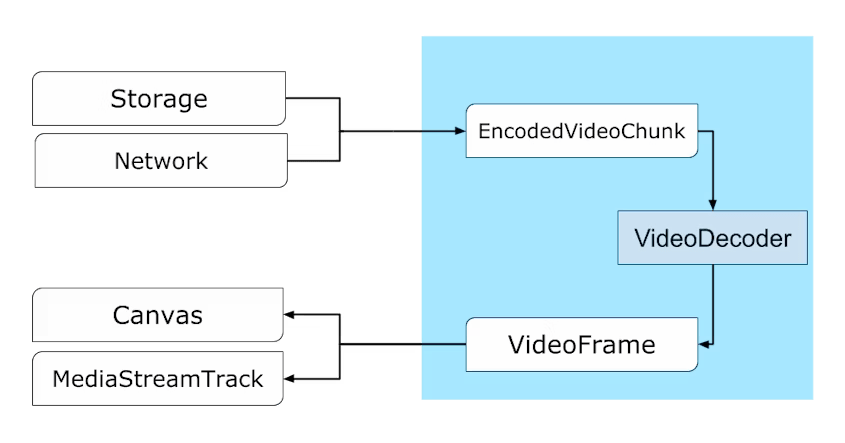
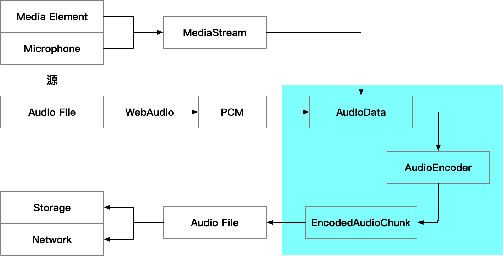

---
tags:
  - WebAV_EN
  - Audio & Video
  - WebCodecs
date: 2023-10-06
---

# WebCodecs: A New Chapter for Web Media

_Feel free to skip the text below and experience [WebCodecs in action][6]_

## What is WebCodecs?

- WebCodecs is a Web specification implemented in Chrome 94 (September 2021)
- It provides interfaces for accessing codec capabilities, enabling fine-grained control over audio and video data

### Issues with Current Web Media APIs

Audio and video technologies are widely used on the Web platform, with many Web APIs **indirectly utilizing codecs** for specific functions:

- Video playback: MSE, HTMLMediaElement
- Audio decoding: WebAudio
- Video recording: MediaRecorder
- Real-time streaming: WebRTC

However, there's no way to flexibly configure or directly access codecs. As a result, many applications use JavaScript or WebAssembly (like ffmpeg.wasm) for codec functionality, despite several **significant limitations**:

- Poor performance (WebCodecs encoding is up to 20 times faster than ffmpeg.wasm)
- High power consumption
- Additional network overhead (downloading built-in codecs)

These workarounds exist because previous Web APIs faced **insurmountable obstacles** in specific scenarios:

- WebAudio can only decode complete audio files, lacking support for streams, decode progress information, and encoding
- MediaRecorder is limited to specific formats (WebM, MP4), with no control over encoding speed or output buffers
- WebRTC is tightly coupled with MediaStream API, opaque, and limited to real-time communication
- Video tags and MSE, while common for playback, lack control over decode rates and buffer lengths, supporting only certain container formats

In summary: **Current APIs are simple and sufficient for specific use cases but lack efficient and fine-grained control**

### WebCodecs Design Goals

- **Streaming**: Stream input/output for remote and disk resources
- **Efficiency**: Utilize hardware capabilities, run in Workers
- **Composability**: Work well with other Web APIs (Streams, WebTransport, WebAssembly)
- **Recoverability**: Handle issues gracefully (network limitations, resource constraints causing frame drops)
- **Flexibility**: Adapt to various scenarios (hard real-time, soft real-time, non-real-time), enable MSE or WebRTC-like functionality
- **Symmetry**: Similar patterns for encoding and decoding

### Non-Goals for WebCodecs

- Container format muxing/demuxing APIs
- Codec implementation in JS or WASM

The above is summarized from the [WebCodecs Explainer][1], providing a quick overview of WebCodecs API's background and objectives.

## What Can WebCodecs Do?

### WebCodecs API Overview

Let's first understand where WebCodecs API fits in the video production/consumption pipeline:


The diagram shows WebCodecs API's **capabilities**:

- Control over encoding/decoding processes
- Access to low-level data before and after codec operations



- `VideoFrame` and `EncodedVideoChunk` represent source images and compressed data, both providing interfaces for accessing underlying binary data
- `VideoEncoder` and `VideoDecoder` handle type conversion between the two
- All image-related types on the Web platform can be converted to `VideoFrame`
- Note the symmetrical API design for encoding and decoding
- Knowledge gained from image codec operations transfers symmetrically to audio codecs



These are the core WebCodecs APIs. While there aren't many new APIs, the main challenge lies in understanding audio/video background knowledge.

Using `mp4box.js` to demux MP4 files, obtaining `EncodedVideoChunk` for WebCodecs decoding, enables MP4 to image frame conversion.  


#### Areas Outside WebCodecs Scope

In the audio/video pipeline, other Web APIs handle:

- Media capture and rendering
- Container muxing/demuxing
- Transport and storage

### Related Web APIs

Fundamental capabilities built on low-level APIs:


- WebAudio: Audio processing
- WebGPU/WebGL + OffscreenCanvas: Offscreen image processing
- OPFS: Local file I/O
- WebWorker + WASM: Intensive computation
- WebTransport: Low-latency network transport

_What features can developers implement using existing Web platform capabilities plus WebCodecs' codec functionality?_

### Demos and Implementation

WebCodecs is a relatively low-level API where even simple features might require substantial helper code. WebAV's utility functions can help implement features quickly.

**[WebAV][3] is built on WebCodecs, providing simple APIs for browser-based media processing**

Let's look at some demos and their WebAV-based implementations:

**1. Controlled Decoding**  
Decode a 20s video at maximum device speed and render frames to Canvas.  
The significance extends beyond fast or frame-by-frame playback - it enables rapid frame traversal, fundamental to video processing.

<video style="width: 100%;" src="./decode-video-demo.mp4" controls></video>

First, import an MP4Clip object from WebAV, initialized with just an MP4 file URL.  
Use the tick method to get video frames and draw them to canvas.  
`while true` means no waiting - speed depends on network download and device decode capabilities.

```js
import { MP4Clip } from '@webav/av-cliper';

// Initialize with MP4 file stream
const clip = new MP4Clip((await fetch('<mp4 url>')).body);
await clip.ready;

let time = 0;
// Render all frames at maximum speed
while (true) {
  const { state, video: videoFrame } = await clip.tick(time);
  if (state === 'done') break;
  if (videoFrame != null && state === 'success') {
    ctx.clearRect(0, 0, cvs.width, cvs.height);
    // Draw to Canvas
    ctx.drawImage(
      videoFrame,
      0,
      0,
      videoFrame.codedWidth,
      videoFrame.codedHeight
    );
    // Important: close immediately after use
    videoFrame.close();
  }
  // Microsecond time unit, ~30fps, dropping excess frames
  time += 33000;
}
clip.destroy();
```

**2. Adding Watermarks**  
Add time-animated semi-transparent text watermarks to video

<video style="width: 100%;" src="./watermask-demo.mp4" controls></video>

Convert text to images for easy CSS styling.  
Control image movement according to rules (animation config omitted here).  
Animation configuration mirrors CSS animations - specify coordinates at key points (0%, 50%), and WebAV interpolates intermediate states.  
Finally, combine MP4Clip and ImgClip to output a new video stream.

```js
const spr1 = new OffscreenSprite(new MP4Clip((await fetch('<mp4 url>')).body));

const spr2 = new OffscreenSprite(new ImgClip('Watermark'));
spr2.setAnimation(/* animation config */);

const com = new Combinator();

await com.add(spr1, { main: true });
await com.add(spr2, { offset: 0 });
// com.ouput() => Output video stream
```

**3. Chroma Key**  
Composite digital avatar with green screen background onto background images, using WebGL for per-frame processing to achieve transparency.  
_Implementation details: [WebGL Chromakey Real-time Green Screen][5]_

<video style="width: 100%;" src="./chromakey-demo.mp4" controls></video>

```js
// Create chroma key utility function
const chromakey = createChromakey(/* chroma key config */);
// Test video with green screen background
const clip = new MP4Clip((await fetch('<mp4 url>')).body);
// Process each MP4 frame through tickInterceptor
clip.tickInterceptor = async (_, tickRet) => {
  if (tickRet.video == null) return tickRet;
  return {
    ...tickRet,
    // Return after chroma key processing
    video: await chromakey(tickRet.video),
  };
};
```

**4. Bloom Shadow**  
Browser-based video recording tool for course creation and live streaming workstations.  
Video demonstrates basic course creation workflow: "**Add camera, share screen, modify asset layers, trim video segments, preview and export**"

<video style="width: 100%;" src="./Bloom-Shadow-demo.mp4" controls></video>

<!-- QR codes: WebAV, article series, Bloom Shadow project -->

## WebCodecs Application Scenarios

**Predicted Applications**

- Video Production
  - Video editing, live streaming workstations with collaboration and AI capabilities
- Video Consumption
  - Players, video conferencing, cloud gaming
- Computation Shift
  - Video compression, thumbnail generation, watermarking, speed adjustment

### Video Production: From Zero to One

The lack of encoding capabilities has limited Web-based video production tools.  
Existing Web video editors heavily depend on server-side capabilities, with room for UX improvement.

Creating animations with Canvas is straightforward; WebCodecs' encoding capabilities now enable quick video export.

Basic video editing features like trimming, watermarking, and subtitle embedding were difficult without WebCodecs. **WebCodecs will fill this gap**.

### Video Consumption: Enhanced Capabilities

Video consumption applications are mature on the Web platform thanks to HTMLMediaElement and MSE.  
While these APIs are simple, they lack fine control, leaving room for improvement.

Examples include buffer delay control, frame-by-frame playback, high-speed playback, and decode control.

WebCodecs will enable building more powerful, better-performing video consumption applications.

### Computation Shift: Win-Win for Cost and Experience

Currently, Web-based audio/video services process everything server-side.

Consider online video tools offering compression (resolution/bitrate reduction), watermarking, speed adjustment, and preview generation.

Workflow: user upload → server processing → user download  
This consumes server compute and bandwidth resources, plus user wait time.

WebCodecs enables local processing, reducing operational costs while improving user experience.

### Case Studies

These tools existed before WebCodecs, so **why believe they'll adopt WebCodecs?**

First, WebCodecs enables better experience, lower costs, and faster iteration.  
Combined with past experience and Web platform advantages, WebCodecs likely sees widespread adoption.

Two examples:

**1. Evolution of Video Consumption Behavior**

1. Early Era  
   User behavior: Download movies for offline viewing, local video players essential
2. Flash Era  
   User behavior: Online video viewing gains popularity
3. HTML5 Era  
   User behavior: Web becomes primary platform for PC video consumption
4. WebCodecs Era  
   Completes audio/video codec capabilities  
   Expected behavior: WebCodecs + AI + collaboration drive web-based video editing, conferencing, and streaming tools

**2. Rich Text Editing**  
Web's core APIs moved text editing online, spawning excellent knowledge management applications.  
Web accessibility plus collaborative editing significantly improved productivity.

- contenteditable: Editable nodes
- Selection: Selection ranges
- Range: Document fragments

Many successful products: Notion, Figma, VSCode...

Summary: **Once the Web platform provides fundamental capabilities in a domain, related products inevitably become web-based**

## WebCodecs Advantages and Limitations

### Advantages

#### Performance

  
Performance limitations severely restrict ffmpeg.wasm adoption, mainly due to lack of hardware acceleration.  
In simple video encoding tests, WebCodecs performs 20 times faster than ffmpeg.wasm.

#### Web Platform

Web platform's inherent advantages: **cross-platform, convenience, iteration speed**  
With improving low-level capabilities, it's ready for large-scale, professional software.  
WebCodecs should gain broader adoption through Web platform advantages.

### Limitations

- Immature Ecosystem
  - Lacks robust muxing/demuxing tools, limited container format support
- Compatibility
  - Older browsers don't support WebCodecs
- Browser Codec Limitations
  - Limited codec parameters (inevitable trade-off for universality)
  - No custom codec support

Ecosystem maturity requires time and developer participation. B2B products typically tolerate compatibility issues; B2C products can fall back to server-side processing.  
The main challenge is browser-provided codecs lagging behind native implementations.  
**Carefully consider WebCodecs** if you need custom codecs or have strict codec parameter requirements.

## Vision

- WebCodecs becomes fundamental to Web platform media processing
- Like HTML5, WebCodecs drives media application development and growth on the Web

## Appendix

- [WebCodecs Explainer Translation][1]
- [Web Audio & Video (0) Overview][2]
- [WebAV][3] WebCodecs-based media processing SDK
- [WebAV DEMO][6] Try browser-based media processing
- [Bloom Shadow][4] Browser-based video recording tool

[1]: /posts/2023/10/02/webcodecs-explainer/
[2]: /posts/2023/07/16/webav-0-overview/
[3]: https://github.com/WebAV-Tech/WebAV
[4]: https://github.com/hughfenghen/bloom-shadow
[5]: /posts/2023/07/07/webgl-chromakey/
[6]: https://webav-tech.github.io/WebAV/demo
