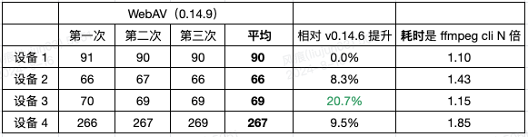

---
tags:
  - WebAV
  - 音视频
  - WebCodecs
  - Web
date: 2024-07-27
---

# WebCodecs 性能表现及优化思路

笔者开源 [WebAV][1] 已经一年半，还写了[系列文章](/tag/WebAV)帮助初学者入门 Web 音视频。

之前一直隐隐担心在 Web 平台处理音视频与 Native APP 会有明显性能差距，因为 WebCodecs API 毕竟被浏览器代理了一层，且一些数据处理需要 js 配合，不确定有多大的性能损耗。

相信刚接触 WebCodecs 的读者也非常关心它的性能表现如何。

如今 [WebAV][1] 已经稳定下来，v1.0 即将发布，于是做了一些简单的性能测试，**结果还算乐观 ：）**

_注：WebAV 是基于 WebCodecs 构建的 SDK，在 Web 平台**创建/编辑视频文件**_

## 环境信息

测试资源：bunny_avc_frag.mp4 (fMP4)，1080P，10min，AVC 编码；  
输出： 10min，3M 码率，30 FPS  
方法：在视频中央绘制一个最简单的文本，合成导出视频

## 设备

1. 设备 1：MacBook Pro, M1（2020）, 16 GB
1. 设备 2：AMD Ryzen 7 5800 8-core，RTX 3080, 32 GB
1. 设备 3：Intel i9-9900k, RTX 2070, 32 GB
1. 设备 4：Intel i5-8265U, UHD Graphics 620, 8 GB

## WebCodecs 性能表现

数字是合成视频消耗的时间（单位 秒），**WebAV 性能数据以后文最新版为准**  

_注 1：本地合成（WebAV、ffmpeg、剪映 APP），跟设备的硬件配置强相关；云端合成（剪映 Web），跟服务资源分配的资源强相关_  
_注 2：剪映 APP 是由官方下载器自动安装的，有个 4.1.0 版本很奇怪，我也不知道原因_

**2024.08.12 更新 WebAV v0.14.6 优化后数据**

**2024.08.16 更新 WebAV v0.14.9 优化后数据**

若读者有兴趣可自行对比或在评论区讨论，WebAV 性能测试代码[在这里][2]，其它工具请自行安装。

### 总结

WebCodecs 能利用硬件加速进行编解码，经过三次优化 WebAV 的性能表现有明显进步；  
跟 Native 方案在部分设备上还有一些差距，虽然还有优化空间，但个人感觉性能不再是方案选择的主要考量因素了；  
所以，接下来主要优化 SDK 的稳定性，以及准备发布 [v1.0 版本](https://github.com/bilibili/WebAV/issues/122)。

也说不定未来还会再次优化性能，关注 WebAV（WebCodecs）性能优化数据的同学，可以订阅该 [文章评论对应的 issue](https://github.com/hughfenghen/hughfenghen.github.io/issues/205) 以接收更新。

## 性能优化思路

_以下记录一些笔者的经验，欢迎读者讨论与补充_

### 性能瓶颈在于编码

编码任务是最消耗计算资源的，所以不要因其他任务（解封装、解码、合成等等）让编码器处于阻塞等待状态；  
可以提前准备好帧数据，一旦开始合成视频，要让编码器持续工作，让编码队列有不间断的视频帧供给。

但需要注意控制好内存/显存占用，不要提前解码太多数据；  
编码队列也不能太大，避免打爆显存，详情阅读后文**控制显存占用**

### 多编码器并行

因为性能瓶颈在于视频编码阶段，稍加分析可发现大量时间在等待编码器输出；  
所以可以将编码任务按 GoP 分配给多个编码器，然后按时间顺序组装多个编码器输出的数据，在部分设备上有明显的优化效果。

### 优化内存占用

音视频文件体积通常会比较大，如果将整个文件加载到内存中将占用过多内存空间，导致频繁 GC 降低性能，加载特别大的音视频文件还会溢出导致错误或崩溃。

可以将视频文件写入到 OPFS（私有源文件系统），按需读取到内存中；  
[WebAV][1] 依赖了 [opfs-tools][3] 来操作私有源文件，大幅降低了内存占用。

### 优化内存分配

在 js 语言中 ArrayBuffer 是可操作的内存数据的抽象。

Web 开发者很少需要关注内存的分配与回收，但音视频处理过程中经常需要对较大的内存数据进行操作，如果频繁创建、回收内存会对性能造成负面影响。

这里介绍一些跟 Web 音视频性能优化相关的 API。

- [subarray][4] 复用已分配的内存，减少开辟新的内存空间，如果修改了复用部分的数据，所有复用的对象会一起改变
- [resize][9] 动态调整 ArrayBuffer 对象的大小，减少开辟新的内存空间
- [transfer][5] 基于已有 ArrayBuffer 创建（扩大或缩小）新的 ArrayBuffer 对象，速度很快，但注意 transfer 之后旧的对象将不可用
- [Transferable][6] js 中实现了该接口的对象，能以极低的成本在不同线程间传递，配合 WebWorker 来优化性能
- [SharedArrayBuffer][8] 在线程间直接共享内存空间，避免传递数据的损耗，但要考虑“锁”的问题
- WebWorker 多线程并发，详情参考笔者的另一篇文章 [JS 多线程并发][7]

_**注意** resize、transfer 的兼容性，启用 SharedArrayBuffer 的条件_

### 控制显存占用

视频帧（[VideoFrame][10]）是图像的原始数据，会占用较大的显存空间，切记**同一时刻不能持有过多的视频帧对象**，按需创建、用完立即 close，否则会打爆显存，严重影响性能。

解码阶段，解码器（VideoDecoder）输出的 VideoFrame 如果没有及时关闭，累积一定数量后，**解码器将停止输出**。

编码阶段，编码器（VideoEncoder）接收的 VideoFrame 是 js 创建的，此时**需要开发者主动控制**创建视频帧对象的数量；  
检测到 [VideoEncoder encodeQueueSize][11] 数量过大，应暂停创建新的视频帧，等待编码器消化队列中的视频帧。

## 附录

- [WebAV][1]
- [WebAV 性能测试][2]
- [opfs-tools][3]
- [subarray][4]
- [resize][9]
- [transfer][5]
- [Transferable][6]
- [js 多线程并发][7]
- [SharedArrayBuffer][8]

[1]: https://github.com/bilibili/WebAV/
[2]: https://github.com/bilibili/WebAV/blob/0f1ed722032057d3efdb56c19209964739adef8a/packages/av-cliper/demo/performance.demo.ts#L14
[3]: https://github.com/hughfenghen/opfs-tools
[4]: https://developer.mozilla.org/en-US/docs/Web/JavaScript/Reference/Global_Objects/TypedArray/subarray
[5]: https://developer.mozilla.org/en-US/docs/Web/JavaScript/Reference/Global_Objects/ArrayBuffer/transfer
[6]: https://developer.mozilla.org/en-US/docs/Web/API/Web_Workers_API/Transferable_objects
[7]: https://hughfenghen.github.io/posts/2023/03/27/js-concurrent/
[8]: https://developer.mozilla.org/zh-CN/docs/Web/JavaScript/Reference/Global_Objects/SharedArrayBuffer
[9]: https://developer.mozilla.org/en-US/docs/Web/JavaScript/Reference/Global_Objects/ArrayBuffer/resize
[10]: https://developer.mozilla.org/en-US/docs/Web/API/VideoFrame
[11]: https://developer.mozilla.org/en-US/docs/Web/API/VideoEncoder/encodeQueueSize
