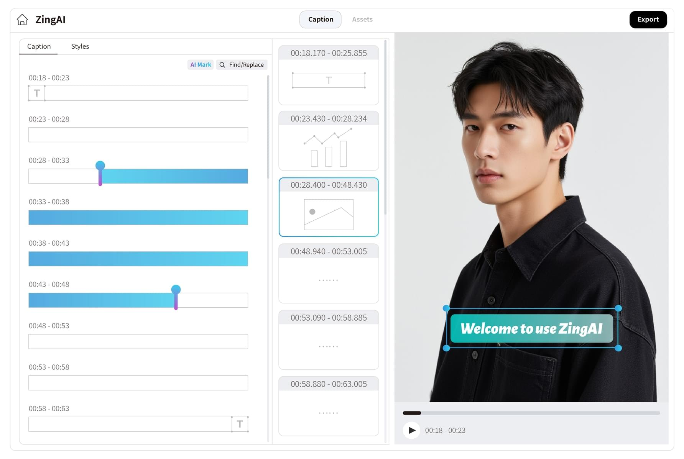
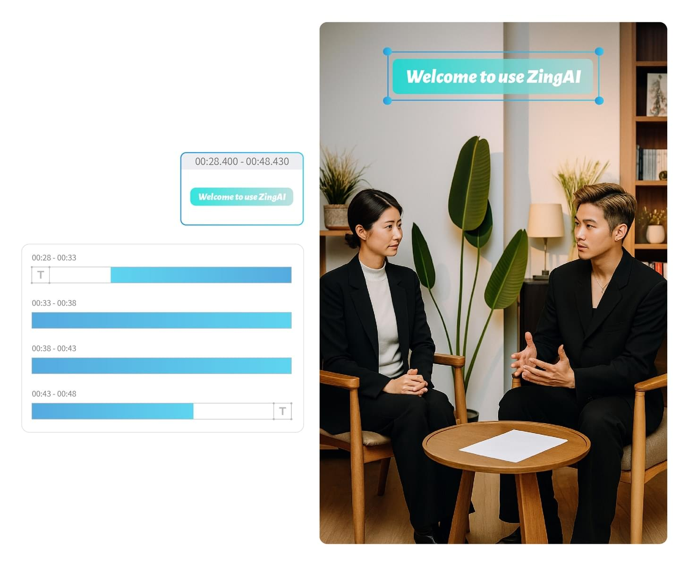
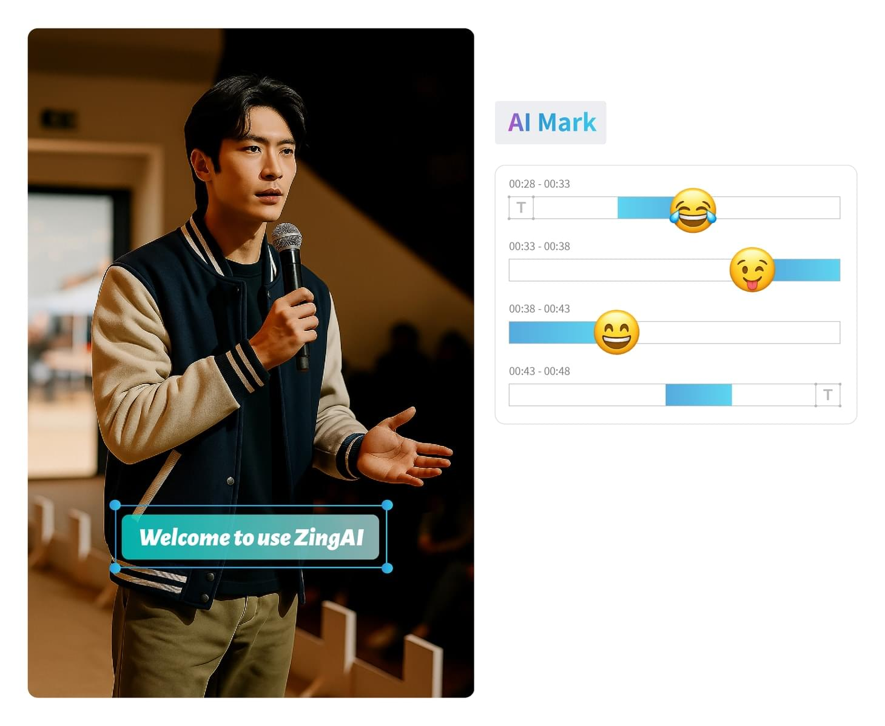
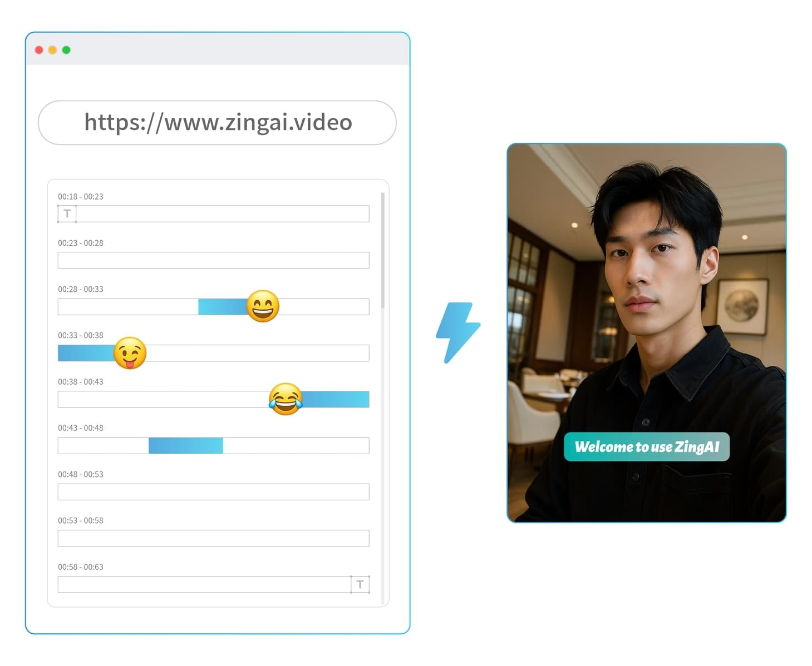

---
tags:
  - WebAV
  - 音视频
  - 工具
date: 2025-09-01
---

# ZingAI.video 在线口播视频剪辑

_[**ZingAI.video 字影**](https://www.zingai.video)是采用前沿 Web 技术构建的口播视频剪辑工具，正在公测，欢迎体验_

## 背景

我发现自己消费的视频基本都是**口播类视频**，且 AI 生成的视频绝大多数也是这类视频。

**口播类视频**并不是指狭义的主播（或数字人）念稿子，它的典型特征是**传达的信息以文字语音为主，图像信息为辅的视频**；  
此类视频没有复杂、炫酷、或有艺术感的图像画面，往往是图像之上的文字（大小、色彩、动画）异常的夸张、醒目。

比如：科普、历史、财经、新闻、演讲、儿童故事、技术分享等。

我离职后要做的（技术分享）就是此类视频，有尝试过几款流行产品的口播剪辑功能，不甚满意；  
正好我在 B 站开发过类似的产品，就干脆尝试自己做一个。

## 设计理念/指导思想

- 文字是口播视频的核心信息，所以**剪辑应该以文字为中心**
- 文字编辑的学习成本更低，门槛低于传统视频编辑交互
- 文字相对于图像与音频更加便于检索、与交互
  - 用户阅读文字或文字查找，获取信息的速度更快
  - 基于文字对应的精确时间信息，用户能更快速的与视频进行交互
    - 辅助视频表达的素材（视频、音频、图像）更容易通过文字进行时间对齐
    - 文字能更快速定位到视频特定的位置
- AI 大模型分析文字的成本更低、速度更快，借助 AI 能大幅提高视频的编辑效率

基于以上我个人总结的信息，设计了 ZingAI.video；  
在 UI 设计方面有较多的创新，特别优化了通过文字编辑视频的体验。

_这是 ZingAI.video 的 UI 设计_

## ZingAI.video 特性

### 文字驱动编辑

创新的交互设计

- 删除文字即删除对应时间的视频片段，这是口播剪辑工具的核心操作之一  
  但 ZingAI 与文字编辑融合得更好
- 快速关联文字与素材（花字、图片、视频、音乐），不再需要小心翼翼地对齐时间
- 文字替换用来修改识别错误的字幕，支持批量替换

### AI 智能增强

AI 编辑提效

- AI 自动高亮字幕中的重点信息，让字幕更醒目
- AI 根据内容智能插入 emoji，让字幕更动人

### 便捷高效

采用前沿技术精心打造

- 打开网页就能流畅编辑，无需下载 APP
- 利用硬件加速导出视频

## 产品规划

ZingAI 是一款编辑工具，但期望用户能以最少量的编辑动作，完成视频制作；  
所以还需要继续增强 AI 能力，如：素材制作、字幕校正、智能分段、更丰富的花字效果、模板功能等。

[ZingAI.video 字影](https://www.zingai.video) 是一个刚发布的产品，还有很多待完善的地方，欢迎体验，也欢迎提出建议。
