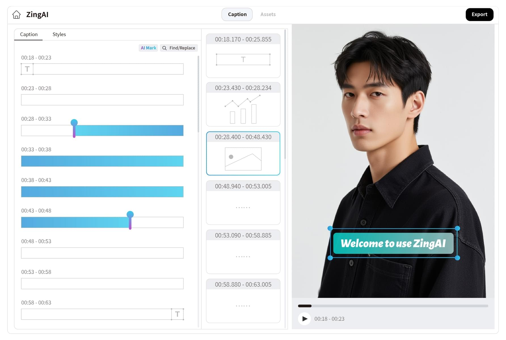
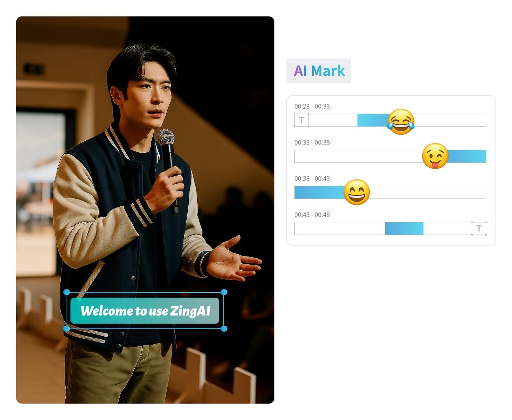

---
tags:
  - WebAV
  - Audio & Video
  - Tool
date: 2025-09-01
---

# ZingAI.video Online Talking Head Video Editing

_[**ZingAI.video**](https://www.zingai.video) is a talking head video editing tool built with cutting-edge Web technology. Welcome to try it._

## Background

I found that the videos I consume are basically **talking head videos**, and the vast majority of AI-generated videos are also of this type.

**Talking head video** does not refer to a narrow sense of a host (or digital human) reading a script. Its typical feature is **a video in which the information conveyed is mainly text and voice, supplemented by image information**;
This type of video does not have complex, cool, or artistic images. It is often the text (size, color, animation) on the image that is exceptionally exaggerated and eye-catching.

For example: popular science, history, finance, news, speeches, children's stories, technical sharing, etc.

What I want to do after I leave my job (technical sharing) is this type of video. I have tried the talking head editing functions of several popular products, but I am not very satisfied;
It just so happens that I have developed a similar product on Bilibili, so I decided to try to make one myself.

## Design Philosophy/Guiding Principles

- Text is the core information of a talking head video, so **editing should be centered on text**
- The learning cost of text editing is lower, and the threshold is lower than traditional video editing interaction
- Text is easier to retrieve and interact with than images and audio
  - Users can get information faster by reading text or searching for text
  - Based on the precise time information corresponding to the text, users can interact with the video more quickly
    - Materials that assist video expression (video, audio, images) are easier to align in time through text
    - Text can more quickly locate a specific position in the video
- The cost of analyzing text by AI large models is lower and the speed is faster. With the help of AI, the editing efficiency of videos can be greatly improved.

Based on the information I have summarized above, I designed ZingAI.video;
There are many innovations in UI design, especially optimizing the experience of editing videos through text.

_This is the UI design of ZingAI.video_

## ZingAI.video Features

### Text-driven Editing

Innovative interaction design

- Deleting text means deleting the video clip of the corresponding time. This is one of the core operations of the talking head editing tool.
  But ZingAI is better integrated with text editing.
- Quickly associate text with materials (fancy text, pictures, videos, music), no longer need to carefully align the time
- Text replacement is used to modify incorrectly recognized subtitles, and supports batch replacement

### AI Smart Enhancement

AI editing improves efficiency

- AI automatically highlights key information in subtitles to make subtitles more eye-catching
- AI intelligently inserts emojis based on content to make subtitles more moving

### Convenient and Efficient

Carefully crafted with cutting-edge technology

- Edit smoothly by opening the web page, no need to download an APP
- Use hardware acceleration to export videos

## Product Planning

ZingAI is an editing tool, but it is expected that users can complete video production with the least amount of editing actions;
Therefore, it is necessary to continue to enhance AI capabilities, such as: material production, subtitle correction, intelligent segmentation, richer fancy text effects, template functions, etc.

[ZingAI.video](https://www.zingai.video) is a newly released product, and there are still many areas to be improved. Welcome to try it and give suggestions.
