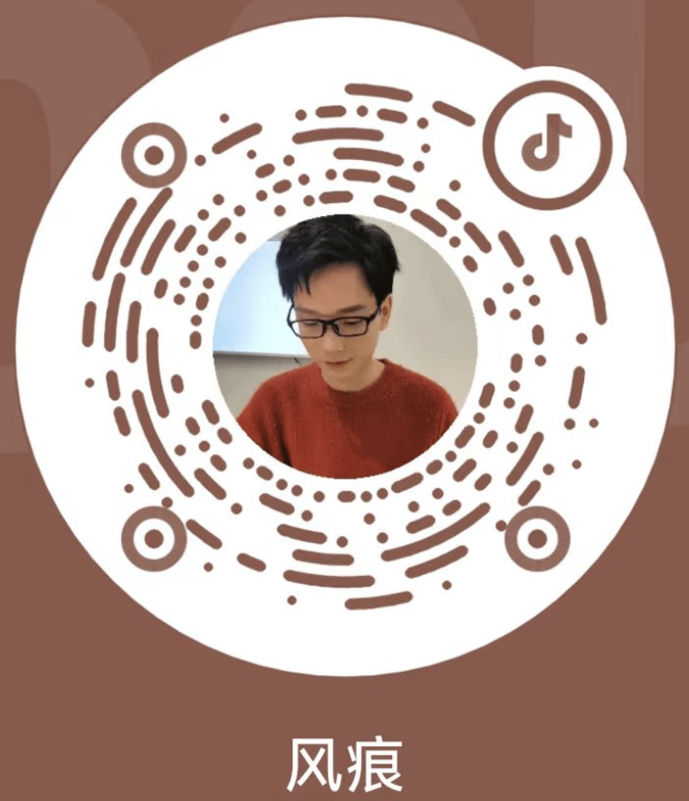

<!-- div 包裹一层，避免收插件奇怪样式影响 -->

## 订阅

本博客持续更新前端工程效率、Web 音视频相关文章  
若你对本博客的内容感兴趣，可通过以下途径接收更新通知

- 微信扫码关注公众号 “风痕 Web 栈”  
  
- 我的 Github 账号 [hughfenghen](https://github.com/hughfenghen)
- 哔哩哔哩 [风痕 di-didi--](https://space.bilibili.com/386916237)
- 我的抖音 [风痕](https://www.douyin.com/user/MS4wLjABAAAASb6lc9xC44eab5eXt37M_3_G-OkUBFfNZilTMLz7Txw)  
  
- 我的 Twitter / X 账号 [风痕](https://x.com/hughfenghen)
- 当前博客订阅 RSS <https://fenghen.me/rss.xml>

## 恰饭

若本博客的内容对你有所帮助，可扫描二维码请作者喝奶茶：）

[Paypal.me](https://paypal.me/hughfenghen)

_若需技术交流，打赏时备注微信昵称，我会加你_  
_也欢迎[商务合作（帅气博主在线接单）](https://fenghen.me/posts/2025/04/11/business-cooperation/)_

