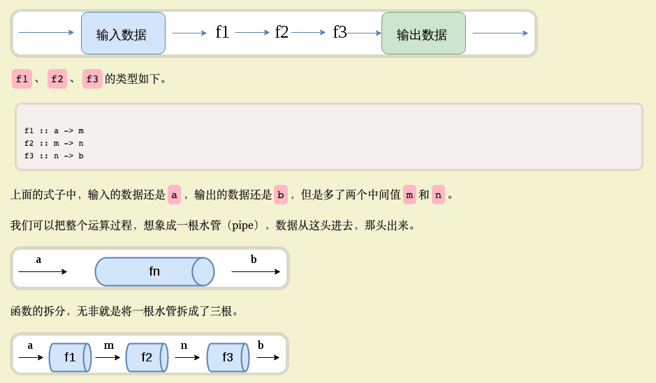
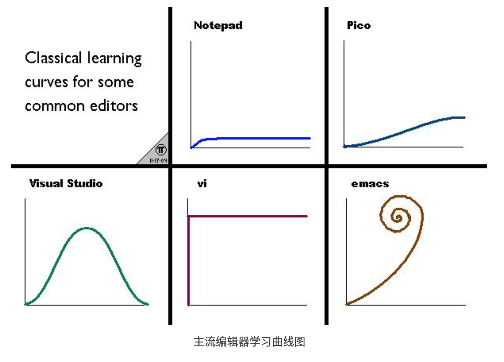

# JS数据处理

## 分享目标
1. 数据处理技巧速成  
2. 让你们感叹：JS还可以这样写  

***如何把JS代码写得更优雅？***  

## 基础

### 实践原则
1. 数据处理时，尽量避免临时变量（特别是let）、修改参数、改变外部引用、for等  
2. 分离数据处理与副作用（DOM操作、存储、网络请求等）代码  

数据处理指：数值计算和数据结构变换。  

#### 第一点：如何避免？
**1. 熟悉并灵活使用自带函数**  
> 1. 包装函数  
>  Array, Boolean, String, Number
> 2. 简单Object  
   Object.assign, Object.keys, Object.values, Object.entries, Object.fromEntries  
> 3. Array  
   map, filter, reduce, slice, concat, flat, join  
   pop, push, shift, unshift, splice, sort, fill  
   some, every, includes   
   find, findIndex, indexOf  
   forEach  
> 4. Math  
>  Math.random, Math.floor, Math.round, Math.ceil

例：
```js
['1', '2', '3'].map(Number)  // => [1, 2, 3]

[1, 2, 3].map(String)  // => ['1', '2', '3'] 

Array(10).fill().map(Math.random) // => [...] 十个随机数

[0, 1, null, {}, []].filter(Boolean) // => [1, {}, []] 过滤假值

['1', '2', '3'].map(parseInt) // => ? <危>
```

:::tip
使用`map、reduce、forEach`等函数代替`for`；`filter、some、every`等代替`if`
:::


**2. 管道、函数组合**  
高阶内容，下文介绍

#### 第二点：如何分离？
*分离并不一定要隔离到不同的函数，也可以在同一个函数中分段。*  
**忌讳数据处理跟副作用混杂在一起。**  

例：
```js
// 榜单：排序后将前三名插入的容器中
const data = [{ nickName: '张三', score: 75 }, { nickName: '李四', score: 10 }, { nickName: '王五', score: 42 } /*...*/]

const container = document.getElementById('rank')

function renderRank(container, data) {
  // 计算逻辑
  const items = data.sort((a, b) => b.score - a.score).slice(0, 3).map(createRankItem)

  // 副作用操作
  container.append(...items)

  function createRankItem({ nickName, score }) {
    const it = document.createElement('li')
    it.text = `${nickName} - ${score}`
    return it
  }
}

renderRank(container, data)
```

## 进阶

### 柯里化

**柯里化是把接受多个参数的函数变换成接受一个单一参数的函数，并且返回接受余下的参数而且返回结果的新函数的技术。**  

说人话：
```js
const f = (a, b, c) => a + b + c

currying(f)(1)(2)(3) // => 6
```

#### 自动柯里化
如果接收参数个数满足预期，则求值；否则返回新的可以接受剩余参数的函数。  

```js
const f = (a, b, c) => a + b + c

autoCurrying(f)(1)(2, 3) // => 6
```

### lodash/fp
总结五点，让大家形成初步印象  
1. JS自带数据结构就那么几个，操作数据结构的函数虽然比较多，也是有限的。  
2. lodash提供了几乎所有简单的数据操作工具函数。  
3. lodash/fp则使lodash提供的工具函数支持自动柯里化。  
4. lodash/fp调整了参数顺序（function first，data last），方便函数组合。  
5. lodash/fp的工具函数默认只给回调函数传递一个参数（避免前文`map(parseInt)`问题）。  

[FP-Guide](https://github.com/lodash/lodash/wiki/FP-Guide)  

类似的库还有[Ramda](http://ramdajs.com/docs/)，甚至可以说Ramda在函数式方面更“专业”，但鉴于lodash的流行度、较低的学习成本，下文例子采用lodash/fp  

#### 例：数组求和实现方法对比
```js
function sum(arr) {
  let rs = 0
  for (const v of arr) {
    rs += v
  }
  return rs
}

sum([1, 2, 3]) // => 6
```

```js
const sum = (arr) => arr.reduce((a, b) => a + b)

sum([1, 2, 3]) // => 6
```

```js
import { reduce, add } from 'lodash/fp'
const sum = reduce(add, 0) // lodash/fp reduce要求三个参数

sum([1, 2, 3]) // => 6
// 如果sum不需要复用，则不需要命名： reduce(add, 0)([1, 2, 3])

// Lisp中符号‘+’ 也是一个函数，可以这样写：(+ 1 2 3)  或  (apply + [1 2 3])
```

### pipe
在使用Unix或Linux命令行的时候，其实已经接触过管道的概念了（符号`|`），把这个概念应用到编程语言中是这样的：  

  

**总结：不使用所要处理的值，只合成运算过程。**  

#### 例：找到用户 Scott 的所有未完成任务，并按到期日期升序排列。
```js
const { pipe, prop, filter, matches, sortBy } = require('lodash/fp');

const data = {
  result: "SUCCESS",
  interfaceVersion: "1.0.3",
  requested: "10/17/2020 15:31:20",
  lastUpdated: "10/16/2020 10:52:39",
  tasks: [
    {
      id: 104, complete: false, priority: "high",
      dueDate: "2020-11-29", username: "Scott",
      title: "Do something", created: "9/22/2020"
    },
    {
      id: 105, complete: false, priority: "medium",
      dueDate: "2020-11-22", username: "Lena",
      title: "Do something else", created: "9/22/2020"
    },
    {
      id: 107, complete: true, priority: "high",
      dueDate: "2020-11-22", username: "Mike",
      title: "Fix the foo", created: "9/22/2020"
    },
    {
      id: 108, complete: false, priority: "low",
      dueDate: "2020-11-15", username: "Punam",
      title: "Adjust the bar", created: "9/25/2020"
    },
    {
      id: 110, complete: false, priority: "medium",
      dueDate: "2020-11-15", username: "Scott",
      title: "Rename everything", created: "10/2/2020"
    },
    {
      id: 112, complete: true, priority: "high",
      dueDate: "2020-11-27", username: "Lena",
      title: "Alter all quuxes", created: "10/5/2020"
    }
  ]
};

pipe(
  prop('tasks'),
  filter(matches({ complete: false, username: 'Scott' })),
  sortBy(prop('dueDate'))
)(data)

// => output:
// [
//   {
//     id: 110,
//     complete: false,
//     priority: 'medium',
//     dueDate: '2020-11-15',
//     username: 'Scott',
//     title: 'Rename everything',
//     created: '10/2/2020'
//   },
//   {
//     id: 104,
//     complete: false,
//     priority: 'high',
//     dueDate: '2020-11-29',
//     username: 'Scott',
//     title: 'Do something',
//     created: '9/22/2020'
//   }
// ]
```

*例子来源于：[Pointfree 编程风格指南](https://www.ruanyifeng.com/blog/2017/03/pointfree.html)*  

:::tip
如果有数据处理是一个pipe搞不定的，那可能是你对工具函数的熟悉度不够。:dog:  

优雅流畅地处理数据，除了了解几个简单的基本概念之后（柯里化、管道），还需要花费一些时间来学习、练习常用的工具函数。  
:::

## 闲话
学习工具函数的作用，类似于记下编辑器许多快捷键之后，写代码的速度会有较大提升。  
JS就像流行的VSCode，不会强迫你记快捷键，JS本身的学习曲线挺平缓的。  
Lisp就像Vim编辑器，强迫你记快捷键，学习曲线就非常陡峭。  
但JS本身非常灵活，我们可以综合两者的优势，就像在VSCode中开启Vim模式。  



## 回顾总结
1. 基础篇中分享了数据处理经验：两个实践原则；  
2. 进阶篇中介绍了柯里化、管道两个概念，然后安利了lodash/fp。  

## 参考
[Pointfree 编程风格指南](https://www.ruanyifeng.com/blog/2017/03/pointfree.html)  
[Ramda 函数库参考教程](http://www.ruanyifeng.com/blog/2017/03/ramda.html)  
[FP-Guide](https://github.com/lodash/lodash/wiki/FP-Guide)  
[Ramda](http://ramdajs.com/docs/)  
[柯里化](https://zh.wikipedia.org/zh/%E6%9F%AF%E9%87%8C%E5%8C%96)  