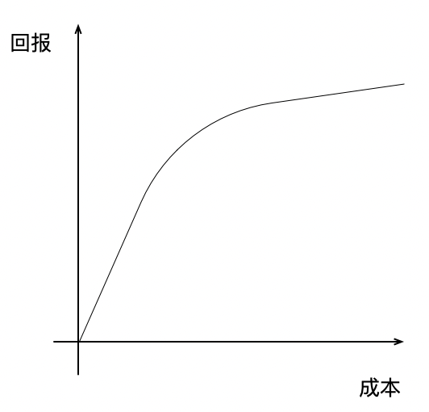
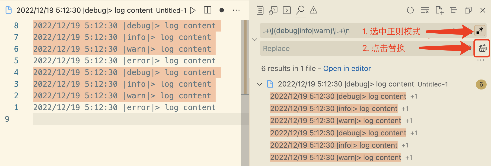

# JS 正则表达式基础

## 前言
个人经验，正则是一个前期少量投入，回报超高的技能点。  
  
其适用范围非常广泛，如批量文本处理、源码替换、程序中逻辑判断等等。  
本文**只介绍常用**的基础知识、技巧，让初学者快速掌握大部分日常所需的正则知识。目标是5分钟内可逐字读完，10分钟内可把例子都动手实践一遍。  

:::tip
可以复制代码粘贴到控制台（F12 或 ctrl+shift+i）查看执行结果
:::

## 特殊匹配符号

|符号|介绍|示例|
|---|---|---|
|.|匹配任意字符|`/./.test('a')`|
|\w|匹配一个单字字符（字母、数字或者下划线）|`/\w/.test('a')`|
|\d|匹配一个数字|`/\d/.test('0')`|
|\s|匹配一个空白符（空格、\n、\r等等）|`/./.test(' ')`|

以上特殊字符大写，则含义相反，如`\D`匹配一个非数字。  

## 匹配数量控制
|符号|介绍|示例|
|---|---|---|
|x?|匹配0或1个x|`/https?:/.test('http://xxx')`，http、https 均可|
|x+|匹配1个或多个x|`/\d+/.test('111')`，匹配多个数字|
|x*|匹配任意多个x，可以是0个|`/\s*value\s*/.test('value ')`，允许value前后出现任意个空白符|
|x{3}|匹配3个x|`/x{3}/.test('xxx')`|

这里特别介绍一下贪婪匹配、非贪婪匹配，因为太常用了。  
正则默认是贪婪匹配，即尽量匹配更多的字符；在符号`+`、`*`，后面紧跟`?`，则非贪婪模式。  
```js
// 默认贪婪模式，尽量匹配最多字符
/a.*c/.exec('abcabc') // ['abcabc']
// 非贪婪模式，尽量匹配最少字符
/a.*?c/.exec('abcabc') // ['abc']
```

## 字符集合
假设正则没有预设`\d`，我们要匹配所有数字应该怎么办？  

可以这样写：   
`/0|1|2|3|4|5|6|7|8|9/.test('0')`； **`|`表示'或'** 的意思。  

看起来太复杂了，简化一下：   
`/[0123456789]/.test('0')`； **`[]`表示一个字符集合**，只要匹配集合中的任意字符都能通过检测。  

既然有了期望的字符集合（白名单），那也应该有非期望的集合（黑名单）：  
`/[^0123456789]/`(等价于`\D`)匹配所有非数字，**方括号中以`^`开头表示匹配'非'** 后面的这些字符。  

## 分组
圆括号`(.*)`包围的内容表示正则的一个分组，分组可以搭配前面介绍的数量控制符号。  
如简单的域名匹配：`/(\w+\.)+(com|io)/.test('hughfenghen.github.io')`

## 特殊非匹配符号
|符号|介绍|示例|
|---|---|---|
|\\|转义符|`/\+/.test('+')`，`+`是表数量的特殊字符，如果想匹配`+`本身，需在前加转义符`\`|
|^|字符串起始位置|`/^1/.test('1000')` 匹配 1 开头的字符串|
|$|字符串结束位置|`/\.com$/.test('bilibili.com')`，匹配 .com 结尾的字符串|


## 应用技巧
使用正则的主要场景：  
1. 判断一个字符串是否具备某种特征  
```js
// 匹配国内手机号码
/^1[357]\d{9}$/.test('13881958429')
```
2. 从一个字符串中提取特定子串
```js
// 从字符串中 提取二级域名，匹配失败则给 company 赋 空串
// 匹配二级域名的是第二个分组（第二个圆括号），对应数组的第三个元素，详情查看 exec 的文档
const [, , company] = /(\w+\.)*(\w+?)\.com/.exec('bilibili.com') ?? [, , '']
// company => bilibili
```
3. 将特定字符串替换成其他字符串
```js
// 删除字符串前后空格，等价于 trim 函数的效果
'   value   '.replace(/^\s*|\s*$/g, '')

// 这里有个前面未介绍的知识点
// /g 表示全局替换，去掉的话，替换起始部分的空格后就结束了（建议动手试试效果
```
当然，利用**正则处理文本不局限于代码**，配合编辑器往往也能节省大量时间。  
如下图，使用 vscode+正则 可从大量的日志中提取出error日志（删除其他类型的日志）  
  

## 结语
本文定位为初学者快速入门，所以只介绍常用的基础知识。  
正则还有很多有意思的玩法，感兴趣的同学自行探索。  
若你认为有高频使用的知识点没有介绍到，可在评论区回复。  

## 附录
- [正则 MDN 文档](https://developer.mozilla.org/zh-CN/docs/Web/JavaScript/Guide/Regular_Expressions)  
- [正则 exec 函数文档](https://developer.mozilla.org/zh-CN/docs/Web/JavaScript/Reference/Global_Objects/RegExp/exec)  
- [正则 test 函数文档](https://developer.mozilla.org/zh-CN/docs/Web/JavaScript/Reference/Global_Objects/RegExp/test)  
- [字符串 repalce 函数文档](https://developer.mozilla.org/zh-CN/docs/Web/JavaScript/Reference/Global_Objects/String/replace)  