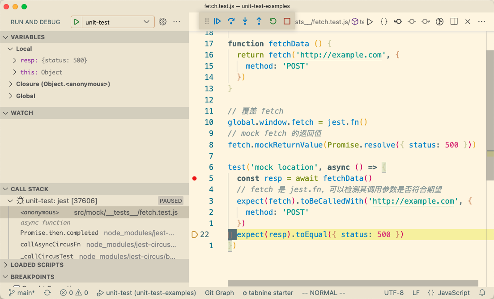

# 单测（Unit Test）技巧

## 前言
本文目的是提高编写单测的效率，适合于有一定单测编写经验，但被单测困扰的同学。  

## 单测的意义与价值
本质：将测试行为及结果固化下来，后续自动化运行  

- 单测是一种调试工具；在开发阶段验证代码是否符合期望，比浏览器中调试更有效率  
- 单测是一种项目文档；帮助了解SDK的API及如何使用  
- 单测能降低项目维护成本；拥有完整的单测用例后，单测执行结果会告诉你代码变更的影响范围  
- 单测能帮助你编写更加优秀的代码  

## 编码技巧

### 单测的边界
单元测试的目标是你写的代码，测试你写的代码符合期望（白盒测试），边界之外代码若有意外尽量 Mock。  
如何确定边界？  
1. import 的第三方包（无IO操作可以不Mock）  
2. 系统(Node.js, 浏览器)提供的部分 API，主要包括 fetch、document、fs

*Mock的方法、技巧参考后文。*

### 编写易于测试的代码  
*优秀的代码有很多要素，优秀的代码肯定是易于测试的。*  

#### 隔离副作用代码
*函数副作用是指函数在正常工作任务之外对外部环境所施加的影响。*  

对JS来说，最常见的副作用是 网络请求、增删DOM节点、读写文件；  
副作用**不可避免**，但可以隔离后只测试相对比较纯的函数。  

<details>
<summary><span style="color: #1989fa; cursor: pointer;">展开查看示例代码</span>
</summary>

```js
// 错误示例
function createList(arr) {
  const ulEl = document.createElement('ul')
  arr.forEach((it) => {
    const li = document.createElement('li')
    li.textContent = it
    ulEl.appendChild(li)
  })
  // 其他逻辑。。。
  document.querySelector('container').appendChild(ulEl)
}

// 正确示例；检测返回值 比 mock document要简单得多
function createList(arr) {
  const ulEl = document.createElement('ul')
  arr.forEach((it) => {
    const li = document.createElement('li')
    li.textContent = it
    ulEl.appendChild(li)
  })
  // 其他逻辑。。。
  return ulEl
}

// 对于汇总了副作用的函数，可以使用 Mock 方法进行测试
// 也可以考虑略过，不编写测试代码，权衡成本即可
function insertList() {
  const arr = [1, 2]
  document.querySelector('container').appendChild(createList(arr))
}
```

</details>

#### 控制圈复杂度

[圈复杂度](https://baike.baidu.com/item/%E5%9C%88%E5%A4%8D%E6%9D%82%E5%BA%A6)简单来说就是逻辑分支越多，圈复杂度越高，单测用例覆盖代码越困难。  

圈复杂度跟业务复杂度相关，无法完全避免，但可通过编码技巧降低或拆分成多个函数，降低单测难度。  

<details>
<summary><span style="color: #1989fa; cursor: pointer;">展开查看示例代码</span>
</summary>


```js
// 错误示例
function envStr2Code(env) {
  if (env === 'dev') {
    return 1
  } else if (env === 'test') {
    return 2
  } else if (env === 'prod') {
    return 3
  } else {
    return -1
  }
}

// 如果要覆盖 所有语句
expect(envStr2Code('dev')).toBe(1)
expect(envStr2Code('test')).toBe(2)
expect(envStr2Code('prod')).toBe(3)
expect(envStr2Code('unknown')).toBe(-1)

// 正确示例
function envStr2Code(env) {
  return ({ dev: 1, test: 2, prod: 3 })[env] ?? -1
}
// 类似的还有
function envCode2Str(code) {
  return [null, 'dev', 'test', 'prod'][code] ?? 'unknown'
}
```

</details>

参考： [圈复杂度优化](https://cloud.tencent.com/developer/article/1806628)  
> 圈复杂度常用优化方法  
> 1. 算法优化  
> 1. 表达式逻辑优化  
> 1. 大函数拆小函数

## Jest 技巧

### Mock
- [fs](https://github.com/hughfenghen/unit-test-examples/blob/main/src/mock/__tests__/fs.test.js)；Mock 原生或第三方模块
- [Data.now](https://github.com/hughfenghen/unit-test-examples/blob/main/src/mock/__tests__/date-now.test.js)；拦截 now 返回特定的时间戳
- [fetch](https://github.com/hughfenghen/unit-test-examples/blob/main/src/mock/__tests__/fetch.test.js)；禁止单测发送请求，检测函数调用参数
- [location](https://github.com/hughfenghen/unit-test-examples/blob/main/src/mock/__tests__/location.test.js)；Mock 全局只读属性
- [dom](https://github.com/hughfenghen/unit-test-examples/blob/main/src/mock/__tests__/dom.test.js)；拦截所有 DOM 节点的方法

### Timer
- timeout
- interval
- promise

fakeTimer

### Snapshot

### Expect
结果比较（snapshot（错误、dom、较长的内容） 、 expect.any）

### 模式
a f t

### 配合 vscode
配合 vscode，在保存代码自动运行单测用例，且能在编辑器中随时 debug  
  
参考vscode配置：[.vscode/launch.json](https://github.com/hughfenghen/unit-test-examples/blob/main/.vscode/launch.json)


<!-- https://info.bilibili.co/pages/viewpage.action?pageId=105002726 -->